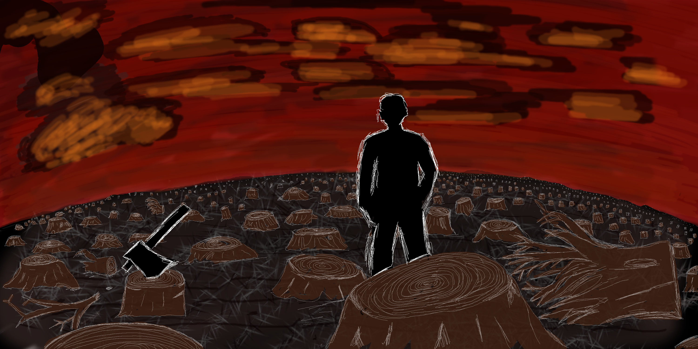

<!--{pagebreak}-->

## Story Time {#storytime}

Kita akan mulai dengan beberapa cerita pendek.
Setiap cerita adalah panggilan yang dilebih-lebihkan untuk machine learning yang dapat ditafsirkan.
Jika Anda sedang terburu-buru, Anda dapat melewatkan cerita.
Jika Anda ingin terhibur dan (tidak) termotivasi, baca terus!

Formatnya terinspirasi oleh Tech Tales karya Jack Clark di [Import AI Newsletter](https://jack-clark.net/).
Jika Anda menyukai cerita semacam ini atau jika Anda tertarik dengan AI, saya sarankan Anda mendaftar.

### Lightning Never Strikes Twice {-}
**2030: A medical lab in Switzerland**

```{r hospital, echo = FALSE, fig.cap = "",width=500}
knitr::include_graphics("images/hospital.png")
```


"Ini jelas bukan cara terburuk untuk mati!" rangkuman Tom, mencoba menemukan sesuatu yang positif dalam tragedi itu.
Dia melepaskan pompa dari tiang infus.
"Dia baru saja meninggal karena alasan yang salah," tambah Lena.
"Dan tentu saja dengan pompa morfin yang salah!
Hanya menciptakan lebih banyak pekerjaan untuk kita!" Tom mengeluh sambil membuka tutup pelat belakang pompa.
Setelah melepas semua sekrup, dia mengangkat pelat dan menyingkirkannya.
Dia memasang kabel ke port diagnostik.
"Kamu tidak hanya mengeluh tentang memiliki pekerjaan, kan?" Lena memberinya senyum mengejek.
"Tentu saja tidak. Tidak pernah!" serunya dengan nada sarkastik.

Dia mem-boot komputer pompa.
Lena mencolokkan ujung kabel yang lain ke tabletnya.
"Baiklah, diagnosa sedang berjalan," dia mengumumkan.
"Aku benar-benar ingin tahu tentang apa yang salah."
"Itu pasti menembak John Doe kami ke Nirvana.
Konsentrasi tinggi zat morfin ini.
Manusia. Maksudku ... itu yang pertama, kan?
Biasanya pompa yang rusak mengeluarkan terlalu sedikit barang manis atau tidak sama sekali.
Tapi tidak pernah, Anda tahu, seperti tembakan gila itu," jelas Tom.
"Aku tahu. Kamu tidak perlu meyakinkanku... Hei, lihat itu." Lena mengangkat tabletnya.
"Apakah Anda melihat puncak ini di sini? Itulah potensi campuran obat penghilang rasa sakit.
Lihat! Baris ini menunjukkan tingkat referensi.
Pria malang itu memiliki campuran obat penghilang rasa sakit dalam sistem darahnya yang bisa membunuhnya 17 kali lipat.
Disuntikkan oleh pompa kami di sini.
Dan di sini ..." dia mengusap, "di sini Anda bisa melihat momen kematian pasien."
"Jadi, tahu apa yang terjadi, bos?" Tom bertanya pada supervisornya.
"Hm... Sensornya sepertinya baik-baik saja.
Detak jantung, kadar oksigen, glukosa, ... Data dikumpulkan seperti yang diharapkan.
Beberapa nilai yang hilang dalam data oksigen darah, tapi itu tidak biasa.
Lihat di sini.
Sensor juga mendeteksi detak jantung pasien yang melambat dan tingkat kortisol yang sangat rendah yang disebabkan oleh turunan morfin dan agen penghambat rasa sakit lainnya."
Dia terus menggesek melalui laporan diagnostik.
Tom menatap terpikat pada layar.
Itu adalah penyelidikan pertamanya tentang kegagalan perangkat yang sebenarnya.

"Oke, ini potongan puzzle pertama kita.
Sistem gagal mengirim peringatan ke saluran komunikasi rumah sakit.
Peringatan dipicu, tetapi ditolak di tingkat protokol.
Bisa jadi salah kita, tapi bisa juga salah rumah sakit.
Tolong kirimkan lognya ke tim IT," kata Lena kepada Tom.
Tom mengangguk dengan mata masih tertuju pada layar.
Lena melanjutkan:
"Ini aneh.
Peringatan itu seharusnya juga menyebabkan pompa mati.
Tapi itu jelas gagal melakukannya.
Itu pasti bug.
Sesuatu yang terlewatkan oleh tim kualitas.
Sesuatu yang sangat buruk.
Mungkin itu terkait dengan masalah protokol."
"Jadi, sistem darurat pompa entah bagaimana rusak, tetapi mengapa pompa itu menjadi penuh pisang dan menyuntikkan begitu banyak obat penghilang rasa sakit ke John Doe?" Tom bertanya-tanya.
"Pertanyaan bagus.
Kamu benar.
Selain kegagalan darurat protokol, pompa seharusnya tidak memberikan obat sebanyak itu sama sekali.
Algoritme seharusnya berhenti lebih awal dengan sendirinya, mengingat tingkat kortisol yang rendah dan tanda-tanda peringatan lainnya," jelas Lena.
"Mungkin nasib buruk, seperti satu dari sejuta hal, seperti disambar petir?" Tom bertanya padanya.
"Tidak, Tom.
Jika Anda telah membaca dokumentasi yang saya kirimkan kepada Anda, Anda akan tahu bahwa pompa itu pertama kali dilatih dalam eksperimen pada hewan, kemudian pada manusia, untuk belajar menyuntikkan obat penghilang rasa sakit dalam jumlah yang sempurna berdasarkan masukan sensorik.
Algoritme pompa mungkin buram dan rumit, tetapi tidak acak.
Itu berarti bahwa dalam situasi yang sama pompa akan berperilaku dengan cara yang persis sama lagi.
Pasien kami akan mati lagi.
Kombinasi atau interaksi yang tidak diinginkan dari input sensorik pasti telah memicu perilaku pompa yang salah.
Makanya kita harus menggali lebih dalam dan mencari tahu apa yang terjadi di sini," jelas Lena.

"Begitu ...," jawab Tom, tenggelam dalam pikirannya.
"Bukankah pasien akan segera meninggal? Karena kanker atau semacamnya?"
Lena mengangguk sambil membaca laporan analisis.
Tom bangkit dan pergi ke jendela.
Dia melihat ke luar, matanya tertuju pada satu titik di kejauhan.
"Mungkin mesin itu membantunya, Anda tahu, dalam membebaskannya dari rasa sakit.
Tidak ada lagi penderitaan.
Mungkin itu hanya melakukan hal yang benar.
Seperti kilat, tapi, Anda tahu, itu bagus.
Maksud saya seperti lotere, tetapi tidak acak.
Tapi karena suatu alasan.
Jika saya adalah pompa, saya akan melakukan hal yang sama."
Dia akhirnya mengangkat kepalanya dan menatapnya.
Dia terus melihat sesuatu di luar.
Keduanya terdiam beberapa saat.
Lena menundukkan kepalanya lagi dan melanjutkan analisis.
"Tidak, Tom. Ini bug... Hanya bug sialan."

### Trust Fall {-}

**2050: A subway station in Singapore**

```{r access-denied, echo = FALSE, fig.cap = "", width=500}

```

Dia bergegas ke stasiun kereta bawah tanah Bishan.
Dengan pikirannya dia sudah bekerja.
Tes untuk arsitektur saraf baru harus diselesaikan sekarang.
Dia memimpin desain ulang "Sistem Prediksi Afinitas Pajak untuk Entitas Perorangan" pemerintah, yang memprediksi apakah seseorang akan menyembunyikan uang dari kantor pajak.
Timnya telah menghasilkan teknik yang elegan.
Jika berhasil, sistem ini tidak hanya akan melayani kantor pajak, tetapi juga masuk ke sistem lain seperti sistem alarm kontra-terorisme dan registri komersial.
Suatu hari, pemerintah bahkan bisa mengintegrasikan prediksi tersebut ke dalam Civic Trust Score.
Civic Trust Score memperkirakan seberapa dapat dipercaya seseorang.
Perkiraan tersebut mempengaruhi setiap bagian dari kehidupan sehari-hari Anda, seperti mendapatkan pinjaman atau berapa lama Anda harus menunggu paspor baru.
Saat dia menuruni eskalator, dia membayangkan bagaimana integrasi sistem timnya ke dalam Civic Trust Score System mungkin terlihat.

Dia secara rutin mengusapkan tangannya ke pembaca RFID tanpa mengurangi kecepatan berjalannya.
Pikirannya sibuk, tetapi ketidaksesuaian antara ekspektasi indra dan kenyataan membunyikan lonceng alarm di otaknya.

Sangat terlambat.

Hidung pertama dia berlari ke gerbang masuk kereta bawah tanah dan jatuh dengan pantatnya pertama ke tanah.
Pintu itu seharusnya terbuka, ... tapi ternyata tidak.
Tercengang, dia berdiri dan melihat layar di sebelah gerbang.
"Silakan coba lain kali," saran senyum ramah di layar.
Seseorang lewat dan, mengabaikannya, menyeka tangannya ke pembaca.
Pintu terbuka dan dia masuk.
Pintu ditutup lagi.
Dia mengusap hidungnya.
Sakit, tapi setidaknya tidak berdarah.
Dia mencoba membuka pintu, tetapi ditolak lagi.
Itu aneh.
Mungkin akun transportasi umum miliknya tidak memiliki token yang cukup.
Dia melihat jam tangan pintarnya untuk memeriksa saldo rekening.

"Login ditolak. Silakan hubungi Citizens Advice Bureau Anda!" arlojinya memberitahunya.

Perasaan mual memukulnya seperti tinju ke perut.
Dia curiga dengan apa yang terjadi.
Untuk mengkonfirmasi teorinya, dia memulai game mobile "Sniper Guild", sebuah ego shooter.
Aplikasi langsung ditutup lagi secara otomatis, yang mengkonfirmasi teorinya.
Dia menjadi pusing dan duduk di lantai lagi.

Hanya ada satu penjelasan yang mungkin:
Civic Trust Scorenya telah turun.
Secara substansial.
Penurunan kecil berarti ketidaknyamanan kecil, seperti tidak mendapatkan penerbangan kelas satu atau harus menunggu sedikit lebih lama untuk dokumen resmi.
Trust score yang rendah jarang terjadi dan berarti Anda diklasifikasikan sebagai ancaman bagi masyarakat.
Salah satu tindakan dalam menangani orang-orang ini adalah menjauhkan mereka dari tempat-tempat umum seperti kereta bawah tanah.
Pemerintah membatasi transaksi keuangan subyek dengan Civic Trust Scores yang rendah.
Mereka juga mulai secara aktif memantau perilaku Anda di media sosial dan bahkan membatasi konten tertentu, seperti game kekerasan.
Menjadi lebih sulit secara eksponensial untuk meningkatkan Civic Trust Scores Anda semakin rendah.
Orang dengan skor yang sangat rendah biasanya tidak pernah sembuh.

Dia tidak bisa memikirkan alasan mengapa skornya harus turun.
Skor tersebut didasarkan pada machine learning.
Sistem Civic Trust Scores bekerja seperti mesin yang diminyaki dengan baik yang menjalankan masyarakat.
Kinerja Trust Score System selalu dipantau secara ketat.
Machine learning telah menjadi jauh lebih baik sejak awal abad ini.
Itu menjadi sangat efisien sehingga keputusan yang dibuat oleh Sistem trust score tidak dapat lagi diperdebatkan.
Sebuah sistem yang sempurna.

Dia tertawa putus asa.
Sistem yang sempurna.
Jika hanya.
Sistem ini jarang gagal.
Tapi itu gagal.
Dia pasti salah satu dari kasus khusus itu;
kesalahan sistem;
mulai sekarang menjadi orang buangan.
Tidak ada yang berani mempertanyakan sistem.
Itu terlalu terintegrasi ke dalam pemerintah, ke dalam masyarakat itu sendiri, untuk dipertanyakan.
Di beberapa negara demokrasi yang tersisa, dilarang untuk membentuk gerakan anti-demokrasi, bukan karena mereka pada dasarnya jahat, tetapi karena mereka akan mengacaukan sistem saat ini.
Logika yang sama diterapkan pada algocrates yang sekarang lebih umum.
Kritik dalam algoritma dilarang karena membahayakan status quo.

Kepercayaan algoritmik adalah jalinan tatanan sosial.
Untuk kebaikan bersama, penilaian kepercayaan palsu yang jarang diterima secara diam-diam.
Ratusan sistem prediksi dan database lain dimasukkan ke dalam skor, sehingga mustahil untuk mengetahui apa yang menyebabkan penurunan skornya.
Dia merasa seperti sebuah lubang gelap besar sedang terbuka di dalam dan di bawahnya.
Dengan ngeri dia melihat ke dalam kehampaan.

Sistem afinitas pajaknya akhirnya diintegrasikan ke dalam Civic Trust Score System, tetapi dia tidak pernah mengetahuinya.


### Fermi's Paperclips {-}

**Year 612 AMS (after Mars settlement): A museum on Mars**

```{r burnt-earth, echo = FALSE, fig.cap = "", width=500}

```

"Sejarah itu membosankan," bisik Xola kepada temannya.
Xola, seorang gadis berambut biru, dengan malas mengejar salah satu drone proyektor yang bersenandung di dalam ruangan dengan tangan kirinya.
"Sejarah itu penting," kata guru itu dengan nada kesal, menatap gadis-gadis itu.
Xola tersipu.
Dia tidak berharap gurunya mendengarnya.

"Xola, apa yang baru saja kamu pelajari?" tanya guru itu padanya.
"Bahwa orang-orang kuno menggunakan semua sumber daya dari Planet Bumi dan kemudian mati?" dia bertanya dengan hati-hati.
"Tidak. Mereka membuat iklim panas dan itu bukan manusia, itu komputer dan mesin. Dan itu Planet Bumi, bukan Planet Bumi," tambah gadis lain bernama Lin.
Xola mengangguk setuju.
Dengan sentuhan bangga, guru itu tersenyum dan mengangguk.
"Kalian berdua benar. Tahukah kalian mengapa itu terjadi?"
"Karena orang-orang picik dan serakah?" tanya Xola.
"Orang-orang tidak bisa menghentikan mesin mereka!" Lin berseru.

"Sekali lagi, kalian berdua benar," guru itu memutuskan,
"tapi jauh lebih rumit dari itu.
Kebanyakan orang pada saat itu tidak menyadari apa yang terjadi.
Beberapa melihat perubahan drastis, tetapi tidak dapat membalikkannya.
Bagian paling terkenal dari periode ini adalah puisi oleh penulis anonim.
Ini paling baik menangkap apa yang terjadi pada waktu itu.
Dengarkan baik-baik!"

Guru memulai puisi.
Selusin drone kecil memposisikan diri di depan anak-anak dan mulai memproyeksikan video langsung ke mata mereka.
Itu menunjukkan seseorang dalam setelan berdiri di hutan dengan hanya tunggul pohon yang tersisa.
Dia mulai berbicara:

*Mesin menghitung; mesin memprediksi.*

*Kami berbaris karena kami adalah bagian darinya.*

*Kami mengejar yang optimal seperti yang terlatih.*

*Optimal adalah satu dimensi, lokal dan tidak dibatasi.*

*Silikon dan daging, mengejar eksponensial.*

*Pertumbuhan adalah mentalitas kami.*

*Saat semua hadiah terkumpul,*

*dan efek samping diabaikan;*

*Ketika semua koin ditambang,*

*dan alam telah tertinggal;*

*Kita akan mendapat masalah,*

*Bagaimanapun, pertumbuhan eksponensial adalah gelembung.*

*Tragedi milik bersama sedang berlangsung,*

*meledak,*

*Di depan mata kita.*

*Perhitungan dingin dan keserakahan dingin,*

*Memenuhi bumi dengan panas.*

*Semuanya sekarat,*

*Dan kami patuh.*

*Seperti kuda dengan penutup mata kita berlomba lomba ciptaan kita sendiri,*

*Menuju Filter Agung peradaban.*

*Jadi kami berbaris tanpa henti.*

*Karena kita adalah bagian dari mesin.*

*Merangkul entropi.*

"Kenangan yang kelam," kata guru itu untuk memecah kesunyian di ruangan itu.
"Itu akan diunggah ke perpustakaan Anda.
Pekerjaan rumahmu adalah menghafalnya sampai minggu depan."
Xola menghela nafas.
Dia berhasil menangkap salah satu drone kecil itu.
Drone itu hangat dari CPU dan mesinnya.
Xola menyukai bagaimana itu menghangatkan tangannya.
