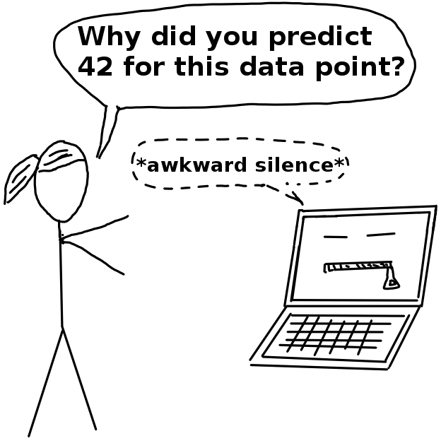

<!--{pagebreak}-->

## What Is Machine Learning?

Machine learning adalah seperangkat metode yang digunakan komputer untuk membuat dan meningkatkan prediksi atau perilaku berdasarkan data.

Misalnya, untuk memprediksi nilai sebuah rumah, komputer akan mempelajari pola dari penjualan rumah sebelumnya.
Buku ini berfokus pada supervised machine learning, yang mencakup semua masalah prediksi di mana kita memiliki kumpulan data yang telah kita ketahui hasil yang diinginkan (misalnya harga rumah sebelumnya) dan ingin belajar memprediksi hasil untuk data baru.
Dikecualikan dari supervised learning adalah misalnya tugas pengelompokan (= unsupervised learning) di mana kita tidak memiliki hasil minat tertentu, tetapi ingin menemukan kumpulan titik data.
Juga dikecualikan adalah hal-hal seperti reinforcement learning, di mana agen belajar untuk mengoptimalkan hadiah tertentu dengan bertindak di lingkungan (misalnya komputer bermain Tetris).
Tujuan supervised learning adalah mempelajari model prediktif yang memetakan fitur data (misalnya ukuran rumah, lokasi, tipe lantai, ...) ke output (misalnya harga rumah).
Jika keluarannya kategorikal, tugas itu disebut klasifikasi, dan jika itu numerik, itu disebut regresi.
Algoritme machine learning mempelajari model dengan memperkirakan parameter (seperti bobot) atau struktur pembelajaran (seperti pohon).
Algoritme dipandu oleh fungsi skor atau loss function yang diminimalkan.
Dalam contoh nilai rumah, mesin meminimalkan perbedaan antara perkiraan harga rumah dan harga yang diprediksi.
Model machine learning yang terlatih sepenuhnya kemudian dapat digunakan untuk membuat prediksi untuk instance baru.

Estimasi harga rumah, rekomendasi produk, deteksi rambu jalan, prediksi credit default dan deteksi penipuan:
Semua contoh ini memiliki kesamaan bahwa mereka dapat diselesaikan dengan machine learning.
Tugasnya berbeda, tetapi pendekatannya sama:
Langkah 1: Pengumpulan data.
Lebih banyak lebih baik.
Data harus berisi hasil yang ingin Anda prediksi dan informasi tambahan untuk membuat prediksi.
Untuk pendeteksi rambu jalan ("Apakah ada rambu jalan pada gambar?"), Anda akan mengumpulkan gambar jalan dan memberi label apakah rambu jalan terlihat atau tidak.
Untuk prediktor default kredit, Anda memerlukan data masa lalu tentang pinjaman aktual, informasi tentang apakah pelanggan gagal bayar dengan pinjaman mereka, dan data yang akan membantu Anda membuat prediksi, seperti pendapatan, default kredit masa lalu, dan sebagainya.
Untuk program penaksir nilai rumah otomatis, Anda dapat mengumpulkan data dari penjualan rumah sebelumnya dan informasi tentang real estat seperti ukuran, lokasi, dan sebagainya.
Langkah 2: Masukkan informasi ini ke dalam algoritme machine learning yang menghasilkan model pendeteksi tanda, model peringkat kredit, atau penaksir nilai rumah.
Langkah 3: Gunakan model dengan data baru.
Integrasikan model ke dalam produk atau proses, seperti mobil tanpa pengemudi, proses aplikasi kredit, atau situs web pasar real estat.

Mesin melampaui manusia dalam banyak tugas, seperti bermain catur (atau baru-baru ini Go) atau memprediksi cuaca.
Bahkan jika mesin sebagus manusia atau sedikit lebih buruk dalam suatu tugas, tetap ada keuntungan besar dalam hal kecepatan, reproduktifitas, dan penskalaan.
Model machine learning yang pernah diterapkan dapat menyelesaikan tugas jauh lebih cepat daripada manusia, dengan andal memberikan hasil yang konsisten dan dapat disalin tanpa batas.
Mereplikasi model machine learning di mesin lain cepat dan murah.
Pelatihan seorang manusia untuk suatu tugas dapat memakan waktu puluhan tahun (terutama ketika mereka masih muda) dan sangat mahal.
Kerugian utama menggunakan machine learning adalah bahwa wawasan tentang data dan tugas yang diselesaikan mesin tersembunyi dalam model yang semakin kompleks.
Anda memerlukan jutaan angka untuk menggambarkan deep neural network, dan tidak ada cara untuk memahami model secara keseluruhan.
Model lain, seperti random forest, terdiri dari ratusan decision trees yang "memilih" untuk prediksi.
Untuk memahami bagaimana keputusan itu dibuat, Anda harus melihat suara dan struktur masing-masing dari ratusan pohon.
Itu tidak bekerja tidak peduli seberapa pintar Anda atau seberapa baik memori kerja Anda.
Model dengan performa terbaik seringkali merupakan perpaduan dari beberapa model (juga disebut ensemble) yang tidak dapat diinterpretasikan, meskipun setiap model tunggal dapat diinterpretasikan.
Jika Anda hanya fokus pada kinerja, Anda akan secara otomatis mendapatkan lebih banyak model buram.
Model pemenang dalam kompetisi machine learning sering kali merupakan kumpulan model atau model yang sangat kompleks seperti boosted trees atau deep neural network.

<!--{pagebreak}-->

## Terminology {#terminology}

Untuk menghindari kebingungan karena ambiguitas, berikut adalah beberapa definisi istilah yang digunakan dalam buku ini:

**Algoritma** adalah seperangkat aturan yang diikuti mesin untuk mencapai tujuan tertentu[^algorithm].
Algoritma dapat dianggap sebagai resep yang mendefinisikan input, output dan semua langkah yang diperlukan untuk mendapatkan dari input ke output.
Resep masakan adalah algoritme di mana bahan-bahannya adalah input, makanan yang dimasak adalah keluarannya, dan langkah-langkah persiapan dan memasak adalah instruksi algoritme.

**Machine learning** adalah serangkaian metode yang memungkinkan komputer belajar dari data untuk membuat dan meningkatkan prediksi (misalnya kanker, penjualan mingguan, default kredit).
Machine learning merupakan perubahan paradigma dari “pemrograman normal” dimana semua instruksi harus diberikan secara eksplisit kepada komputer menjadi “pemrograman tidak langsung” yang berlangsung melalui penyediaan data.

```{r programing-vs-ml, echo = FALSE, fig.cap = "", width = 400}
knitr::include_graphics("images/programing-ml.png")
```

**Learner** atau **Machine Learning Algorithm** adalah program yang digunakan untuk mempelajari model machine learning dari data.
Nama lain adalah "inducer" (misalnya "tree inducer").

**Model machine learning** adalah program yang dipelajari yang memetakan input ke prediksi.
Ini bisa menjadi satu set bobot untuk model linier atau untuk jaringan saraf.
Nama lain untuk kata "model" yang agak tidak spesifik adalah "prediktor" atau - tergantung pada tugasnya - "pengklasifikasi" atau "regression models".
Dalam rumus, model machine learning yang terlatih disebut $\hat{f}$ atau $\hat{f}(x)$.

```{r learner-definition, fig.cap = "A learner learns a model from labeled training data. The model is used to make predictions.", echo = FALSE, width = 500}
knitr::include_graphics("images/learner.png")
```


**Model black box** adalah sistem yang tidak mengungkapkan mekanisme internalnya.
Dalam machine learning, "black box" menggambarkan model yang tidak dapat dipahami dengan melihat parameternya (misalnya jaringan saraf).
Kebalikan dari black box kadang-kadang disebut sebagai **white box**, dan dalam buku ini disebut sebagai [interpretable model](#simple).
[Metode model-agnostic](#agnostic) untuk interpretabilitas memperlakukan model machine learning sebagai black box, meskipun tidak.

```{r black-box, echo = FALSE, fig.cap  = "", width = 1500}

```


**Interpretable machine learning** mengacu pada metode dan model yang membuat perilaku dan prediksi sistem machine learning dapat dipahami oleh manusia.

**Dataset** adalah tabel dengan data yang dipelajari mesin.
Dataset berisi fitur dan target untuk diprediksi.
Ketika digunakan untuk menginduksi model, dataset disebut data pelatihan.

**Instance** adalah baris dalam set data.
Nama lain untuk 'instance' adalah: (data) titik, contoh, observasi.
Sebuah instance terdiri dari nilai fitur $x^{(i)}$ dan, jika diketahui, hasil target $y_i$.

**Fitur** adalah input yang digunakan untuk prediksi atau klasifikasi.
Fitur adalah kolom dalam kumpulan data.
Di seluruh buku, fitur diasumsikan dapat ditafsirkan, artinya mudah dipahami maksudnya, seperti suhu pada hari tertentu atau tinggi badan seseorang.
Interpretabilitas fitur adalah asumsi besar.
Tetapi jika sulit untuk memahami fitur input, lebih sulit lagi untuk memahami apa yang dilakukan model tersebut.
Matriks dengan semua fitur disebut X dan $x^{(i)}$ untuk satu instance.
Vektor fitur tunggal untuk semua instance adalah $x_j$ dan nilai untuk fitur j dan instance i adalah $x^{(i)}_j$.

**Target** adalah informasi yang dipelajari mesin untuk diprediksi.
Dalam rumus matematika, target biasanya disebut y atau $y_i$ untuk satu instance.

**Machine learning task** adalah kombinasi set data dengan fitur dan target.
Tergantung pada jenis target, tugas tersebut dapat berupa klasifikasi, regresi, analisis kelangsungan hidup, pengelompokan, atau deteksi outlier.

**Prediksi** adalah apa yang model machine learning "tebak" nilai target yang harus didasarkan pada fitur yang diberikan.
Dalam buku ini, prediksi model dilambangkan dengan $\hat{f}(x^{(i)})$ atau $\hat{y}$.


[^algorithm]: "Definition of Algorithm."  https://www.merriam-webster.com/dictionary/algorithm. (2017).
