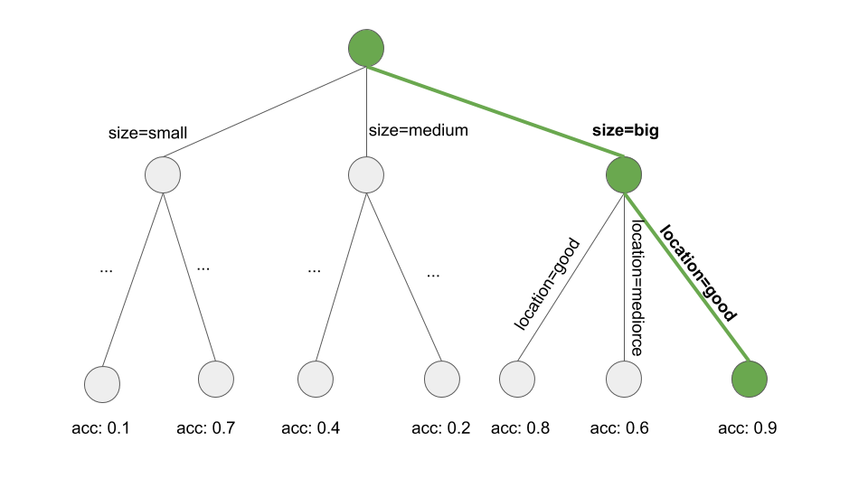

```{r, message = FALSE, warning = FALSE, echo = FALSE}
devtools::load_all(".")
set.seed(42)

if(!require("sbrl")) install.packages("../pkg/sbrl_1.2.tar.gz", repos = NULL, type = "source")
```

<!--{pagebreak}-->

## Decision Rules {#rules}

Decision rules adalah pernyataan IF-THEN sederhana yang terdiri dari kondisi (juga disebut antecedent) dan prediksi.
Sebagai contoh:
JIKA hari ini hujan DAN jika April (kondisi), MAKA besok akan hujan (prediksi).
decision rules tunggal atau kombinasi dari beberapa aturan dapat digunakan untuk membuat prediksi.

decision rules mengikuti struktur umum:
JIKA kondisi terpenuhi MAKA buat prediksi tertentu.
decision rules mungkin merupakan model prediksi yang paling dapat ditafsirkan.
Struktur IF-THEN mereka secara semantik menyerupai bahasa alami dan cara kita berpikir, asalkan kondisinya dibangun dari fitur yang dapat dipahami, panjang kondisinya pendek (sejumlah kecil pasangan `feature=value` dikombinasikan dengan AND) dan ada tidak terlalu banyak aturan.
Dalam pemrograman, sangat wajar untuk menulis aturan IF-THEN.
Yang baru dalam machine learning adalah bahwa decision rules dipelajari melalui suatu algoritma.

Bayangkan menggunakan algoritme untuk mempelajari decision rules untuk memprediksi nilai rumah (`low`, `medium` atau `high`).
Satu decision rules yang dipelajari oleh model ini dapat berupa:
Jika sebuah rumah berukuran lebih dari 100 meter persegi dan memiliki taman, maka nilainya tinggi.
Lebih formal:
IF `size>100 AND garden=1` THEN `value=high`.

Mari kita uraikan decision rules:

- `size>100` adalah kondisi pertama di bagian IF.
- `garden=1` adalah kondisi kedua di bagian IF.
- Kedua kondisi dihubungkan dengan 'AND' untuk membuat kondisi baru.
Keduanya harus benar agar aturan dapat diterapkan.
- Hasil yang diprediksi (bagian ELSE) adalah `value=high`.

Decision rules menggunakan setidaknya satu pernyataan `feature=value` dalam ketentuan, tanpa batas atas berapa banyak lagi yang dapat ditambahkan dengan 'AND'.
Pengecualian adalah aturan default yang tidak memiliki bagian IF eksplisit dan yang berlaku saat tidak ada aturan lain yang berlaku, tetapi lebih lanjut tentang ini nanti.

Kegunaan decision rules biasanya diringkas dalam dua angka: support dan akurasi.

**Support atau coverage of a rule**:
Persentase instance yang menerapkan kondisi aturan disebut support.
Ambil contoh aturan `size=big AND location=good THEN value=high` untuk memprediksi nilai rumah.
Misalkan 100 dari 1000 rumah besar dan berada di lokasi yang baik, maka support aturannya adalah 10%.
Prediksi (bagian THEN) tidak penting untuk perhitungan support.

**Akurasi atau confidence of a rule**:
Keakuratan aturan adalah ukuran seberapa akurat aturan dalam memprediksi kelas yang benar untuk kasus di mana kondisi aturan berlaku.
Sebagai contoh:
Katakanlah dari 100 rumah, di mana aturan `size=big AND location=good THEN value=high` berlaku, 85 memiliki `value=high`, 14 memiliki `value=medium` dan 1 memiliki `value=low`, maka akurasi aturan adalah 85%.

Biasanya ada trade-off antara akurasi dan support:
Dengan menambahkan lebih banyak fitur ke kondisi, kami dapat mencapai akurasi yang lebih tinggi, tetapi kehilangan support.

Untuk membuat pengklasifikasi yang baik untuk memprediksi nilai rumah, Anda mungkin perlu mempelajari tidak hanya satu aturan, tetapi mungkin 10 atau 20.
Kemudian segalanya bisa menjadi lebih rumit dan Anda dapat mengalami salah satu masalah berikut:

- Aturan dapat tumpang tindih:
Bagaimana jika saya ingin memprediksi nilai sebuah rumah dan dua atau lebih aturan berlaku dan mereka memberi saya prediksi yang bertentangan?
- Tidak ada aturan yang berlaku:
Bagaimana jika saya ingin memprediksi nilai sebuah rumah dan tidak ada aturan yang berlaku?

Ada dua strategi utama untuk menggabungkan beberapa aturan:
decision list (terurut) dan kumpulan keputusan (tidak berurutan).
Kedua strategi menyiratkan solusi yang berbeda untuk masalah aturan yang tumpang tindih.

Sebuah **decision list** memperkenalkan perintah ke decision rules.
Jika kondisi aturan pertama benar untuk sebuah instance, kami menggunakan prediksi aturan pertama.
Jika tidak, kami pergi ke aturan berikutnya dan memeriksa apakah itu berlaku dan seterusnya.
decision list memecahkan masalah tumpang tindih aturan dengan hanya mengembalikan prediksi aturan pertama dalam daftar yang berlaku.

Sebuah **decision set** menyerupai demokrasi aturan, kecuali bahwa beberapa aturan mungkin memiliki kekuatan suara yang lebih tinggi.
Dalam satu set, aturannya saling eksklusif, atau ada strategi untuk menyelesaikan konflik, seperti pemungutan suara mayoritas, yang mungkin ditimbang oleh akurasi aturan individu atau ukuran kualitas lainnya.
Interpretabilitas berpotensi menderita ketika beberapa aturan berlaku.

Baik decision list dan set dapat mengalami masalah bahwa tidak ada aturan yang berlaku untuk sebuah instance.
Ini dapat diselesaikan dengan memperkenalkan aturan default.
Aturan default adalah aturan yang berlaku ketika tidak ada aturan lain yang berlaku.
Prediksi aturan default sering kali merupakan kelas yang paling sering dari titik data yang tidak tercakup oleh aturan lain.
Jika satu set atau daftar aturan mencakup seluruh ruang fitur, kami menyebutnya lengkap.
Dengan menambahkan aturan default, satu set atau daftar secara otomatis menjadi lengkap.

Ada banyak cara untuk mempelajari aturan dari data dan buku ini masih jauh dari mencakup semuanya.
Bab ini menunjukkan tiga dari mereka.
Algoritme dipilih untuk mencakup berbagai ide umum untuk learning rules, sehingga ketiganya mewakili pendekatan yang sangat berbeda.

1. **OneR** mempelajari aturan dari satu fitur.
OneR dicirikan oleh kesederhanaan, interpretasi, dan penggunaannya sebagai tolok ukur.
1. **Sequential covering** adalah prosedur umum yang mempelajari aturan secara iteratif dan menghapus titik data yang dicakup oleh aturan baru.
Prosedur ini digunakan oleh banyak algoritma rule learning.
1. **Bayesian Rule Lists** menggabungkan pola frequent yang telah ditambang sebelumnya ke dalam decision list menggunakan statistik Bayesian.
Menggunakan pola pra-tambang adalah pendekatan umum yang digunakan oleh banyak algoritma rule learning.

Mari kita mulai dengan pendekatan paling sederhana: Menggunakan satu fitur terbaik untuk mempelajari aturan.

### Learn Rules from a Single Feature (OneR)

Algoritma OneR yang disarankan oleh Holte (1993)[^oner] adalah salah satu algoritma induksi aturan yang paling sederhana.
Dari semua fitur, OneR memilih salah satu yang membawa informasi paling banyak tentang hasil yang diinginkan dan membuat decision rules dari fitur ini.

Terlepas dari nama OneR, yang merupakan singkatan dari "One Rule", algoritme menghasilkan lebih dari satu aturan:
Ini sebenarnya adalah satu aturan per nilai fitur unik dari fitur terbaik yang dipilih.
Nama yang lebih baik adalah OneFeatureRules.

Algoritmanya sederhana dan cepat:

1. Diskretisasi fitur kontinu dengan memilih interval yang sesuai.
1. Untuk setiap fitur:
    - Buat tabel silang antara nilai fitur dan hasil (kategoris).
    - Untuk setiap nilai fitur, buat aturan yang memprediksi kelas paling sering dari instance yang memiliki nilai fitur khusus ini (dapat dibaca dari tabel silang).
    - Hitung total kesalahan aturan untuk fitur tersebut.
1. Pilih fitur dengan total error terkecil.

OneR selalu mencakup semua contoh kumpulan data, karena menggunakan semua tingkat fitur yang dipilih.
Nilai yang hilang dapat diperlakukan sebagai nilai fitur tambahan atau diperhitungkan sebelumnya.


Model OneR adalah decision trees dengan hanya satu split.
Pemisahan tidak harus biner seperti pada CART, tetapi tergantung pada jumlah nilai fitur unik.


Mari kita lihat contoh bagaimana fitur terbaik dipilih oleh OneR.
Tabel berikut menunjukkan kumpulan data buatan tentang rumah dengan informasi tentang nilai, lokasi, ukuran, dan apakah hewan peliharaan diperbolehkan.
Kami tertarik untuk mempelajari model sederhana untuk memprediksi nilai sebuah rumah.

```{r OneR-freq-table1}
value = factor(c("high", "high", "high", "medium", "medium", "medium", "medium", "low", "low", "low"), levels = c("low", "medium", "high"))

df = data.frame(
  location = c("good", "good", "good", "bad", "good", "good", "bad", "bad", "bad", "bad"),
  size = c("small", "big", "big", "medium", "medium", "small", "medium", "small", "medium", "small"), 
  pets = c("yes", "no", "no", "no", "only cats", "only cats", "yes", "yes", "yes", "no"),
  value = value
)
value.f = factor(paste("value=", value, sep = ""), levels = c("value=low", "value=medium", "value=high"))
kable(df)
```


OneR membuat tabel silang antara setiap fitur dan hasilnya:

```{r OneR-freq-table2}
kable(table(paste0("location=", df[,"location"]), value.f))
kable(table(paste0("size=", df[,"size"]), value.f))
kable(table(paste0("pets=", df[,"pets"]), value.f))
```

Untuk setiap fitur, kita menelusuri tabel baris demi baris:
Setiap nilai fitur adalah bagian IF dari sebuah aturan;
kelas yang paling umum untuk instance dengan nilai fitur ini adalah prediksi, bagian THEN dari aturan.
Misalnya, fitur ukuran dengan level `small`, `medium`, dan `big` menghasilkan tiga aturan.
Untuk setiap fitur, kami menghitung tingkat kesalahan total dari aturan yang dihasilkan, yang merupakan jumlah kesalahan.
Fitur lokasi memiliki kemungkinan nilai `buruk` dan `baik`.
Nilai yang paling sering untuk rumah di lokasi yang buruk adalah `rendah` dan ketika kita menggunakan `rendah` sebagai prediksi, kita membuat dua kesalahan, karena dua rumah memiliki nilai `sedang`.
p-valuerediksi rumah di lokasi yang baik adalah `tinggi` dan sekali lagi kami membuat dua kesalahan, karena dua rumah memiliki nilai `sedang`.
Kesalahan yang kami buat dengan menggunakan fitur lokasi adalah 4/10, untuk fitur ukuran adalah 3/10 dan untuk fitur hewan peliharaan adalah 4/10.
Fitur ukuran menghasilkan aturan dengan kesalahan terendah dan akan digunakan untuk model OneR akhir:

IF `size=small` THEN  `value=low`  
IF `size=medium` THEN  `value=medium`  
IF `size=big` THEN  `value=high`

OneR lebih menyukai fitur dengan banyak kemungkinan level, karena fitur tersebut dapat menyesuaikan target dengan lebih mudah.
Bayangkan sebuah kumpulan data yang hanya berisi noise dan tanpa sinyal, yang berarti bahwa semua fitur mengambil nilai acak dan tidak memiliki p-valuerediksi untuk target.
Beberapa fitur memiliki level lebih dari yang lain.
Fitur dengan lebih banyak level sekarang dapat lebih mudah dipasangkan.
Fitur yang memiliki level terpisah untuk setiap instance dari data akan memprediksi dengan sempurna seluruh set data pelatihan.
Solusinya adalah dengan membagi data menjadi set pelatihan dan validasi, mempelajari aturan pada data pelatihan dan mengevaluasi kesalahan total untuk memilih fitur pada set validasi.

Ikatan adalah masalah lain, yaitu ketika dua fitur menghasilkan kesalahan total yang sama.
OneR memecahkan ikatan dengan mengambil fitur pertama dengan kesalahan terendah atau fitur dengan p-value terendah dari uji chi-squared.

**Contoh**

Mari kita coba OneR dengan data nyata.
Kami menggunakan [tugas klasifikasi kanker serviks](#cervical) untuk menguji algoritma OneR.
Semua fitur input kontinu didiskritisasi menjadi 5 kuantilnya.
Aturan berikut dibuat:
```{r oner-cervical}
library("OneR")
data("cervical")
rule = OneR::OneR(Biopsy ~ ., data = cervical)

rule.to.table = function(rule){
  dt = data.frame(x = names(rule$rules), prediction = unlist(rule$rules))
  colnames(dt) = c(rule$feature, "prediction")
  dt
}

kable(rule.to.table(rule), row.names = FALSE)
```

Fitur usia dipilih oleh OneR sebagai fitur prediksi terbaik.
Karena kanker jarang terjadi, untuk setiap aturan kelas mayoritas dan oleh karena itu label yang diprediksi selalu Sehat, yang agak tidak membantu.
Tidak masuk akal untuk menggunakan prediksi label dalam kasus yang tidak seimbang ini.
Tabel silang antara interval 'Usia' dan Kanker/Sehat bersama dengan persentase wanita dengan kanker lebih informatif:

```{r oner-cervical-confusion}
tt = table(paste0("Age=", bin(cervical$Age)), cervical$Biopsy)
cn = colnames(tt)
tt = data.frame(matrix(tt, ncol = 2), row.names = rownames(tt))
colnames(tt) = cn 
tt$p.cancer = round(tt[,"Cancer"]/(tt[,"Cancer"] + tt[,"Healthy"]), 2)
kable(tt[c("Cancer", "Healthy", "p.cancer")], col.names = c("# Cancer", "# Healthy", "P(Cancer)"))
```

Tapi sebelum Anda mulai menafsirkan apa pun:
Karena prediksi untuk setiap fitur dan setiap nilai adalah Sehat, tingkat kesalahan total adalah sama untuk semua fitur.
Ikatan dalam kesalahan total, secara default, diselesaikan dengan menggunakan fitur pertama dari yang memiliki tingkat kesalahan terendah (di sini, semua fitur memiliki 55/858), yang kebetulan merupakan fitur Usia.

OneR tidak mendukung tugas regresi.
Tetapi kita dapat mengubah tugas regresi menjadi tugas klasifikasi dengan memotong hasil kontinu ke dalam interval.
Kami menggunakan trik ini untuk memprediksi jumlah [sepeda sewaan](#bike-data) dengan OneR dengan memotong jumlah sepeda menjadi empat kuartil (0-25%, 25-50%, 50-75%, dan 75-100 %).
Tabel berikut menunjukkan fitur yang dipilih setelah menyesuaikan model OneR:

```{r oner-bike}
data("bike")
bike2 = bike
bike2$days_since_2011 = max(0, bike2$days_since_2011)
bike2$cnt =  cut(bike2$cnt, breaks = quantile(bike$cnt), dig.lab = 10, include.lowest = TRUE)
rule = OneR::OneR(cnt ~ ., data = bike2)

kable(rule.to.table(rule), row.names = FALSE)
```

Fitur yang dipilih adalah bulan.
Fitur bulan memiliki (kejutan!) 12 tingkat fitur, yang lebih banyak daripada kebanyakan fitur lainnya.
Jadi ada bahaya overfitting.
Di sisi yang lebih optimis: fitur bulan dapat menangani tren musiman (misalnya sepeda yang lebih jarang disewa di musim dingin) dan prediksinya tampak masuk akal.

Sekarang kita beralih dari algoritma OneR sederhana ke prosedur yang lebih kompleks menggunakan aturan dengan kondisi yang lebih kompleks yang terdiri dari beberapa fitur: Sequential Covering.

### Sequential Covering

Sequential covering adalah prosedur umum yang berulang kali mempelajari satu aturan untuk membuat decision list (atau kumpulan) yang mencakup seluruh kumpulan data aturan demi aturan.
Banyak algoritma rule learning adalah varian dari algoritma sequential covering.
Bab ini memperkenalkan resep utama dan menggunakan RIPPER, varian dari algoritma Sequential covering untuk contoh.

Idenya sederhana:
Pertama, temukan aturan bagus yang berlaku untuk beberapa titik data.
Hapus semua titik data yang dicakup oleh aturan.
Titik data tercakup ketika kondisi berlaku, terlepas dari apakah titik diklasifikasikan dengan benar atau tidak.
Ulangi rule learning dan penghapusan poin tertutup dengan poin yang tersisa sampai tidak ada lagi poin yang tersisa atau kondisi berhenti lainnya terpenuhi.
Hasilnya adalah decision list.
Pendekatan rule learning berulang dan penghapusan titik data tertutup ini disebut "separate-and-conquer".

Misalkan kita sudah memiliki algoritme yang dapat membuat satu aturan yang mencakup sebagian data.
Algoritma Sequential covering untuk dua kelas (satu positif, satu negatif) bekerja seperti ini:

- Mulailah dengan daftar aturan kosong (rlist).
- Pelajari aturan r.
- Sementara daftar aturan di bawah ambang batas kualitas tertentu (atau contoh positif belum tercakup):
    - Tambahkan aturan r ke rlist.
    - Hapus semua titik data yang dicakup oleh aturan r.
    - Pelajari aturan lain pada data yang tersisa.
- Kembalikan decision list.

```{r covering-algo, fig.cap = "The covering algorithm works by sequentially covering the feature space with single rules and removing the data points that are already covered by those rules. For visualization purposes, the features x1 and x2 are continuous, but most rule learning algorithms require categorical features."}
set.seed(42)
n = 100
dat = data.frame(x1 = rnorm(n), x2 = rnorm(n))
dat$class = rbinom(n = 100, size = 1, p = exp(dat$x1 + dat$x2) / (1 + exp(dat$x1 + dat$x2)))
dat$class = factor(dat$class)

min.x1 = min(dat$x1)
min.x2 = min(dat$x2)
p1 = ggplot(dat) + geom_point(aes(x = x1, y = x2, color = class, shape = class))+ 
  scale_color_viridis(guide = "none", discrete = TRUE, option = "D", end = 0.9) +
  scale_shape_discrete(guide = "none") +
  ggtitle("Data")
p2 = ggplot(dat) + 
  geom_rect(xmin = -3, xmax = 0,   ymin = -2, ymax = -0.5, color = "black", fill = NA) + 
geom_point(aes(x = x1, y = x2, color = class, shape = class)) + 
  scale_color_viridis(guide = "none", discrete = TRUE, option = "D", end = 0.9) +
  scale_shape_discrete(guide = "none") +
  ggtitle("Step 1: Find rule")

dat.reduced = filter(dat, !(x1 <= 0 & x2 <= -0.5))

p3 = ggplot(dat.reduced) + 
  geom_rect(xmin = -3, xmax = 0,   ymin = -2, ymax = -0.5, color = "black", fill = NA)  + 
  geom_point(aes(x = x1, y = x2, color = class, shape = class)) + 
  scale_x_continuous(limits = c(min.x1, NA)) + 
  scale_y_continuous(limits = c(min.x2, NA)) + 
  scale_color_viridis(guide = "none", discrete = TRUE, option = "D", end = 0.9) +
  scale_shape_discrete(guide = "none") + 
  ggtitle("Step 2: Remove covered instances")


p4 = p3 + 
  geom_rect(xmin = 0.8, xmax = 2.5, ymin = -1.5, ymax = 1.5, color = "black", fill = NA)  + 
  ggtitle("Step 3: Find next rule")

gridExtra::grid.arrange(p1, p2, p3, p4, ncol = 2)

```

Misalnya:
Kami memiliki tugas dan kumpulan data untuk memprediksi nilai rumah dari ukuran, lokasi, dan apakah hewan peliharaan diperbolehkan.
Kami mempelajari aturan pertama, yang ternyata adalah:
Jika `size=big` dan `location=good`, maka `value=high`.
Kemudian kami menghapus semua rumah besar di lokasi yang baik dari dataset.
Dengan data yang tersisa, kita mempelajari aturan berikutnya.
Mungkin: Jika `lokasi=baik`, maka `nilai=sedang`.
Perhatikan bahwa aturan ini dipelajari pada data tanpa rumah besar di lokasi yang baik, hanya menyisakan rumah sedang dan kecil di lokasi yang baik.

Untuk pengaturan multi-kelas, pendekatannya harus dimodifikasi.
Pertama, kelas-kelas diurutkan berdasarkan peningkatan prevalensi.
Algoritme sequential covering dimulai dengan kelas yang paling tidak umum, mempelajari aturan untuk itu, menghapus semua instance yang tercakup, kemudian pindah ke kelas paling tidak umum kedua dan seterusnya.
Kelas saat ini selalu diperlakukan sebagai kelas positif dan semua kelas dengan prevalensi lebih tinggi digabungkan dalam kelas negatif.
Kelas terakhir adalah aturan default.
Ini juga disebut sebagai strategi satu lawan semua dalam klasifikasi.


Bagaimana kita mempelajari satu aturan?
Algoritma OneR tidak akan berguna di sini, karena akan selalu mencakup seluruh ruang fitur.
Tapi ada banyak kemungkinan lain.
Salah satu kemungkinannya adalah mempelajari satu aturan dari decision trees dengan beam search:

- Pelajari decision trees (dengan CART atau algoritma pembelajaran pohon lainnya).
- Mulai dari simpul akar dan pilih simpul paling murni secara rekursif (misalnya dengan tingkat kesalahan klasifikasi terendah).
- Kelas mayoritas dari simpul terminal digunakan sebagai prediksi aturan;
jalur yang menuju ke simpul tersebut digunakan sebagai kondisi aturan.

Gambar berikut mengilustrasikan beam search di pohon:

```{r learn-one-rule, fig.cap = "Learning a rule by searching a path through a decision tree. A decision tree is grown to predict the target of interest. We start at the root node, greedily and iteratively follow the path which locally produces the purest subset (e.g. highest accuracy) and add all the split values to the rule condition. We end up with: If `location=good` and `size=big`, then `value=high`.", out.width=700}

```

Mempelajari satu aturan adalah masalah pencarian, di mana ruang pencarian adalah ruang dari semua aturan yang mungkin.
Tujuan dari pencarian adalah untuk menemukan aturan terbaik menurut beberapa kriteria.
Ada banyak strategi pencarian yang berbeda:
hill-climbing, beam search, exhaustive search, best-first search, ordered search, stochastic search, top-down search, bottom-up search, ...

RIPPER (Repeated Incremental Pruning to Produce Error Reduction) oleh Cohen (1995)[^ripper] adalah varian dari algoritma Sequential Covering.
RIPPER sedikit lebih canggih dan menggunakan fase pasca-pemrosesan (pemangkasan aturan) untuk mengoptimalkan decision list (atau set).
RIPPER dapat berjalan dalam mode berurutan atau tidak berurutan dan menghasilkan decision list atau kumpulan keputusan.

**Contoh**

Kami akan menggunakan RIPPER untuk contoh.

Algoritme RIPPER tidak menemukan aturan apa pun dalam tugas klasifikasi untuk [kanker serviks](#cervical).
```{r jrip-cervical, include = FALSE}
library("RWeka")
library(rJava)

extract.rules.jrip = function (rule) {
rules = scan(text=.jcall(rule$classifier, "S", "toString"), sep="\n", what="")
# removes text
rules = rules[-c(1, 2, length(rules))]
rules = gsub("\\([0-9]*\\.[0-9]\\/[0-9]*\\.[0-9]\\)", "", rules)
rules = as.matrix(rules)[-c(1:2, 6), ,drop=FALSE]
rules  = data.frame(rules)
if (nrow(rules) == 0) {
  return(NULL)
} else {
  kable(rules)
}
}

rule = JRip(Biopsy ~ ., data = cervical)
extract.rules.jrip(rule)
```

Saat kita menggunakan RIPPER pada tugas regresi untuk memprediksi [jumlah sepeda](#bike-data) beberapa aturan ditemukan.
Karena RIPPER hanya berfungsi untuk klasifikasi, jumlah sepeda harus diubah menjadi hasil kategoris.
Saya mencapai ini dengan memotong jumlah sepeda menjadi kuartil.
Misalnya (4548, 5956) adalah interval yang mencakup perkiraan jumlah sepeda antara 4548 dan 5956.
Tabel berikut menunjukkan decision list aturan yang dipelajari.

```{r jrip-bike}
bike2 = bike
bike2$cnt = round(bike2$cnt)
bike2$cnt =  cut(bike$cnt, breaks = quantile(bike$cnt), dig.lab = 10, include.lowest = TRUE)
bike2$temp = round(bike2$temp)
bike2$windspeed = round(bike2$windspeed)
bike2$hum = round(bike2$hum)

rule = JRip(cnt  ~ ., data = bike2)
extract.rules.jrip(rule)
```

Interpretasinya sederhana:
Jika kondisi berlaku, kami memprediksi interval di sisi kanan untuk jumlah sepeda.
Aturan terakhir adalah aturan default yang berlaku ketika tidak ada aturan lain yang berlaku untuk sebuah instance.
Untuk memprediksi instance baru, mulai dari bagian atas daftar dan periksa apakah aturan berlaku.
Ketika suatu kondisi cocok, maka sisi kanan aturan adalah prediksi untuk instance ini.
Aturan default memastikan bahwa selalu ada prediksi.

### Bayesian Rule Lists

Di bagian ini, saya akan menunjukkan pendekatan lain untuk mempelajari decision list, yang mengikuti resep kasar ini:

1. Pra-tambang pola yang sering dari data yang dapat digunakan sebagai kondisi untuk decision rules.
1. Pelajari decision list dari pilihan aturan yang sudah ditentukan sebelumnya.

Pendekatan khusus menggunakan resep ini disebut Bayesian Rule Lists (Letham et. al, 2015)[^brl] atau disingkat BRL.
BRL menggunakan statistik Bayesian untuk mempelajari decision list dari pola yang sering ditambang dengan algoritma pohon FP (Borgelt 2005)[^fp-tree]

Tapi mari kita mulai perlahan dengan langkah pertama BRL.

**Pra-penambangan pola yang sering**

Pola yang sering adalah seringnya (bersama) terjadinya nilai fitur.
Sebagai langkah pra-pemrosesan untuk algoritma BRL, kami menggunakan fitur (kami tidak memerlukan hasil target dalam langkah ini) dan mengekstrak pola yang sering muncul darinya.
Pola dapat berupa nilai fitur tunggal seperti `size=medium` atau kombinasi nilai fitur seperti `size=medium AND location=bad`.

Frekuensi suatu pola diukur dengan supportnya dalam kumpulan data:

$$Support(x_j=A)=\frac{1}n{}\sum_{i=1}^nI(x^{(i)}_{j}=A)$$

di mana A adalah nilai fitur, n jumlah titik data dalam kumpulan data dan I fungsi indikator yang mengembalikan 1 jika fitur $x_j$ dari instance i memiliki level A jika tidak 0.
Dalam kumpulan data nilai rumah, jika 20% rumah tidak memiliki balkon dan 80% memiliki satu atau lebih, maka support untuk pola `balcony=0` adalah 20%.
support juga dapat diukur untuk kombinasi nilai fitur, misalnya untuk `balcony=0 AND pets=allowed`.

Ada banyak algoritma untuk menemukan pola yang sering seperti itu, misalnya Apriori atau FP-Growth.
Yang Anda gunakan tidak terlalu penting, hanya kecepatan ditemukannya pola yang berbeda, tetapi pola yang dihasilkan selalu sama.

Saya akan memberi Anda gambaran kasar tentang bagaimana algoritma Apriori bekerja untuk menemukan pola yang sering.
Sebenarnya algoritma Apriori terdiri dari dua bagian, dimana bagian pertama menemukan pola frequent dan bagian kedua membangun aturan asosiasi darinya.
Untuk algoritma BRL, kami hanya tertarik pada pola frequent yang dibangkitkan di bagian pertama Apriori.

Pada langkah pertama, algoritma Apriori dimulai dengan semua nilai fitur yang memiliki support lebih besar dari support minimum yang ditentukan oleh pengguna.
Jika pengguna mengatakan bahwa support minimum harus 10% dan hanya 5% rumah yang memiliki `size=big`, kami akan menghapus nilai fitur tersebut dan hanya mempertahankan `size=medium` dan `size=small` sebagai pola.
Ini tidak berarti bahwa rumah dihapus dari data, itu hanya berarti bahwa `size=big` tidak dikembalikan sebagai pola yang sering.
Berdasarkan pola frequent dengan nilai fitur tunggal, algoritma Apriori secara iteratif mencoba mencari kombinasi nilai fitur dengan urutan yang semakin tinggi.
Pola dibangun dengan menggabungkan pernyataan `feature=value` dengan logika AND, mis. `size=medium AND location=bad`.
Pola yang dihasilkan dengan support di bawah support minimum dihapus.
Pada akhirnya kita memiliki semua pola yang sering.
Setiap subset dari klausa pola frequent menjadi frequent lagi, yang disebut properti Apriori.
Masuk akal secara intuitif:
Dengan menghapus suatu kondisi dari suatu pola, pola yang direduksi hanya dapat mencakup lebih banyak atau jumlah titik data yang sama, tetapi tidak kurang.
Misalnya, jika 20% rumah `size=medium and location=good`, maka daya dukung rumah yang hanya `size=medium` adalah 20% atau lebih besar.
Properti Apriori digunakan untuk mengurangi jumlah pola yang akan diperiksa.
Hanya dalam kasus pola yang sering kita harus memeriksa pola urutan yang lebih tinggi.

Sekarang kita selesai dengan kondisi pra-penambangan untuk algoritma Bayesian Rule Lists.
Tetapi sebelum kita melanjutkan ke langkah kedua BRL, saya ingin memberi petunjuk tentang cara lain untuk rule learning berdasarkan pola yang sudah ditambang sebelumnya.
Pendekatan lain menyarankan untuk memasukkan hasil yang diinginkan ke dalam proses penambangan pola yang sering dan juga mengeksekusi bagian kedua dari algoritma Apriori yang membangun aturan IF-THEN.
Karena algoritme tidak supervised, bagian THEN juga berisi nilai fitur yang tidak kami minati.
Tetapi kita dapat memfilter menurut aturan yang hanya memiliki hasil yang menarik di bagian THEN.
Aturan-aturan ini sudah membentuk seperangkat keputusan, tetapi juga memungkinkan untuk mengatur, memangkas, menghapus, atau menggabungkan kembali aturan.

Namun dalam pendekatan BRL, kami bekerja dengan pola frequent dan mempelajari bagian THEN dan bagaimana mengatur pola ke dalam decision list menggunakan statistik Bayesian.

**Mempelajari Bayesian Rule Lists**

Tujuan dari algoritma BRL adalah untuk mempelajari decision list yang akurat menggunakan pilihan kondisi yang telah ditambang sebelumnya, sambil memprioritaskan daftar dengan sedikit aturan dan kondisi yang singkat.
BRL membahas tujuan ini dengan mendefinisikan distribusi decision list dengan distribusi sebelumnya untuk panjang kondisi (lebih disukai aturan yang lebih pendek) dan jumlah aturan (lebih disukai daftar yang lebih pendek).

Distribusi probabilitas posteriori dari daftar memungkinkan untuk mengatakan seberapa besar kemungkinan decision list, mengingat asumsi singkat dan seberapa baik daftar tersebut cocok dengan data.
Tujuan kami adalah menemukan daftar yang memaksimalkan probabilitas posterior ini.
Karena tidak mungkin menemukan daftar terbaik yang tepat langsung dari distribusi daftar, BRL menyarankan resep berikut:
1) Menghasilkan decision list awal, yang diambil secara acak dari distribusi apriori.
2) Memodifikasi daftar secara iteratif dengan menambahkan, mengganti atau menghapus aturan, memastikan bahwa daftar yang dihasilkan mengikuti distribusi posterior daftar.
3) Pilih decision list dari daftar sampel dengan probabilitas tertinggi menurut distribusi posteriori.

Mari kita membahas algoritma lebih dekat:
Algoritma dimulai dengan pola nilai fitur pra-penambangan dengan algoritma FP-Growth.
BRL membuat sejumlah asumsi tentang distribusi target dan distribusi parameter yang menentukan distribusi target.
(Itu statistik Bayesian.)
Jika Anda tidak terbiasa dengan statistik Bayesian, jangan terlalu terpaku pada penjelasan berikut.
Penting untuk diketahui bahwa pendekatan Bayesian adalah cara untuk menggabungkan pengetahuan atau persyaratan yang ada (disebut distribusi apriori) sekaligus menyesuaikan dengan data.
Dalam kasus decision list, pendekatan Bayesian masuk akal, karena asumsi sebelumnya mendorong decision list menjadi pendek dengan aturan pendek.

Tujuannya adalah untuk mengambil sampel decision list d dari distribusi posteriori:

$$\underbrace{p(d|x,y,A,\alpha,\lambda,\eta)}_{posteriori}\propto\underbrace{p(y|x,d,\alpha)}_{likelihood}\cdot\underbrace{p(d|A,\lambda,\eta)}_{priori}$$

di mana d adalah decision list, x adalah fitur, y adalah target, A kumpulan kondisi pra-tambang, $\lambda$ panjang perkiraan sebelumnya dari decision list, $\eta$ jumlah kondisi yang diharapkan sebelumnya dalam aturan, $\alpha$ pseudo-count sebelumnya untuk kelas positif dan negatif yang paling baik ditetapkan pada (1,1).

$$p(d|x,y,A,\alpha,\lambda,\eta)$$

mengkuantifikasi seberapa besar kemungkinan decision list, mengingat data yang diamati dan asumsi apriori.
Ini sebanding dengan kemungkinan hasil y yang diberikan decision list dan data kali probabilitas daftar yang diberikan asumsi sebelumnya dan kondisi pra-tambang.

$$p(y|x,d,\alpha)$$

adalah kemungkinan y yang diamati, mengingat decision list dan data.
BRL mengasumsikan bahwa y dihasilkan oleh distribusi Dirichlet-Multinomial.
Semakin baik decision list d menjelaskan data, semakin tinggi kemungkinannya.

$$p(d|A,\lambda,\eta)$$

adalah distribusi sebelumnya dari decision list.
Ini secara perkalian menggabungkan distribusi Poisson terpotong (parameter $\lambda$) untuk jumlah aturan dalam daftar dan distribusi Poisson terpotong (parameter $\eta$) untuk jumlah nilai fitur dalam ketentuan aturan.

decision list memiliki probabilitas posterior yang tinggi jika menjelaskan hasil y dengan baik dan juga kemungkinan sesuai dengan asumsi sebelumnya.

Estimasi dalam statistik Bayesian selalu sedikit rumit, karena kita biasanya tidak dapat langsung menghitung jawaban yang benar, tetapi kita harus menggambar kandidat, mengevaluasinya, dan memperbarui estimasi posteriori kita menggunakan metode rantai Markov Monte Carlo.
Untuk decision list, ini bahkan lebih rumit, karena kita harus menggambar dari distribusi decision list.
Penulis BRL mengusulkan untuk terlebih dahulu menggambar decision list awal dan kemudian memodifikasinya secara iteratif untuk menghasilkan sampel decision list dari distribusi posterior daftar (rantai Markov decision list).
Hasilnya berpotensi tergantung pada decision list awal, jadi disarankan untuk mengulangi prosedur ini untuk memastikan banyaknya variasi daftar.
Default dalam implementasi perangkat lunak adalah 10 kali.
Resep berikut memberi tahu kita cara menggambar decision list awal:

- Pola pra-tambang dengan FP-Growth.
- Contoh parameter panjang daftar m dari distribusi Poisson terpotong.
- Untuk aturan default: Contoh parameter distribusi Dirichlet-Multinomial $\theta_0$ dari nilai target (yaitu aturan yang berlaku saat tidak ada lagi yang berlaku).
- Untuk aturan decision list j=1,...,m, lakukan:
    - Contoh parameter panjang aturan l (jumlah kondisi) untuk aturan j.
    - Contoh kondisi panjang $l_j$ dari kondisi pra-tambang.
    - Contoh parameter distribusi Dirichlet-Multinomial untuk bagian THEN (yaitu untuk distribusi hasil target yang diberikan aturan)
- Untuk setiap observasi dalam dataset:
    - Temukan aturan dari decision list yang berlaku terlebih dahulu

Langkah selanjutnya adalah menghasilkan banyak daftar baru mulai dari sampel awal ini untuk mendapatkan banyak sampel dari distribusi posterior decision list.

decision list baru diambil sampelnya dengan memulai dari daftar awal dan kemudian secara acak memindahkan aturan ke posisi berbeda dalam daftar atau menambahkan aturan ke decision list saat ini dari kondisi yang telah ditentukan sebelumnya atau menghapus aturan dari decision list.
Aturan mana yang diubah, ditambahkan, atau dihapus dipilih secara acak.
Pada setiap langkah, algoritma mengevaluasi probabilitas posteriori dari decision list (campuran akurasi dan kependekan).
Algoritma Metropolis Hastings memastikan bahwa kami mengambil sampel decision list yang memiliki probabilitas posterior tinggi.
Prosedur ini memberi kita banyak sampel dari distribusi decision list.
Algoritma BRL memilih decision list sampel dengan probabilitas posterior tertinggi.

**Contoh**

Itu saja dengan teorinya, sekarang mari kita lihat metode BRL beraksi.
Contoh menggunakan varian BRL yang lebih cepat yang disebut Scalable Bayesian Rule Lists (SBRL) oleh Yang et. al (2017) [^sbrl].
Kami menggunakan algoritma SBRL untuk memprediksi [risiko kanker serviks](#cervical).
Saya pertama-tama harus mendiskritisasi semua fitur input agar algoritma SBRL berfungsi.
Untuk tujuan ini saya menggabungkan fitur kontinu berdasarkan frekuensi nilai dengan kuantil.

Kami mendapatkan aturan berikut:

```{r sbrl-cervical, results = "hide", eval = FALSE}
library("sbrl")
library("arules")
data("cervical")

cervical2 = as.data.frame(lapply(cervical, function(x) {
  if(is.factor(x) || length(unique(x)) < 3) {
    as.factor(x)
  } else {
    discretize(x, method = "interval", 3)
    #discretize(x, breaks = max(length(unique(x))-1, 5))
  }
}))

get.sbrl.rules = function(x) {
    res = lapply(1:nrow(x$rs), function(i) {
        if (i == 1) 
            sprintf("If      %s (rule[%d]) then positive probability = %.8f\n", 
                x$rulenames[x$rs$V1[i]], x$rs$V1[i], x$rs$V2[i])
        else if (i == nrow(x$rs)) 
            sprintf("else  (default rule)  then positive probability = %.8f\n", 
                x$rs$V2[nrow(x$rs)])
        else sprintf("else if %s (rule[%d]) then positive probability = %.8f\n", 
            x$rulenames[x$rs$V1[i]], x$rs$V1[i], x$rs$V2[i])
    })
    data.frame(rules = unlist(res))
}


cervical2$label = cervical2$Biopsy
cervical2$Biopsy = NULL
rules = sbrl(cervical2, pos_sign = "Cancer", neg_sign = "Healthy", rule_maxlen = 2)
rn = rules$rulenames
rl = get.sbrl.rules(rules)
saveRDS(list(rulenames = rn, rules = rl), file = "../data/cached-sbrl-cervical.RDS")
```


```{r sbrl-cervical-show}
rules = readRDS("../data/cached-sbrl-cervical.RDS")
kable(rules$rules)
```

Perhatikan bahwa kita mendapatkan aturan yang masuk akal, karena prediksi pada bagian THEN bukanlah hasil kelas, tetapi probabilitas prediksi untuk kanker.

Kondisi dipilih dari pola yang telah ditambang sebelumnya dengan algoritma FP-Growth.
Tabel berikut menampilkan kumpulan kondisi yang dapat dipilih oleh algoritme SBRL untuk membuat decision list.
Jumlah maksimum nilai fitur dalam kondisi yang saya izinkan sebagai pengguna adalah dua.
Berikut adalah contoh dari sepuluh pola:

```{r sbrl-cervical-premined}
set.seed(1)
conditions = sample(rules$rulenames, size = 10)
kable(gsub("\\{|\\}", "", conditions), col.names = "pre-mined conditions")
```

Selanjutnya, kami menerapkan algoritme SBRL ke [tugas prediksi rental sepeda](#bike-data).
Ini hanya berfungsi jika masalah regresi dalam memprediksi jumlah sepeda diubah menjadi tugas klasifikasi biner.
Saya telah secara sewenang-wenang membuat tugas klasifikasi dengan membuat label yaitu 1 jika jumlah sepeda melebihi 4000 sepeda dalam sehari, jika tidak 0.

Daftar berikut dipelajari oleh SBRL:

```{r sbrl-bike, results = "hide", eval = FALSE}
library("sbrl")
library("arules")
data("bike")

bike2 = bike
bike2$label = bike2$cnt > 4000
bike2$cnt = NULL
bike2 = as.data.frame(lapply(bike2, function(x) {
  if(is.factor(x) || length(unique(x)) < 3) {
    as.factor(x)
  } else {
    discretize(x, method = "interval", 3)
    #discretize(x, breaks = max(length(unique(x))-1, 5))
  }
}))
rules = sbrl(bike2, pos_sign = TRUE, neg_sign = FALSE, rule_maxlen = 3)
rules = get.sbrl.rules(rules)
saveRDS(rules, file = "../data/cached-sbrl-bike.RDS")
```

```{r sbrl-bike-show}
rules = readRDS("../data/cached-sbrl-bike.RDS")
kable(rules)
```

Mari kita perkirakan probabilitas jumlah sepeda akan melebihi 4000 untuk satu hari di tahun 2012 dengan suhu 17 derajat Celcius.
Aturan pertama tidak berlaku, karena hanya berlaku selama berhari-hari di tahun 2011.
Aturan kedua berlaku, karena hari pada tahun 2012 dan 17 derajat terletak pada interval `[7.35,19.9)`.
Prediksi kami untuk probabilitas lebih dari 4000 sepeda yang disewa adalah 88%.

### Advantages

Bagian ini membahas manfaat aturan IF-THEN secara umum.

Aturan IF-THEN **mudah ditafsirkan**.
Mereka mungkin adalah model yang paling dapat diinterpretasikan dari yang dapat diinterpretasikan.
Pernyataan ini hanya berlaku jika jumlah aturannya kecil, kondisi aturannya pendek (maksimal 3 saya katakan) dan jika aturan diatur dalam decision list atau decision set yang tidak tumpang tindih.

decision rules bisa **seekspresif seperti decision trees, sekaligus lebih ringkas**.
decision trees sering juga menderita dari subpohon yang direplikasi, yaitu, ketika pemisahan di simpul anak kiri dan kanan memiliki struktur yang sama.

**Prediksi dengan aturan IF-THEN cepat**, karena hanya beberapa pernyataan biner yang perlu diperiksa untuk menentukan aturan mana yang berlaku.

decision rules **kuat** terhadap transformasi monoton dari fitur input, karena hanya ambang batas dalam kondisi yang berubah.
Mereka juga kuat terhadap outlier, karena hanya penting jika suatu kondisi berlaku atau tidak.

Aturan IF-THEN biasanya menghasilkan model yang jarang, yang berarti tidak banyak fitur yang disertakan.
Mereka **hanya memilih fitur yang relevan** untuk model tersebut.
Misalnya, model linier memberikan bobot untuk setiap fitur input secara default.
Fitur yang tidak relevan dapat diabaikan begitu saja oleh aturan IF-THEN.

Aturan sederhana seperti dari OneR **dapat digunakan sebagai dasar** untuk algoritme yang lebih kompleks.

### Disadvantages 

Bagian ini membahas kelemahan aturan IF-THEN secara umum.

Penelitian dan literatur untuk aturan IF-THEN berfokus pada klasifikasi dan hampir **mengabaikan regresi**.
Meskipun Anda selalu dapat membagi target berkelanjutan menjadi interval dan mengubahnya menjadi masalah klasifikasi, Anda selalu kehilangan informasi.
Secara umum, pendekatan lebih menarik jika dapat digunakan baik untuk regresi maupun klasifikasi.

Seringkali **fitur juga harus kategoris**.
Itu berarti fitur numerik harus dikategorikan jika Anda ingin menggunakannya.
Ada banyak cara untuk memotong fitur kontinu menjadi interval, tetapi ini tidak sepele dan disertai dengan banyak pertanyaan tanpa jawaban yang jelas.
Berapa banyak interval yang harus dibagi menjadi fitur?
Apa kriteria pemisahan: Panjang interval tetap, kuantil atau yang lainnya?
Mengkategorikan fitur berkelanjutan adalah masalah non-sepele yang sering diabaikan dan orang-orang hanya menggunakan metode terbaik berikutnya (seperti yang saya lakukan dalam contoh).

Banyak dari algoritma rule learning yang lebih tua rentan terhadap overfitting.
Algoritme yang disajikan di sini semuanya memiliki setidaknya beberapa perlindungan untuk mencegah overfitting:
OneR terbatas karena hanya dapat menggunakan satu fitur (hanya bermasalah jika fitur memiliki terlalu banyak level atau jika ada banyak fitur, yang setara dengan masalah pengujian ganda), RIPPER melakukan pemangkasan dan Bayesian Rule Lists memberlakukan distribusi sebelumnya pada keputusan daftar.

decision rules **buruk dalam menggambarkan hubungan linier** antara fitur dan output.
Itu adalah masalah yang mereka bagikan dengan decision trees.
decision trees dan aturan hanya dapat menghasilkan fungsi prediksi seperti langkah, di mana perubahan prediksi selalu langkah diskrit dan tidak pernah kurva mulus.
Hal ini terkait dengan isu bahwa input harus kategoris.
Dalam decision trees, mereka secara implisit dikategorikan dengan memisahkannya.


### Software and Alternatives


OneR diimplementasikan dalam [paket R OneR](https://cran.r-project.org/web/packages/OneR/), yang digunakan untuk contoh dalam buku ini.
OneR juga diimplementasikan di [library machine learning Weka](https://www.eecs.yorku.ca/tdb/_doc.php/userg/sw/weka/doc/weka/classifiers/rules/package-summary.html ) dan dengan demikian tersedia di Java, R dan Python.
RIPPER juga diterapkan di Weka. Sebagai contoh, saya menggunakan implementasi R dari JRIP di [paket RWeka](https://cran.r-project.org/web/packages/RWeka/index.html).
SBRL tersedia sebagai [paket R](https://cran.r-project.org/web/packages/sbrl/index.html) (yang saya gunakan untuk contoh), di [Python](https://github.com/datascienceinc/Skater) atau sebagai [implementasi C](https://github.com/Hongyuy/sbrlmod).

Saya bahkan tidak akan mencoba membuat daftar semua alternatif untuk mempelajari kumpulan dan daftar decision rules, tetapi akan menunjukkan beberapa pekerjaan meringkas.
Saya merekomendasikan buku "Foundations of Rule Learning" oleh Fuernkranz et. al (2012)[^fuernkranz].
Ini adalah pekerjaan ekstensif tentang learning rules, bagi mereka yang ingin mempelajari topik lebih dalam.
Ini menyediakan kerangka kerja holistik untuk berpikir tentang learning rules dan menyajikan banyak algoritma rule learning.
Saya juga merekomendasikan untuk memeriksa [peserta didik aturan Weka](http://weka.sourceforge.net/doc.dev/weka/classifiers/rules/package-summary.html), yang mengimplementasikan RIPPER, M5Rules, OneR, PART dan banyak lagi lebih.
Aturan IF-THEN dapat digunakan dalam model linier seperti yang dijelaskan dalam buku ini dalam bab tentang [algoritma RuleFit](#rulefit).


[^fuernkranz]: Fürnkranz, Johannes, Dragan Gamberger, and Nada Lavrač. "Foundations of rule learning." Springer Science & Business Media, (2012).

[^oner]: Holte, Robert C. "Very simple classification rules perform well on most commonly used datasets." Machine learning 11.1 (1993): 63-90.

[^ripper]: Cohen, William W. "Fast effective rule induction." Machine Learning Proceedings (1995). 115-123.

[^brl]: Letham, Benjamin, et al. "Interpretable classifiers using rules and Bayesian analysis: Building a better stroke prediction model." The Annals of Applied Statistics 9.3 (2015): 1350-1371.

[^sbrl]: Yang, Hongyu, Cynthia Rudin, and Margo Seltzer. "Scalable Bayesian rule lists." Proceedings of the 34th International Conference on Machine Learning-Volume 70. JMLR. org, 2017.

[^fp-tree]: Borgelt, C. "An implementation of the FP-growth algorithm." Proceedings of the 1st International Workshop on Open Source Data Mining Frequent Pattern Mining Implementations - OSDM ’05, 1–5. http://doi.org/10.1145/1133905.1133907 (2005).
