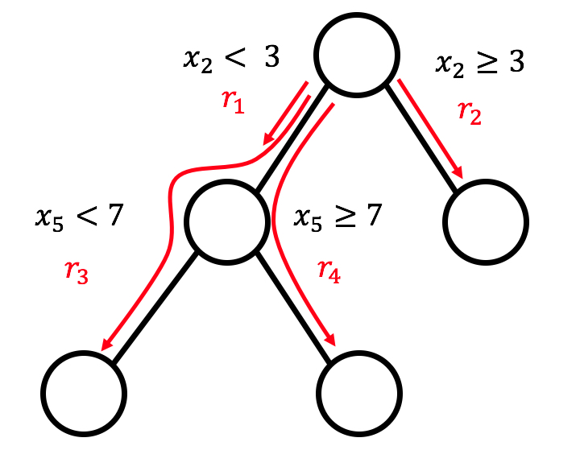

```{r, message = FALSE, warning = FALSE, echo = FALSE}
devtools::load_all()
set.seed(42)
```

<!--{pagebreak}-->

## RuleFit {#rulefit}
Algoritme RuleFit oleh Friedman dan Popescu (2008)[^Friedman2008] mempelajari sparse linear models yang menyertakan efek interaksi yang terdeteksi secara otomatis dalam bentuk decision rules.

Model linear regression tidak memperhitungkan interaksi antar fitur.
Apakah tidak nyaman untuk memiliki model yang sederhana dan dapat diinterpretasikan seperti model linier, tetapi juga mengintegrasikan feature interactions?
RuleFit mengisi celah ini.
RuleFit mempelajari sparse linear models dengan fitur asli dan juga sejumlah fitur baru yang merupakan decision rules.
Fitur baru ini menangkap interaksi antara fitur asli.
RuleFit secara otomatis menghasilkan fitur-fitur ini dari decision trees.
Setiap jalur melalui pohon dapat ditransformasikan menjadi decision rules dengan menggabungkan keputusan yang dibagi menjadi aturan.
Prediksi node dibuang dan hanya split yang digunakan dalam decision rules:

```{r rulefit-split, fig.cap="4 rules can be generated from a tree with 3 terminal nodes.", out.width=500}

```
Dari mana decision trees itu berasal?
Pohon-pohon dilatih untuk memprediksi hasil yang diinginkan.
Ini memastikan bahwa pemisahan bermakna untuk tugas prediksi.
Algoritme apa pun yang menghasilkan banyak pohon dapat digunakan untuk RuleFit, misalnya random forest.
Setiap pohon didekomposisi menjadi decision rules yang digunakan sebagai fitur tambahan dalam model sparse linear regression (Lasso).

Makalah RuleFit menggunakan data perumahan Boston untuk menggambarkan hal ini:
Tujuannya adalah untuk memprediksi nilai median rumah dari lingkungan Boston.
Salah satu aturan yang dihasilkan oleh RuleFit adalah:
IF `number of rooms > 6.64`  AND  `concentration of nitric oxide <0.67` THEN 1 ELSE 0.

RuleFit juga dilengkapi dengan ukuran feature importance yang membantu mengidentifikasi istilah dan aturan linier yang penting untuk prediksi.
feature importance dihitung dari bobot regression models.
Ukuran kepentingan dapat digabungkan untuk fitur asli (yang digunakan dalam bentuk "mentah" dan mungkin dalam banyak decision rules).

RuleFit juga memperkenalkan partial dependence plot untuk menunjukkan perubahan rata-rata dalam prediksi dengan mengubah fitur.
Partial dependence plot adalah metode model-agnostic yang dapat digunakan dengan model apa pun, dan dijelaskan dalam [bab buku tentang partial dependence plot](#pdp).

### Interpretation and Example

Karena RuleFit memperkirakan model linier pada akhirnya, interpretasinya sama dengan "normal" [model linier](#limo).
Satu-satunya perbedaan adalah model memiliki fitur baru yang diturunkan dari decision rules.
decision rules adalah fitur biner:
Nilai 1 berarti semua kondisi aturan terpenuhi, jika tidak, nilainya 0.
Untuk istilah linier di RuleFit, interpretasinya sama seperti dalam model linear regression:
Jika fitur bertambah satu unit, hasil yang diprediksi berubah dengan bobot fitur yang sesuai.

```{r prepare-rulefit-example}
library(pre)
library(dplyr)

data("bike")

X = bike[bike.features.of.interest]

# round features so that table is better
X$temp = round(X$temp, 0)
X$hum = round(X$hum, 0)
X$windspeed = round(X$windspeed, 0)

y = bike[,'cnt']
dat = cbind(X, y)
mod = pre(y ~ ., data = dat, maxdepth = 2, ntrees = 100)
coefs <- coef(mod)
coefs$description[is.na(coefs$description)] = coefs$rule[is.na(coefs$description)]
coefs = left_join(coef(mod), pre::importance(mod, plot=FALSE)$baseimp)
coefs = coefs[!is.na(coefs$coefficient), ]
coefs$imp = round(coefs$imp, 1)
coefs$coefficient = round(coefs$coefficient, 1)
coefs$sd = round(coefs$sd, 2)
coefs$rule = NULL
coefs = coefs[!is.na(coefs$imp), ]
coefs = coefs[order(coefs$imp, decreasing = TRUE), ]
```

Dalam contoh ini, kami menggunakan RuleFit untuk memprediksi jumlah [sepeda sewaan](#bike-data) pada hari tertentu.
Tabel menunjukkan lima aturan yang dihasilkan oleh RuleFit, bersama dengan bobot dan kepentingan Lasso mereka.
Perhitungannya dijelaskan nanti di bab ini.

```{r rulefit-example}
# Making the table a bit prettier
coefs$description = gsub("\\%", "", coefs$description)
coefs$description = gsub("c\\(", "(", coefs$description)
kable(coefs[1:5, c('description', 'coefficient', 'imp')],
  col.names = c('Description', 'Weight', 'Importance'),
  row.names=FALSE, 
  digits = 0)

```


Aturan yang paling penting adalah: "`r coefs[1, 'description']`" dan bobot yang sesuai adalah `r round(coefs[1, 'coefficient'], 0)`.
Interpretasinya adalah:
Jika `r coefs[1, 'description']`, maka jumlah sepeda yang diprediksi meningkat sebesar `r round(coefs[1, 'coefficient'], 0)`, ketika semua nilai fitur lainnya tetap.
Secara total, `r nrow(coef(mod))` aturan tersebut dibuat dari fitur `r ncol(X)` asli.
Cukup banyak!
Namun berkat Lasso, hanya `r nrow(coefs[coefs$coefficient != 0,])` dari `r nrow(coef(mod))` yang memiliki bobot berbeda dari 0.

Menghitung feature importance global mengungkapkan bahwa tren suhu dan waktu adalah fitur yang paling penting:

```{r rulefit-importance, fig.cap = 'Feature importance measures for a RuleFit model predicting bike counts. The most important features for the predictions were temperature and time trend.', dev.args = list(pointsize = 16)}
pre::importance(mod)
```

Pengukuran feature importance mencakup pentingnya istilah fitur mentah dan semua decision rules di mana fitur tersebut muncul.

**Template interpretasi**

Interpretasinya analog dengan model linier:
Hasil prediksi berubah $\beta_j$ jika fitur $x_j$ berubah satu unit, asalkan semua fitur lainnya tetap tidak berubah.
Interpretasi bobot dari decision rules adalah kasus khusus:
Jika semua kondisi decision rules $r_k$ berlaku, hasil yang diprediksi berubah sebesar $\alpha_k$ (bobot yang dipelajari dari aturan $r_k$ dalam model linier).

Untuk klasifikasi (menggunakan logistic regression alih-alih linear regression):
Jika semua kondisi decision rules $r_k$ berlaku, peluang untuk peristiwa vs. tidak ada peristiwa berubah dengan faktor $\alpha_k$.

### Theory
Mari kita selami lebih dalam detail teknis algoritme RuleFit.
RuleFit terdiri dari dua komponen:
Komponen pertama membuat "rules" dari decision trees dan komponen kedua cocok dengan model linier dengan fitur asli dan aturan baru sebagai input (maka nama "RuleFit").

**Langkah 1: Pembuatan aturan**

Seperti apa aturan itu?
Aturan yang dihasilkan oleh algoritma memiliki bentuk yang sederhana.
Sebagai contoh:
IF `x2 < 3` AND `x5 < 7` THEN 1 ELSE 0.
Aturan dibangun dengan mendekomposisi decision trees:
Setiap jalur ke simpul di pohon dapat dikonversi ke decision rules.
Pohon yang digunakan untuk aturan dipasang untuk memprediksi hasil target.
Oleh karena itu pemisahan dan aturan yang dihasilkan dioptimalkan untuk memprediksi hasil yang Anda minati.
Anda cukup mengaitkan keputusan biner yang mengarah ke simpul tertentu dengan "AND", dan voila, Anda memiliki aturan.
Diinginkan untuk menghasilkan banyak aturan yang beragam dan bermakna.
Peningkatan gradien digunakan untuk menyesuaikan ansambel decision trees dengan melakukan regresi atau klasifikasi y dengan fitur asli Anda X.
Setiap pohon yang dihasilkan diubah menjadi beberapa aturan.
Tidak hanya boosted trees, tetapi algoritme tree ensemble apa pun dapat digunakan untuk menghasilkan pohon untuk RuleFit.
Sebuah tree ensemble dapat dijelaskan dengan rumus umum ini:

$$f(x)=a_0+\sum_{m=1}^M{}a_m{}f_m(X)$$

M adalah jumlah pohon dan $f_m(x)$ adalah fungsi prediksi dari pohon ke-m.
$a$ adalah bobotnya.
Ansambel yang dikantongi, random forest, AdaBoost, dan MART menghasilkan tree ensemble dan dapat digunakan untuk RuleFit.

Kami membuat aturan dari semua pohon ansambel.
Setiap aturan $r_m$ berbentuk:

$$r_m(x)=\prod_{j\in\text{T}_m}I(x_j\in{}s_{jm})$$

di mana $\text{T}_{m}$ adalah himpunan fitur yang digunakan dalam pohon ke-m, I adalah fungsi indikator yaitu 1 ketika fitur $x_j$ berada dalam subset nilai s yang ditentukan untuk j- fitur th (seperti yang ditentukan oleh pemisahan pohon) dan 0 sebaliknya.
Untuk fitur numerik, $s_{jm}$ adalah interval dalam rentang nilai fitur.
Interval terlihat seperti salah satu dari dua kasus:

$$x_{s_{jm},\text{lower}}<x_j$$

$$x_j<x_{s_{jm},upper}$$

Perpecahan lebih lanjut dalam fitur itu mungkin menyebabkan interval yang lebih rumit.
Untuk fitur kategoris, subset s berisi beberapa kategori fitur tertentu.

Contoh yang dibuat-buat untuk dataset persewaan sepeda:

$$r_{17}(x)=I(x_{\text{temp}}<15)\cdot{}I(x_{\text{weather}}\in\{\text{good},\text{cloudy}\})\cdot{}I(10\leq{}x_{\text{windspeed}}<20)$$

Aturan ini mengembalikan 1 jika ketiga kondisi terpenuhi, jika tidak 0.
RuleFit mengekstrak semua aturan yang mungkin dari pohon, tidak hanya dari simpul daun.
Jadi aturan lain yang akan dibuat adalah:

$$r_{18}(x)=I(x_{\text{temp}}<15)\cdot{}I(x_{\text{weather}}\in\{\text{good},\text{cloudy}\}$$

Secara keseluruhan, jumlah aturan yang dibuat dari tree ensemble M dengan node terminal $t_m$ masing-masing adalah:

$$K=\sum_{m=1}^M2(t_m-1)$$ 

Trik yang diperkenalkan oleh penulis RuleFit adalah mempelajari pohon dengan kedalaman acak sehingga banyak aturan beragam dengan panjang berbeda dihasilkan.
Perhatikan bahwa kami membuang nilai prediksi di setiap node dan hanya mempertahankan kondisi yang mengarahkan kami ke sebuah node dan kemudian kami membuat aturan darinya.
Pembobotan decision rules dilakukan pada langkah 2 RuleFit.

Cara lain untuk melihat langkah 1:
RuleFit menghasilkan serangkaian fitur baru dari fitur asli Anda.
Fitur-fitur ini biner dan dapat mewakili interaksi yang cukup kompleks dari fitur asli Anda.
Aturan dipilih untuk memaksimalkan tugas prediksi.
Aturan secara otomatis dihasilkan dari matriks kovariat X.
Anda cukup melihat aturan sebagai fitur baru berdasarkan fitur asli Anda.

**Langkah 2: sparse linear models**

Anda mendapatkan BANYAK aturan di langkah 1.
Karena langkah pertama dapat dilihat hanya sebagai transformasi fitur, Anda masih belum selesai memasang model.
Juga, Anda ingin mengurangi jumlah aturan.
Selain aturan, semua fitur "mentah" Anda dari kumpulan data asli Anda juga akan digunakan dalam sparse linear models.
Setiap aturan dan setiap fitur asli menjadi fitur dalam model linier dan mendapatkan perkiraan bobot.
Fitur mentah asli ditambahkan karena pohon gagal mewakili hubungan linier sederhana antara y dan x.
Sebelum kami melatih sparse linear models, kami memenangkan fitur asli agar lebih kuat terhadap outlier:

$$l_j^*(x_j)=min(\delta_j^+,max(\delta_j^-,x_j))$$

di mana $\delta_j^-$ dan $\delta_j^+$ adalah kuantil $\delta$ dari distribusi data fitur $x_j$.
Pilihan 0,05 untuk $\delta$ berarti bahwa setiap nilai fitur $x_j$ yang berada di 5% nilai terendah atau 5% tertinggi akan ditetapkan ke kuantil masing-masing pada 5% atau 95%.
Sebagai aturan praktis, Anda dapat memilih $\delta$ = 0,025.
Selain itu, suku-suku linier harus dinormalisasi sehingga memiliki kepentingan awal yang sama dengan decision rules tipikal:

$$l_j(x_j)=0.4\cdot{}l^*_j(x_j)/std(l^*_j(x_j))$$

$0,4$ adalah standar deviasi rata-rata dari aturan dengan distribusi support seragam $s_k\sim{}U(0,1)$.

Kami menggabungkan kedua jenis fitur untuk menghasilkan matriks fitur baru dan melatih sparse linear models dengan Lasso, dengan struktur berikut:

$$\hat{f}(x)=\hat{\beta}_0+\sum_{k=1}^K\hat{\alpha}_k{}r_k(x)+\sum_{j=1}^p\hat{\beta}_j{}l_j(x_j)$$

di mana $\hat{\alpha}$ adalah vektor bobot perkiraan untuk fitur aturan dan $\hat{\beta}$ vektor bobot untuk fitur asli.
Karena RuleFit menggunakan Lasso, loss function mendapatkan batasan tambahan yang memaksa beberapa bobot untuk mendapatkan perkiraan nol:

$$(\{\hat{\alpha}\}_1^K,\{\hat{\beta}\}_0^p)=argmin_{\{\hat{\alpha}\}_1^K,\{\hat{\beta}\}_0^p}\sum_{i=1}^n{}L(y^{(i)},f(x^{(i)}))+\lambda\cdot\left(\sum_{k=1}^K|\alpha_k|+\sum_{j=1}^p|b_j|\right)$$

Hasilnya adalah model linier yang memiliki efek linier untuk semua fitur asli dan untuk aturan.
Interpretasinya sama dengan model linier, satu-satunya perbedaan adalah bahwa beberapa fitur sekarang menjadi aturan biner.

**Langkah 3 (opsional): feature importance**

Untuk istilah linier dari fitur asli, feature importance diukur dengan prediktor standar:

$$I_j=|\hat{\beta}_j|\cdot{}std(l_j(x_j))$$

di mana $\beta_j$ adalah bobot dari model Lasso dan $std(l_j(x_j))$ adalah standar deviasi dari suku linier di atas data.

Untuk ketentuan decision rules, kepentingannya dihitung dengan rumus berikut:

$$I_k=|\hat{\alpha}_k|\cdot\sqrt{s_k(1-s_k)}$$

di mana $\hat{\alpha}_k$ adalah bobot Lasso terkait dari decision rules dan $s_k$ adalah support fitur dalam data, yang merupakan persentase titik data yang diterapkan decision rules (di mana $r_k (x)=1$):

$$s_k=\frac{1}{n}\sum_{i=1}^n{}r_k(x^{(i)})$$

Sebuah fitur muncul sebagai istilah linier dan mungkin juga dalam banyak decision rules.
Bagaimana kita mengukur kepentingan total suatu fitur?
Pentingnya $J_j(x)$ dari sebuah fitur dapat diukur untuk setiap prediksi individu:

$$J_j(x)=I_j(x)+\sum_{x_j\in{}r_k}I_k(x)/m_k$$

di mana $I_l$ adalah pentingnya suku linier dan $I_k$ pentingnya decision rules di mana $x_j$ muncul, dan $m_k$ adalah jumlah fitur yang membentuk aturan $r_k$.
Menambahkan feature importance dari semua instance memberi kami feature importance global:

$$J_j(X)=\sum_{i=1}^n{}J_j(x^{(i)})$$

Dimungkinkan untuk memilih subset instance dan menghitung feature importance untuk grup ini.

### Advantages

RuleFit secara otomatis menambahkan **feature interactions** ke model linier.
Oleh karena itu, ini memecahkan masalah model linier yang Anda harus menambahkan istilah interaksi secara manual dan sedikit membantu dengan masalah pemodelan hubungan nonlinier.

RuleFit dapat menangani tugas klasifikasi dan regresi.

Aturan yang dibuat mudah untuk diinterpretasikan, karena merupakan decision rules biner.
Baik aturan tersebut berlaku untuk sebuah instance atau tidak.
Interpretabilitas yang baik hanya dijamin jika jumlah kondisi dalam suatu aturan tidak terlalu besar.
Aturan dengan 1 hingga 3 kondisi tampaknya masuk akal bagi saya.
Ini berarti kedalaman maksimum 3 untuk pohon-pohon di tree ensemble.

Bahkan jika ada banyak aturan dalam model, mereka tidak berlaku untuk setiap contoh.
Untuk contoh individu hanya beberapa aturan yang berlaku (= memiliki bobot bukan nol).
Ini meningkatkan kemampuan interpretasi lokal.

RuleFit mengusulkan banyak alat diagnostik yang berguna.
Alat-alat ini adalah model-agnostic, sehingga Anda dapat menemukannya di bagian model-agnostic buku: [feature importance](#feature-importance), [partial dependence plot](#pdp) dan [feature interactions](#interaction).


### Disadvantages

Terkadang RuleFit membuat banyak aturan yang mendapatkan bobot bukan nol dalam model Lasso.
Interpretabilitas menurun dengan meningkatnya jumlah fitur dalam model.
Solusi yang menjanjikan adalah memaksa efek fitur menjadi monoton, artinya peningkatan fitur harus mengarah pada peningkatan prediksi.

Kelemahan anekdotal: Makalah mengklaim kinerja RuleFit yang baik - sering kali mendekati kinerja prediktif random forest! -- tetapi dalam beberapa kasus di mana saya mencobanya secara pribadi, kinerjanya mengecewakan.
Coba saja untuk masalah Anda dan lihat bagaimana kinerjanya.

Produk akhir dari prosedur RuleFit adalah model linier dengan fitur mewah tambahan (decision rules).
Tetapi karena merupakan model linier, interpretasi bobot masih tidak intuitif.
Muncul dengan "catatan kaki" yang sama dengan model linear regression biasa:
"... mengingat semua fitur sudah diperbaiki."
Ini menjadi sedikit lebih rumit ketika Anda memiliki aturan yang tumpang tindih.
Misalnya, satu decision rules (fitur) untuk prediksi sepeda dapat berupa: "temp > 10" dan aturan lainnya dapat berupa "temp > 15 & weather='GOOD'".
Jika cuaca baik dan suhu di atas 15 derajat, suhu secara otomatis lebih besar dari 10.
Dalam kasus di mana aturan kedua berlaku, aturan pertama juga berlaku.
Interpretasi dari perkiraan bobot untuk aturan kedua adalah:
"Dengan asumsi semua fitur lainnya tetap, perkiraan jumlah sepeda meningkat $\beta_2$ saat cuaca bagus dan suhu di atas 15 derajat.".
Tapi, sekarang menjadi sangat jelas bahwa 'semua fitur lainnya diperbaiki' bermasalah, karena jika aturan 2 berlaku, aturan 1 juga berlaku dan interpretasinya tidak masuk akal.


### Software and Alternative

Algoritme RuleFit diimplementasikan di R oleh Fokkema dan Christoffersen (2017)[^Fokkema] dan Anda dapat menemukan [versi Python di Github](https://github.com/christophM/rulefit).

Kerangka kerja yang sangat mirip adalah [skope-rules](https://github.com/scikit-learn-contrib/skope-rules), modul Python yang juga mengekstrak aturan dari ansambel.
Ini berbeda dalam cara mempelajari aturan akhir:
Pertama, aturan skope menghapus aturan berperforma rendah, berdasarkan ambang batas recall dan presisi.
Kemudian, duplikat dan aturan serupa dihapus dengan melakukan seleksi berdasarkan keragaman istilah logis (variabel + operator yang lebih besar/lebih kecil) dan kinerja (skor F1) dari aturan.
Langkah terakhir ini tidak bergantung pada penggunaan Lasso, tetapi hanya mempertimbangkan skor F1 yang keluar dari kantong dan istilah logis yang membentuk aturan.


[^Friedman2008]: Friedman, Jerome H, and Bogdan E Popescu. "Predictive learning via rule ensembles." The Annals of Applied Statistics. JSTOR, 916–54. (2008).

[^Fokkema]: Fokkema, Marjolein, and Benjamin Christoffersen.  "Pre: Prediction rule ensembles". https://CRAN.R-project.org/package=pre (2017).
