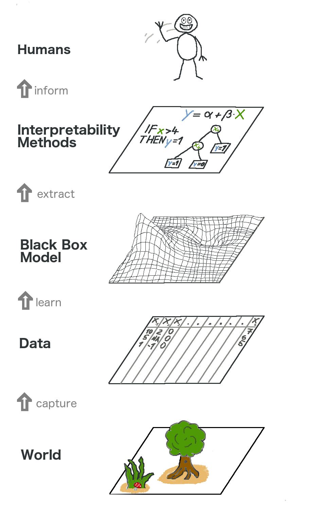

```{r, message = FALSE, warning = FALSE, echo = FALSE}
devtools::load_all()
```

# Model-Agnostic Methods {#agnostic}

Memisahkan penjelasan dari model machine learning (= metode interpretasi model-agnostic) memiliki beberapa keunggulan (Ribeiro, Singh, dan Guestrin 2016[^Ribeiro2016]).
Keuntungan besar dari metode interpretasi model-agnostic dibandingkan yang spesifik model adalah fleksibilitasnya.
Pengembang machine learning bebas menggunakan model machine learning apa pun yang mereka suka ketika metode interpretasi dapat diterapkan ke model apa pun.
Apa pun yang dibangun di atas interpretasi model machine learning, seperti grafis atau antarmuka pengguna, juga menjadi independen dari model machine learning yang mendasarinya.
Biasanya, tidak hanya satu, tetapi banyak jenis model machine learning dievaluasi untuk menyelesaikan tugas, dan ketika membandingkan model dalam hal interpretasi, lebih mudah untuk bekerja dengan penjelasan model-agnostic, karena metode yang sama dapat digunakan untuk semua jenis dari model.

Alternatif untuk metode interpretasi model-agnostic adalah dengan hanya menggunakan [interpretable models](#simple), yang seringkali memiliki kerugian besar yaitu kinerja prediktif hilang dibandingkan dengan model machine learning lainnya dan Anda membatasi diri pada satu jenis model.
Alternatif lainnya adalah dengan menggunakan metode interpretasi model-spesifik.
Kerugiannya adalah ia juga mengikat Anda ke satu jenis model dan akan sulit untuk beralih ke yang lain.

Aspek yang diinginkan dari sistem penjelasan model-agnostic adalah (Ribeiro, Singh, dan Guestrin 2016):

- **Fleksibilitas model:**
Metode interpretasi dapat bekerja dengan model machine learning apa pun, seperti random forest dan deep neural networks.
- **Fleksibilitas penjelasan:**
Anda tidak terbatas pada bentuk penjelasan tertentu.
Dalam beberapa kasus mungkin berguna untuk memiliki rumus linier, dalam kasus lain grafik dengan feature importance.
- **Fleksibilitas representasi:**
Sistem penjelasan harus dapat menggunakan representasi fitur yang berbeda sebagai model yang dijelaskan.
Untuk pengklasifikasi teks yang menggunakan vektor penyisipan kata abstrak, mungkin lebih baik menggunakan keberadaan kata individual untuk penjelasannya.

**Gambar yang lebih besar**

Mari kita lihat tingkat tinggi pada interpretabilitas model-agnostic.
Kami menangkap dunia dengan mengumpulkan data, dan mengabstraksikannya lebih lanjut dengan belajar memprediksi data (untuk tugas) dengan model machine learning.
Interpretabilitas hanyalah lapisan lain di atas yang membantu manusia memahami.

```{r bigpicture, fig.cap="The big picture of explainable machine learning. The real world goes through many layers before it reaches the human in the form of explanations.", out.width=700}

```

Lapisan terendah adalah **Dunia**.
Ini benar-benar bisa menjadi alam itu sendiri, seperti biologi tubuh manusia dan bagaimana reaksinya terhadap pengobatan, tetapi juga hal-hal yang lebih abstrak seperti pasar real estat.
Lapisan Dunia berisi segala sesuatu yang dapat diamati dan menarik.
Pada akhirnya, kami ingin mempelajari sesuatu tentang Dunia dan berinteraksi dengannya.

Lapisan kedua adalah lapisan **Data**.
Kita harus mendigitalkan Dunia agar dapat diproses oleh komputer dan juga untuk menyimpan informasi.
Lapisan Data berisi apa saja dari gambar, teks, data tabular dan sebagainya.

Dengan memasang model machine learning berdasarkan lapisan Data, kita mendapatkan lapisan **Model black box**.
Algoritma machine learning belajar dengan data dari dunia nyata untuk membuat prediksi atau menemukan struktur.

Di atas lapisan Model black box adalah lapisan **Metode Interpretability**, yang membantu kita menangani opasitas model machine learning.
Apa fitur yang paling penting untuk diagnosis tertentu?
Mengapa transaksi keuangan diklasifikasikan sebagai penipuan?

Lapisan terakhir ditempati oleh **Manusia**.
Lihat! Yang ini melambai kepada Anda karena Anda membaca buku ini dan membantu memberikan penjelasan yang lebih baik untuk model black box!
Manusia pada akhirnya adalah konsumen dari penjelasan.

Abstraksi berlapis-lapis ini juga membantu untuk memahami perbedaan pendekatan antara ahli statistik dan praktisi machine learning.
Ahli statistik berurusan dengan lapisan Data, seperti merencanakan uji klinis atau merancang survei.
Mereka melewati lapisan Model black box dan langsung ke lapisan Metode Interpretasi.
Spesialis machine learning juga menangani lapisan Data, seperti mengumpulkan sampel berlabel gambar kanker kulit atau merayapi Wikipedia.
Kemudian mereka melatih model machine learning black box.
Lapisan Metode Interpretasi dilewati dan manusia langsung berurusan dengan prediksi model black box.
Sangat bagus bahwa interpretable machine learning memadukan pekerjaan ahli statistik dan spesialis machine learning.

Tentu saja grafik ini tidak menangkap semuanya:
Data bisa berasal dari simulasi.
Model black box juga menghasilkan prediksi yang bahkan mungkin tidak menjangkau manusia, tetapi hanya memasok mesin lain, dan seterusnya.
Namun secara keseluruhan, ini adalah abstraksi yang berguna untuk memahami bagaimana interpretabilitas menjadi lapisan baru ini di atas model machine learning.


[^Ribeiro2016]: Ribeiro, Marco Tulio, Sameer Singh, and Carlos Guestrin. "Model-agnostic interpretability of machine learning." ICML Workshop on Human Interpretability in Machine Learning. (2016).
