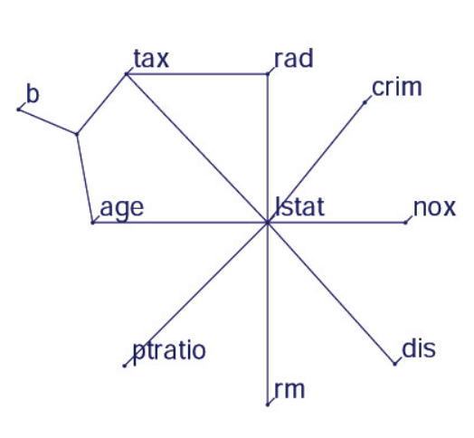

```{r, message = FALSE, warning = FALSE, echo = FALSE}
devtools::load_all("../")
set.seed(42)
```

## Feature Interaction {#interaction}

When features in a prediction model interact with each other, then the influence of the features on the prediction is not additive but more complex.
It follows that Aristotle's predicate "the whole is greater than the sum of its parts." only applies in the presence of feature interactions.

### Feature Interaction?

When a machine learning model makes a prediction based on two features, we can decompose the prediction into four terms: 
a constant term, one term for the first feature, one for the second feature and one for the interaction effect between the two features.  
The interaction between two features is the change in the prediction that occurs by varying the features, after having accounted for the individual feature effects.
It's the effect that comes on top of the sum of the individual feature effects. 

For example: a model predicts the value of a house, using house size (big or small) and location (good or bad) as features, amounting to four possible predictions:

| Location | Size  | Predicted value |
|---------:|------:|----------------:|
| good     | big   | 300,000         | 
| good     | small | 200,000         |
| bad      | big   | 250,000         | 
| bad      | small | 150,000         |


We decompose the model prediction into the following parts: 
A constant term (150,000), an effect for the size feature (+100,000 if big, +0 if small) and an effect for the location (+50,000 if good, +0 if bad). 
This decomposition fully explains the model predictions.
There is no interaction effect, because the model prediction is a sum of the single feature effects for size and location. 
Making a small house big always adds 100,000 to the predicted value, no matter the location. 
Also the difference in predicted value between a good and a bad location is 50,000, independent of the size.

Now let's consider an example with interaction:

| Location | Size  | Predicted value |
|---------:|------:|----------------:|
| good     | big   | 400,000         | 
| good     | small | 200,000         |
| bad      | big   | 250,000         | 
| bad      | small | 150,000         |


We decompose the prediction table into the following parts: 
A constant term (150,000), an effect for the size feature (+100,000 if big, +0 if small) and an effect for the location (+50,000 if good, +0 if bad). 
For this table, we need an extra term for the interaction: +100,000 if the house is big and in a good location.
This is an interaction between the size and the location, because in this case, the difference in predicted value between a big and a small house depends on the location. 

One way to estimate the interaction strength is to measure how much of the variation of the predicted outcome depends on the interaction of the features.
This measurement is called H-statistic, introduced by Friedman and Popescu (2008)[^Friedman2008]


### Theory: Friedman's H-statistic

We will look into two cases: 
The interaction between two features, which tells us if and how strongly two specific features interact with each other in the model;
The interaction between a feature and all other features, which tells us if and how strongly (in total) the specific feature interacts in the model with all the other features.
In theory, arbitrary interactions between any number of features can be measured, but those two cases represent the most interesting interaction cases.


If two features $x_j$ and $x_k$ don't interact, we can decompose the [partial dependence function](#pdp) in the following way (assuming that the partial dependence functions are centered at zero):

$$PD_{jk}(x_j,x_k)=PD_j(x_j)+PD_k(x_k)$$

where $PD_{jk}(x_j,x_k)$ is the 2-way partial dependence function of both features and $PD_j(x_j)$ and $PD_k(x_k)$ the partial dependence functions of the single features.

Similarly, if a feature $x_j$ has no interaction with any of the other features, we can express the prediction function $\hat{f}(x)$ as a sum of partial dependence functions, where the first summand only depends on $x_j$ and the second depends on all other features excluding $x_j$:

$$\hat{f}(x)=PD_j(x_j)+PD_{-j}(x_{-j})$$
where $PD_{-j}(x_{-j})$ is the partial dependence function that depends on all features excluding $x_j$.

This decomposition expresses the partial dependence (or full prediction) function without interactions (between features $x_j$ and $x_k$ or, respectively, $x_j$ and $x_{-j}$). 
In a next step we measure the difference between the observed partial dependence function and the decomposed one without interactions.
We calculate the variance of the output of the partial dependence (for measuring the interaction between two features) or of the complete function (for measuring the interaction between a feature and all other features). 
The amount of the variance that is explained by the interaction (difference between observed and no-interaction PD) is used as the interaction strength statistic.
The statistic is 0 when there is no interaction at all and 1 if all of the variance of the $PD_{jk}$ or $\hat{f}$ is explained by the sum of the partial dependence functions.
An interaction statistic of 1 between two features means that each single $PD$ function is constant and the effect on the prediction only comes through the interaction.


In mathematical terms, the H-statistic for the interaction between feature $x_j$ and $x_k$ proposed by Friedman and Popescu is:

$$H^2_{jk}=\sum_{i=1}^n\left[PD_{jk}(x_{j}^{(i)},x_k^{(i)})-PD_j(x_j^{(i)})-PD_k(x_{k}^{(i)})\right]/\sum_{i=1}^n{PD}^2_{jk}(x_j^{(i)},x_k^{(i)})$$


Similarly for measuring if a feature $x_j$ interacts with any other feature:

$$H^2_{j}=\sum_{i=1}^n\left[\hat{f}(x^{(i)})-PD_j(x_j^{(i)})-PD_{-j}(x_{-j}^{(i)})\right]/\sum_{i=1}^n\hat{f}^2(x^{(i)})$$

The H-statistic is expensive to evaluate, because it iterates over all data points and at each point the partial dependence has to be evaluated which is done using - again - all $n$ data points. 
In the worst case, we need $2n^2$ calls to the machine learning models predict function to compute the  $H^2_j$-statistic and $3n^2$ for the $H^2_{jk}$-statistic. 
To speed up the computation, we can sample from the $n$ data points . 
This has the drawback that it adds variance to the partial dependence estimates, which makes the statistic unstable.
So when you are using sampling to reduce the computational burden, make sure to sample enough data points.

In their paper, Friedman and Popescu also propose a test for the H-statistic being significantly different from zero:
The Null hypothesis is the absence of interaction. 
To generate the interaction statistic under the Null hypothesis, you have to be able to adjust the model so that it has no interaction between feature $x_j$ and $x_k$ or all others.
This is not possible for all types of models, so running this test is model-specific and not model-agnostic and as such not covered here.

The interaction strength statistic can also be applied in a classification setting, when the predicted outcome is the probability for a class.


### Examples

Let's see how feature interactions look like in practice!
We measure the interaction strength of features in a support vector machine that predicts the number of [bike rentals](#bike-data), given weather and calendrical features. 
The following plot shows the results of the feature interaction analysis:

```{r interaction-bike, fig.cap = 'The interaction strength for each feature with all other features for a support vector machine predicting bike rentals. Overall the interaction effects between the features are very weak (below 1 percent of variance explained by each feature).'}
data(bike)
library("mlr")
library("iml")
library("ggplot2")

bike.task = makeRegrTask(data = bike, target = "cnt")
mod.bike = mlr::train(mlr::makeLearner(cl = 'regr.svm', id = 'bike-rf'), bike.task)

pred.bike = Predictor$new(mod.bike, data = bike[setdiff(colnames(bike), "cnt")])
ia = Interaction$new(pred.bike, grid.size = 50) 
plot(ia)
```

In this next example we calculate the interaction statistic for a classification problem, where we deal with the partial dependence of the predicted probability.
We analyse the interactions between features in a random forest that is trained to predict [cervical cancer](#cervical), given some risk factors.
```{r interaction-cervical-prep}
data(cervical)
cervical.task = makeClassifTask(data = cervical, target = "Biopsy")
mod = mlr::train(mlr::makeLearner(cl = 'classif.randomForest', id = 'cervical-rf', predict.type = 'prob'), cervical.task)
```


```{r interaction-cervical, fig.cap = 'The interaction strength for each feature with all other features for a random forest predicting the probability of cervical cancer. The number of diagnosed sexually transmitted diseases has the highest interaction effect with all other features, followed by the number of pregnancies.', eval = FALSE, fig.show = "hide"}
# Due to long running time and timeouts on TravisCI, this has to be run locally. 
# And image has to be added to git repo manually.
pred.cervical = Predictor$new(mod, data = cervical, class = "Cancer")
ia1 = Interaction$new(pred.cervical, grid.size = 100) 
plot(ia)
```

```{r interaction-cervical-include, fig.cap = 'The interaction strength for each feature with all other features for a random forest predicting the probability of cervical cancer. The number of diagnosed sexually transmitted diseases has the highest interaction effect with all other features, followed by the number of pregnancies.'}
knitr::include_graphics("images/interaction-cervical-1.png")
```
After looking into the feature interactions of each feature with all other features, we can pick one of the features and specifically dive deeper into all the 2-way interactions between the chosen feature with the other features:

```{r interaction2-cervical-age, fig.cap = 'The 2-way interactions between number of pregnancies with each other feature. There is a strong interaction between the number of pregnancies and the age.', eval = FALSE, fig.show = "hide"}
# Due to long running time and timeouts on TravisCI, this has to be run locally. 
# And image has to be added to git repo manually.
ia2 = Interaction$new(pred.cervical, grid.size = 100, feature = "Num.of.pregnancies") 
plot(ia) + scale_x_continuous("2-way interaction strength")
```

```{r interaction2-cervical-age-include, fig.cap = 'The interaction strength for each feature with all other features for a random forest predicting the probability of cervical cancer. The number of diagnosed sexually transmitted diseases has the highest interaction effect with all other features, followed by the number of pregnancies.'}
knitr::include_graphics("images/interaction2-cervical-age-1.png")
```


### Advantages 

- The interaction statistic has an **underlying theory** through the partial dependence decomposition.
- The H-statistic has a **meaningful interpretation**: The interaction is defined as the portion of variance explained by the interaction.
- Since the statistic is **dimensionless and always between 0 and 1**, it is comparable across features and even across models.
- The statistic **detects all kinds of interactions**, regardless of a specific form.
- With the H-statistic it is also possible to analyze arbitrary **higher interactions**: 
For example the interaction strength between 3 or more features.


### Disadvantages

- The first thing you will notice: 
The interaction H-statistic takes a long time to compute, because it's **computationally expensive**.
- Sometimes the results are weird and for small simulations **don't yield the expected results**. 
But this is more anecdotal evidence.
- The computation involves estimating marginal distributions. 
These **estimates also have some variance**, when we don't use all of the data points. 
This means when we sample points, the estimates will also vary from run to run and the results might **become unstable**.
I recommend repeating it a few times to see if you have enough data included for a stable result.
- It is unclear whether an interaction is significantly bigger than 0. 
We would need to conduct a statistical test, but this **test is not (yet) available in a model-agnostic version**. 
- Connected to the testing problem: It's hard to tell when the H-statistic is large enough that we would consider it a strong interaction.
- The H-statistic tells us how strong the interactions are, but it doesn't tell us how the interaction is shaped.
That's what [partial dependence plots](#pdp) are for. 
A meaningful workflow is to measure the interaction strengths and then create 2D-partial dependence plots for the interactions in which you are interested.
- The H-statistic can't be meaningfully applied if the inputs are pixels.
- The interaction statistic works under the assumption that we can independently shuffle features (the same problem that partial dependence plots have). When the features strongly correlate, the assumption is violated and **we integrate over feature combinations that are very unlikely in reality**.


### Software

- For the examples in this book, I used the R package `iml`, which is available on [CRAN](https://cran.r-project.org/web/packages/iml) and the development version on [Github](https://github.com/christophM/iml).
- There are other implementations, which focus on a specific model:
    - The R package [pre](https://cran.r-project.org/web/packages/pre/index.html) implements the [RuleFit algorithm](#rulefit) plus the H-statistic.
    - The R package [gbm](https://github.com/gbm-developers/gbm3) implements gradient boosted models plus the H-statistic.


### Alternatives

The H-statistic is not the only way to measure interactions, there is also: 

- Variable Interaction Networks (VIN) by Hooker (2004)[^Hooker2004]: 
An approach that decomposes the prediction function into main effects and feature interactions. 
The interactions between features are then visualized as a network. 
Unfortunately, there is no software available yet.



- Partial dependence based feature interaction by Greenwell et. al (2018)[^Greenwell2018]: 
For measuring the interaction between two features, this approach measures the feature importance (defined as the variance of the 1D partial dependence function) of one feature conditional on different, fixed points of the other feature. 
When the variance is high, then the features interact with each other, if it is zero, they don't interact.
The R package `vip` is available on [Github](https://github.com/koalaverse/vip).
They also cover partial dependence plots and feature importance.

[^Hooker2004]: Hooker, G. (2004). Discovering Additive Structure in Black Box Functions. Knowledge Discovery and Data Mining, 575–580. http://doi.org/10.1145/1014052.1014122


[^Greenwell2018]: Greenwell, B. M., Boehmke, B. C., & McCarthy, A. J. (2018). A Simple and Effective Model-Based Variable Importance Measure, 1–27. Retrieved from http://arxiv.org/abs/1805.04755


