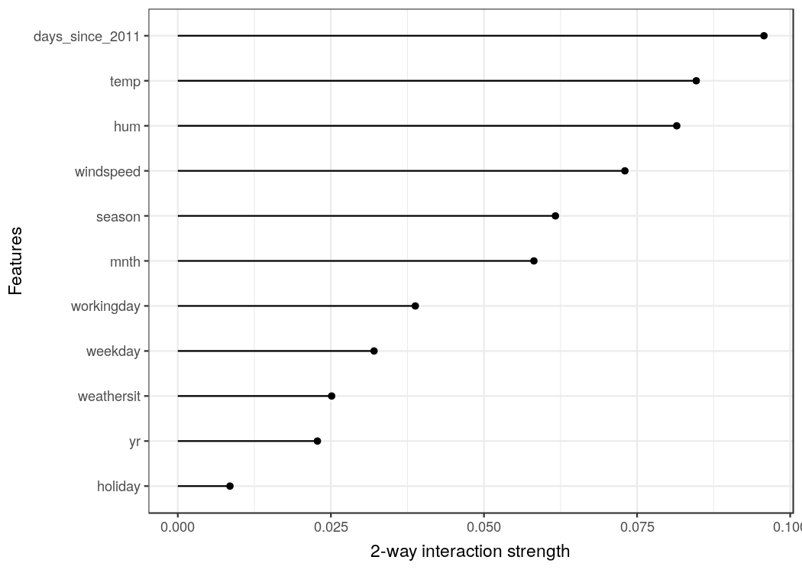

```{r, message = FALSE, warning = FALSE, echo = FALSE}
devtools::load_all("../")
set.seed(42)
```

<!--{pagebreak}-->

## Feature Interaction {#interaction}

Ketika fitur berinteraksi satu sama lain dalam model prediksi, prediksi tidak dapat dinyatakan sebagai jumlah dari efek fitur, karena efek dari satu fitur tergantung pada nilai fitur lainnya.
Predikat Aristoteles "Keseluruhan lebih besar dari jumlah bagian-bagiannya" berlaku di hadapan interaksi.

### Feature Interaction?

Jika model machine learning membuat prediksi berdasarkan dua fitur, kita dapat menguraikan prediksi menjadi empat istilah:
istilah konstan, istilah untuk fitur pertama, istilah untuk fitur kedua, dan istilah untuk interaksi antara dua fitur.
Interaksi antara dua fitur adalah perubahan prediksi yang terjadi dengan memvariasikan fitur setelah mempertimbangkan efek fitur individual.

Misalnya, sebuah model memprediksi nilai sebuah rumah, menggunakan ukuran rumah (besar atau kecil) dan lokasi (baik atau buruk) sebagai fitur, yang menghasilkan empat kemungkinan prediksi:

| Location | Size  | Prediction |
|---------:|------:|----------------:|
| good     | big   | 300,000         | 
| good     | small | 200,000         |
| bad      | big   | 250,000         | 
| bad      | small | 150,000         |


Kami menguraikan prediksi model menjadi bagian-bagian berikut:
Istilah konstan (150.000), efek untuk fitur ukuran (+100.000 jika besar; +0 jika kecil) dan efek untuk lokasi (+50.000 jika baik; +0 jika buruk).
Dekomposisi ini sepenuhnya menjelaskan prediksi model.
Tidak ada efek interaksi, karena prediksi model merupakan penjumlahan dari efek fitur tunggal untuk ukuran dan lokasi.
Saat Anda membuat rumah kecil menjadi besar, prediksi selalu meningkat 100.000, terlepas dari lokasinya.
Selain itu, perbedaan prediksi antara lokasi yang baik dan lokasi yang buruk adalah 50.000, berapa pun ukurannya.

Sekarang mari kita lihat contoh dengan interaksi:

| Location | Size  | Prediction |
|---------:|------:|----------------:|
| good     | big   | 400,000         | 
| good     | small | 200,000         |
| bad      | big   | 250,000         | 
| bad      | small | 150,000         |


Kami menguraikan tabel prediksi menjadi bagian-bagian berikut:
Istilah konstan (150.000), efek untuk fitur ukuran (+100.000 jika besar, +0 jika kecil) dan efek untuk lokasi (+50.000 jika baik, +0 jika buruk).
Untuk tabel ini kita memerlukan istilah tambahan untuk interaksi: +100.000 jika rumahnya besar dan di lokasi yang bagus.
Ini adalah interaksi antara ukuran dan lokasi, karena dalam hal ini perbedaan prediksi antara rumah besar dan kecil tergantung pada lokasi.

Salah satu cara untuk memperkirakan kekuatan interaksi adalah dengan mengukur seberapa banyak variasi prediksi bergantung pada feature interactions.
Pengukuran ini disebut H-statistik, diperkenalkan oleh Friedman dan Popescu (2008)[^Friedman2008].


### Theory: Friedman's H-statistic

Kita akan menangani dua kasus:
Pertama, ukuran interaksi dua arah yang memberi tahu kita apakah dan sejauh mana dua fitur dalam model berinteraksi satu sama lain;
kedua, ukuran interaksi total yang memberi tahu kita apakah dan sejauh mana suatu fitur berinteraksi dalam model dengan semua fitur lainnya.
Secara teori, interaksi sewenang-wenang antara sejumlah fitur dapat diukur, tetapi keduanya adalah kasus yang paling menarik.

Jika dua fitur tidak berinteraksi, kita dapat menguraikan [fungsi ketergantungan parsial](#pdp) sebagai berikut (dengan asumsi fungsi ketergantungan parsial dipusatkan pada nol):

$$PD_{jk}(x_j,x_k)=PD_j(x_j)+PD_k(x_k)$$

di mana $PD_{jk}(x_j,x_k)$ adalah fungsi ketergantungan parsial 2 arah dari kedua fitur dan $PD_j(x_j)$ dan $PD_k(x_k)$ fungsi ketergantungan parsial dari fitur tunggal.

Demikian juga, jika sebuah fitur tidak memiliki interaksi dengan fitur lainnya, kita dapat menyatakan fungsi prediksi $\hat{f}(x)$ sebagai jumlah dari fungsi ketergantungan parsial, di mana jumlah pertama hanya bergantung pada j dan yang kedua pada semua fitur lain kecuali j:

$$\hat{f}(x)=PD_j(x_j)+PD_{-j}(x_{-j})$$

di mana $PD_{-j}(x_{-j})$ adalah fungsi ketergantungan parsial yang bergantung pada semua fitur kecuali fitur ke-j.

Dekomposisi ini mengungkapkan fungsi ketergantungan parsial (atau prediksi penuh) tanpa interaksi (antara fitur j dan k, atau masing-masing j dan semua fitur lainnya).
Pada langkah berikutnya, kami mengukur perbedaan antara fungsi ketergantungan parsial yang diamati dan yang terdekomposisi tanpa interaksi.
Kami menghitung varians dari output ketergantungan parsial (untuk mengukur interaksi antara dua fitur) atau seluruh fungsi (untuk mengukur interaksi antara fitur dan semua fitur lainnya).
Besarnya varians yang dijelaskan oleh interaksi (selisih antara PD yang diamati dan tidak ada interaksi) digunakan sebagai statistik kekuatan interaksi.
Statistiknya adalah 0 jika tidak ada interaksi sama sekali dan 1 jika semua varians dari $PD_{jk}$ atau $\hat{f}$ dijelaskan oleh jumlah fungsi ketergantungan parsial.
Statistik interaksi 1 antara dua fitur berarti bahwa setiap fungsi PD tunggal adalah konstan dan efek pada prediksi hanya datang melalui interaksi.
H-statistik juga bisa lebih besar dari 1, yang lebih sulit untuk ditafsirkan.
Hal ini dapat terjadi ketika varians dari interaksi 2 arah lebih besar dari varians dari partial dependence plot 2 dimensi.

Secara matematis, H-statistik yang diajukan oleh Friedman dan Popescu untuk interaksi antara fitur j dan k adalah:

$$H^2_{jk}=\sum_{i=1}^n\left[PD_{jk}(x_{j}^{(i)},x_k^{(i)})-PD_j(x_j^{(i)})-PD_k(x_{k}^{(i)})\right]^2/\sum_{i=1}^n{PD}^2_{jk}(x_j^{(i)},x_k^{(i)})$$

Hal yang sama berlaku untuk mengukur apakah fitur j berinteraksi dengan fitur lain:

$$H^2_{j}=\sum_{i=1}^n\left[\hat{f}(x^{(i)})-PD_j(x_j^{(i)})-PD_{-j}(x_{-j}^{(i)})\right]^2/\sum_{i=1}^n\hat{f}^2(x^{(i)})$$

H-statistik mahal untuk dievaluasi, karena iterasi pada semua titik data dan pada setiap titik ketergantungan parsial harus dievaluasi yang pada gilirannya dilakukan dengan semua n titik data.
Dalam kasus terburuk, kita memerlukan panggilan 2n^2^ ke model machine learning yang memprediksi fungsi untuk menghitung statistik-H dua arah (j vs. k) dan 3n^2^ untuk statistik-H total (j vs. semua ).
Untuk mempercepat komputasi, kita dapat mengambil sampel dari n titik data.
Ini memiliki kelemahan meningkatkan varians dari perkiraan ketergantungan parsial, yang membuat statistik-H tidak stabil.
Jadi, jika Anda menggunakan pengambilan sampel untuk mengurangi beban komputasi, pastikan untuk mengambil sampel titik data yang cukup.

Friedman dan Popescu juga mengusulkan statistik uji untuk mengevaluasi apakah statistik-H berbeda secara signifikan dari nol.
Hipotesis nol adalah tidak adanya interaksi.
Untuk menghasilkan statistik interaksi di bawah hipotesis nol, Anda harus dapat menyesuaikan model sehingga tidak ada interaksi antara fitur j dan k atau yang lainnya.
Ini tidak mungkin untuk semua jenis model.
Oleh karena itu, tes ini khusus untuk model, bukan model-agnostic, dan karena itu tidak dibahas di sini.

Statistik kekuatan interaksi juga dapat diterapkan dalam pengaturan klasifikasi jika prediksi adalah probabilitas.

### Examples

Mari kita lihat seperti apa feature interactions dalam praktik!
Kami mengukur kekuatan feature interactions dalam support vector machine yang memprediksi jumlah [sepeda sewaan](#bike-data) berdasarkan fitur cuaca dan kalender.
Plot berikut menunjukkan feature interactions H-statistik:

```{r interaction-bike, fig.cap = 'The interaction strength (H-statistic) for each feature with all other features for a support vector machine predicting bicycle rentals. Overall, the interaction effects between the features are very weak (below 10% of variance explained per feature).', cache = FALSE}
data(bike)
library("mlr")
library("iml")
library("ggplot2")

bike.task = makeRegrTask(data = bike, target = "cnt")
mod.bike = mlr::train(mlr::makeLearner(cl = 'regr.svm', id = 'bike-rf'), bike.task)

pred.bike = Predictor$new(mod.bike, data = bike[setdiff(colnames(bike), "cnt")])
ia = Interaction$new(pred.bike, grid.size = 50) 
plot(ia) +
 scale_y_discrete("")
```

Dalam contoh berikut, kita menghitung statistik interaksi untuk masalah klasifikasi.
Kami menganalisis interaksi antara fitur di random forest yang dilatih untuk memprediksi [kanker serviks](#cervical), mengingat beberapa faktor risiko.

```{r interaction-cervical-prep}
data(cervical)
cervical.task = makeClassifTask(data = cervical, target = "Biopsy")
mod = mlr::train(mlr::makeLearner(cl = 'classif.randomForest', id = 'cervical-rf', predict.type = 'prob'), cervical.task)
```

```{r interaction-cervical, eval = FALSE, fig.show = "hide"}
# Due to long running time and timeouts on TravisCI, this has to be run locally. 
# And image has to be added to git repo manually.
pred.cervical = Predictor$new(mod, data = cervical, class = "Cancer")
ia1 = Interaction$new(pred.cervical, grid.size = 100) 
plot(ia1) +
 scale_y_discrete("")
```

```{r interaction-cervical-include, fig.cap = 'The interaction strength (H-statistic) for each feature with all other features for a random forest predicting the probability of cervical cancer. The years on hormonal contraceptives has the highest relative interaction effect with all other features, followed by the number of pregnancies.'}
knitr::include_graphics("images/interaction-cervical-1.png")
```

Setelah melihat feature interactions dari setiap fitur dengan semua fitur lainnya, kita dapat memilih salah satu fitur dan menyelami lebih dalam semua interaksi 2 arah antara fitur yang dipilih dan fitur lainnya.

```{r interaction2-cervical-age, eval = FALSE, fig.show = "hide"}
# Due to long running time and timeouts on TravisCI, this has to be run locally. 
# And image has to be added to git repo manually.
ia2 = Interaction$new(pred.cervical, grid.size = 100, feature = "Num.of.pregnancies") 
plot(ia2) + scale_x_continuous("2-way interaction strength") +
 scale_y_continuous("")
```

```{r interaction2-cervical-age-include, fig.cap = 'The 2-way interaction strengths (H-statistic) between number of pregnancies and each other feature. There is a strong interaction between the number of pregnancies and the age.'}

```

### Advantages 

Interaksi H-statistik memiliki **teori yang mendasari** melalui dekomposisi ketergantungan parsial.

Statistik-H memiliki **interpretasi yang bermakna**:
Interaksi didefinisikan sebagai bagian dari varians yang dijelaskan oleh interaksi.

Karena statistiknya **tanpa dimensi**, statistik ini dapat dibandingkan di seluruh fitur dan bahkan di seluruh model.

Statistik **mendeteksi semua jenis interaksi**, apa pun bentuknya.

Dengan statistik-H, Anda juga dapat menganalisis **interaksi yang lebih tinggi** sewenang-wenang seperti kekuatan interaksi antara 3 fitur atau lebih.


### Disadvantages

Hal pertama yang akan Anda perhatikan:
Interaksi H-statistik membutuhkan waktu lama untuk dihitung, karena **secara komputasi mahal**.

Perhitungan melibatkan memperkirakan distribusi marjinal.
**Perkiraan ini juga memiliki varians tertentu** jika kita tidak menggunakan semua titik data.
Ini berarti bahwa saat kami mengambil sampel poin, perkiraannya juga bervariasi dari satu putaran ke yang lain dan **hasilnya bisa tidak stabil**.
Saya sarankan mengulangi perhitungan statistik-H beberapa kali untuk melihat apakah Anda memiliki cukup data untuk mendapatkan hasil yang stabil.

Tidak jelas apakah interaksi secara signifikan lebih besar dari 0.
Kami perlu melakukan uji statistik, tetapi **pengujian ini belum (belum) tersedia dalam versi model-agnostic**.

Mengenai masalah pengujian, sulit untuk mengatakan kapan statistik-H cukup besar bagi kita untuk mempertimbangkan interaksi "kuat".

Juga, H-statistik bisa lebih besar dari 1, yang membuat interpretasi menjadi sulit.

Ketika efek total dari dua fitur lemah, tetapi sebagian besar terdiri dari interaksi, maka statistik-H akan sangat besar.
Ini dapat dengan mudah diinterpretasikan sebagai efek interaksi yang kuat, ketika pada kenyataannya kedua fitur memainkan peran kecil dalam model.

Statistik-H memberi tahu kita kekuatan interaksi, tetapi tidak memberi tahu kita seperti apa interaksi itu.
Untuk itulah [partial dependence plot](#pdp).
Alur kerja yang bermakna adalah mengukur kekuatan interaksi dan kemudian membuat partial dependence plot 2D untuk interaksi yang Anda minati.

H-statistik tidak dapat digunakan secara bermakna jika inputnya adalah piksel.
Jadi teknik ini tidak berguna untuk pengklasifikasi gambar.

Statistik interaksi bekerja dengan asumsi bahwa kita dapat mengacak fitur secara mandiri.
Jika fitur berkorelasi kuat, asumsi tersebut dilanggar dan **kami mengintegrasikan kombinasi fitur yang sangat tidak mungkin dalam kenyataan**.
Itu adalah masalah yang sama yang dimiliki oleh partial dependence plot.
Anda tidak bisa mengatakan secara umum apakah itu mengarah pada perkiraan yang terlalu tinggi atau terlalu rendah.

Terkadang hasilnya aneh dan untuk simulasi kecil **tidak memberikan hasil yang diharapkan**.
Tapi ini lebih merupakan pengamatan anekdotal.

### Implementations

Untuk contoh dalam buku ini, saya menggunakan paket R `iml`, yang tersedia di [CRAN](https://cran.r-project.org/web/packages/iml) dan versi pengembangan di [Github](https://github.com/christophM/iml).
Ada implementasi lain, yang berfokus pada model tertentu:
Paket R [pre](https://cran.r-project.org/web/packages/pre/index.html) mengimplementasikan [RuleFit](#rulefit) dan H-statistic.
Paket R [gbm](https://github.com/gbm-developers/gbm3) mengimplementasikan model yang ditingkatkan gradien dan statistik-H.


### Alternatives

Statistik-H bukan satu-satunya cara untuk mengukur interaksi:

Variable Interaction Networks (VIN) oleh Hooker (2004)[^Hooker2004] adalah pendekatan yang menguraikan fungsi prediksi menjadi efek utama dan feature interactions.
Interaksi antar fitur kemudian divisualisasikan sebagai jaringan.
Sayangnya belum ada perangkat lunak yang tersedia.

Feature interactions berbasis ketergantungan parsial oleh Greenwell et. al (2018)[^Greenwell2018] mengukur interaksi antara dua fitur.
Pendekatan ini mengukur feature importance (didefinisikan sebagai varians dari fungsi ketergantungan parsial) dari satu fitur yang bergantung pada titik tetap yang berbeda dari fitur lainnya.
Jika varians tinggi, maka fitur berinteraksi satu sama lain, jika nol, fitur tidak berinteraksi.
Paket R terkait `vip` tersedia di [Github](https://github.com/koalaverse/vip).
Paket ini juga mencakup partial dependence plot dan feature importance.

[^Hooker2004]: Hooker, Giles. "Discovering additive structure in black box functions." Proceedings of the tenth ACM SIGKDD international conference on Knowledge discovery and data mining. (2004).

[^Greenwell2018]: Greenwell, Brandon M., Bradley C. Boehmke, and Andrew J. McCarthy. "A simple and effective model-based variable importance measure." arXiv preprint arXiv:1805.04755 (2018).


