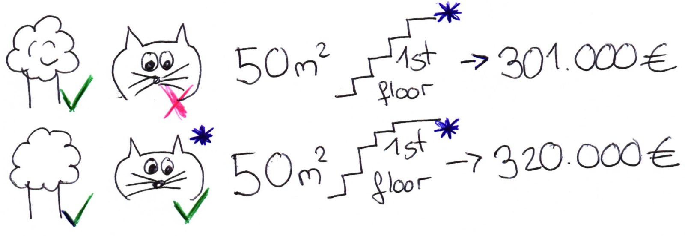
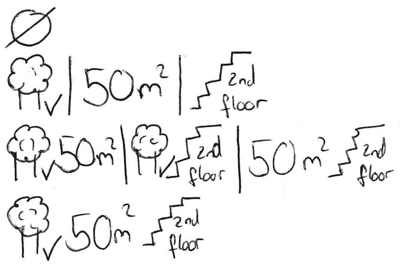

```{r, message = FALSE, warning = FALSE, echo = FALSE}
devtools::load_all("../")
```


## Shapley Value Explanations {#shapley}

Predictions can be explained by assuming that each feature is a 'player' in a game where the prediction is the payout.
The Shapley value - a method from coalitional game theory - tells us how to fairly distribute the 'payout' among the features.


### The general idea

Assume the following scenario: 

You trained a machine learning model to predict apartment prices.
For a certain apartment it predicts 300.000 € and you need to explain this prediction.
The apartment has a size of 50 m^2^, is located on the 2nd floor, with a park nearby and cats are forbidden (see Figure \@ref(fig:shapley-instance)).

```{r shapley-instance, fig.cap = "The predicted price for our apartment is 300.000€. It's a 50 square meter apartment on the second floor. There is a park nearby and cats are forbidden. Our goal is to explain how each of these features values contributed towards the predicted price of 300k€."}
knitr::include_graphics("images/shapley-instance.jpg")
```

The average prediction for all apartments is 310.000€.
How much did each feature value contribute to the prediction compared to the average prediction?


The answer is easy for linear regression models:
The effect of each feature is the weight of the feature times the feature value minus the average effect of all apartments:
This works only because of the linearity of the model.
For more complex model we need a different solution.
For example [LIME](#lime) suggests local models to estimate effects.

A different solution comes from cooperative game theory:
The Shapley value, coined by @shapley1953value, is a method for assigning payouts to players depending on their contribution towards the total payout.
Players cooperate in a coalition and obtain a certain gain from that cooperation.

Players?
Game?
Payout?
What's the connection to machine learning prediction and interpretability?
The 'game' is the prediction task for a single instance of the dataset.
The 'gain' is the actual prediction for this instance minus the average prediction of all instances.
The 'players' are the feature values of the instance, which collaborate to receive the gain (= predict a certain value).
In our apartment example from Figure \@ref(fig:shapley-instance), the feature values 'park-allowed', 'cat-forbidden', 'area-50m^2^' and 'floor-2nd' worked together to achieve the prediction of 300.000€.
Our goal is to explain the difference of the actual prediction (300.000€) and the average prediction (310.000€): a difference of -10.000€.

The answer might be:
The 'park-nearby' contributed 30.000€; 'size-50m^2^' contributed 10.000€; 'floor-2nd' contributed 0€; 'cat-forbidden' contributed -50.000€.
The contributions add up to -10.000€: the final prediction minus the average predicted apartment price.

**How do we calculate the Shapley value for one feature?**

The Shapley value is the average marginal contribution of a feature value over all possible coalitions.
All clear now?
Have a look at Figure \@ref(fig:shapley-instance-intervened) to learn how to compute the contribution of a feature value to a coalition.

```{r shapley-instance-intervened, fig.cap = "We assess the contribution of the 'cat-forbidden' feature value when added to a coalition of 'park-nearby', 'size-50m^2^'. We simulate that only 'park-nearby', 'cat-forbidden' and 'size-50m^2^' are in a coalition by randomly drawing the value for the floor feature. Then we predict the price of the apartment with this combination (301.000€). In a second step we remove 'cat-forbidden' from the coalition by replacing it with a random value of the cat allowed/forbidden feature from the randomly drawn apartment. In the example it was 'cat-allowed', but it could have been 'cat-forbidden' again. We predict the apartment price for the coalition of 'park-nearby' and 'size-50m^2^' (320.000€). The contribution of 'cat-forbidden' was 301.000€ - 320.000€ = -19.000€. This estimation depends on the sampled non-participating feature values and we get better estimates by repeating this procedure. This figure shows the computation of the marginal contribution for only one coalition. The Shapley value is the weighted average of marginal contributions over all coalitions."}

```

We repeat this computation for all possible coalitions.
The computation time increases exponentially with the number of features, so we have to sample from all possible coalitions.
The Shapley value is the average over all the marginal contributions.
Figure \@ref(fig:shapley-coalitions) shows all coalitions for computing the Shapley value of the 'cat-forbidden' feature value.
When we repeat the Shapley value for all feature values, we get the complete distribution of the prediction (minus the average) among the feature values.

```{r shapley-coalitions, fig.cap = "All coalitions of feature values that are needed to assess the Shapley value for 'cat-forbidden'. The first row shows the coalition without any feature values. The 2nd, 3rd and 4th row show different coalitions - separated by '|' - with increasing coalition size. For each of those coalitions we compute the predicted apartment price with and without the 'cat-forbidden' feature value and take the difference to get the marginal contribution. The Shapley value is the (weighted) average of marginal contributions. We replace the feature values of features that are not in a coalition with random feature values from the apartment dataset to get a prediction from the machine learning model."}

```


### Examples and Interpretation

The interpretation of the Shapley value $\phi_{ij}$ for feature $j$ and instance $i$ is: the feature value $x_{ij}$ contributed $\phi_{ij}$ towards the prediction for instance $i$ compared to the average prediction for the dataset.

The Shapley value works for both classification (if we deal with probabilities) and regression.

We use the Shapley value to analyse the predictions of a Random Forest model predicting [cervical cancer](#cervical).
Table \@ref(tab:shapley-cervical-instance) shows the feature values for the cancer risk factors of a woman in the dataset.
Figure \@ref(fig:shapley-cervical-plot) visualizes the Shapley values, that are also listed in Table \@ref(tab:shapley-cervical-table).


```{r shapley-cervical-prepare}
data("cervical")
library("caret")
library("iml")


ntree = 30
cervical.x = cervical[names(cervical) != 'Biopsy']

model <- caret::train(cervical.x,
               cervical$Biopsy,
               method = 'rf', ntree=ntree, maximise = FALSE)
predictor = Predictor$new(model, class = 1, data = cervical.x)

instance_indices = 326
x.interest = cervical.x[instance_indices,]

avg.prediction = mean(predict(model, type = 'prob')[,'Cancer'])
actual.prediction = predict(model, newdata = x.interest, type = 'prob')['Cancer']
diff.prediction = actual.prediction - avg.prediction
```


```{r shapley-cervical-instance}
kable(t(x.interest), caption = sprintf("Risk factors (feature values) of one woman in the cervical cancer dataset with a predicted %.2f cancer probability.", actual.prediction))
```

```{r shapley-cervical-plot, fig.cap = sprintf("Feature value contributions for woman %i in the cervical cancer dataset. With a prediction of %.2f, this woman's cancer probability is %.2f above the average prediction of %.2f. The feature value that increased the probability the most is the number of diagnosed STDs. The feature contributions sum up to the difference of actual and average prediction (%.2f).", instance_indices, actual.prediction,diff.prediction, avg.prediction, diff.prediction)}
# shapley1 = shapley(model, bike.train.x, x.interest = bike.train.x[instance_indices[1],], class = 2)
shapley2 = Shapley$new(predictor, x.interest = x.interest)
plot(shapley2) + scale_y_continuous("Feature value contribution") +
  ggtitle(sprintf("Actual prediction: %.2f\nAverage prediction: %.2f\nDifference: %.2f", actual.prediction, avg.prediction, diff.prediction))
```
```{r shapley-cervical-table}
kable(shapley2$results[c('feature', 'phi')], caption = sprintf("The Shapley values (phi) for data point %i from the cervical cancer dataset; explaining the contributions towards the prediction of %.2f minus %.2f (= %.2f).", instance_indices, actual.prediction, avg.prediction, diff.prediction))
```


For the [bike rental dataset](#bike-data) we also train a Random Forest to predict the number of rented bikes for a day  given the weather conditions and calendric information.
Table \@ref(tab:shapley-bike-instance) displays the feature values of the day for which we want to explain the prediction.
Figure \@ref(fig:shapley-bike-plot) shows the explanations created for the  Random Forest prediction of one specific day; the raw Shapley values are displayed in  Table \@ref(tab:shapley-bike-table)


```{r shapley-bike-prepare}
data("bike")
ntree = 30
bike.train.x = bike[names(bike) != 'cnt']

model <- caret::train(bike.train.x,
               bike$cnt,
               method = 'rf', ntree=ntree, maximise = FALSE)
predictor = Predictor$new(model, data = bike.train.x)

instance_indices = c(295, 285)

avg.prediction = mean(predict(model))
actual.prediction = predict(model, newdata = bike.train.x[instance_indices[2],])
diff.prediction = actual.prediction - avg.prediction
x.interest = bike.train.x[instance_indices[2],]
```


```{r shapley-bike-instance}
kable(t(x.interest), caption = sprintf("Instance (day) for which to explain the predicted outcome (%.0f bikes)", actual.prediction))
```

```{r shapley-bike-plot, fig.cap = sprintf("Feature value contributions for instance %i. With a predicted %.0f rented bikes, this day is %.0f below the average prediction of %.0f. The feature values that had the most negative effects were the weather situation, humidity and the time trend (years since 2011). The temperature on that day had a positive effect compared to the average prediction. The feature contributions sum up to the difference of actual and average prediction (%.0f).", instance_indices[2], actual.prediction, diff.prediction, avg.prediction, diff.prediction)}
shapley2 = Shapley$new(predictor, x.interest = x.interest)
plot(shapley2) +  scale_y_continuous("Feature value contribution") +
  ggtitle(sprintf("Actual prediction: %.0f\nAverage prediction: %.0f\nDifference: %.0f", actual.prediction, avg.prediction, diff.prediction))
```

```{r shapley-bike-table}
table.dat = shapley2$results[c('feature', 'phi')]
kable(table.dat, digits = 2,
  caption = sprintf("The Shapley values for data point %i from the bike rental dataset.", instance_indices[2]))
```

Be careful to interpret the Shapley value correctly:
The Shapley value is the average contribution of a feature value towards the prediction in different coalitions.
The Shapley value is NOT the difference in prediction when we would drop the feature from the model.


### The Shapley Value in Detail

This Section goes deeper into the definition and computation of the Shapley value for the curious reader.
Skip this part straight to 'Advantages and Disadvantages' if you are not interested in the technicalities.

We are interested in the effect each feature has on the prediction of a data point.
In a linear model it is easy to calculate the individual effects.
Here's how a linear model prediction looks like for one data instance:

$$\hat{f}(x_{i\cdot})=\hat{f}(x_{i1},\ldots,x_{ip})=\beta_0+\beta_{1}x_{i1}+\ldots+\beta_{p}x_{ip}$$

where $x_{i\cdot}$ is the instance for which we want to compute the feature effects.
Each $x_{ij}$ is a feature value, with $j\in\{1,\ldots,p\}$.
The $\beta_j$ are the weights corresponding to $x_{ij}$.

The feature effect $\phi_{ij}$ of $x_{ij}$ on the prediction $\hat{f}(x_{i\cdot})$ is:

$$\phi_{ij}(\hat{f})=\beta_{j}x_{ij}-E(\beta_{j}X_{j})=\beta_{j}x_{ij}-\beta_{j}E(X_{j})$$

where $E(\beta_jX_{j})$ is the mean effect estimate for feature $X_{j}$.
The effect is the difference between the feature contribution to the equation minus the average contribution.
Nice!
Now we know how much each feature contributed towards the prediction.
If we sum up all the feature effects over all features for one instance, the result is:

$$\sum_{j=1}^{p}\phi_{ij}(\hat{f})=\sum_{j=1}^p(\beta_{j}x_{ij}-E(\beta_{j}X_{j}))=(\beta_0+\sum_{j=1}^p\beta_{j}x_{ij})-(\beta_0+\sum_{j=1}^{p}E(\beta_{j}X_{j}))=\hat{f}(x_{i\cdot})-E(\hat{f}(X))$$

This is the predicted value for the data point $x_{i\cdot}$ minus the average predicted value.
Feature effects $\phi_{ij}$ can be negative.

Now, can we do the same for any type of model?
It would be great to have this as a model-agnostic tool.
Since we don't have the $\beta$'s from a linear equation in other model types, we need a different solution.

Help comes from unexpected places: cooperative game theory.
The Shapley value is a solution for computing feature effects $\phi_{ij}(\hat{f})$ for single predictions for any machine learning model $\hat{f}$.


#### The Shapley Value
The Shapley value is defined via a value function $val$ over players in S.

The Shapley value of a feature value $x_{ij}$ is it's contribution to the payed outcome, weighted and summed over all possible feature value combinations:

$$\phi_{ij}(val)=\sum_{S\subseteq\{x_{i1},\ldots,x_{ip}\}\setminus\{x_{ij}\}}\frac{|S|!\left(p-|S|-1\right)!}{p!}\left(val\left(S\cup\{x_{ij}\}\right)-val(S)\right)$$

where $S$ is a subset of the features used in the model, $x_{i\cdot}$ is the vector feature values of instance $i$ and $p$ the number of features.
$val_{x_i}(S)$ is the prediction for feature values in set $S$, marginalised over features not in $S$:

$$val_{x_i}(S)=\int\hat{f}(x_{i1},\ldots,x_{ip})d\mathbb{P}_{X_{i\cdot}\notin{}S}-E_X(\hat{f}(X))$$

You actually do multiple integrations, for each feature not in $S$.
One concrete example:
The machine learning model works on 4 features $\{x_{i1},x_{i2},x_{i3},x_{i4}\}$ and we evaluate $\hat{f}$ for the coalition $S$ consisting of feature values $x_{i1}$ and $x_{i3}$:

$$val_{x_i}(S)=val_{x_i}(\{x_{i1},x_{i3}\})=\int_{\mathbb{R}}\int_{\mathbb{R}}\hat{f}(x_{i1},X_{2},x_{i3},X_{4})d\mathbb{P}_{X_2,X_4}-E_X(\hat{f}(X))$$

This looks similar to the linear model feature effects!

Don't get confused by the many uses of the word 'value':
The feature value is the numerical value of a feature and instance;
the Shapley value is the feature contribution towards the prediction;
the value function is the payout function given a certain coalition of players (feature values).

The Shapley value is the only attribution method that satisfies the following properties (which can be seen as a definition of a fair payout):

1. **Efficiency**: $\sum_{j=1}^p\phi_{ij}=\hat{f}(x_i)-E_X(\hat{f}(X))$.
The feature effects have to sum up to the difference of prediction for $x_{i\cdot}$ and the average.
1. **Symmetry**: If $val(S\cup\{x_{ij}\})=val(S\cup\{x_{ik}\})$ for all $S\subseteq\{x_{i1},\ldots,x_{ip}\} \setminus \{x_{ij},x_{ik}\}$, then $\phi_{ij}=\phi_{ik}$.
The contribution for two features should be the same if they contribute equally to all possible coalitions.
1. **Dummy**: If $val(S\cup\{x_{ij}\})=val(S)$ for all $S\subseteq\{x_{i1},\ldots,x_{ip}\}$, then $\phi_{ij}=0$.
A feature which does not change the predicted value - no matter to which coalition of feature values it is added - should have a Shapley value of 0.
1. **Additivity**: For a game with combined payouts $val+val^*$ the respective Shapley values are $\phi_{ij}+\phi_{ij}^*$.
The additivity axiom has no practical relevance in the context of feature effects.


An intuitive way to understand the Shapley value is  the following illustration:
The feature values enter a room in random order.
All feature values in the room participate in the game (= contribute to the prediction).
The Shapley value $\phi_{ij}$ is the average marginal contribution of feature value $x_{ij}$ by joining whatever features already entered the room before, i.e.

$$\phi_{ij}=\sum_{\text{All.orderings}}val(\{\text{features.before.j}\}\cup{}x_{ij})-val(\{\text{features.before.j}\})$$


#### Estimating the Shapley value
All possible coalitions (sets) of features have to be evaluated, with and without the feature of interest for calculating the exact Shapley value for one feature value.
For more than a few features, the exact solution to this problem becomes intractable, because the number of possible coalitions increases exponentially by adding more features.
@strumbelj2014 suggest an approximation with Monte-Carlo sampling:

$$\hat{\phi}_{ij}=\frac{1}{M}\sum_{m=1}^M\left(\hat{f}(x^{*+j})-\hat{f}(x^{*-j})\right)$$

where $\hat{f}(x^{*+j})$ is the prediction for $x_{i\cdot}$, but with a random number of features values replaced by feature values from a random data point $x$, excluding the feature value for $x_{ij}$
The x-vector  $x^{*-j}$ is almost identical to $x^{*+j}$, but the value $x_{ij}$ is also taken from the sampled $x$.
Each of those $M$ new instances are kind of 'Frankensteins', pieced together from two instances.

**Approximate Shapley Estimation Algorithm**: Each feature value $x_{ij}$'s contribution towards the difference $\hat{f}(x_{i\cdot})-\mathbb{E}(\hat{f})$ for instance $x_{i\cdot}\in{}X$.

- Require: Number of iterations $M$, instance of interest $x$, data $X$, and machine learning model $\hat{f}$
- For all $j\in\{1,\ldots,p\}$:
    - For all $m\in\{1,\ldots,M\}$:
  	    - draw random instance $z$ from $X$
  	    - choose a random permutation of feature $o \in \pi(S)$
  	    - order instance $x$: $x_{o}=(x_{o_1},\ldots,x_{o_j},\ldots,x_{o_p})$
  	    - order instance $z$: $z_{o}=(z_{o_1},\ldots,z_{o_j},\ldots,z_{o_p})$
  	    - construct two new instances
  		      - $x^{*+j}=(x_{o_1},\ldots,x_{o_{j-1}},x_{o_j},z_{o_{j+1}},\ldots,z_{o_p})$
  		      - $x^{*-j}=(x_{o_1},\ldots,x_{o_{j-1}},z_{o_j},z_{o_{j+1}},\ldots,z_{o_p})$
  	    - $\phi_{ij}^{(m)}=\hat{f}(x^{*+j})-\hat{f}(x^{*-j})$
    - $\phi_{ij}(x)=\frac{1}{M}\sum_{m=1}^M\phi_{ij}^{(m)}$

First, select an instance of interest $i$, a feature $j$ and the number of samples $M$.
For each sample, a random instance from the data is chosen and the order of the features is mixed.
From this instance, two new instances are created, by combining values from the instance of interest $x$ and the sample.
The first instance $x^{*+j}$ is the instance of interest, but where all values in order before and including feature $j$ are replaced by feature values from the sample.
The second instance $x^{*-j}$ is similar, but has all the values in order before, but excluding feature $j$, replaced by features from the sample.
The difference in prediction from the black box is computed: $\phi_{ij}^{(m)}=\hat{f}(x^{*+j})-\hat{f}(x^{*-j})$.
All these differences are averaged and result in $\phi_{ij}(x)=\frac{1}{M}\sum_{m=1}^M\phi_{ij}^{(m)}$.
Averaging implicitly weighs samples by the probability distribution of $X$.

That's not the only way to compute the Shapley value:
For example, @Lundberg2016 propose a computation method that includes weight kernels and regularised linear regression.


### Advantages
- The difference between the prediction and the average prediction is fairly distributed among the features values of the instance - the shapley efficiency property.
This property sets the Shapley value apart from other methods like [LIME](#lime).
LIME does not guarantee to perfectly distribute the effects.
It might make the Shapley value the only method to deliver a full explanation.
In situations that demand explainability by law - like EU's "right to explanations" -  the Shapley value might actually be the only compliant method.
I am not a lawyer, so this reflects only my intuition about the requirements.
- The Shapley value allows contrastive explanations:
Instead of comparing a prediction with the average prediction of the whole dataset, you could compare it to a subset or even to a single datapoint.
- The Shapley value is the only explanation method with a solid theory.
The axioms - efficiency, symmetry, dummy, additivity - give the explanation a reasonable foundation.
Methods like LIME assume linear behaviour of the machine learning model locally but there is no theory why this should work or not.
- It's mind-blowing to explain a prediction as a game played by the feature values.


### Disadvantages
- The Shapley value needs a lot of computation time.
In 99.9% of the real world problems the approximate solution - not the exact one - is feasible.
An accurate computation of the Shapley value is potentially computational expensive, because there are $2^k$ possible coalitions of features and the 'absence' of a feature has to be simulated by drawing random samples, which increases the variance for the estimate $\phi_{ij}$.
The exponential number of the coalitions is handled by sampling coalitions and fixing the number of samples $M$.
Decreasing $M$ reduces computation time, but increases the variance of $\phi_{ij}$.
It is unclear how to choose a sensitive $M$.
- The Shapley value can be misinterpreted:
The Shapley value $\phi_{ij}$ of a feature $j$ is not the difference in predicted value after the removal of feature $j$.
The interpretation of the Shapley value is rather:
Given the current set of feature values, the total contribution of feature value $x_{ij}$ to the difference in the actual prediction and the mean prediction is $\phi_{ij}$.
- The Shapley value is the wrong explanation method if you seek sparse explanations.
Humans prefer selective explanations \cite{miller2017explanation}, like LIME produces, so especially for explanations facing lay-persons, LIME might be the better choice for feature effects computation.
- The Shapley value returns a simple value per feature, and not a prediction model like LIME.
This means it can't be used to make statements about changes in the prediction for changes in the input like:
"If I would earn 300 € more per year, my credit score should go up by 5 points."
