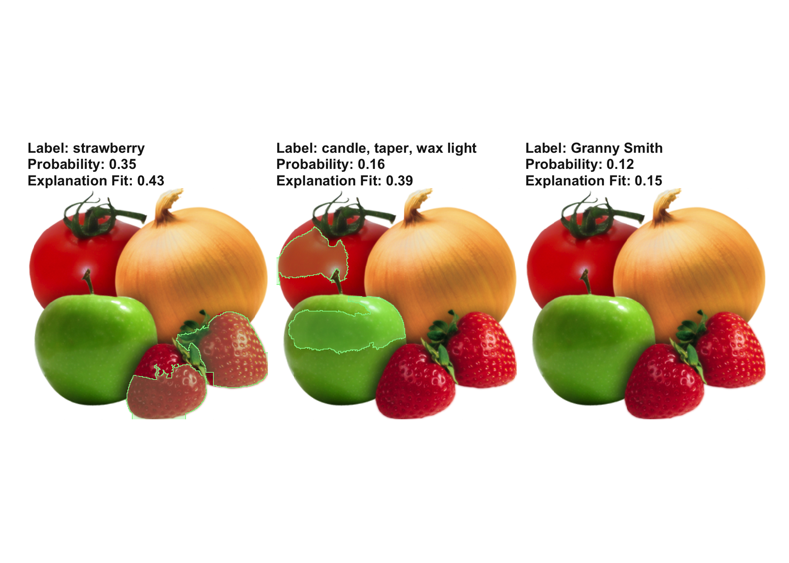

```{r, message = FALSE, warning = FALSE, echo = FALSE}
devtools::load_all()
set.seed(42)
```

<!--{pagebreak}-->

## Local Surrogate (LIME) {#lime}

Local surrogate models adalah model yang dapat ditafsirkan yang digunakan untuk menjelaskan prediksi individu dari model machine learning black box.
Penjelasan local interpretable model-agnostic explanations (LIME)[^Ribeiro2016lime] adalah makalah di mana penulis mengusulkan implementasi konkret local surrogate models.
Surrogate models dilatih untuk memperkirakan prediksi model black box yang mendasarinya.
Alih-alih melatih surrogate models global, LIME berfokus pada pelatihan local surrogate models untuk menjelaskan prediksi individu.

Idenya cukup intuitif.
Pertama, lupakan data pelatihan dan bayangkan Anda hanya memiliki model black box di mana Anda dapat memasukkan titik data dan mendapatkan prediksi model.
Anda dapat memeriksa kotak sesering yang Anda inginkan.
Tujuan Anda adalah untuk memahami mengapa model machine learning membuat prediksi tertentu.
LIME menguji apa yang terjadi pada prediksi saat Anda memberikan variasi data ke dalam model machine learning.
LIME menghasilkan kumpulan data baru yang terdiri dari sampel yang terganggu dan prediksi yang sesuai dari model black box.
Pada kumpulan data baru ini, LIME kemudian melatih interpretable models, yang diberi bobot berdasarkan kedekatan instance sampel dengan instance yang diinginkan.
interpretable models dapat berupa apa saja dari [bab interpretable models](#simple), misalnya [Lasso](#lasso) atau [decision trees](#tree).
Model yang dipelajari harus merupakan perkiraan yang baik dari prediksi model machine learning secara lokal, tetapi tidak harus menjadi pendekatan global yang baik.
Jenis akurasi ini juga disebut local fidelity.

Secara matematis, local surrogate models dengan kendala interpretability dapat dinyatakan sebagai berikut:

$$\text{explanation}(x)=\arg\min_{g\in{}G}L(f,g,\pi_x)+\Omega(g)$$

explanation model misalnya x adalah model g (misalnya model linear regression) yang meminimalkan loss L (misalnya kesalahan kuadrat rata-rata), yang mengukur seberapa dekat penjelasannya dengan prediksi model asli f (misalnya model xgboost), sedangkan kompleksitas model $\Omega(g)$ dijaga tetap rendah (misalnya lebih memilih fitur yang lebih sedikit).
G adalah keluarga penjelasan yang mungkin, misalnya semua model linear regression yang mungkin.
Ukuran kedekatan $\pi_x$ mendefinisikan seberapa besar lingkungan di sekitar instance x yang kami pertimbangkan untuk penjelasannya.
Dalam praktiknya, LIME hanya mengoptimalkan bagian yang hilang.
Pengguna harus menentukan kerumitannya, mis. dengan memilih jumlah fitur maksimum yang dapat digunakan model linear regression.

Resep untuk melatih local surrogate models:

- Pilih instance yang Anda minati yang ingin Anda beri penjelasan tentang prediksi black boxnya.
- Ganggu dataset Anda dan dapatkan prediksi black box untuk poin-poin baru ini.
- Bobot sampel baru sesuai dengan kedekatannya dengan instance yang diinginkan.
- Latih model yang tertimbang dan dapat diinterpretasikan pada dataset dengan variasi.
- Menjelaskan prediksi dengan menginterpretasikan model lokal.

Dalam implementasi saat ini di [R](https://github.com/thomasp85/lime) dan [Python](https://github.com/marcotcr/lime), misalnya, linear regression dapat dipilih sebagai interpretable surrogate model.
Sebelumnya, Anda harus memilih K, jumlah fitur yang ingin Anda miliki dalam model interpretable Anda.
Semakin rendah K, semakin mudah untuk menginterpretasikan model.
K yang lebih tinggi berpotensi menghasilkan model dengan fidelitas yang lebih tinggi.
Ada beberapa metode untuk model pelatihan dengan fitur K persis.
Pilihan yang bagus adalah [Lasso](#lasso).
Model Lasso dengan parameter regularisasi tinggi $\lambda$ menghasilkan model tanpa fitur apa pun.
Dengan melatih kembali model Lasso dengan penurunan $\lambda$ secara perlahan, satu demi satu, fitur mendapatkan perkiraan bobot yang berbeda dari nol.
Jika ada K fitur dalam model, Anda telah mencapai jumlah fitur yang diinginkan.
Strategi lainnya adalah pemilihan fitur ke depan atau ke belakang.
Ini berarti Anda memulai dengan model lengkap (= berisi semua fitur) atau dengan model hanya dengan intersep dan kemudian menguji fitur mana yang akan memberikan peningkatan terbesar saat ditambahkan atau dihapus, hingga model dengan fitur K tercapai.

Bagaimana Anda mendapatkan variasi data?
Hal ini tergantung pada jenis data, yang dapat berupa teks, gambar atau data tabular.
Untuk teks dan gambar, solusinya adalah mengaktifkan atau menonaktifkan satu kata atau piksel super.
Dalam kasus data tabular, LIME membuat sampel baru dengan mengganggu setiap fitur secara individual, menggambar dari distribusi normal dengan mean dan standar deviasi yang diambil dari fitur tersebut.

### LIME for Tabular Data

Data tabular adalah data yang datang dalam tabel, dengan setiap baris mewakili sebuah instance dan setiap kolom merupakan fitur.
Sampel LIME tidak diambil di sekitar instance yang diinginkan, tetapi dari pusat massa data pelatihan, yang bermasalah.
Tetapi ini meningkatkan kemungkinan bahwa hasil untuk beberapa prediksi titik sampel berbeda dari titik data yang diinginkan dan bahwa LIME dapat mempelajari setidaknya beberapa penjelasan.

Yang terbaik adalah menjelaskan secara visual cara kerja pengambilan sampel dan pelatihan model lokal:

```{r lime-fitting, fig.cap='LIME algorithm for tabular data. A) Random forest predictions given features x1 and x2. Predicted classes: 1 (dark) or 0 (light). B) Instance of interest (big dot) and data sampled from a normal distribution (small dots). C) Assign higher weight to points near the instance of interest. D) Signs of the grid show the classifications of the locally learned model from the weighted samples. The white line marks the decision boundary (P(class=1) = 0.5).', fig.height=9, fig.width=9}
## Creating dataset ###########################################################
library("dplyr")
library("ggplot2")

# Define range of set
lower_x1 = -2
upper_x1 = 2
lower_x2 = -2
upper_x2 = 1

# Size of the training set for the black box classifier
n_training  = 20000
# Size for the grid to plot the decision boundaries
n_grid = 100
# Number of samples for LIME explanations
n_sample = 500


# Simulate y ~ x1 + x2
set.seed(1)
x1 = runif(n_training, min = lower_x1, max = upper_x1)
x2 = runif(n_training, min = lower_x2, max = upper_x2)
y = get_y(x1, x2)
# Add noise
y_noisy = get_y(x1, x2, noise_prob = 0.01)
lime_training_df = data.frame(x1=x1, x2=x2, y=as.factor(y), y_noisy=as.factor(y_noisy))

# For scaling later on
x_means = c(mean(x1), mean(x2))
x_sd = c(sd(x1), sd(x2))


# Learn model
rf = randomForest::randomForest(y_noisy ~ x1 + x2, data = lime_training_df, ntree=100)
lime_training_df$predicted = predict(rf, lime_training_df)


# The decision boundaries
grid_x1 = seq(from=lower_x1, to=upper_x1, length.out=n_grid)
grid_x2 = seq(from=lower_x2, to=upper_x2, length.out=n_grid)
grid_df = expand.grid(x1 = grid_x1, x2 = grid_x2)
grid_df$predicted = as.numeric(as.character(predict(rf, newdata = grid_df)))


# The observation to be explained
explain_x1 = 1
explain_x2 = -0.5
explain_y_model = predict(rf, newdata = data.frame(x1=explain_x1, x2=explain_x2))
df_explain = data.frame(x1=explain_x1, x2=explain_x2, y_predicted=explain_y_model)

point_explain = c(explain_x1, explain_x2)
point_explain_scaled = (point_explain - x_means) / x_sd

# Drawing the samples for the LIME explanations
x1_sample = rnorm(n_sample, x_means[1], x_sd[1])
x2_sample = rnorm(n_sample, x_means[2], x_sd[2])
df_sample = data.frame(x1 = x1_sample, x2 = x2_sample)
# Scale the samples
points_sample = apply(df_sample, 1, function(x){
  (x - x_means) / x_sd
}) %>% t


# Add weights to the samples
kernel_width = sqrt(dim(df_sample)[2]) * 0.15
distances = get_distances(point_explain_scaled, 
  points_sample = points_sample)

df_sample$weights = kernel(distances, kernel_width=kernel_width)

df_sample$predicted = predict(rf, newdata = df_sample)


# Trees
# mod = rpart(predicted ~ x1 + x2, data = df_sample,  weights = df_sample$weights)
# grid_df$explained = predict(mod, newdata = grid_df, type='prob')[,2]

# Logistic regression model
mod = glm(predicted ~ x1 + x2, data = df_sample,  weights = df_sample$weights, family='binomial')
grid_df$explained = predict(mod, newdata = grid_df, type='response')

# logistic decision boundary
coefs = coefficients(mod)
logistic_boundary_x1 = grid_x1
logistic_boundary_x2 = -  (1/coefs['x2']) * (coefs['(Intercept)'] + coefs['x1'] * grid_x1) 
logistic_boundary_df = data.frame(x1 = logistic_boundary_x1, x2 = logistic_boundary_x2)  
logistic_boundary_df = filter(logistic_boundary_df, x2 <= upper_x2, x2 >= lower_x2)


# Create a smaller grid for visualization of local model boundaries
x1_steps = unique(grid_df$x1)[seq(from=1, to=n_grid, length.out = 20)]
x2_steps = unique(grid_df$x2)[seq(from=1, to=n_grid, length.out = 20)]
grid_df_small = grid_df[grid_df$x1 %in% x1_steps & grid_df$x2 %in% x2_steps,]
grid_df_small$explained_class = round(grid_df_small$explained)

colors = c('#132B43', '#56B1F7')
# Data with some noise
p_data = ggplot(lime_training_df) +
  geom_point(aes(x=x1,y=x2,fill=y_noisy, color=y_noisy), alpha =0.3, shape=21) +
  scale_fill_manual(values = colors) +
  scale_color_manual(values = colors) +
  my_theme(legend.position = 'none')

# The decision boundaries of the learned black box classifier
p_boundaries = ggplot(grid_df) +
  geom_raster(aes(x=x1,y=x2,fill=predicted), alpha = 0.3, interpolate=TRUE) +
  my_theme(legend.position='none') +
  ggtitle('A')


# Drawing some samples
p_samples = p_boundaries +
  geom_point(data = df_sample, aes(x=x1, y=x2)) +
  scale_x_continuous(limits = c(-2, 2)) +
  scale_y_continuous(limits = c(-2, 1))
# The point to be explained
p_explain = p_samples +
  geom_point(data = df_explain, aes(x=x1,y=x2), fill = 'yellow', shape = 21, size=4) +
  ggtitle('B')

p_weighted = p_boundaries +
  geom_point(data = df_sample, aes(x=x1, y=x2, size=weights)) +
  scale_x_continuous(limits = c(-2, 2)) +
  scale_y_continuous(limits = c(-2, 1)) +
  geom_point(data = df_explain, aes(x=x1,y=x2), fill = 'yellow', shape = 21, size=4) +
  ggtitle('C')

p_boundaries_lime = ggplot(grid_df)  +
  geom_raster(aes(x=x1,y=x2,fill=predicted), alpha = 0.3, interpolate=TRUE) +
  geom_point(aes(x=x1, y=x2, color=explained), size = 2, data = grid_df_small[grid_df_small$explained_class==1,], shape=3) +
  geom_point(aes(x=x1, y=x2, color=explained), size = 2, data = grid_df_small[grid_df_small$explained_class==0,], shape=95) +
  geom_point(data = df_explain, aes(x=x1,y=x2), fill = 'yellow', shape = 21, size=4) +
  geom_line(aes(x=x1, y=x2), data =logistic_boundary_df, color = 'white') +
  my_theme(legend.position='none') + ggtitle('D')


gridExtra::grid.arrange(p_boundaries, p_explain, p_weighted, p_boundaries_lime, ncol=2)

```

Seperti biasa, iblis ada dalam detailnya.
Mendefinisikan lingkungan yang berarti di sekitar titik itu sulit.
LIME saat ini menggunakan smoothing kernel eksponensial untuk mendefinisikan lingkungan.
Smoothing kernel adalah fungsi yang mengambil dua contoh data dan mengembalikan ukuran kedekatan.
Lebar kernel menentukan seberapa besar lingkungan:
Lebar kernel yang kecil berarti instance harus sangat dekat untuk mempengaruhi model lokal, lebar kernel yang lebih besar berarti instance yang lebih jauh juga mempengaruhi model.
Jika Anda melihat [implementasi Python LIME (file lime/lime_tabular.py)](https://github.com/marcotcr/lime/tree/ce2db6f20f47c3330beb107bb17fd25840ca4606) Anda akan melihat bahwa ia menggunakan smoothing kernel eksponensial (pada data yang dinormalisasi) dan lebar kernel adalah 0,75 kali akar kuadrat dari jumlah kolom data pelatihan.
Kelihatannya seperti garis kode yang tidak bersalah, tetapi itu seperti gajah yang duduk di ruang tamu Anda di sebelah porselen bagus yang Anda dapatkan dari kakek-nenek Anda.
Masalah besarnya adalah kita tidak memiliki cara yang baik untuk menemukan kernel atau lebar terbaik.
Dan dari mana 0,75 itu berasal?
Dalam skenario tertentu, Anda dapat dengan mudah membalikkan penjelasan Anda dengan mengubah lebar kernel, seperti yang ditunjukkan pada gambar berikut:


```{r lime-fail, fig.cap = "Explanation of the prediction of instance x = 1.6. The predictions of the black box model depending on a single feature is shown as a thick line and the distribution of the data is shown with rugs. Three local surrogate models with different kernel widths are computed. The resulting linear regression model depends on the kernel width: Does the feature have a negative, positive or no effect for x = 1.6?"}
set.seed(42)
df = data.frame(x = rnorm(200, mean = 0, sd = 3))
df$x[df$x < -5] = -5
df$y = (df$x + 2)^2
df$y[df$x > 1] = -df$x[df$x > 1] + 10 + - 0.05 * df$x[df$x > 1]^2
#df$y = df$y + rnorm(nrow(df), sd = 0.05)
explain.p = data.frame(x = 1.6, y = 8.5)

w1 = kernel(get_distances(data.frame(x = explain.p$x), df), 0.1)
w2 = kernel(get_distances(data.frame(x = explain.p$x), df), 0.75)
w3 = kernel(get_distances(data.frame(x = explain.p$x), df), 2)

lm.1 = lm(y ~ x, data = df, weights = w1)
lm.2 = lm(y ~ x, data = df, weights = w2)
lm.3 = lm(y ~ x, data = df, weights = w3)
df.all = rbind(df, df, df)

df.all$lime = c(predict(lm.1), predict(lm.2), predict(lm.3))
df.all$width = factor(c(rep(c(0.1, 0.75, 2), each = nrow(df))))


ggplot(df.all, aes(x = x, y = y)) + 
  geom_line(size = 2.5) + 
  geom_rug(sides = "b") + 
  geom_line(aes(x = x, y = lime, group = width, color = width, linetype = width)) + 
  geom_point(data = explain.p, aes(x = x, y = y), size = 12, shape = "x") + 
  scale_color_viridis("Kernel width", discrete = TRUE) + 
  scale_linetype("Kernel width") + 
  scale_y_continuous("Black Box prediction")

```

Contoh hanya menunjukkan satu fitur.
Ini menjadi lebih buruk di ruang fitur dimensi tinggi.
Juga sangat tidak jelas apakah ukuran jarak harus memperlakukan semua fitur secara setara.
Apakah satuan jarak untuk fitur x1 identik dengan satu unit untuk fitur x2?
Ukuran jarak cukup sewenang-wenang dan jarak dalam dimensi yang berbeda (alias fitur) mungkin tidak sebanding sama sekali.


#### Example

Mari kita lihat contoh konkretnya.
Kami kembali ke [data sewa sepeda](#bike-data) dan mengubah masalah prediksi menjadi klasifikasi:
Setelah memperhitungkan tren persewaan sepeda yang semakin populer dari waktu ke waktu, kami ingin mengetahui pada hari tertentu apakah jumlah sepeda yang disewa akan berada di atas atau di bawah garis tren.
Anda juga dapat mengartikan "above" sebagai jumlah sepeda di atas rata-rata, tetapi disesuaikan dengan tren.

```{r lime-tabular-example-train-black-box, cache = TRUE}
data("bike")
ntree = 100
bike.train.resid = factor(resid(lm(cnt ~ days_since_2011, data = bike)) > 0, levels = c(FALSE, TRUE), labels = c('below', 'above'))
bike.train.x = bike[names(bike) != 'cnt']

model <- caret::train(bike.train.x,
  bike.train.resid,
  method = 'rf', ntree=ntree, maximise = FALSE)
n_features_lime = 2
```

Pertama kita melatih random forest dengan pohon `r ntree` pada tugas klasifikasi.
Pada hari berapa jumlah sepeda sewaan akan berada di atas rata-rata bebas tren, berdasarkan informasi cuaca dan kalender?

Penjelasan dibuat dengan fitur `r n_features_lime`.
Hasil dari sparse local linear model yang dilatih untuk dua instance dengan prediksi kelas yang berbeda:

```{r lime-tabular-example-explain-plot-1, fig.cap=sprintf('LIME explanations for two instances of the bike rental dataset. Warmer temperature and good weather situation have a positive effect on the prediction. The x-axis shows the feature effect: The weight times the actual feature value.') }
library("iml")
library("gridExtra")
instance_indices = c(295, 8)
set.seed(44)
bike.train.x$temp = round(bike.train.x$temp, 2)
pred = Predictor$new(model, data = bike.train.x, class = "above", type = "prob")
lim1 = LocalModel$new(pred, x.interest = bike.train.x[instance_indices[1],], k = n_features_lime)
lim2= LocalModel$new(pred, x.interest = bike.train.x[instance_indices[2],], k = n_features_lime)
wlim = c(min(c(lim1$results$effect, lim2$results$effect)), max(c(lim1$results$effect, lim2$results$effect)))
a = plot(lim1) +
  scale_y_continuous(limit = wlim) + 
  geom_hline(aes(yintercept=0))   +
  theme(axis.title.y=element_blank(),
        axis.ticks.y=element_blank())
b = plot(lim2) +
    scale_y_continuous(limit = wlim) + 
    geom_hline(aes(yintercept=0)) +
  theme(axis.title.y=element_blank(),
        axis.ticks.y=element_blank())
grid.arrange(a, b, ncol = 1)
```

Dari gambar menjadi jelas bahwa lebih mudah untuk menafsirkan fitur kategoris daripada fitur numerik.
Salah satu solusinya adalah dengan mengkategorikan fitur numerik ke dalam bin.


### LIME for Text

LIME untuk teks berbeda dengan LIME untuk data tabular.
Variasi data dihasilkan secara berbeda:
Mulai dari teks asli, teks baru dibuat dengan menghapus kata-kata secara acak dari teks asli.
Dataset diwakili dengan fitur biner untuk setiap kata.
Fitur adalah 1 jika kata yang sesuai disertakan dan 0 jika telah dihapus.

#### Example

Dalam contoh ini kami mengklasifikasikan [komentar YouTube](#spam-data) sebagai spam atau normal.

Model black box adalah decision trees dalam yang dilatih pada matriks kata dokumen.
Setiap komentar adalah satu dokumen (= satu baris) dan setiap kolom adalah jumlah kemunculan kata tertentu.
Short decision trees mudah dimengerti, tetapi dalam kasus ini pohonnya sangat dalam.
Juga di tempat pohon ini mungkin ada recurrent neural networks atau support vector machine yang dilatih pada penyisipan kata (vektor abstrak).
Mari kita lihat dua komentar dari dataset ini dan kelas yang sesuai (1 untuk spam, 0 untuk komentar normal):

```{r load-text-classification-lime}
data("ycomments")
example_indices = c(267, 173)
texts = ycomments$CONTENT[example_indices]
```

```{r show--data-TubeSpam}
kable(ycomments[example_indices, c('CONTENT', 'CLASS')])
```

Langkah selanjutnya adalah membuat beberapa variasi dari kumpulan data yang digunakan dalam model lokal.
Misalnya, beberapa variasi dari salah satu komentar:

```{r lime-text-variations}
library("tm")

labeledTerms = prepare_data(ycomments$CONTENT)
labeledTerms$class = factor(ycomments$CLASS, levels = c(0,1), labels = c('no spam', 'spam'))
labeledTerms2 = prepare_data(ycomments, trained_corpus = labeledTerms)

rp = rpart::rpart(class ~ ., data = labeledTerms)
predict_fun = get_predict_fun(rp, labeledTerms)
tokenized = tokenize(texts[2])
set.seed(2)
variations = create_variations(texts[2], predict_fun, prob=0.7, n_variations = 5, class='spam')
colnames(variations) = c(tokenized, 'prob', 'weight')
example_sentence = paste(colnames(variations)[variations[2, ] == 1], collapse = ' ')
```

```{r lime-text-variations-output, results='asis'}
kable(variations)
```

Setiap kolom sesuai dengan satu kata dalam kalimat.
Setiap baris adalah variasi, 1 berarti kata tersebut adalah bagian dari variasi ini dan 0 berarti kata tersebut telah dihapus.
Kalimat yang sesuai untuk salah satu variasi adalah "```r example_sentence```".
Kolom "prob" menunjukkan prediksi probabilitas spam untuk setiap variasi kalimat.
Kolom "weight" menunjukkan kedekatan variasi dengan kalimat asli, dihitung sebagai 1 dikurangi proporsi kata yang dihilangkan, misalnya jika 1 dari 7 kata dihilangkan, kedekatannya adalah 1 - 1/7 = 0,86.

Berikut adalah dua kalimat (satu spam, satu tanpa spam) dengan perkiraan bobot lokal yang ditemukan oleh algoritme LIME:

```{r lime-text-explanations, fig.cap = "LIME explanations for text classification."}
set.seed(42)
ycomments.predict = get.ycomments.classifier(ycomments)
explanations  = data.table::rbindlist(lapply(seq_along(texts), function(i) {
  explain_text(texts[i], ycomments.predict, class='spam', case=i, prob = 0.5)
})
)
explanations = data.frame(explanations)
kable(explanations[c("case", "label_prob", "feature", "feature_weight")])
```

Kata "channel" menunjukkan kemungkinan spam yang tinggi.
Untuk komentar non-spam tidak ada bobot bukan nol yang diperkirakan, karena tidak peduli kata mana yang dihapus, kelas yang diprediksi tetap sama.

### LIME for Images {#images-lime}

*Bagian ini ditulis oleh Verena Haunschmid.*

LIME untuk gambar bekerja secara berbeda dari LIME untuk data dan teks tabular.
Secara intuitif, tidak masuk akal untuk mengganggu piksel individu, karena lebih dari satu piksel berkontribusi pada satu kelas.
Mengubah piksel individu secara acak mungkin tidak akan banyak mengubah prediksi.
Oleh karena itu, variasi gambar dibuat dengan mengelompokkan gambar menjadi "superpiksel" dan mematikan atau menghidupkan superpiksel.
Superpiksel adalah piksel yang saling berhubungan dengan warna yang sama dan dapat dimatikan dengan mengganti setiap piksel dengan warna yang ditentukan pengguna seperti abu-abu.
Pengguna juga dapat menentukan probabilitas untuk mematikan superpiksel di setiap permutasi.

#### Example

Dalam contoh ini kita melihat klasifikasi yang dibuat oleh jaringan saraf Inception V3.
Gambar yang digunakan menunjukkan beberapa roti yang saya panggang dalam mangkuk.
Karena kami dapat memiliki beberapa prediksi label per gambar (diurutkan berdasarkan probabilitas), kami dapat menjelaskan label teratas.
Prediksi teratas adalah "Bagel" dengan probabilitas 77%, diikuti oleh "Strawberry" dengan probabilitas 4%.
Gambar berikut menunjukkan untuk "Bagel" dan "Strawberry" penjelasan LIME.
Penjelasan dapat ditampilkan langsung pada sampel gambar.
Hijau berarti bagian gambar ini meningkatkan kemungkinan label dan merah berarti penurunan.

```{r lime-images-package-example-include, fig.cap="Left: Image of a bowl of bread. Middle and right: LIME explanations for the top 2 classes (bagel, strawberry) for image classification made by Google's Inception V3 neural network.", out.width=500}

```
Prediksi dan penjelasan untuk "Bagel" sangat masuk akal, bahkan jika prediksinya salah -- ini jelas bukan bagel karena lubang di tengahnya tidak ada.


### Advantages

Meskipun Anda **mengganti model pembelajaran mesin yang mendasarinya**, Anda masih dapat menggunakan model lokal yang dapat diinterpretasikan untuk penjelasan.
Misalkan orang yang melihat penjelasan memahami decision tree dengan baik.
Karena Anda menggunakan model local surrogate, Anda menggunakan decision tree sebagai penjelasan tanpa benar-benar harus menggunakan decision tree untuk membuat prediksi.
Misalnya, Anda dapat menggunakan SVM.
Dan jika ternyata model xgboost bekerja lebih baik, Anda dapat mengganti SVM dan tetap menggunakan sebagai decision tree untuk menjelaskan prediksi.

Model local surrogate mendapat manfaat dari literatur dan pengalaman pelatihan dan menafsirkan model yang dapat ditafsirkan.

Saat menggunakan Lasso atau short trees, **penjelasan yang dihasilkan pendek (= selektif) dan mungkin kontras**.
Oleh karena itu, mereka membuat [penjelasan yang ramah manusia](#explanation).
Inilah mengapa saya lebih banyak melihat LIME di aplikasi yang penerima penjelasannya adalah orang awam atau orang yang hanya punya sedikit waktu.
Itu tidak cukup untuk atribusi lengkap, jadi saya tidak melihat LIME dalam skenario compliance di mana Anda mungkin diwajibkan secara hukum untuk menjelaskan prediksi sepenuhnya.
Juga untuk men-debug model pembelajaran mesin, akan berguna untuk memiliki semua alasan, bukan beberapa.

LIME adalah salah satu dari sedikit metode yang **berfungsi untuk data tabular, teks, dan gambar**.

**Ukuran fidelitas** (seberapa baik model yang dapat diinterpretasikan mendekati prediksi kotak hitam) memberi kita gambaran yang baik tentang seberapa andal model yang dapat diinterpretasikan dalam menjelaskan prediksi kotak hitam di sekitar instance data yang diinginkan.

LIME diimplementasikan dalam Python ([lime](https://github.com/marcotcr/lime) library) dan R ([lime package](https://cran.r-project.org/web/packages/lime/index.html) dan [iml package](https://cran.r-project.org/web/packages/iml/index.html)) dan **sangat mudah digunakan**.

Penjelasan yang dibuat dengan model local surrogate **dapat menggunakan fitur lain (yang dapat ditafsirkan) selain model asli yang dilatih.**.
Tentu saja, fitur yang dapat diinterpretasikan ini harus diturunkan dari instance data.
Pengklasifikasi teks dapat mengandalkan penyisipan kata abstrak sebagai fitur, tetapi penjelasannya dapat didasarkan pada ada atau tidak adanya kata dalam sebuah kalimat.
Sebuah model regresi dapat mengandalkan transformasi non-interpretable dari beberapa atribut, tetapi penjelasan dapat dibuat dengan atribut asli.
Misalnya, model regresi dapat dilatih pada komponen principal component analysis (PCA) dari jawaban survei, tetapi LIME mungkin dilatih pada pertanyaan survei asli.
Menggunakan fitur yang dapat diinterpretasikan untuk LIME dapat menjadi keuntungan besar dibandingkan metode lain, terutama ketika model dilatih dengan fitur yang tidak dapat diinterpretasikan.

### Disadvantages

Definisi neighborhood yang benar adalah masalah yang sangat besar dan belum terpecahkan saat menggunakan LIME dengan data tabular.
Menurut pendapat saya itu adalah masalah terbesar dengan LIME dan alasan mengapa saya akan merekomendasikan untuk menggunakan LIME hanya dengan sangat hati-hati.
Untuk setiap aplikasi Anda harus mencoba pengaturan kernel yang berbeda dan lihat sendiri apakah penjelasannya masuk akal.
Sayangnya, ini adalah saran terbaik yang dapat saya berikan untuk menemukan lebar kernel yang baik.

Pengambilan sampel dapat ditingkatkan dalam penerapan LIME saat ini.
Titik data diambil sampelnya dari distribusi Gaussian, mengabaikan korelasi antar fitur.
Hal ini dapat menyebabkan titik data yang tidak mungkin yang kemudian dapat digunakan untuk mempelajari model local explanation.

Kompleksitas explanation model harus didefinisikan terlebih dahulu.
Ini hanya keluhan kecil, karena pada akhirnya pengguna selalu harus menentukan kompromi antara fidelity dan sparsity.

Masalah besar lainnya adalah ketidakstabilan penjelasan.
Dalam sebuah artikel [^limerobustness] penulis menunjukkan bahwa penjelasan dari dua titik yang sangat dekat sangat bervariasi dalam pengaturan simulasi.
Juga, pengalaman saya, jika Anda mengulangi proses sampling, maka eksplanasi yang keluar bisa berbeda.
Ketidakstabilan berarti sulit untuk mempercayai penjelasannya, dan Anda harus sangat kritis.

Penjelasan LIME dapat dimanipulasi oleh ilmuwan data untuk menyembunyikan bias [^fool].
Kemungkinan manipulasi membuat lebih sulit untuk mempercayai penjelasan yang dihasilkan dengan LIME.

Kesimpulan:
Local surrogate models, dengan LIME sebagai implementasi konkret, sangat menjanjikan.
Tetapi metode ini masih dalam tahap pengembangan dan banyak masalah yang perlu dipecahkan sebelum dapat diterapkan dengan aman.


[^Ribeiro2016lime]: Ribeiro, Marco Tulio, Sameer Singh, and Carlos Guestrin. "Why should I trust you?: Explaining the predictions of any classifier." Proceedings of the 22nd ACM SIGKDD international conference on knowledge discovery and data mining. ACM (2016).

[^limerobustness]: Alvarez-Melis, David, and Tommi S. Jaakkola. "On the robustness of interpretability methods." arXiv preprint arXiv:1806.08049 (2018).


[^fool]: Slack, Dylan, et al. "Fooling lime and shap: Adversarial attacks on post hoc explanation methods." Proceedings of the AAAI/ACM Conference on AI, Ethics, and Society. 2020.
