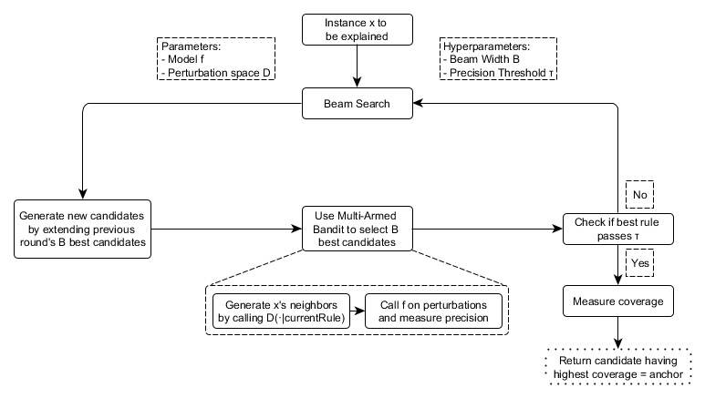

```{r, message = FALSE, warning = FALSE, echo = FALSE}
devtools::load_all()
set.seed(42)
library(anchors)
```

<!--{pagebreak}-->

## Scoped Rules (Anchors) {#anchors}

*Authors: Tobias Goerke & Magdalena Lang*

`r if(is.html){only.in.html}`

Anchors menjelaskan prediksi individu dari setiap model klasifikasi black box dengan menemukan decision rules yang "menjangkar" prediksi secara memadai.
Aturan menjangkar prediksi jika perubahan nilai fitur lain tidak memengaruhi prediksi.
Anchors menggunakan teknik reinforcement learning dalam kombinasi dengan algoritma pencarian grafik untuk mengurangi jumlah panggilan model (dan karenanya runtime yang diperlukan) seminimal mungkin sambil tetap dapat memulihkan dari local optima. Ribeiro, Singh, dan Guestrin mengusulkan algoritme pada tahun 2018[^Ribeiro2018Anchors] -- peneliti yang sama yang memperkenalkan algoritme [LIME](#lime).

Seperti pendahulunya, pendekatan Anchors menerapkan strategi *perturbation-based* untuk menghasilkan penjelasan *lokal* untuk prediksi model machine learning black box. Namun, alih-alih surrogate models yang digunakan oleh LIME, penjelasan yang dihasilkan dinyatakan sebagai aturan *IF-THEN* yang mudah dipahami, yang disebut *Anchors*. Aturan-aturan ini dapat digunakan kembali karena mereka *scoped*: Anchors mencakup gagasan coverage, yang menyatakan dengan tepat ke contoh lain, yang mungkin tidak terlihat, yang diterapkan. Menemukan Anchors melibatkan eksplorasi atau masalah bandit multi-bersenjata, yang berasal dari disiplin reinforcement learning. Untuk tujuan ini, neighbors, atau perturbations, dibuat dan dievaluasi untuk setiap contoh yang sedang dijelaskan. Melakukannya memungkinkan pendekatan untuk mengabaikan struktur black box dan parameter internalnya sehingga ini dapat tetap tidak teramati dan tidak berubah. Jadi, algoritmenya adalah *model-agnostic*, artinya dapat diterapkan ke **setiap** kelas model.

Dalam makalah mereka, penulis membandingkan kedua algoritme mereka dan memvisualisasikan betapa berbedanya ini berkonsultasi dengan lingkungan instance untuk mendapatkan hasil. Untuk ini, gambar berikut menggambarkan LIME dan Anchors secara lokal yang menjelaskan pengklasifikasi biner kompleks (memprediksi **-** atau **+**) menggunakan dua contoh contoh. Hasil LIME tidak menunjukkan seberapa setia mereka karena LIME hanya mempelajari batas keputusan linier yang paling mendekati model dengan perturbation space $D$. Mengingat perturbation space yang sama, pendekatan Anchors membangun penjelasan yang coveragenya disesuaikan dengan perilaku model dan dengan jelas mengekspresikan batas-batasnya. Dengan demikian, mereka setia dengan desain dan menyatakan dengan tepat untuk contoh mana mereka valid. Properti ini membuat Anchors sangat intuitif dan mudah dipahami.

```{r fig.cap="LIME vs. Anchors -- A Toy Visualization. Figure from Ribeiro, Singh, and Guestrin (2018).", out.width=350, fig.align="center"}

```

Seperti disebutkan sebelumnya, hasil atau penjelasan algoritme datang dalam bentuk aturan, yang disebut Anchors. Contoh sederhana berikut mengilustrasikan Anchors seperti itu. Misalnya, kita diberikan model black box bivariat yang memprediksi apakah seorang penumpang selamat atau tidak dari bencana Titanic. Sekarang kami ingin tahu *mengapa* model memprediksi untuk satu individu tertentu yang bertahan. Algoritma Anchors memberikan penjelasan hasil seperti yang ditunjukkan di bawah ini.


| Feature         | Value         |
| --------------- |:-------------:|
| Age             | 20            |
| Sex             | female        |
| Class           | first         |
| TicketPrice     | 300\$          |
| More attributes | ...           |
| **Survived**    | **true**      |

Tabel: satu individu teladan dan prediksi model

Dan penjelasan Anchors yang sesuai adalah:

IF `SEX = female`  
AND `Class = first`  
THEN PREDICT `Survived = true`  
WITH PRECISION `97%`  
AND COVERAGE `15%`  
 
Contoh menunjukkan bagaimana Anchors dapat memberikan wawasan penting ke dalam prediksi model dan alasan yang mendasarinya. Hasilnya menunjukkan atribut mana yang diperhitungkan oleh model, yang dalam hal ini adalah jenis kelamin perempuan dan kelas satu. Manusia, yang terpenting untuk kebenaran, dapat menggunakan aturan ini untuk memvalidasi perilaku model. Anchors juga memberi tahu kita bahwa itu berlaku untuk 15\% instance perturbation space. Dalam kasus tersebut, penjelasannya 97\% akurat, artinya predikat yang ditampilkan hampir secara eksklusif bertanggung jawab atas hasil yang diprediksi.

Anchors $A$ secara formal didefinisikan sebagai berikut:

$$\mathbb{E}_{\mathcal{D}_x(z|A)}[1_{f(x)=f(z)}]\geq\tau,A(x)=1$$

Di mana:

+ $x$ mewakili instance yang sedang dijelaskan (mis., satu baris dalam kumpulan data tabular).
+ $A$ adalah sekumpulan predikat, yaitu aturan atau Anchors yang dihasilkan, sehingga $A(x)=1$ ketika semua predikat fitur yang ditentukan oleh $A$ sesuai dengan nilai fitur $x$.
+ $f$ menunjukkan model klasifikasi yang akan dijelaskan (misalnya, model jaringan saraf tiruan). Itu dapat ditanyakan untuk memprediksi label untuk $x$ dan perturbationsnya.
+ $D_x (\cdot|A)$ menunjukkan distribusi neighbors $x$, cocok dengan $A$.
+ $0 \leq \tau \leq 1$ menentukan ambang presisi. Hanya aturan yang mencapai fidelitas lokal minimal $\tau$ yang dianggap sebagai hasil yang valid.

Deskripsi formal mungkin menakutkan dan dapat ditulis dengan kata-kata:

> Diberikan contoh $x$ untuk dijelaskan, aturan atau Anchors $A$ harus ditemukan, sehingga berlaku untuk $x$, sedangkan kelas yang sama seperti untuk $x$ diprediksi untuk sebagian kecil dari setidaknya $\tau$ dari neighbors $x$ di mana $A$ yang sama berlaku. Hasil presisi aturan dari mengevaluasi neighbors atau perturbations (mengikuti $D_x (z|A)$) menggunakan model machine learning yang disediakan (dilambangkan dengan fungsi indikator $1_{f(x) = f(z)}$).


### Finding Anchors


Meskipun deskripsi matematis Anchors mungkin tampak jelas dan lugas, membangun aturan tertentu tidak mungkin dilakukan. Itu akan membutuhkan evaluasi $1_{f(x) = f(z)}$ untuk semua $z \in \mathcal{D}_x(\cdot|A)$ yang tidak mungkin dalam ruang input kontinu atau besar. Oleh karena itu, penulis mengusulkan untuk memperkenalkan parameter $0 \leq \delta \leq 1$ untuk membuat definisi probabilistik. Dengan cara ini, sampel diambil sampai ada kepercayaan statistik mengenai presisinya. Definisi probabilistik berbunyi sebagai berikut:

$$P(prec(A)\geq\tau)\geq{}1-\delta\quad\textrm{with}\quad{}prec(A)=\mathbb{E}_{\mathcal{D}_x(z|A)}[1_{f(x)=f(z)}]$$

Dua definisi sebelumnya digabungkan dan diperluas dengan pengertian coverage. Dasar pemikirannya terdiri dari menemukan aturan yang berlaku untuk sebagian besar ruang input model. coverage secara formal didefinisikan sebagai kemungkinan Anchors untuk diterapkan ke neighborsnya, yaitu, perturbation spacenya:

$$cov(A)=\mathbb{E}_{\mathcal{D}_{(z)}[A(z)]}$$ 

Termasuk elemen ini mengarah ke definisi akhir Anchors dengan mempertimbangkan maksimalisasi coverage:

$$\underset{A\:\textrm{s.t.}\;P(prec(A)\geq\tau)\geq{}1-\delta}{\textrm{max}}cov(A)$$

Dengan demikian, proses berusaha untuk aturan yang memiliki coverage tertinggi di antara semua aturan yang memenuhi syarat (semua yang memenuhi ambang presisi diberikan definisi probabilistik). Aturan-aturan ini dianggap lebih penting, karena mereka menggambarkan bagian yang lebih besar dari model.
Perhatikan bahwa aturan dengan predikat lebih cenderung memiliki presisi lebih tinggi daripada aturan dengan predikat lebih sedikit. Secara khusus, aturan yang memperbaiki setiap fitur $x$ mengurangi lingkungan yang dievaluasi menjadi instance yang identik. Dengan demikian, model mengklasifikasikan semua neighbors secara merata, dan presisi aturannya adalah $1$. Pada saat yang sama, aturan yang memperbaiki banyak fitur terlalu spesifik dan hanya berlaku untuk beberapa contoh. Oleh karena itu, ada *trade-off antara presisi dan coverage*.

Pendekatan Anchors menggunakan empat komponen utama untuk menemukan penjelasan, seperti yang ditunjukkan pada gambar di bawah ini.

**Generasi Kandidat**: Menghasilkan kandidat penjelasan baru. Di babak pertama, satu kandidat per fitur $x$ akan dibuat dan memperbaiki nilai masing-masing dari kemungkinan perturbations. Di setiap babak lainnya, kandidat terbaik dari babak sebelumnya diperpanjang oleh satu predikat fitur yang belum ada di dalamnya.

**Identifikasi Kandidat Terbaik**: Aturan kandidat harus dibandingkan terkait aturan mana yang menjelaskan $x$ paling baik. Untuk tujuan ini, perturbations yang cocok dengan aturan yang diamati saat ini dibuat dievaluasi dengan memanggil model. Namun, panggilan ini perlu diminimalkan untuk membatasi overhead komputasi. Inilah sebabnya, pada inti komponen ini, ada Multi-Armed-Bandit eksplorasi murni (*MAB*; *KL-LUCB*[^KLLUCB], tepatnya). MAB digunakan untuk mengeksplorasi dan mengeksploitasi strategi yang berbeda secara efisien (disebut lengan dalam analogi mesin slot) menggunakan pemilihan berurutan. Dalam pengaturan yang diberikan, setiap aturan kandidat harus dilihat sebagai lengan yang bisa ditarik. Setiap kali ditarik, neighbors masing-masing dievaluasi, dan dengan demikian kami memperoleh lebih banyak informasi tentang hasil aturan kandidat (presisi dalam kasus Anchors). Presisi dengan demikian menyatakan seberapa baik aturan menggambarkan contoh yang akan dijelaskan.

**Validasi Ketepatan Kandidat**: Mengambil lebih banyak sampel jika belum ada keyakinan statistik bahwa kandidat melebihi ambang $\tau$.

**Modified Beam Search**: Semua komponen di atas digabungkan dalam beam search, yang merupakan algoritma pencarian grafik dan varian dari algoritma broadth-first. Ini membawa kandidat terbaik $B$ dari setiap putaran ke putaran berikutnya (di mana $B$ disebut *Beam Width*). Aturan terbaik $B$ ini kemudian digunakan untuk membuat aturan baru. Pencarian berkas paling banyak melakukan putaran $featureCount(x)$, karena setiap fitur hanya dapat dimasukkan dalam aturan paling banyak satu kali. Jadi, pada setiap putaran $i$, menghasilkan kandidat dengan predikat $i$ tepat dan memilih B terbaik darinya. Oleh karena itu, dengan menetapkan $B$ tinggi, algoritme cenderung menghindari local optima. Pada gilirannya, ini membutuhkan jumlah panggilan model yang tinggi dan dengan demikian meningkatkan beban komputasi.

```{r fig.cap="The anchors algorithm’s components and their interrelations (simplified)", out.width=800}

```

Pendekatan ini tampaknya merupakan resep yang sempurna untuk memperoleh informasi statistik yang baik secara efisien tentang mengapa sistem apa pun mengklasifikasikan sebuah instance seperti itu. Ini secara sistematis bereksperimen dengan input model dan menyimpulkan dengan mengamati output masing-masing. Ini bergantung pada metode Machine Learning (MAB) yang sudah mapan dan diteliti untuk mengurangi jumlah panggilan yang dilakukan ke model. Ini, pada gilirannya, secara drastis mengurangi runtime algoritme.

### Complexity and Runtime

Mengetahui perilaku runtime asimtotik pendekatan Anchors membantu untuk mengevaluasi seberapa baik kinerjanya diharapkan pada masalah tertentu. Biarkan $B$ menunjukkan lebar balok dan $p$ jumlah semua fitur. Kemudian algoritma Anchors tunduk pada:

$$\mathcal{O}(B\cdot{}p^2+p^2\cdot\mathcal{O}_{\textrm{MAB}\lbrack{}B\cdot{}p,B\rbrack})$$

Batas ini mengabstraksi dari hyperparameter yang tidak bergantung masalah, seperti kepercayaan statistik $\delta$. Mengabaikan hyperparameter membantu mengurangi kompleksitas batas (lihat makalah asli untuk info lebih lanjut). Karena MAB mengekstrak $B$ terbaik dari kandidat $B \cdot p$ di setiap putaran, sebagian besar MAB dan runtimenya mengalikan faktor $p^2$ lebih banyak daripada parameter lainnya.

Dengan demikian menjadi jelas: efisiensi algoritme menurun dengan masalah berlimpah fitur.


### Tabular Data Example

Data tabular adalah data terstruktur yang diwakili oleh tabel, di mana kolom mewujudkan fitur dan contoh baris.
Misalnya, kami menggunakan [data sewa sepeda](#bike-data) untuk menunjukkan potensi pendekatan Anchors untuk menjelaskan prediksi ML untuk instance yang dipilih. Untuk ini, kami mengubah regresi menjadi masalah klasifikasi dan melatih random forest sebagai model black box kami. Ini untuk mengklasifikasikan apakah jumlah sepeda yang disewa berada di atas atau di bawah garis tren.

Sebelum membuat penjelasan Anchors, seseorang perlu mendefinisikan fungsi perturbations. Cara mudah untuk melakukannya adalah dengan menggunakan perturbation space default intuitif untuk kasus penjelasan tabel yang dapat dibangun dengan mengambil sampel dari, misalnya, data pelatihan.
Saat mengganggu sebuah instance, pendekatan default ini mempertahankan nilai fitur yang tunduk pada predikat Anchors, sambil mengganti fitur yang tidak tetap dengan nilai yang diambil dari instance sampel acak lainnya dengan probabilitas yang ditentukan. Proses ini menghasilkan contoh baru yang mirip dengan yang dijelaskan tetapi telah mengadopsi beberapa nilai dari contoh acak lainnya. Dengan demikian, mereka menyerupai neighbors.

```{r results='hide', cache=FALSE}
library(anchors)
library(jsonlite)
library(BBmisc)
library(uuid)
library(magrittr)
set.seed(1)

colPal = c("#555555","#DFAD47","#7EBCA9", "#E5344E", "#681885", "#d25d97", "#fd3c46", "#ff9a39", "#6893bf", "#42c3a8")
load("../data/bike.RData")

bike$target = factor(resid(lm(cnt ~ days_since_2011, data = bike)) > 0, 
                     levels = c(FALSE, TRUE), labels = c('below', 'above'))
bike$cnt = NULL
# Make long factor levels shorter
levels(bike$weathersit)[levels(bike$weathersit)=="RAIN/SNOW/STORM"] <- "BAD"


bike.task = makeClassifTask(data = bike, target = "target")
```

```{r results='hide',  eval = FALSE}
# If you want to update anchors, make sure to set eval=TRUE and add the RDS files to the repository
devtools::install_github("viadee/anchorsOnR")
library(anchors)
library(jsonlite)
library(BBmisc)
library(uuid)
library(magrittr)
set.seed(1)


mod = mlr::train(mlr::makeLearner(cl = 'classif.randomForest', 
                                  id = 'bike-rf'), bike.task)
bikeDisc = list(
  integer(),
  integer(),
  integer(),
  integer(),
  integer(),
  integer(),
  integer(),
  c(0, 7, 14, 21, 28),
  c(30, 60, 69, 92),
  c(5, 10, 15, 20, 25),
  integer()
)

bike.explainer = anchors(bike, mod, target = "target", bins = bikeDisc, tau = 0.9, batchSize = 1000, beams = 1)
bike.explained.instances = bike[c(40, 475, 610, 106, 200, 700),] 
bike.explanations = anchors::explain(bike.explained.instances, bike.explainer)
saveRDS(bike.explanations, file = "../data/cached-anchors.RDS")

bike.explainer_edge = anchors(bike, mod, target = "target", tau = 1, batchSize = 1000, beams = 1, allowSuboptimalSteps = F)
bike.explained.instances_edge = bike[c(452, 300),] 
bike.explanations_edge = anchors::explain(bike.explained.instances_edge, bike.explainer_edge)
saveRDS(bike.explanations_edge, file = "../data/cached-anchors-edge.RDS")
```


```{r message=FALSE, cache=TRUE, fig.cap="Anchors explaining six instances of the bike rental dataset. Each row represents one explanation or anchor, and each bar depicts the feature predicates contained by it. The x-axis displays a rule's precision, and a bar's thickness corresponds to its coverage. The 'base' rule contains no predicates. These anchors show that the model mainly considers the temperature for predictions.", fig.height=10, fig.width=12}
bike.explanations = readRDS("../data/cached-anchors.RDS")
plotExplanations(bike.explanations, colPal = colPal)
```

Hasilnya dapat diinterpretasikan secara naluriah dan menunjukkan untuk setiap contoh yang dijelaskan, fitur mana yang paling penting untuk prediksi model. Karena Anchors hanya memiliki beberapa predikat, mereka juga memiliki coverage yang tinggi dan karenanya berlaku untuk kasus lain.
Aturan yang ditunjukkan di atas dihasilkan dengan $\tau = 0,9$. Oleh karena itu, kami meminta Anchors yang perturbationsnya dievaluasi dengan setia mendukung label dengan akurasi setidaknya $90\%$. Juga, diskritisasi digunakan untuk meningkatkan ekspresi dan penerapan fitur numerik.

Semua aturan sebelumnya dibuat untuk contoh di mana model memutuskan dengan percaya diri berdasarkan beberapa fitur. Namun, contoh lain tidak diklasifikasikan secara jelas oleh model karena lebih banyak fitur penting. Dalam kasus seperti itu, Anchors menjadi lebih spesifik, terdiri dari lebih banyak fitur, dan berlaku untuk lebih sedikit instance.

```{r message=FALSE, warning=FALSE, echo=FALSE, results='hide', cache=TRUE, fig.cap="Explaining instances near decision boundaries leads to specific rules comprising a higher number of feature predicates and lower coverage. Also, the empty rule, i.e., the base feature, gets less important. This can be interpreted as a signal for a decision boundary, as the instance is located in a volatile neighborhood.", fig.height=9, fig.width=12}
bike.explanations_edge = readRDS("../data/cached-anchors-edge.RDS")
plotExplanations(bike.explanations_edge, colPal = colPal)
```


Meskipun memilih perturbation space default adalah pilihan yang nyaman untuk dibuat, hal itu mungkin berdampak besar pada algoritme dan dengan demikian dapat menyebabkan hasil yang bias. Misalnya, jika rangkaian kereta tidak seimbang (ada jumlah instance yang tidak sama dari setiap kelas), perturbation space juga demikian. Kondisi ini selanjutnya mempengaruhi pencarian aturan dan presisi hasil.

Kumpulan data [kanker serviks](#cervical) adalah contoh yang sangat baik dari situasi ini.
Menerapkan algoritma Anchors mengarah ke salah satu situasi berikut:

+ Menjelaskan contoh berlabel *sehat* menghasilkan aturan kosong karena semua neighbors yang dihasilkan mengevaluasi ke *sehat*.
+ Penjelasan untuk instance berlabel *cancer* terlalu spesifik, yaitu, terdiri dari banyak predikat fitur, karena perturbation space sebagian besar mencakup nilai dari instance *healthy*.

```{r}
load("../data/cervical.RData")
cervical.sampled.healthy <- cervical[sample(which(cervical$Biopsy == "Healthy"), 20), ]
cervical.balanced <- rbind(cervical[cervical$Biopsy == "Cancer", ], cervical.sampled.healthy)
```


```{r message=FALSE, warning=FALSE, echo=FALSE, results='hide',  eval = FALSE}
set.seed(1)

cervical.task = makeClassifTask(data = cervical, target = "Biopsy")
mod = mlr::train(mlr::makeLearner(cl = 'classif.randomForest', id = 'cervical-rf', 
                                  predict.type = 'prob'), cervical.task)
cancer.explainer = anchors(cervical, mod, beams = 1)
cancer.explanation = anchors::explain(cervical[c(1,7),], cancer.explainer)
saveRDS(cancer.explanation, file = "../data/cached-anchors-cervical.RDS")


set.seed(1)
cancer.explainer.balanced = anchors(cervical.balanced, mod, tau = 1, beams = 2,
                                    delta = 0.05, epsilon = 0.05, batchSize = 1000,
                                    emptyRuleEvaluations = 1000)
cancer.explanation.balanced = anchors::explain(cervical.sampled.healthy[2:5,], cancer.explainer.balanced)
saveRDS(cancer.explanation.balanced, file = "../data/cached-anchors-cervical-balanced.RDS")
```


```{r message=FALSE, warning=FALSE, echo=FALSE, results='hide', cache=TRUE, fig.cap="Constructing anchors within unbalanced perturbation spaces leads to unexpressive results.", fig.height=10, fig.width=12}
cancer.explanation = readRDS("../data/cached-anchors-cervical.RDS")
plotExplanations(cancer.explanation, colPal = colPal)
```

Hasil ini mungkin tidak diinginkan dan dapat didekati dengan berbagai cara. Misalnya, perturbation space khusus dapat didefinisikan bahwa sampel berbeda, misalnya, dari kumpulan data yang tidak seimbang atau distribusi normal. Ini, bagaimanapun, datang dengan efek samping: neighbors sampel tidak representatif dan mengubah coverage coverage. Alternatifnya, kita bisa memodifikasi keyakinan MAB $\delta$ dan nilai parameter kesalahan $\epsilon$. Hal ini akan menyebabkan MAB menarik lebih banyak sampel, yang pada akhirnya menyebabkan minoritas menjadi sampel lebih sering secara absolut.

Untuk contoh ini, kami menggunakan subset dari set kanker serviks di mana sebagian besar kasus diberi label *kanker*. Kami kemudian memiliki kerangka kerja untuk membuat perturbation space yang sesuai darinya. perturbations sekarang lebih cenderung mengarah pada berbagai prediksi, dan algoritme Anchors dapat mengidentifikasi fitur penting. Namun, kita perlu mempertimbangkan definisi coverage: itu hanya didefinisikan dalam perturbation space. Pada contoh sebelumnya, kita menggunakan rangkaian kereta sebagai dasar perturbation space. Karena kami hanya menggunakan subset di sini, coverage yang tinggi tidak selalu menunjukkan pentingnya aturan yang tinggi secara global.

```{r message=FALSE, warning=FALSE, echo=FALSE, results='hide', cache=TRUE, fig.cap="Balancing the data set before constructing anchors shows the model's reasoning for decisions in minority cases.", fig.height=10, fig.width=20}
cancer.explanation.balanced = readRDS("../data/cached-anchors-cervical-balanced.RDS")
table(cervical.balanced$Biopsy)
plotExplanations(cancer.explanation.balanced, colPal = colPal)
```


### Advantages

Pendekatan Anchors menawarkan banyak keuntungan dibandingkan LIME. Pertama, keluaran algoritme lebih mudah dipahami, karena aturannya **mudah ditafsirkan** (bahkan untuk orang awam).

Lebih lanjut, **Anchors dapat diatur** dan bahkan menyatakan ukuran kepentingan dengan memasukkan gagasan coverage. Kedua, pendekatan Anchors **berfungsi ketika prediksi model tidak linier atau kompleks** di lingkungan instance. Karena pendekatan ini menyebarkan teknik reinforcement learning alih-alih memasang surrogate models, kemungkinannya kecil untuk tidak sesuai dengan model.

Selain itu, algoritmenya adalah **model-agnostic** dan karenanya berlaku untuk model apa pun.

Selain itu, **sangat efisien karena dapat diparalelkan** dengan memanfaatkan MAB yang mendukung pengambilan sampel batch (mis., BatchSAR).

### Disadvantages

Algoritme mengalami **sangat dapat dikonfigurasi** dan penyiapan yang berdampak, seperti kebanyakan penjelas perturbation-based. Tidak hanya hiperparameter seperti lebar berkas atau ambang presisi yang perlu disetel untuk menghasilkan hasil yang berarti, tetapi juga fungsi perturbations perlu dirancang secara eksplisit untuk satu domain/kasus penggunaan. Pikirkan bagaimana data tabular terganggu dan pikirkan bagaimana menerapkan konsep yang sama pada data gambar (Petunjuk: ini tidak dapat diterapkan). Untungnya, pendekatan default dapat digunakan di beberapa domain (misalnya, tabular), memfasilitasi pengaturan penjelasan awal.

Selain itu, **banyak skenario memerlukan diskritisasi** karena jika tidak, hasilnya terlalu spesifik, memiliki coverage yang rendah, dan tidak berkontribusi untuk memahami model. Meskipun diskritisasi dapat membantu, diskritisasi juga dapat mengaburkan batasan keputusan jika digunakan secara sembarangan dan dengan demikian memiliki efek sebaliknya. Karena tidak ada teknik diskritisasi terbaik, pengguna perlu mengetahui data sebelum memutuskan bagaimana mendiskritisasi data agar tidak mendapatkan hasil yang buruk.

Membuat anchor memerlukan **banyak panggilan ke model ML**, sama seperti semua penjelajah perturbation-based. Sementara algoritme menyebarkan MAB untuk meminimalkan jumlah panggilan, waktu prosesnya masih sangat bergantung pada kinerja model dan oleh karena itu sangat bervariasi.

Terakhir, gagasan tentang **coverage tidak ditentukan di beberapa domain**. Misalnya, tidak ada definisi yang jelas atau universal tentang bagaimana superpiksel dalam satu gambar dibandingkan dengan di gambar lain.

### Software and Alternatives

Saat ini ada dua implementasi yang tersedia: [anchor, a Python package](https://github.com/marcotcr/anchor) (juga terintegrasi oleh [Alibi](https://github.com/SeldonIO/alibi )) dan [implementasi Java](https://github.com/viadee/javaAnchorExplainer).
Yang pertama adalah referensi penulis algoritme Anchors dan yang terakhir adalah implementasi berkinerja tinggi yang dilengkapi dengan antarmuka R, yang disebut [Anchors](https://github.com/viadee/anchorsOnR), yang digunakan untuk contoh dalam ini bab.
Sampai sekarang, Anchors hanya mendukung data tabular. Namun, Anchors secara teoritis dapat dibangun untuk domain atau jenis data apa pun.

[^Ribeiro2018Anchors]: Marco Tulio Ribeiro, Sameer Singh, Carlos Guestrin. "Anchors: High-Precision Model-Agnostic Explanations." AAAI Conference on Artificial Intelligence (AAAI), 2018

[^KLLUCB]: Emilie Kaufmann and Shivaram Kalyanakrishnan. “Information Complexity in Bandit Subset Selection”. Proceedings of Machine Learning Research (2013).
