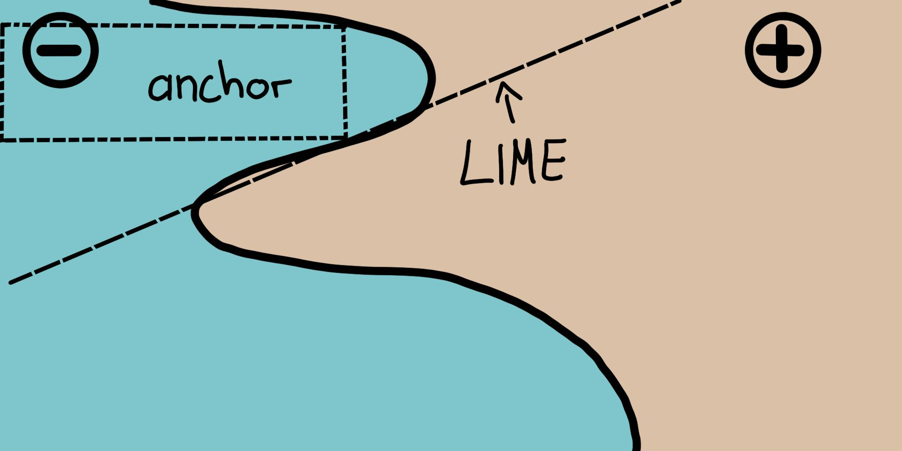

```{r, message = FALSE, warning = FALSE, echo = FALSE}
devtools::load_all()
set.seed(42)
```

<!--{pagebreak}-->

## Scoped Rules (Anchors) {#anchors}

*Authors: Tobias Goerke & Magdalena Lang*

`r if(is.html){only.in.html}`

Anchors explains individual predictions of any black-box classification model by finding a decision rule that "anchors" the prediction sufficiently.
A rule anchors a prediction if changes in other feature values do not affect the prediction.
Anchors utilizes reinforcement learning techniques in combination with a graph search algorithm to reduce the number of model calls (and hence the required runtime) to a minimum while still being able to recover from local optima. Ribeiro, Singh, and Guestrin proposed the algorithm in 2018[^Ribeiro2018Anchors] -- the same researchers that introduced the [LIME](#lime) algorithm. 

Like its predecessor, the anchors approach deploys a *perturbation-based* strategy to generate *local* explanations for predictions of black-box machine learning models. However, instead of surrogate models used by LIME, the resulting explanations are expressed as easy-to-understand *IF-THEN* rules, called *anchors*. These rules are reusable since they are *scoped*: anchors include the notion of coverage, stating precisely to which other, possibly unseen, instances they apply. Finding anchors involves an exploration or multi-armed bandit problem, which originates in the discipline of reinforcement learning. To this end, neighbors, or perturbations, are created and evaluated for every instance that is being explained. Doing so allows the approach to disregard the black-box’s structure and its internal parameters so that these can remain both unobserved and unaltered. Thus, the algorithm is *model-agnostic*, meaning it can be applied to **any** class of model.

In their paper, the authors compare both of their algorithms and visualize how differently these consult an instance's neighborhood to derive results. For this, the following figure depicts both LIME and anchors locally explaining a complex binary classifier (predicts either **-** or **+**) using two exemplary instances. LIME’s results do not indicate how faithful they are as LIME solely learns a linear decision boundary that best approximates the model given a perturbation space $D$. Given the same perturbation space, the anchors approach constructs explanations whose coverage is adapted to the model’s behavior and clearly express their boundaries. Thus, they are faithful by design and state exactly for which instances they are valid. This property makes anchors particularly intuitive and easy to comprehend.

```{r fig.cap="LIME vs. Anchors -- A Toy Visualization. Figure from Ribeiro, Singh, and Guestrin (2018).", out.width=350, fig.align="center"}

```

As mentioned before, the algorithm’s results or explanations come in the form of rules, called anchors. The following simple example illustrates such an anchor. For instance, suppose we are given a bivariate black-box model that predicts whether or not a passenger survives the Titanic disaster. Now we would like to know *why* the model predicts for one specific individual that it survives. The anchors algorithm provides a result explanation like the one shown below.


| Feature         | Value         |
| --------------- |:-------------:|
| Age             | 20            |
| Sex             | female        |
| Class           | first         |
| TicketPrice     | 300\$          |
| More attributes | ...           |
| **Survived**    | **true**      |

Table: one exemplary individual and the model's prediction

And the corresponding anchors explanation is:

IF `SEX = female`  
AND `Class = first`  
THEN PREDICT `Survived = true`  
WITH PRECISION `97%`  
AND COVERAGE `15%`  
 
The example shows how anchors can provide essential insights into a model's prediction and its underlying reasoning. The result shows which attributes were taken into account by the model, which in this case, is the female sex and first class. Humans, being paramount for correctness, can use this rule to validate the model's behavior. The anchor additionally tells us that it applies to 15\% of perturbation space's instances. In those cases the explanation is 97\% accurate, meaning the displayed predicates are almost exclusively responsible for the predicted outcome.

An anchor $A$ is formally defined as follows:

$$\mathbb{E}_{\mathcal{D}_x(z|A)}[1_{f(x)=f(z)}]\geq\tau,A(x)=1$$

Wherein:

+ $x$ represents the instance being explained (e.g., one row in a tabular data set).
+ $A$ is a set of predicates, i.e., the resulting rule or anchor, such that $A(x)=1$ when all feature predicates defined by $A$ correspond to $x$’s feature values.
+ $f$ denotes the classification model to be explained (e.g., an artificial neural network model). It can be queried to predict a label for $x$ and its perturbations.
+ $D_x (\cdot|A)$ indicates the distribution of neighbors of $x$, matching $A$.
+ $0 \leq \tau \leq 1$ specifies a precision threshold. Only rules that achieve a local fidelity of at least $\tau$ are considered a valid result.

The formal description may be intimidating and can be put in words:

> Given an instance $x$ to be explained, a rule or an anchor $A$ is to be found, such that it applies to $x$, while the same class as for $x$ gets predicted for a fraction of at least $\tau$ of $x$’s neighbors where the same $A$ is applicable. A rule’s precision results from evaluating neighbors or perturbations (following $D_x (z|A)$) using the provided machine learning model (denoted by the indicator function $1_{f(x) = f(z)}$).


### Finding Anchors


Although anchors’ mathematical description may seem clear and straightforward, constructing particular rules is infeasible. It would require evaluating $1_{f(x) = f(z)}$ for all $z \in \mathcal{D}_x(\cdot|A)$ which is not possible in continuous or large input spaces. Therefore, the authors propose to introduce the parameter $0 \leq \delta \leq 1$ to create a probabilistic definition. This way, samples are drawn until there is statistical confidence concerning their precision. The probabilistic definition reads as follows:

$$P(prec(A)\geq\tau)\geq{}1-\delta\quad\textrm{with}\quad{}prec(A)=\mathbb{E}_{\mathcal{D}_x(z|A)}[1_{f(x)=f(z)}]$$

The previous two definitions are combined and extended by the notion of coverage. Its rationale consists of finding rules that apply to a preferably large part of the model’s input space. Coverage is formally defined as an anchors' probability of applying to its neighbors, i.e., its perturbation space: 

$$cov(A)=\mathbb{E}_{\mathcal{D}_{(z)}[A(z)]}$$ 

Including this element leads to anchors' final definition taking into account the maximization of coverage:

$$\underset{A\:\textrm{s.t.}\;P(prec(A)\geq\tau)\geq{}1-\delta}{\textrm{max}}cov(A)$$

Thus, the proceeding strives for a rule that has the highest coverage among all eligible rules (all those that satisfy the precision threshold given the probabilistic definition). These rules are thought to be more important, as they describe a larger part of the model.
Note that rules with more predicates tend to have higher precision than rules with fewer predicates. In particular, a rule that fixes every feature of $x$ reduces the evaluated neighborhood to identical instances. Thus, the model classifies all neighbors equally, and the rule’s precision is $1$. At the same time, a rule that fixes many features is overly specific and only applicable to a few instances. Hence, there is a *trade-off between precision and coverage*.

The anchors approach uses four main components to find explanations, as is shown in the figure below.

**Candidate Generation**: Generates new explanation candidates. In the first round, one candidate per feature of $x$ gets created and fixes the respective value of possible perturbations. In every other round, the best candidates of the previous round are extended by one feature predicate that is not yet contained therein.

**Best Candidate Identification**: Candidate rules are to be compared in regard to which rule explains $x$ the best. To this end, perturbations that match the currently observed rule are created evaluated by calling the model. However, these calls need to be minimized as to limit computational overhead. This is why, at the core of this component, there is a pure-exploration Multi-Armed-Bandit (*MAB*; *KL-LUCB*[^KLLUCB], to be precise). MABs are used to efficiently explore and exploit different strategies (called arms in an analogy to slot machines) using sequential selection. In the given setting, each candidate rule is to be seen as an arm that can be pulled. Each time it is pulled, respective neighbors get evaluated, and we thereby obtain more information about the candidate rule's payoff (precision in anchors' case). The precision thus states how well the rule describes the instance to be explained.

**Candidate Precision Validation**: Takes more samples in case there is no statistical confidence yet that the candidate exceeds the $\tau$ threshold.

**Modified Beam Search**: All of the above components are assembled in a beam search, which is a graph search algorithm and a variant of the breadth-first algorithm. It carries the $B$ best candidates of each round over to the next one (where $B$ is called the *Beam Width*). These $B$ best rules are then used to create new rules. The beam search conducts at most $featureCount(x)$ rounds, as each feature can only be included in a rule at most once. Thus, at every round $i$, it generates candidates with exactly $i$ predicates and selects the B best thereof. Therefore, by setting $B$ high, the algorithm more likely avoids local optima. In turn, this requires a high number of model calls and thereby increases the computational load.

```{r fig.cap="The anchors algorithm’s components and their interrelations (simplified)", out.width=800}
knitr::include_graphics("images/anchors-process.jpg")
```

The approach is a seemingly perfect recipe for efficiently deriving statistically sound information about why any system classified an instance the way it did. It systematically experiments with the model’s input and concludes by observing respective outputs. It relies on well established and researched Machine Learning methods (MABs) to reduce the number of calls made to the model. This, in turn, drastically reduces the algorithm’s runtime.

### Complexity and Runtime

Knowing the anchors approach’s asymptotic runtime behavior helps to evaluate how well it is expected to perform on specific problems. Let $B$ denote the beam width and $p$ the number of all features. Then the anchors algorithm is subject to:

$$\mathcal{O}(B\cdot{}p^2+p^2\cdot\mathcal{O}_{\textrm{MAB}\lbrack{}B\cdot{}p,B\rbrack})$$

This boundary abstracts from problem-independent hyperparameters, such as the statistical confidence $\delta$. Ignoring hyperparameters helps reduce the boundary's complexity (see original paper for more info). Since the MAB extracts the $B$ best out of $B \cdot p$ candidates in each round, most MABs and their runtimes multiply the $p^2$ factor more than any other parameter.

It thus becomes apparent: the algorithm’s efficiency decreases with feature abundant problems.


### Tabular Data Example

Tabular data is structured data represented by tables, wherein columns embody features and rows instances. 
For instance, we use the [bike rental data](#bike-data) to demonstrate the anchors approach's potential to explain ML predictions for selected instances. For this, we turn the regression into a classification problem and train a random forest as our black-box model. It is to classify whether the number of rented bicycles lies above or below the trend line. 

Before creating anchor explanations, one needs to define a perturbation function. An easy way to do so is to use an intuitive default perturbation space for tabular explanation cases which can be built by sampling from, e.g., the training data. 
When perturbing an instance, this default approach maintains the features' values that are subject to the anchors' predicates, while replacing the non-fixed features with values taken from another randomly sampled instance with a specified probability. This process yields new instances that are similar to the explained one but have adopted some values from other random instances. Thus, they resemble neighbors.

```{r results='hide', cache=TRUE}
devtools::install_github("viadee/anchorsOnR")
library(anchors)
library(jsonlite)
library(BBmisc)
library(uuid)
library(magrittr)
set.seed(1)

colPal = c("#555555","#DFAD47","#7EBCA9", "#E5344E", "#681885", "#d25d97", "#fd3c46", "#ff9a39", "#6893bf", "#42c3a8")

load("../data/bike.RData")

bike$target = factor(resid(lm(cnt ~ days_since_2011, data = bike)) > 0, 
                     levels = c(FALSE, TRUE), labels = c('below', 'above'))
bike$cnt = NULL
# Make long factor levels shorter
levels(bike$weathersit)[levels(bike$weathersit)=="RAIN/SNOW/STORM"] <- "BAD"


bike.task = makeClassifTask(data = bike, target = "target")

mod = mlr::train(mlr::makeLearner(cl = 'classif.randomForest', 
                                  id = 'bike-rf'), bike.task)
```


```{r message=FALSE, cache=TRUE, fig.cap="Anchors explaining six instances of the bike rental dataset. Each row represents one explanation or anchor, and each bar depicts the feature predicates contained by it. The x-axis displays a rule's precision, and a bar's thickness corresponds to its coverage. The 'base' rule contains no predicates. These anchors show that the model mainly considers the temperature for predictions.", fig.height=10, fig.width=10}
bikeDisc = list(
  integer(),
  integer(),
  integer(),
  integer(),
  integer(),
  integer(),
  integer(),
  c(0, 7, 14, 21, 28),
  c(30, 60, 69, 92),
  c(5, 10, 15, 20, 25),
  integer()
)

bike.explainer = anchors(bike, mod, target = "target", bins = bikeDisc, tau = 0.9, batchSize = 1000, beams = 1)

bike.explained.instances = bike[c(40, 475, 610, 106, 200, 700),] 
bike.explanations = explain(bike.explained.instances, bike.explainer)

plotExplanations(bike.explanations, colPal = colPal)
```

The results are instinctively interpretable and show for each explained instance, which features are most important for the model's prediction. As the anchors only have a few predicates, they additionally have high coverage and hence apply to other cases.
The rules shown above were generated with $\tau = 0.9$. Thus, we ask for anchors whose evaluated perturbations faithfully support the label with an accuracy of at least $90\%$. Also, discretization was used to increase the expressiveness and applicability of numerical features. 

All of the previous rules were generated for instances where the model decides confidently based on a few features. However, other instances are not as distinctly classified by the model as more features are of importance. In such cases, anchors get more specific, comprise more features, and apply to fewer instances.

```{r message=FALSE, warning=FALSE, echo=FALSE, results='hide', cache=TRUE, fig.cap="Explaining instances near decision boundaries leads to specific rules comprising a higher number of feature predicates and lower coverage. Also, the empty rule, i.e., the base feature, gets less important. This can be interpreted as a signal for a decision boundary, as the instance is located in a volatile neighborhood.", fig.height=9, fig.width=10}
bike.explainer_edge = anchors(bike, mod, target = "target", tau = 1, batchSize = 1000, beams = 1, allowSuboptimalSteps = F)

bike.explained.instances_edge = bike[c(452, 300),] 
bike.explanations_edge = explain(bike.explained.instances_edge, bike.explainer_edge)

plotExplanations(bike.explanations_edge, colPal = colPal)
```


While choosing the default perturbation space is a comfortable choice to make, it may have a great impact on the algorithm and can thus lead to biased results. For example, if the train set is unbalanced (there is an unequal number of instances of each class), the perturbation space is as well. This condition further affects the rule-finding and the result's precision.

The [cervical cancer](#cervical) data set is an excellent example of this situation Applying the anchors algorithm leads to one of the following situations: 

+ Explaining instances labeled *healthy* yields empty rules as all generated neighbors evaluate to *healthy*.
+ Explanations for instances labeled *cancer* are overly specific, i.e., comprise many feature predicates, since the perturbation space mostly covers values from *healthy* instances.


```{r message=FALSE, warning=FALSE, echo=FALSE, results='hide', cache=TRUE}
set.seed(1)

load("../data/cervical.RData")
cervical.task = makeClassifTask(data = cervical, target = "Biopsy")
mod = mlr::train(mlr::makeLearner(cl = 'classif.randomForest', id = 'cervical-rf', 
                                  predict.type = 'prob'), cervical.task)
```


```{r message=FALSE, warning=FALSE, echo=FALSE, results='hide', cache=TRUE, fig.cap="Constructing anchors within unbalanced perturbation spaces leads to unexpressive results.", fig.height=10, fig.width=10}
cancer.explainer = anchors(cervical, mod, beams = 1)
cancer.explanation = explain(cervical[c(1,7),], cancer.explainer)
plotExplanations(cancer.explanation, colPal = colPal)
```

This outcome may be unwanted and can be approached in multiple ways. For example, a custom perturbation space can be defined that samples differently, e.g., from an unbalanced data set or a normal distribution. This, however, comes with a side-effect: the sampled neighbors are not representative and change the coverage's scope. Alternatively, we could modify the MAB's confidence $\delta$ and error parameter values $\epsilon$. This would cause the MAB to draw more samples, ultimately leading to the minority being sampled more often in absolute terms.  

For this example, we use a subset of the cervical cancer set in which the majority of cases are labeled *cancer*. We then have the framework to create a corresponding perturbation space from it. Perturbations are now more likely to lead to varying predictions, and the anchors algorithm can identify important features. However, one needs to take the coverage's definition into account: it is only defined within the perturbation space. In the previous examples, we used the train set as the perturbation space's basis. Since we only use a subset here, a high coverage does not necessarily indicate globally high rule importance. 

```{r message=FALSE, warning=FALSE, echo=FALSE, results='hide', cache=TRUE, fig.cap="Balancing the data set before constructing anchors shows the model's reasoning for decisions in minority cases.", fig.height=10, fig.width=11}
set.seed(1)

cervical.sampled.healthy <- cervical[sample(which(cervical$Biopsy == "Healthy"), 20), ]
cervical.balanced <- rbind(cervical[cervical$Biopsy == "Cancer", ], cervical.sampled.healthy)
table(cervical.balanced$Biopsy)

cancer.explainer.balanced = anchors(cervical.balanced, mod, tau = 1, beams = 2,
                                    delta = 0.05, epsilon = 0.05, batchSize = 1000,
                                    emptyRuleEvaluations = 1000)
cancer.explanation.balanced = explain(cervical.sampled.healthy[2:5,], cancer.explainer.balanced)
plotExplanations(cancer.explanation.balanced, colPal = colPal)
```


### Advantages

The anchors approach offers multiple advantages over LIME. First, the algorithm’s output is easier to understand, as rules are **easy to interpret** (even for laypersons).

Furthermore, **anchors are subsettable** and even state a measure of importance by including the notion of coverage. Second, the anchors approach **works when model predictions are non-linear or complex** in an instance’s neighborhood. As the approach deploys reinforcement learning techniques instead of fitting surrogate models, it is less likely to underfit the model.

Apart from that, the algorithm is **model-agnostic** and thus applicable to any model.

Furthermore, it is **highly efficient as it can be parallelized** by making use of MABs that support batch sampling (e.g., BatchSAR).

### Disadvantages

The algorithm suffers from a **highly configurable** and impactful setup, just like most perturbation-based explainers. Not only do hyperparameters such as the beam width or precision threshold need to be tuned to yield meaningful results but also does the perturbation function need to be explicitly designed for one domain/use-case. Think of how tabular data gets perturbed and think of how to apply the same concepts to image data (Hint: these cannot be applied). Luckily, default approaches may be used in some domains (e.g., tabular), facilitating an initial explanation setup.

Also, **many scenarios require discretization** as otherwise results are too specific, have low coverage, and do not contribute to understanding the model. While discretization can help, it may also blur decision boundaries if used carelessly and thus have the exact opposite effect. Since there is no best discretization technique, users need to be aware of the data before deciding on how to discretize data not to obtain poor results.

Constructing anchors requires **many calls to the ML model**, just like all perturbation-based explainers. While the algorithm deploys MABs to minimize the number of calls, its runtime still very much depends on the model’s performance and is therefore highly variable.

Lastly, the notion of **coverage is undefined in some domains**. For example, there is no obvious or universal definition of how superpixels in one image compare to such in other images.

### Software and Alternatives

There currently are two implementations available: [anchor, a Python package](https://github.com/marcotcr/anchor) (also integrated by [Alibi](https://github.com/SeldonIO/alibi)) and a [Java implementation](https://github.com/viadee/javaAnchorExplainer). The former is the anchors algorithm's authors' reference and the latter a high-performance implementation which comes with an R interface, called [anchorsOnR](https://github.com/viadee/anchorsOnR), which was used for the examples in this chapter. As of now, anchorsOnR supports tabular data only. However, anchors may theoretically be constructed for any domain or type of data.

[^Ribeiro2018Anchors]: Marco Tulio Ribeiro, Sameer Singh, Carlos Guestrin. "Anchors: High-Precision Model-Agnostic Explanations." AAAI Conference on Artificial Intelligence (AAAI), 2018

[^KLLUCB]: Emilie Kaufmann and Shivaram Kalyanakrishnan. “Information Complexity in Bandit Subset Selection”. Proceedings of Machine Learning Research (2013).
