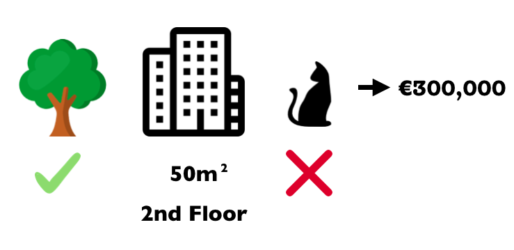
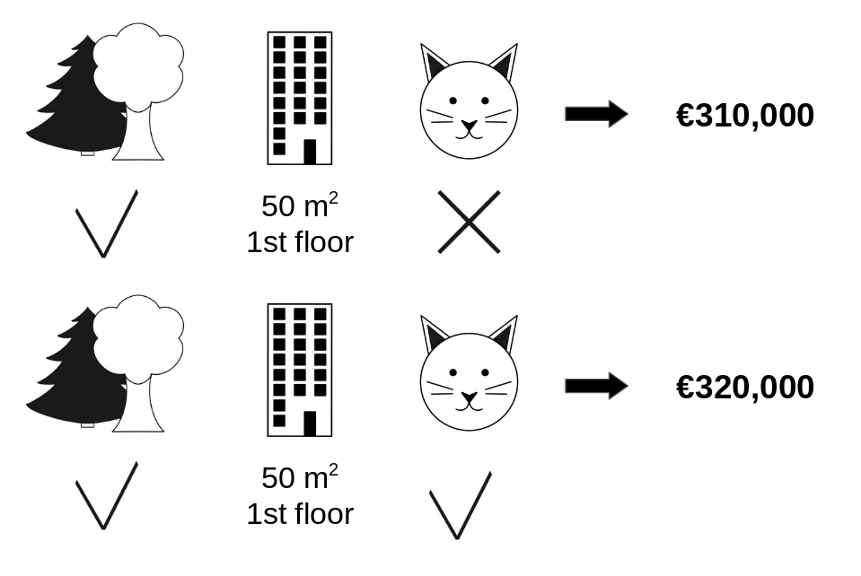
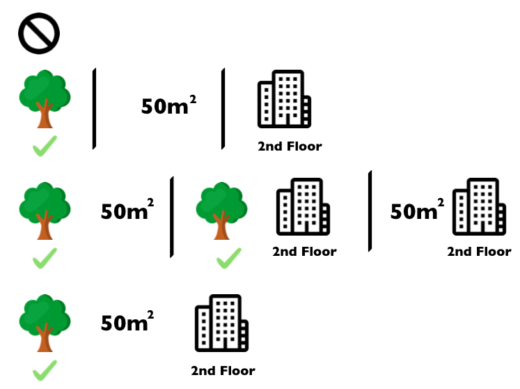

```{r, message = FALSE, warning = FALSE, echo = FALSE}


devtools::load_all()
set.seed(42)
```

<!--{pagebreak}-->

## Shapley Values {#shapley}

Sebuah prediksi dapat dijelaskan dengan mengasumsikan bahwa setiap nilai fitur dari instance adalah "players" dalam game di mana prediksi adalah payout.
Nilai Shapley -- sebuah metode dari coalitional game theory -- memberi tahu kita cara mendistribusikan "payout" secara adil di antara fitur-fiturnya.

```{block2, type = "rmdnote", echo = TRUE}
Interested in an in-depth, hands-on course on SHAP and Shapley values?
Head over to [the Shapley course page](https://leanpub.com/c/shapley-xai) and get notified once the course is available.
```


### General Idea

Asumsikan skenario berikut:

Anda telah melatih model machine learning untuk memprediksi harga apartemen.
Untuk apartemen tertentu, prediksinya €300.000 dan Anda perlu menjelaskan prediksi ini.
Apartemen memiliki luas 50 m^2^, terletak di lantai 2, memiliki taman di dekatnya dan kucing dilarang:

```{r shapley-instance, fig.cap = "The predicted price for a 50 m^2^ 2nd floor apartment with a nearby park and cat ban is €300,000. Our goal is to explain how each of these feature values contributed to the prediction.", out.width=500}

```

Prediksi rata-rata untuk semua apartemen adalah €310.000.
Seberapa besar kontribusi setiap nilai fitur terhadap prediksi dibandingkan dengan prediksi rata-rata?

Jawabannya sederhana untuk model linear regression.
Pengaruh masing-masing fitur adalah bobot fitur dikalikan nilai fitur.
Ini hanya bekerja karena linearitas model.
Untuk model yang lebih kompleks, kita membutuhkan solusi yang berbeda.
Misalnya, [LIME](#lime) menyarankan model lokal untuk memperkirakan efek.
Solusi lain datang dari cooperative game theory:
Nilai Shapley, diciptakan oleh Shapley (1953)[^shapley1953], adalah metode untuk menetapkan payout kepada players tergantung pada kontribusi mereka terhadap total payout.
players bekerja sama dalam koalisi dan menerima keuntungan tertentu dari kerja sama ini.

Players?
Game?
Payout?
Apa hubungannya dengan prediksi dan kemampuan interpretasi machine learning?
"game" adalah tugas prediksi untuk satu instance dari kumpulan data.
"Keuntungan" adalah prediksi aktual untuk instance ini dikurangi prediksi rata-rata untuk semua instance.
"players" adalah nilai fitur dari instance yang berkolaborasi untuk menerima keuntungan (= memprediksi nilai tertentu).
Dalam contoh apartemen kami, nilai fitur `park-nearby`, `cat-banned`, `area-50` dan `floor-2nd` bekerja sama untuk mencapai prediksi €300.000.
Tujuan kami adalah menjelaskan perbedaan antara prediksi aktual (€300.000) dan prediksi rata-rata (€310.000): selisih -€10.000.

Jawabannya bisa jadi:
`park-nearby` menyumbang €30.000; `area-50` menyumbang €10.000; `lantai-2` menyumbang €0; kontribusi `cat-banned` - €50.000.
Kontribusi bertambah hingga -€10.000, prediksi akhir dikurangi prediksi harga apartemen rata-rata.

**Bagaimana cara menghitung nilai Shapley untuk satu fitur?**

Nilai Shapley adalah kontribusi marjinal rata-rata dari nilai fitur di semua kemungkinan koalisi.
Semua jelas sekarang?

Pada gambar berikut, kami mengevaluasi kontribusi nilai fitur `cat-banned` ketika ditambahkan ke koalisi `park-nearby` dan `area-50`.
Kami mensimulasikan bahwa hanya `park-nearby`, `cat-banned` dan `area-50` yang berada dalam koalisi dengan menggambar apartemen lain secara acak dari data dan menggunakan nilainya untuk fitur lantai.
Nilai `floor-2nd` digantikan oleh `floor-1st` yang diambil secara acak.
Kemudian kami memprediksi harga apartemen dengan kombinasi ini (€310.000).
Pada langkah kedua, kami menghapus `cat-banned` dari koalisi dengan menggantinya dengan nilai acak dari fitur cat diperbolehkan/dilarang dari apartemen yang diambil secara acak.
Dalam contoh itu `cat-allowed`, tapi bisa saja `cat-banned` lagi.
Kami memprediksi harga apartemen untuk koalisi `park-nearby` dan `area-50` (€320.000).
Kontribusi `cat-banned` adalah €310.000 - €320.000 = -€10.000.
Perkiraan ini tergantung pada nilai apartemen yang diambil secara acak yang berfungsi sebagai "donor" untuk nilai fitur cat dan lantai.
Kami akan mendapatkan perkiraan yang lebih baik jika kami mengulangi langkah pengambilan sampel ini dan membuat rata-rata kontribusi.


```{r shapley-instance-intervened, fig.cap = "One sample repetition to estimate the contribution of `cat-banned` to the prediction when added to the coalition of `park-nearby` and `area-50`.", out.width=500}

```

Kami ulangi perhitungan ini untuk semua kemungkinan koalisi.
Nilai Shapley adalah rata-rata dari semua kontribusi marjinal untuk semua kemungkinan koalisi.
Waktu komputasi meningkat secara eksponensial dengan jumlah fitur.
Salah satu solusi untuk menjaga agar waktu komputasi dapat dikelola adalah dengan menghitung kontribusi hanya untuk beberapa sampel dari kemungkinan koalisi.

Gambar berikut menunjukkan semua koalisi nilai fitur yang diperlukan untuk menentukan nilai Shapley untuk `cat-banned`.
Baris pertama menunjukkan koalisi tanpa nilai fitur apa pun.
Baris kedua, ketiga dan keempat menunjukkan koalisi yang berbeda dengan ukuran koalisi yang semakin besar, dipisahkan dengan tanda "|".
Secara keseluruhan, koalisi berikut dimungkinkan:

- `No feature values`
- `park-nearby`
- `area-50`
- `floor-2nd`
- `park-nearby`+`area-50`
- `park-nearby`+`floor-2nd`
- `area-50`+`floor-2nd`
- `park-nearby`+`area-50`+`floor-2nd`.

Untuk setiap koalisi ini, kami menghitung prediksi harga apartemen dengan dan tanpa nilai fitur `cat-banned` dan mengambil selisihnya untuk mendapatkan kontribusi marjinal.
Nilai Shapley adalah rata-rata (tertimbang) dari kontribusi marjinal.
Kami mengganti nilai fitur dari fitur yang tidak berkoalisi dengan nilai fitur acak dari dataset apartemen untuk mendapatkan prediksi dari model machine learning.


```{r shapley-coalitions, fig.cap = "All 8 coalitions needed for computing the exact Shapley value of the `cat-banned` feature value.", out.width=500}

```

Jika kami memperkirakan nilai Shapley untuk semua nilai fitur, kami mendapatkan distribusi prediksi yang lengkap (dikurangi rata-rata) di antara nilai fitur.

### Examples and Interpretation

Interpretasi nilai Shapley untuk nilai fitur j adalah:
Nilai fitur ke-j berkontribusi $\phi_j$ pada prediksi instance khusus ini dibandingkan dengan prediksi rata-rata untuk kumpulan data.

Nilai Shapley berfungsi untuk klasifikasi (jika kita berurusan dengan probabilitas) dan regresi.

Kami menggunakan nilai Shapley untuk menganalisis prediksi model random forest yang memprediksi [kanker serviks](#cervical):

```{r shapley-cervical-prepare}
data("cervical")
library("caret")
library("iml")


ntree = 30
cervical.x = cervical[names(cervical) != 'Biopsy']

model <- caret::train(cervical.x,
               cervical$Biopsy,
               method = 'rf', ntree=ntree, maximise = FALSE)
predictor = Predictor$new(model, class = "Cancer", data = cervical.x, type = "prob")

instance_indices = 326
x.interest = cervical.x[instance_indices,]

avg.prediction = mean(predict(model, type = 'prob')[,'Cancer'])
actual.prediction = predict(model, newdata = x.interest, type = 'prob')['Cancer']
diff.prediction = actual.prediction - avg.prediction
```


```{r shapley-cervical-plot, fig.cap = sprintf("Shapley values for a woman in the cervical cancer dataset. With a prediction of %.2f, this woman's cancer probability is %.2f above the average prediction of %.2f. The number of diagnosed STDs increased the probability the most. The sum of contributions yields the difference between actual and average prediction (%.2f).", actual.prediction,diff.prediction, avg.prediction, diff.prediction)}
shapley2 = Shapley$new(predictor, x.interest = x.interest, sample.size = 100)
plot(shapley2) +
  scale_y_continuous("Feature value contribution") +
  ggtitle(sprintf("Actual prediction: %.2f\nAverage prediction: %.2f\nDifference: %.2f", actual.prediction, avg.prediction, diff.prediction)) +
 scale_x_discrete("")
```


Untuk [set data sewa sepeda](#bike-data), kami juga melatih random forest untuk memprediksi jumlah sepeda sewaan dalam sehari, berdasarkan informasi cuaca dan kalender.
Penjelasan yang dibuat untuk prediksi random forest pada hari tertentu:

```{r shapley-bike-prepare}
data("bike")
ntree = 30
bike.train.x = bike[names(bike) != 'cnt']

model <- caret::train(bike.train.x,
               bike$cnt,
               method = 'rf', ntree=ntree, maximise = FALSE)
predictor = Predictor$new(model, data = bike.train.x)

instance_indices = c(295, 285)

avg.prediction = mean(predict(model))
actual.prediction = predict(model, newdata = bike.train.x[instance_indices[2],])
diff.prediction = actual.prediction - avg.prediction
x.interest = bike.train.x[instance_indices[2],]
```


```{r shapley-bike-plot, fig.cap = sprintf("Shapley values for day %i. With a predicted %.0f rental bikes, this day is %.0f below the average prediction of %.0f. The weather situation and humidity had the largest negative contributions. The temperature on this day had a positive contribution. The sum of Shapley values yields the difference of actual and average prediction (%.0f).", instance_indices[2], actual.prediction, diff.prediction, avg.prediction, diff.prediction)}
shapley2 = Shapley$new(predictor, x.interest = x.interest)
plot(shapley2) +  scale_y_continuous("Feature value contribution") +
  ggtitle(sprintf("Actual prediction: %.0f\nAverage prediction: %.0f\nDifference: %.0f", actual.prediction, avg.prediction, diff.prediction))  +
 scale_x_discrete("")
```


Berhati-hatilah untuk menginterpretasikan nilai Shapley dengan benar:
Nilai Shapley adalah kontribusi rata-rata dari nilai fitur untuk prediksi dalam koalisi yang berbeda.
Nilai Shapley BUKAN perbedaan dalam prediksi ketika kami akan menghapus fitur dari model.


### The Shapley Value in Detail

Bagian ini membahas lebih dalam definisi dan perhitungan nilai Shapley untuk pembaca yang penasaran.
Lewati bagian ini dan langsung ke "Keuntungan dan Kerugian" jika Anda tidak tertarik dengan detail teknisnya.

Kami tertarik pada bagaimana setiap fitur memengaruhi prediksi titik data.
Dalam model linier mudah untuk menghitung efek individu.
Berikut adalah seperti apa prediksi model linier untuk satu contoh data:

$$\hat{f}(x)=\beta_0+\beta_{1}x_{1}+\ldots+\beta_{p}x_{p}$$

di mana x adalah contoh yang ingin kita hitung kontribusinya.
Setiap $x_j$ adalah nilai fitur, dengan j = 1,...,p.
$\beta_j$ adalah bobot yang sesuai dengan fitur j.

Kontribusi $\phi_j$ dari fitur ke-j pada prediksi $\hat{f}(x)$ adalah:

$$\phi_j(\hat{f})=\beta_{j}x_j-E(\beta_{j}X_{j})=\beta_{j}x_j-\beta_{j}E(X_{j})$$

di mana $E(\beta_jX_{j})$ adalah estimasi efek rata-rata untuk fitur j.
Kontribusi adalah selisih antara efek fitur dikurangi efek rata-rata.
Bagus!
Sekarang kita tahu seberapa besar kontribusi setiap fitur terhadap prediksi.
Jika kita menjumlahkan semua feature contribution untuk satu instance, hasilnya adalah sebagai berikut:

$$\begin{align*}\sum_{j=1}^{p}\phi_j(\hat{f})=&\sum_{j=1}^p(\beta_{j}x_j-E(\beta_{j}X_{j}))\\=&(\beta_0+\sum_{j=1}^p\beta_{j}x_j)-(\beta_0+\sum_{j=1}^{p}E(\beta_{j}X_{j}))\\=&\hat{f}(x)-E(\hat{f}(X))\end{align*}$$

Ini adalah nilai prediksi untuk titik data x dikurangi nilai prediksi rata-rata.
feature contribution bisa negatif.

Bisakah kita melakukan hal yang sama untuk semua jenis model?
Akan sangat bagus untuk memiliki ini sebagai alat model-agnostic.
Karena kami biasanya tidak memiliki bobot yang sama pada tipe model lain, kami membutuhkan solusi yang berbeda.

Bantuan datang dari tempat yang tidak terduga: cooperative game theory.
Nilai Shapley adalah solusi untuk menghitung feature contribution untuk prediksi tunggal untuk model machine learning apa pun.


#### The Shapley Value

Nilai Shapley didefinisikan melalui nilai fungsi val players di S.

Nilai Shapley dari nilai fitur adalah kontribusinya terhadap payout, dibobot dan dijumlahkan atas semua kemungkinan kombinasi nilai fitur:

$$\phi_j(val)=\sum_{S\subseteq\{x_{1},\ldots,x_{p}\}\setminus\{x_j\}}\frac{|S|!\left(p-|S|-1\right)!}{p!}\left(val\left(S\cup\{x_j\}\right)-val(S)\right)$$

di mana S adalah subset dari fitur yang digunakan dalam model, x adalah vektor nilai fitur dari instance yang akan dijelaskan dan p jumlah fitur.
$val_x(S)$ adalah prediksi untuk nilai fitur di set S yang terpinggirkan dari fitur yang tidak termasuk dalam set S:

$$val_{x}(S)=\int\hat{f}(x_{1},\ldots,x_{p})d\mathbb{P}_{x\notin{}S}-E_X(\hat{f}(X))$$

Anda benar-benar melakukan beberapa integrasi untuk setiap fitur yang tidak mengandung S.
Contoh konkrit:
Model machine learning bekerja dengan 4 fitur x1, x2, x3 dan x4 dan kami mengevaluasi prediksi untuk koalisi S yang terdiri dari nilai fitur x1 dan x3:

$$val_{x}(S)=val_{x}(\{x_{1},x_{3}\})=\int_{\mathbb{R}}\int_{\mathbb{R}}\hat{f}(x_{1},X_{2},x_{3},X_{4})d\mathbb{P}_{X_2X_4}-E_X(\hat{f}(X))$$

Ini terlihat mirip dengan feature contribution dalam model linier!

Jangan bingung dengan banyaknya penggunaan kata "nilai":
Nilai fitur adalah nilai numerik atau kategoris dari fitur dan instance;
nilai Shapley adalah feature contribution pada prediksi;
fungsi nilai adalah fungsi payout untuk koalisi players (nilai fitur).

Nilai Shapley adalah satu-satunya metode atribusi yang memenuhi properti **Efficiency**, **Symmetry**, **Dummy**, dan **Additivity**, yang bersama-sama dapat dianggap sebagai definisi payout yang adil.

**Efisiensi**
feature contribution harus menambahkan hingga perbedaan prediksi untuk x dan rata-rata.

$$\sum\nolimits_{j=1}^p\phi_j=\hat{f}(x)-E_X(\hat{f}(X))$$

**Simetri**
Kontribusi dari dua nilai fitur j dan k harus sama jika mereka berkontribusi sama untuk semua kemungkinan koalisi.
Jika

$$val(S\cup\{x_j\})=val(S\cup\{x_k\})$$

untuk semua

$$S\subseteq\{x_{1},\ldots,x_{p}\}\setminus\{x_j,x_k\}$$

kemudian

$$\phi_j=\phi_{k}$$

**Dummy**
Fitur j yang tidak mengubah p-valuerediksi -- terlepas dari gabungan nilai fitur mana yang ditambahkan -- harus memiliki nilai Shapley 0.
Jika

$$val(S\cup\{x_j\})=val(S)$$

untuk semua

$$S\subseteq\{x_{1},\ldots,x_{p}\}$$

kemudian

$$\phi_j=0$$

**Kelebihan**
Untuk game dengan payout gabungan val+val^+^ nilai Shapley masing-masing adalah sebagai berikut:

$$\phi_j+\phi_j^{+}$$

Misalkan Anda melatih random forest, yang berarti bahwa prediksi adalah rata-rata dari banyak decision trees.
Properti Additivity menjamin bahwa untuk nilai fitur, Anda dapat menghitung nilai Shapley untuk setiap pohon secara individual, membuat rata-ratanya, dan mendapatkan nilai Shapley untuk nilai fitur untuk random forest.

#### Intuition

Cara intuitif untuk memahami nilai Shapley adalah ilustrasi berikut:
Nilai fitur memasuki ruangan dalam urutan acak.
Semua nilai fitur di ruang berpartisipasi dalam game (= berkontribusi pada prediksi).
Nilai Shapley dari nilai fitur adalah perubahan rata-rata dalam prediksi yang diterima koalisi yang sudah ada di ruangan saat nilai fitur bergabung dengan mereka.


#### Estimating the Shapley Value

Semua kemungkinan koalisi (set) nilai fitur harus dievaluasi dengan dan tanpa fitur ke-j untuk menghitung nilai Shapley yang tepat.
Untuk lebih dari beberapa fitur, solusi yang tepat untuk masalah ini menjadi bermasalah karena jumlah kemungkinan koalisi meningkat secara eksponensial karena lebih banyak fitur ditambahkan.
Strumbelj dkk. (2014)[^strumbelj2014] mengusulkan pendekatan dengan pengambilan sampel Monte-Carlo:

$$\hat{\phi}_{j}=\frac{1}{M}\sum_{m=1}^M\left(\hat{f}(x^{m}_{+j})-\hat{f}(x^{m}_{-j})\right)$$

di mana $\hat{f}(x^{m}_{+j})$ adalah prediksi untuk x, tetapi dengan sejumlah nilai fitur acak diganti dengan nilai fitur dari titik data acak z, kecuali untuk nilai masing-masing dari fitur j.
Vektor-x $x^{m}_{-j}$ hampir identik dengan $x^{m}_{+j}$, tetapi nilai $x_j^{m}$ juga diambil dari z sampel .
Masing-masing dari M instance baru ini adalah sejenis "Monster Frankenstein" yang dikumpulkan dari dua instance.

**Perkiraan estimasi Shapley untuk nilai fitur tunggal**:

- Output: Nilai Shapley untuk nilai fitur ke-j
- Wajib: Jumlah iterasi M, instance of interest x, indeks fitur j, matriks data X, dan model machine learning f
  - Untuk semua m = 1,...,M:
    - Gambarkan instance acak z dari matriks data X
    - Pilih permutasi acak dari nilai fitur
    - Contoh pesanan x: $x_o=(x_{(1)},\ldots,x_{(j)},\ldots,x_{(p)})$
    - Memesan instance z: $z_o=(z_{(1)},\ldots,z_{(j)},\ldots,z_{(p)})$
    - Bangun dua instance baru
        - Dengan fitur j: $x_{+j}=(x_{(1)},\ldots,x_{(j-1)},x_{(j)},z_{(j+1)},\ldots ,z_{(p)})$
        - Tanpa fitur j: $x_{-j}=(x_{(1)},\ldots,x_{(j-1)},z_{(j)},z_{(j+1)},\ldots ,z_{(p)})$
    - Hitung kontribusi marjinal: $\phi_j^{m}=\hat{f}(x_{+j})-\hat{f}(x_{-j})$
- Hitung nilai Shapley sebagai rata-rata: $\phi_j(x)=\frac{1}{M}\sum_{m=1}^M\phi_j^{m}$

Pertama, pilih instance yang menarik x, fitur j dan jumlah iterasi M.
Untuk setiap iterasi, instance acak z dipilih dari data dan urutan fitur secara acak dihasilkan.
Dua instance baru dibuat dengan menggabungkan nilai dari instance yang diinginkan x dan sampel z.
Instance $x_{+j}$ adalah instance yang diinginkan, tetapi semua nilai dalam urutan setelah fitur j diganti dengan nilai fitur dari sampel z.
Instance $x_{-j}$ sama dengan $x_{+j}$, tetapi selain itu fitur j diganti dengan nilai fitur j dari sampel z.
Perbedaan prediksi dari black box dihitung:

$$\phi_j^{m}=\hat{f}(x^m_{+j})-\hat{f}(x^m_{-j})$$

Semua perbedaan ini dirata-ratakan dan menghasilkan:

$$\phi_j(x)=\frac{1}{M}\sum_{m=1}^M\phi_j^{m}$$

Rata-rata secara implisit menimbang sampel dengan distribusi probabilitas X.

Prosedur harus diulang untuk setiap fitur untuk mendapatkan semua nilai Shapley.

### Advantages

Perbedaan antara prediksi dan prediksi rata-rata **tersebar adil** di antara nilai fitur instance -- properti Efficiency dari nilai Shapley.
Properti ini membedakan nilai Shapley dari metode lain seperti [LIME](#lime).
LIME tidak menjamin bahwa prediksi didistribusikan secara adil di antara fitur-fitur.
Nilai Shapley mungkin satu-satunya metode untuk memberikan penjelasan lengkap.
Dalam situasi di mana hukum memerlukan penjelasan -- seperti "hak atas penjelasan" UE -- nilai Shapley mungkin merupakan satu-satunya metode yang sesuai secara hukum, karena didasarkan pada teori yang kuat dan mendistribusikan efeknya secara adil.
Saya bukan pengacara, jadi ini hanya mencerminkan intuisi saya tentang persyaratan.

Nilai Shapley memungkinkan **penjelasan kontrastif**.
Alih-alih membandingkan prediksi dengan prediksi rata-rata seluruh kumpulan data, Anda dapat membandingkannya dengan subset atau bahkan dengan satu titik data.
Kontrastivitas ini juga sesuatu yang tidak dimiliki model lokal seperti LIME.

Nilai Shapley adalah satu-satunya metode penjelasan dengan **teori yang solid**.
Aksioma -- efisiensi, simetri, dummy, aditif -- memberikan penjelasan dasar yang masuk akal.
Metode seperti LIME mengasumsikan perilaku linier model machine learning secara lokal, tetapi tidak ada teori mengapa ini harus berhasil.

Sangat menakjubkan untuk **menjelaskan prediksi sebagai game** yang dimainkan oleh nilai fitur.


### Disadvantages

Nilai Shapley membutuhkan **banyak waktu komputasi**.
Dalam 99,9% masalah dunia nyata, hanya solusi perkiraan yang layak.
Perhitungan yang tepat dari nilai Shapley secara komputasi mahal karena ada 2^k^ kemungkinan koalisi nilai fitur dan "tidak adanya" fitur harus disimulasikan dengan menggambar instance acak, yang meningkatkan varians untuk estimasi Shapley estimasi nilai.
Jumlah eksponensial koalisi ditangani dengan sampling koalisi dan membatasi jumlah iterasi M.
Penurunan M mengurangi waktu komputasi, tetapi meningkatkan varians dari nilai Shapley.
Tidak ada aturan praktis yang baik untuk jumlah iterasi M.
M harus cukup besar untuk memperkirakan nilai Shapley secara akurat, tetapi cukup kecil untuk menyelesaikan perhitungan dalam waktu yang wajar.
Seharusnya dimungkinkan untuk memilih M berdasarkan batas Chernoff, tetapi saya belum melihat makalah apa pun tentang melakukan ini untuk nilai Shapley untuk prediksi machine learning.

Nilai Shapley **dapat disalahartikan**.
Nilai Shapley dari sebuah nilai fitur bukanlah selisih dari nilai prediksi setelah fitur tersebut dikeluarkan dari pelatihan model.
Interpretasi dari nilai Shapley adalah:
Mengingat kumpulan nilai fitur saat ini, kontribusi nilai fitur terhadap perbedaan antara prediksi aktual dan prediksi rata-rata adalah nilai Shapley yang diperkirakan.

Nilai Shapley adalah metode penjelasan yang salah jika Anda mencari penjelasan yang jarang (penjelasan yang mengandung sedikit fitur).
Penjelasan dibuat dengan metode nilai Shapley **selalu gunakan semua fitur**.
Manusia lebih menyukai penjelasan selektif, seperti yang dihasilkan oleh LIME.
LIME mungkin merupakan pilihan yang lebih baik untuk penjelasan yang harus dihadapi orang awam.
Solusi lain adalah [SHAP](https://github.com/slundberg/shap) yang diperkenalkan oleh Lundberg dan Lee (2016)[^lundberg2016], yang didasarkan pada nilai Shapley, tetapi juga dapat memberikan penjelasan dengan beberapa fitur.

Nilai Shapley mengembalikan nilai sederhana per fitur, tetapi **tidak ada model prediksi** seperti LIME.
Ini berarti tidak dapat digunakan untuk membuat pernyataan tentang perubahan prediksi untuk perubahan input, seperti:
"Jika saya mendapatkan €300 lebih setahun, skor kredit saya akan meningkat 5 poin."

Kerugian lainnya adalah **Anda memerlukan akses ke data** jika Anda ingin menghitung nilai Shapley untuk instance data baru.
Tidaklah cukup untuk mengakses fungsi prediksi karena Anda memerlukan data untuk mengganti bagian dari instance yang diinginkan dengan nilai dari instance data yang diambil secara acak.
Ini hanya dapat dihindari jika Anda dapat membuat instans data yang terlihat seperti instans data nyata tetapi bukan instans aktual dari data pelatihan.

Seperti banyak metode interpretasi berbasis permutasi lainnya, metode nilai Shapley mengalami **penyertaan instance data yang tidak realistis** ketika fitur dikorelasikan.
Untuk mensimulasikan bahwa nilai fitur hilang dari koalisi, kami meminggirkan fitur tersebut.
Ini dicapai dengan mengambil sampel nilai dari distribusi marjinal fitur.
Ini baik-baik saja selama fitur-fiturnya independen.
Ketika fitur bergantung, maka kami mungkin mengambil sampel nilai fitur yang tidak masuk akal untuk instance ini.
Tapi kami akan menggunakannya untuk menghitung nilai fitur Shapley.
Salah satu solusi mungkin untuk mengubah fitur yang berkorelasi bersama-sama dan mendapatkan satu nilai Shapley yang saling menguntungkan untuk mereka.
Adaptasi lainnya adalah conditional sampling: Fitur disampel bersyarat pada fitur yang sudah ada dalam tim.
Sementara pengambilan sampel bersyarat memperbaiki masalah titik data yang tidak realistis, masalah baru diperkenalkan:
Nilai yang dihasilkan bukan lagi nilai Shapley untuk game kita, karena melanggar aksioma simetri, seperti yang ditemukan oleh Sundararajan et. al (2019)[^cond1] dan dibahas lebih lanjut oleh Janzing et. al (2020)[^cond2].


### Software and Alternatives

Nilai Shapley diimplementasikan dalam paket `iml` dan [fastshap](https://github.com/bgreenwell/fastshap) untuk R.

SHAP, metode estimasi alternatif untuk nilai Shapley, disajikan di [bab berikutnya](#shap).

Pendekatan lain disebut breakDown, yang diimplementasikan dalam paket `breakDown` R[^breakdown].
BreakDown juga menunjukkan kontribusi setiap fitur pada prediksi, tetapi menghitungnya selangkah demi selangkah.
Mari kita gunakan kembali analogi game:
Kami mulai dengan tim kosong, menambahkan nilai fitur yang akan berkontribusi paling besar pada prediksi dan mengulangi hingga semua nilai fitur ditambahkan.
Seberapa besar kontribusi setiap nilai fitur tergantung pada nilai fitur masing-masing yang sudah ada di "tim", yang merupakan kelemahan besar dari metode breakDown.
Ini lebih cepat daripada metode nilai Shapley, dan untuk model tanpa interaksi, hasilnya sama.


[^shapley1953]: Shapley, Lloyd S. "A value for n-person games." Contributions to the Theory of Games 2.28 (1953): 307-317.

[^strumbelj2014]: Štrumbelj, Erik, and Igor Kononenko. "Explaining prediction models and individual predictions with feature contributions." Knowledge and information systems 41.3 (2014): 647-665.

[^breakdown]: Staniak, Mateusz, and Przemyslaw Biecek. "Explanations of model predictions with live and breakDown packages." arXiv preprint arXiv:1804.01955 (2018).

[^lundberg2016]: Lundberg, Scott M., and Su-In Lee. "A unified approach to interpreting model predictions." Advances in Neural Information Processing Systems. 2017.


[^cond1]: Sundararajan, Mukund, and Amir Najmi. "The many Shapley values for model explanation." arXiv preprint arXiv:1908.08474 (2019).

[^cond2]: Janzing, Dominik, Lenon Minorics, and Patrick Blöbaum. "Feature relevance quantification in explainable AI: A causal problem." International Conference on Artificial Intelligence and Statistics. PMLR, 2020.
