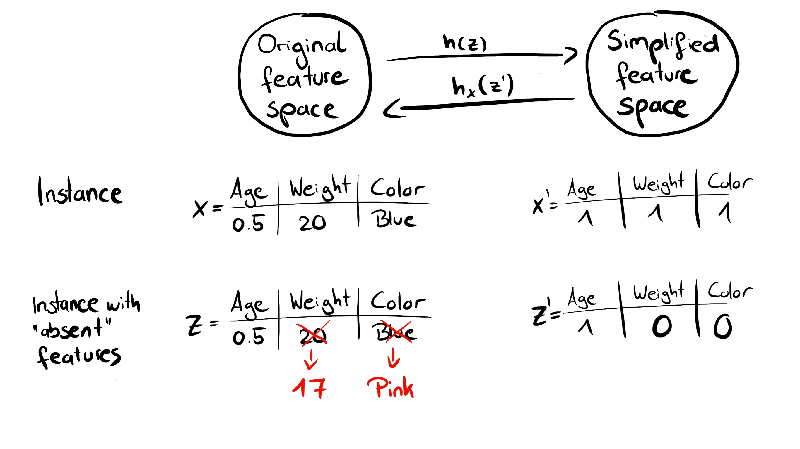
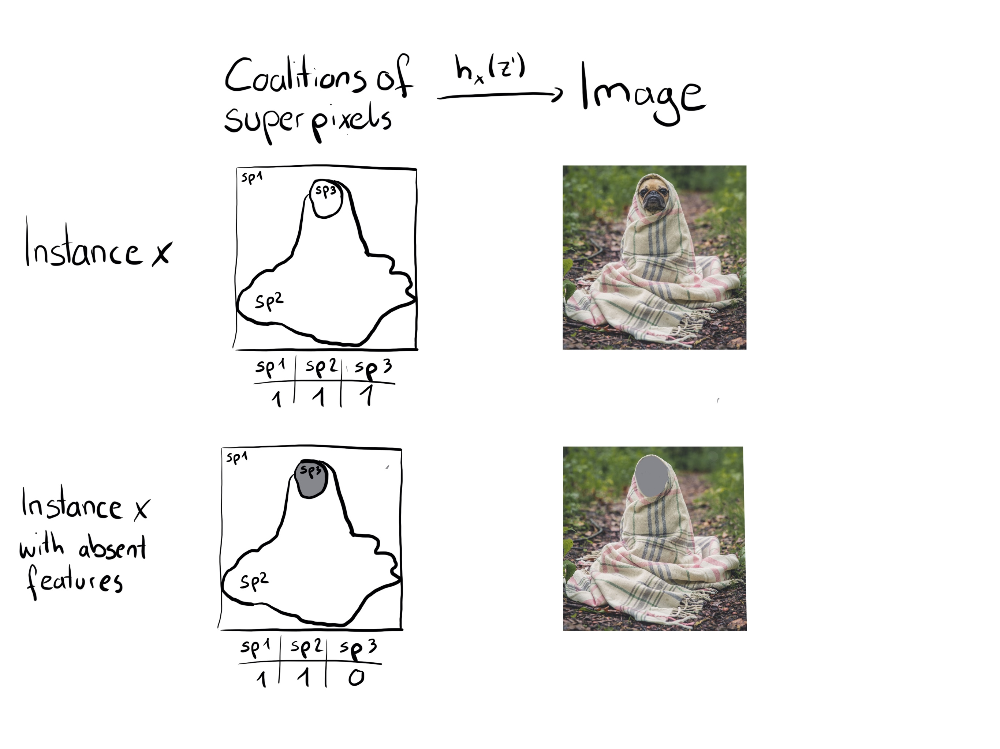
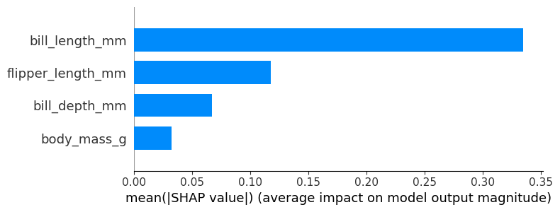
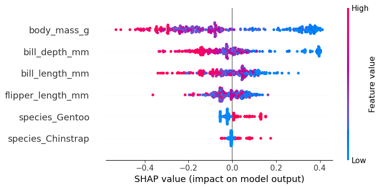
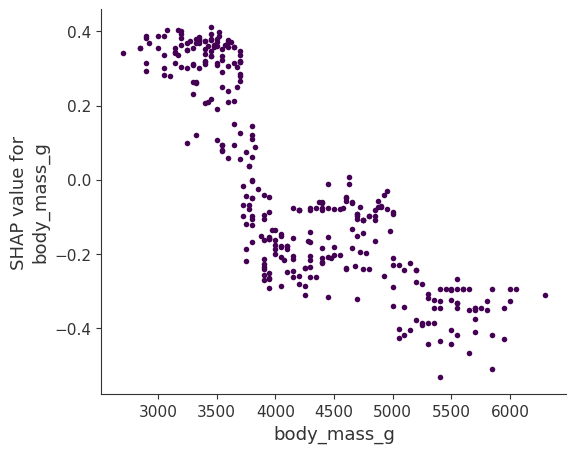
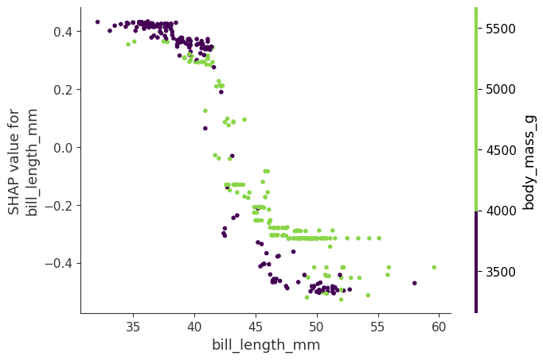
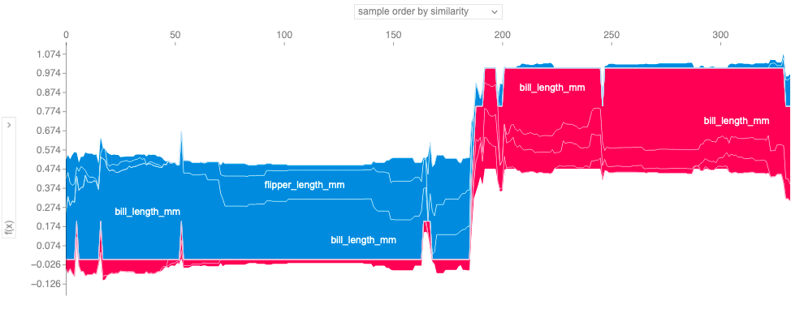

```{r, message = FALSE, warning = FALSE, echo = FALSE}
devtools::load_all()
set.seed(42)
```

<!--{pagebreak}-->

## SHAP (SHapley Additive exPlanations) {#shap}

`r if(is.html){only.in.html}`

SHAP (SHapley Additive exPlanations) oleh Lundberg and Lee (2016)[^lundberg2016] adalah metode untuk menjelaskan prediksi individu.
SHAP didasarkan pada game yang secara teoritis optimal [Nilai Shapley](#shapley).

Ada dua alasan mengapa SHAP mendapatkan babnya sendiri dan bukan merupakan subbab dari [nilai Shapley](#shapley).
Pertama, penulis SHAP mengusulkan KernelSHAP, pendekatan estimasi alternatif berbasis kernel untuk nilai Shapley yang terinspirasi oleh [local surrogate models](#lime).
Dan mereka mengusulkan TreeSHAP, pendekatan estimasi yang efisien untuk model berbasis pohon.
Kedua, SHAP hadir dengan banyak metode interpretasi global berdasarkan agregasi nilai Shapley.
Bab ini menjelaskan pendekatan estimasi baru dan metode interpretasi global.

```{block2, type = "rmdnote", echo = TRUE}
Interested in an in-depth, hands-on course on SHAP and Shapley values?
Head over to [the Shapley course page](https://leanpub.com/c/shapley-xai) and get notified once the course is available.
```
Saya sarankan membaca bab tentang [Nilai Shapley](#shapley) dan [model lokal (LIME)](#lime) terlebih dahulu.

### Definition

Tujuan dari SHAP adalah untuk menjelaskan prediksi dari sebuah instance x dengan menghitung kontribusi dari setiap fitur untuk prediksi.
Metode penjelasan SHAP menghitung nilai Shapley dari coalitional game theory.
Nilai fitur dari instance data bertindak sebagai players dalam koalisi.
Nilai Shapley memberi tahu kami cara mendistribusikan "payout" (= prediksi) secara adil di antara fitur.
Seorang players dapat menjadi nilai fitur individu, mis. untuk data tabel.
Seorang players juga bisa menjadi sekelompok nilai fitur.
Misalnya untuk menjelaskan suatu gambar, piksel dapat dikelompokkan menjadi piksel super dan prediksi didistribusikan di antara mereka.
Salah satu inovasi yang dibawa SHAP ke meja adalah bahwa penjelasan nilai Shapley direpresentasikan sebagai metode feature attribution aditif, model linier.
Pandangan itu menghubungkan LIME dan Nilai Shapley.
SHAP menetapkan penjelasannya sebagai:

$$g(z')=\phi_0+\sum_{j=1}^M\phi_jz_j'$$

di mana g adalah explanation model, $z'\in\{0,1\}^M$ adalah vektor koalisi, M adalah ukuran koalisi maksimum dan $\phi_j\in\mathbb{R}$ adalah feature attribution untuk fitur j, nilai-nilai Shapley.
Apa yang saya sebut "vektor koalisi" disebut "fitur yang disederhanakan" dalam makalah SHAP.
Saya pikir nama ini dipilih, karena misalnya. data gambar, gambar tidak direpresentasikan pada tingkat piksel, tetapi dikumpulkan ke piksel super.
Saya percaya akan sangat membantu untuk memikirkan z sebagai menggambarkan koalisi:
Dalam vektor koalisi, entri 1 berarti bahwa nilai fitur yang sesuai adalah "ada" dan 0 berarti "tidak ada".
Ini seharusnya terdengar akrab bagi Anda jika Anda tahu tentang nilai-nilai Shapley.
Untuk menghitung nilai Shapley, kami mensimulasikan bahwa hanya beberapa nilai fitur yang diputar ("hadir") dan beberapa tidak ("tidak ada").
Representasi sebagai model koalisi linier adalah trik untuk menghitung $\phi$.
Untuk x, instance yang diinginkan, vektor koalisi x' adalah vektor dari semua 1, yaitu, semua nilai fitur "ada".
Rumus disederhanakan menjadi:

$$g(x')=\phi_0+\sum_{j=1}^M\phi_j$$

Anda dapat menemukan rumus ini dalam notasi serupa di bab [Nilai Shapley](#shapley).
Lebih lanjut tentang estimasi aktual datang kemudian.
Mari kita bicara dulu tentang properti $\phi$ sebelum kita masuk ke detail estimasinya.

Nilai Shapley adalah satu-satunya solusi yang memenuhi sifat Efficiency, Symmetry, Dummy dan Additivity.
SHAP juga memenuhi ini, karena menghitung nilai Shapley.
Dalam makalah SHAP, Anda akan menemukan perbedaan antara properti SHAP dan properti Shapley.
SHAP menjelaskan tiga sifat yang diinginkan berikut ini:

**1) Local accuracy**

$$f(x)=g(x')=\phi_0+\sum_{j=1}^M\phi_jx_j'$$

Jika Anda mendefinisikan $\phi_0=E_X(\hat{f}(x))$ dan menyetel semua $x_j'$ ke 1, ini adalah properti efisiensi Shapley.
Hanya dengan nama yang berbeda dan menggunakan vektor koalisi.

$$f(x)=\phi_0+\sum_{j=1}^M\phi_jx_j'=E_X(\hat{f}(X))+\sum_{j=1}^M\phi_j$$

**2) Missingness**

$$x_j'=0\Rightarrow\phi_j=0$$

Missingness mengatakan bahwa fitur yang hilang mendapat atribusi nol.
Perhatikan bahwa $x_j'$ mengacu pada koalisi, di mana nilai 0 menunjukkan tidak adanya nilai fitur.
Dalam notasi koalisi, semua nilai fitur $x_j'$ dari instance yang akan dijelaskan harus '1'.
Kehadiran 0 akan berarti bahwa nilai fitur hilang untuk contoh yang menarik.
Properti ini bukan salah satu properti dari nilai Shapley "normal".
Jadi mengapa kita membutuhkannya untuk SHAP?
Lundberg menyebutnya ["properti pembukuan kecil"](https://github.com/slundberg/shap/issues/175#issuecomment-407134438).
Fitur yang hilang dapat -- secara teori -- memiliki nilai Shapley yang berubah-ubah tanpa merusak properti local accuracy, karena dikalikan dengan $x_j'=0$.
Properti Missingness memberlakukan bahwa fitur yang hilang mendapatkan nilai Shapley 0.
Dalam praktiknya, ini hanya relevan untuk fitur yang konstan.

**3) Konsistensi**

Misalkan $f_x(z')=f(h_x(z'))$ dan $z_{\setminus{}j}'$ menunjukkan bahwa $z_j'=0$.
Untuk setiap dua model f dan f' yang memenuhi:

$$f_x'(z')-f_x'(z_{\setminus{}j}')\geq{}f_x(z')-f_x(z_{\setminus{}j}')$$

untuk semua input $z'\in\{0,1\}^M$, maka:

$$\phi_j(f',x)\geq\phi_j(f,x)$$

Properti konsistensi mengatakan bahwa jika model berubah sehingga kontribusi marjinal dari nilai fitur meningkat atau tetap sama (terlepas dari fitur lainnya), nilai Shapley juga meningkat atau tetap sama.
Dari Konsistensi, properti Shapley mengikuti Linearitas, Dummy, dan Simetri, seperti yang dijelaskan dalam Lampiran Lundberg dan Lee.

### KernelSHAP


KernelSHAP memperkirakan untuk sebuah instance x kontribusi dari setiap nilai fitur pada prediksi.
KernelSHAP terdiri dari 5 langkah:

- Contoh koalisi $z_k'\in\{0,1\}^M,\quad{}k\in\{1,\ldots,K\}$ (1 = fitur ada dalam koalisi, 0 = fitur tidak ada).
- Dapatkan prediksi untuk setiap $z_k'$ dengan terlebih dahulu mengonversi $z_k'$ ke ruang fitur asli dan kemudian menerapkan model f: $f(h_x(z_k'))$
- Hitung bobot untuk setiap $z_k'$ dengan kernel SHAP.
- Sesuaikan model linier berbobot.
- Mengembalikan nilai Shapley $\phi_k$, koefisien dari model linier.

Kita dapat membuat koalisi acak dengan membalik koin berulang kali sampai kita memiliki rantai 0 dan 1.
Misalnya, vektor (1,0,1,0) berarti kita memiliki koalisi fitur pertama dan ketiga.
Koalisi sampel K menjadi dataset untuk regression models.
Target regression models adalah prediksi koalisi.
("Tunggu!," Anda berkata, "Model belum dilatih pada data koalisi biner ini dan tidak dapat membuat prediksi untuk mereka.")
Untuk mendapatkan dari koalisi nilai fitur ke instance data yang valid, kita memerlukan fungsi $h_x(z')=z$ di mana $h_x:\{0,1\}^M\rightarrow\mathbb{R}^p$.
Fungsi $h_x$ memetakan 1 ke nilai yang sesuai dari instance x yang ingin kita jelaskan.
Untuk data tabular, ini memetakan 0 ke nilai instance lain yang kami sampel dari data.
Artinya kita menyamakan "nilai fitur tidak ada" dengan "nilai fitur diganti dengan nilai fitur acak dari data".
Untuk data tabular, gambar berikut memvisualisasikan pemetaan dari koalisi ke nilai fitur:

```{r shap-simplified-feature, fig.cap = "Function $h_x$ maps a coalition to a valid instance. For present features (1), $h_x$ maps to the feature values of x. For absent features (0), $h_x$ maps to the values of a randomly sampled data instance.", out.width=800}

```

$h_x$ untuk data tabular memperlakukan $X_C$ dan $X_S$ sebagai independen dan terintegrasi pada distribusi marginal:

$$f(h_x(z'))=E_{X_C}[f(x)]$$

Pengambilan sampel dari distribusi marjinal berarti mengabaikan struktur ketergantungan antara fitur yang ada dan yang tidak ada.
KernelSHAP karena itu menderita masalah yang sama seperti semua metode interpretasi berbasis permutasi.
Estimasi memberi terlalu banyak bobot pada contoh yang tidak mungkin.
Hasil bisa menjadi tidak dapat diandalkan.
Tetapi perlu untuk mengambil sampel dari distribusi marjinal.
Solusinya adalah mengambil sampel dari distribusi bersyarat, yang mengubah fungsi nilai, dan oleh karena itu game yang nilai Shapley adalah solusinya.
Akibatnya, nilai-nilai Shapley memiliki interpretasi yang berbeda:
Misalnya, fitur yang mungkin tidak digunakan oleh model sama sekali dapat memiliki nilai Shapley bukan nol saat pengambilan sampel bersyarat digunakan.
Untuk game marginal, nilai fitur ini akan selalu mendapatkan nilai Shapley 0, karena jika tidak maka akan melanggar aksioma Dummy.

Untuk gambar, gambar berikut menjelaskan fungsi pemetaan yang mungkin:

```{r fig.cap = "Function $h_x$ maps coalitions of super pixels (sp) to images. Super-pixels are groups of pixels. For present features (1), $h_x$ returns the corresponding part of the original image. For absent features (0), $h_x$ greys out the corresponding area. Assigning the average color of surrounding pixels or similar would also be an option.", out.width=800}

```

Perbedaan besar pada LIME adalah bobot instance dalam regression models.
LIME memberi bobot pada instance sesuai dengan seberapa dekat mereka dengan instance aslinya.
Semakin banyak 0 dalam vektor koalisi, semakin kecil bobot dalam LIME.
SHAP menimbang contoh sampel sesuai dengan bobot yang akan didapat koalisi dalam estimasi nilai Shapley.
Koalisi kecil (sedikit 1) dan koalisi besar (yaitu banyak 1) mendapatkan bobot terbesar.
Intuisi di baliknya adalah:
Kami belajar paling banyak tentang fitur individual jika kami dapat mempelajari efeknya secara terpisah.
Jika koalisi terdiri dari satu fitur, kita dapat mempelajari tentang efek utama terisolasi fitur pada prediksi.
Jika koalisi terdiri dari semua kecuali satu fitur, kita dapat mempelajari efek total fitur ini (efek utama plus feature interactions).
Jika sebuah koalisi terdiri dari setengah fitur, kita hanya belajar sedikit tentang feature contribution individual, karena ada banyak kemungkinan koalisi dengan setengah fitur.
Untuk mencapai pembobotan yang sesuai dengan Shapley, Lundberg et. al mengusulkan kernel SHAP:

$$\pi_{x}(z')=\frac{(M-1)}{\binom{M}{|z'|}|z'|(M-|z'|)}$$

Di sini, M adalah ukuran koalisi maksimum dan $|z'|$ jumlah fitur yang ada dalam instance z'.
Lundberg dan Lee menunjukkan bahwa linear regression dengan bobot kernel ini menghasilkan nilai Shapley.
Jika Anda akan menggunakan kernel SHAP dengan LIME pada data koalisi, LIME juga akan memperkirakan nilai Shapley!

Kita bisa sedikit lebih pintar tentang pengambilan sampel koalisi:
Koalisi terkecil dan terbesar mengambil sebagian besar beban.
Kami mendapatkan estimasi nilai Shapley yang lebih baik dengan menggunakan beberapa anggaran pengambilan sampel K untuk memasukkan koalisi berbobot tinggi ini daripada mengambil sampel secara membabi buta.
Kami mulai dengan semua kemungkinan koalisi dengan fitur 1 dan M-1, yang menghasilkan total 2 kali koalisi M.
Ketika kami memiliki sisa anggaran yang cukup (anggaran saat ini adalah K - 2M), kami dapat menyertakan koalisi dengan dua fitur dan dengan fitur M-2 dan seterusnya.
Dari ukuran koalisi yang tersisa, kami mengambil sampel dengan bobot yang disesuaikan.

Kami memiliki data, target dan bobot.
Semuanya untuk membangun model weighted linear regression kami:

$$g(z')=\phi_0+\sum_{j=1}^M\phi_jz_j'$$

Kami melatih model linier g dengan mengoptimalkan loss function L berikut:

$$L(f,g,\pi_{x})=\sum_{z'\in{}Z}[f(h_x(z'))-g(z')]^2\pi_{x}(z')$$

di mana Z adalah data pelatihan.
Ini adalah jumlah kesalahan kuadrat lama yang membosankan yang biasanya kami optimalkan untuk model linier.
Koefisien estimasi model, $\phi_j$ adalah nilai Shapley.

Karena kita berada dalam pengaturan linear regression, kita juga dapat menggunakan alat standar untuk regresi.
Misalnya, kita dapat menambahkan istilah regularisasi untuk membuat model sparse.
Jika kita menambahkan penalti L1 pada loss L, kita dapat membuat penjelasan yang jarang.
(Saya tidak begitu yakin apakah koefisien yang dihasilkan masih akan menjadi nilai Shapley yang valid)

### TreeSHAP

Lundberg dkk. al (2018)[^tree-shap] mengusulkan TreeSHAP, varian SHAP untuk model machine learning berbasis pohon seperti decision trees, random forest, dan gradient boosted trees.
TreeSHAP diperkenalkan sebagai alternatif model-specific yang cepat untuk KernelSHAP, tetapi ternyata ia dapat menghasilkan feature attribution yang tidak intuitif.

TreeSHAP mendefinisikan fungsi nilai menggunakan ekspektasi kondisional $E_{X_S|X_C}(f(x)|x_S)$ alih-alih ekspektasi marginal.
Masalah dengan ekspektasi bersyarat adalah bahwa fitur yang tidak memiliki pengaruh pada fungsi prediksi f bisa mendapatkan estimasi TreeSHAP yang berbeda dari nol.[^dummy1][^dummy2]
Estimasi bukan nol dapat terjadi ketika fitur tersebut dikorelasikan dengan fitur lain yang sebenarnya memiliki pengaruh terhadap prediksi.

Seberapa cepat TreeSHAP?
Dibandingkan dengan KernelSHAP yang tepat, ini mengurangi kompleksitas komputasi dari $O(TL2^M)$ menjadi $O(TLD^2)$, di mana T adalah jumlah pohon, L adalah jumlah maksimum daun di setiap pohon dan D kedalaman maksimum pohon apa pun.

TreeSHAP menggunakan ekspektasi bersyarat $E_{X_S|X_C}(f(x)|x_S)$ untuk memperkirakan efek.
Saya akan memberi Anda beberapa intuisi tentang bagaimana kita dapat menghitung prediksi yang diharapkan untuk satu pohon, sebuah instance x dan subset fitur S.
Jika kita mengkondisikan semua fitur -- jika S adalah himpunan semua fitur -- maka prediksi dari simpul di mana instance x jatuh akan menjadi prediksi yang diharapkan.
Jika kami tidak melakukan kondisi pada fitur apa pun -- jika S kosong -- kami akan menggunakan rata-rata tertimbang dari prediksi semua simpul terminal.
Jika S berisi beberapa, tetapi tidak semua, fitur, kami mengabaikan prediksi node yang tidak dapat dijangkau.
Unreachable berarti jalur keputusan yang mengarah ke node ini bertentangan dengan nilai dalam $x_S$.
Dari node terminal yang tersisa, kami membuat rata-rata prediksi yang diberi bobot berdasarkan ukuran node (yaitu jumlah sampel pelatihan di node tersebut).
Rata-rata dari node terminal yang tersisa, dibobot dengan jumlah instance per node, adalah prediksi yang diharapkan untuk x yang diberikan S.
Masalahnya adalah kita harus menerapkan prosedur ini untuk setiap kemungkinan subset S dari nilai fitur.

TreeSHAP menghitung dalam waktu polinomial, bukan eksponensial.
Ide dasarnya adalah mendorong semua himpunan bagian S yang mungkin ke bawah pohon secara bersamaan.
Untuk setiap simpul keputusan, kita harus melacak jumlah himpunan bagian.
Ini tergantung pada himpunan bagian di simpul induk dan fitur split.
Sebagai contoh, ketika pemisahan pertama dalam sebuah pohon adalah pada fitur x3, maka semua subset yang berisi fitur x3 akan menuju ke satu simpul (yang menjadi tujuan x).
Subset yang tidak mengandung fitur x3 pergi ke kedua node dengan bobot yang dikurangi.
Sayangnya, himpunan bagian dengan ukuran yang berbeda memiliki bobot yang berbeda.
Algoritme harus melacak bobot keseluruhan himpunan bagian di setiap simpul.
Ini mempersulit algoritma.
Saya merujuk ke kertas asli untuk rincian TreeSHAP.
Perhitungan dapat diperluas ke lebih banyak pohon:
Berkat properti Additivity dari nilai Shapley, nilai Shapley dari tree ensemble adalah rata-rata (tertimbang) dari nilai Shapley dari masing-masing pohon.

Selanjutnya, kita akan melihat penjelasan SHAP dalam aksi.

### Examples

Saya melatih pengklasifikasi random forest dengan 100 pohon untuk memprediksi [risiko kanker serviks](#cervical).
Kami akan menggunakan SHAP untuk menjelaskan prediksi individu.
Kita dapat menggunakan metode estimasi TreeSHAP yang cepat daripada metode KernelSHAP yang lebih lambat, karena random forest adalah kumpulan pohon.
Namun alih-alih mengandalkan distribusi bersyarat, contoh ini menggunakan distribusi marginal.
Ini dijelaskan dalam paket, tetapi tidak di kertas aslinya.
Fungsi Python TreeSHAP lebih lambat dengan distribusi marjinal, tetapi masih lebih cepat daripada KernelSHAP, karena skalanya linier dengan baris dalam data.

Karena kita menggunakan distribusi marginal di sini, interpretasinya sama seperti pada [bab nilai Shapley](#shapley).
Tetapi dengan paket shap Python hadir visualisasi yang berbeda:
Anda dapat memvisualisasikan feature attribution seperti nilai Shapley sebagai "forces".
Setiap nilai fitur adalah forces yang meningkatkan atau menurunkan prediksi.
Prediksi dimulai dari baseline.
Garis dasar untuk nilai Shapley adalah rata-rata dari semua prediksi.
Dalam plot, setiap nilai Shapley adalah panah yang mendorong untuk meningkatkan (nilai positif) atau menurunkan (nilai negatif) prediksi.
Forces ini menyeimbangkan satu sama lain pada prediksi aktual dari instance data.

Gambar berikut menunjukkan plot SHAP explanation force untuk dua wanita dari dataset kanker serviks:

```{r, fig.cap = "SHAP values to explain the predicted cancer probabilities of two individuals. The baseline -- the average predicted probability -- is 0.066. The first woman has a low predicted risk of 0.06. Risk increasing effects such as STDs are offset by decreasing effects such as age. The second woman has a high predicted risk of 0.71. Age of 51 and 34 years of smoking increase her predicted cancer risk.", out.width = 800}
img1 <-  rasterGrob(as.raster(png::readPNG("images/shap-explain-1.png")), interpolate = FALSE)
img2 <-  rasterGrob(as.raster(png::readPNG("images/shap-explain-2.png")), interpolate = FALSE)
grid.arrange(img1, img2, ncol = 1)
```
Ini adalah penjelasan untuk prediksi individu.

Nilai Shapley dapat digabungkan menjadi penjelasan global.
Jika kita menjalankan SHAP untuk setiap instance, kita mendapatkan matriks nilai Shapley.
Matriks ini memiliki satu baris per instance data dan satu kolom per fitur.
Kita dapat menginterpretasikan seluruh model dengan menganalisis nilai-nilai Shapley dalam matriks ini.

Kami mulai dengan feature importance SHAP.

### SHAP Feature Importance

Ide di balik feature importance SHAP sederhana saja:
Fitur dengan nilai Shapley absolut yang besar adalah penting.
Karena kami menginginkan kepentingan global, kami menjumlahkan nilai Shapley absolut per fitur di seluruh data:

$$I_j=\sum_{i=1}^n{}|\phi_j^{(i)}|$$

Selanjutnya, kami mengurutkan fitur dengan mengurangi kepentingan dan memplotnya.
Gambar berikut menunjukkan feature importance SHAP untuk random forest yang dilatih sebelumnya untuk memprediksi kanker serviks.

```{r fig.cap="SHAP feature importance measured as the mean absolute Shapley values. The number of years with hormonal contraceptives was the most important feature, changing the predicted absolute cancer probability on average by 2.4 percentage points (0.024 on x-axis).", out.width=800}

```

Feature importance SHAP adalah alternatif dari [permutation feature importance](#feature-importance).
Ada perbedaan besar antara kedua ukuran kepentingan:
Permutation feature importance didasarkan pada penurunan performa model.
SHAP didasarkan pada besarnya feature attribution.

Plot feature importance berguna, tetapi tidak berisi informasi di luar kepentingannya.
Untuk plot yang lebih informatif, selanjutnya kita akan melihat summary plot.

### SHAP Summary Plot

Summary plot menggabungkan feature importance dengan efek fitur.
Setiap titik pada summary plot adalah nilai Shapley untuk fitur dan instance.
Posisi pada sumbu y ditentukan oleh fitur dan pada sumbu x oleh nilai Shapley.
Warna mewakili nilai fitur dari rendah ke tinggi.
Titik-titik yang tumpang-tindih bergoyang ke arah sumbu y, jadi kami mendapatkan gambaran tentang distribusi nilai Shapley per fitur.
Fitur-fitur tersebut diurutkan sesuai dengan kepentingannya.

```{r fig.cap = "SHAP summary plot. Low number of years on hormonal contraceptives reduce the predicted cancer risk, a large number of years increases the risk. Your regular reminder: All effects describe the behavior of the model and are not necessarily causal in the real world.",  out.width=800}

```

Dalam summary plot, kita melihat indikasi pertama dari hubungan antara nilai fitur dan dampaknya pada prediksi.
Tetapi untuk melihat bentuk hubungan yang tepat, kita harus melihat plot SHAP dependence.
372

### SHAP Dependence Plot

SHAP dependence mungkin merupakan plot interpretasi global yang paling sederhana:
1) Pilih fitur.
2) Untuk setiap instance data, plot titik dengan nilai fitur pada sumbu x dan nilai Shapley yang sesuai pada sumbu y.
3) Selesai.

Secara matematis, plot berisi poin-poin berikut: $\{(x_j^{(i)},\phi_j^{(i)})\}_{i=1}^n$

Gambar berikut menunjukkan SHAP dependence selama bertahun-tahun pada kontrasepsi hormonal:

```{r fig.cap="SHAP dependence plot for years on hormonal contraceptives. Compared to 0 years, a few years lower the predicted probability and a high number of years increases the predicted cancer probability.", out.width=800}

```

Plot SHAP dependence adalah alternatif untuk [partial dependence plot](#pdp) dan [accumulated local effects](#ale).
Sementara plot PDP dan ALE menunjukkan efek rata-rata, SHAP dependence juga menunjukkan varians pada sumbu y.
Khususnya dalam hal interaksi, plot SHAP dependence akan jauh lebih tersebar di sumbu y.
Plot ketergantungan dapat ditingkatkan dengan menyoroti feature interactions ini.


### SHAP Interaction Values

Efek interaksi adalah efek fitur gabungan tambahan setelah memperhitungkan efek fitur individual.
Indeks interaksi Shapley dari game theory didefinisikan sebagai:

$$\phi_{i,j}=\sum_{S\subseteq\setminus\{i,j\}}\frac{|S|!(M-|S|-2)!}{2(M-1)!}\delta_{ij}(S)$$

ketika $i\neq{}j$ dan:

$$\delta_{ij}(S)=f_x(S\cup\{i,j\})-f_x(S\cup\{i\})-f_x(S\cup\{j\})+f_x(S)$$

Rumus ini mengurangi efek utama dari fitur sehingga kita mendapatkan efek interaksi murni setelah memperhitungkan efek individu.
Kami rata-rata nilai atas semua kemungkinan koalisi fitur S, seperti dalam perhitungan nilai Shapley.
Ketika kami menghitung nilai interaksi SHAP untuk semua fitur, kami mendapatkan satu matriks per instance dengan dimensi M x M, di mana M adalah jumlah fitur.

Bagaimana kita bisa menggunakan indeks interaksi?
Misalnya, untuk secara otomatis mewarnai plot SHAP dependence dengan interaksi terkuat:

```{r fig.cap = "SHAP feature dependence plot with interaction visualization. Years on hormonal contraceptives interacts with STDs. In cases close to 0 years, the occurence of an STD increases the predicted cancer risk. For more years on contraceptives, the occurence of an STD reduces the predicted risk. Again, this is not a causal model. Effects might be due to confounding (e.g. STDs and lower cancer risk could be correlated with more doctor visits).", out.width=800}

```

### Clustering SHAP values

Anda dapat mengelompokkan data Anda dengan bantuan nilai Shapley.
Tujuan dari clustering adalah untuk menemukan grup dari instance yang serupa.
Biasanya, pengelompokan didasarkan pada fitur.
Fitur sering pada skala yang berbeda.
Misalnya, tinggi dapat diukur dalam meter, intensitas warna dari 0 hingga 100 dan beberapa keluaran sensor antara -1 dan 1.
Kesulitannya adalah menghitung jarak antara instance dengan fitur yang berbeda dan tidak dapat dibandingkan.

Pengelompokan SHAP bekerja dengan mengelompokkan nilai Shapley dari setiap instance.
Ini berarti Anda mengelompokkan instance berdasarkan kesamaan penjelasan.
Semua nilai SHAP memiliki unit yang sama -- unit dari ruang prediksi.
Anda dapat menggunakan metode pengelompokan apa pun.
Contoh berikut menggunakan pengelompokan aglomeratif hierarkis untuk mengurutkan instance.

Plot terdiri dari banyak force plots, yang masing-masing menjelaskan prediksi sebuah instance.
Kami memutar force plots secara vertikal dan menempatkannya berdampingan sesuai dengan kesamaan pengelompokannya.

```{r, fig.cap="Stacked SHAP explanations clustered by explanation similarity. Each position on the x-axis is an instance of the data. Red SHAP values increase the prediction, blue values decrease it. A cluster stands out: On the right is a group with a high predicted cancer risk.", out.width=800}

```
### Advantages

Karena SHAP menghitung nilai Shapley, semua keuntungan dari nilai Shapley berlaku:
SHAP memiliki **dasar teori yang kuat** dalam game theory.
Prediksi ini **tersebar adil** di antara nilai fitur.
Kami mendapatkan **penjelasan kontrastif** yang membandingkan prediksi dengan prediksi rata-rata.

SHAP **menghubungkan nilai LIME dan Shapley**.
Ini sangat berguna untuk lebih memahami kedua metode.
Ini juga membantu menyatukan bidang interpretable machine learning.

SHAP memiliki **implementasi cepat untuk model berbasis pohon**.
Saya percaya ini adalah kunci popularitas SHAP, karena hambatan terbesar untuk mengadopsi nilai-nilai Shapley adalah komputasi yang lambat.

Komputasi cepat memungkinkan untuk menghitung banyak nilai Shapley yang diperlukan untuk **interpretasi model global**.
Metode interpretasi global mencakup feature importance, feature dependence, interaksi, pengelompokan dan summary plot.
Dengan SHAP, interpretasi global konsisten dengan local explanation, karena nilai Shapley adalah "unit atom" interpretasi global.
Jika Anda menggunakan LIME untuk local explanation dan partial dependence plot ditambah permutation feature importance untuk penjelasan global, Anda tidak memiliki dasar yang sama.

### Disadvantages

**KernelSHAP lambat**.
Ini membuat KernelSHAP tidak praktis untuk digunakan saat Anda ingin menghitung nilai Shapley untuk banyak instance.
Juga semua metode SHAP global seperti feature importance SHAP memerlukan komputasi nilai Shapley untuk banyak instance.

**KernelSHAP mengabaikan feature dependence**.
Sebagian besar metode interpretasi berbasis permutasi lainnya memiliki masalah ini.
Dengan mengganti nilai fitur dengan nilai dari contoh acak, biasanya lebih mudah untuk mengambil sampel secara acak dari distribusi marjinal.
Namun, jika fitur bergantung, mis. berkorelasi, ini menyebabkan terlalu banyak bobot pada titik data yang tidak mungkin.
TreeSHAP memecahkan masalah ini dengan secara eksplisit memodelkan prediksi yang diharapkan bersyarat.

**TreeSHAP dapat menghasilkan feature attribution yang tidak intuitif**.
Sementara TreeSHAP memecahkan masalah ekstrapolasi ke titik data yang tidak mungkin, ia melakukannya dengan mengubah fungsi nilai dan karenanya sedikit mengubah game.
TreeSHAP mengubah fungsi nilai dengan mengandalkan prediksi kondisional yang diharapkan.
Dengan perubahan nilai fungsi, fitur yang tidak berpengaruh pada prediksi bisa mendapatkan nilai TreeSHAP berbeda dari nol.

Kerugian dari nilai Shapley juga berlaku untuk SHAP:
Nilai Shapley **dapat disalahartikan** dan akses ke data diperlukan untuk menghitungnya untuk data baru (kecuali untuk TreeSHAP).

Dimungkinkan untuk membuat interpretasi yang sengaja menyesatkan dengan SHAP, yang dapat menyembunyikan bias [^fool].
Jika Anda adalah ilmuwan data yang membuat penjelasan, ini bukan masalah sebenarnya (bahkan akan menjadi keuntungan jika Anda adalah ilmuwan data jahat yang ingin membuat penjelasan yang menyesatkan).
Ini adalah kerugia sebagai penerima penjelasan, karena Anda bisa kurang yakin tentang kebenarannya.

### Software

Penulis mengimplementasikan SHAP dalam paket Python [shap](https://github.com/slundberg/shap).
Implementasi ini berfungsi untuk model berbasis pohon di library machine learning [scikit-learn](https://scikit-learn.org/stable/) untuk Python.
Paket SHAP juga digunakan untuk contoh dalam bab ini.
SHAP terintegrasi ke dalam kerangka kerja peningkatan pohon [xgboost](https://github.com/dmlc/xgboost/tree/master/python-package) dan [LightGBM](https://github.com/microsoft/LightGBM).
Di R, ada paket [shapper](https://modeloriented.github.io/shapper/) dan [fastshap](https://github.com/bgreenwell/fastshap).
SHAP juga disertakan dalam paket R [xgboost](https://rdrr.io/cran/xgboost/man/xgb.plot.shap.html).

[^lundberg2016]: Lundberg, Scott M., and Su-In Lee. "A unified approach to interpreting model predictions." Advances in Neural Information Processing Systems. 2017.

[^tree-shap]: Lundberg, Scott M., Gabriel G. Erion, and Su-In Lee. "Consistent individualized feature attribution for tree ensembles." arXiv preprint arXiv:1802.03888 (2018).

[^dummy1]: Sundararajan, Mukund, and Amir Najmi. "The many Shapley values for model explanation." arXiv preprint arXiv:1908.08474 (2019).

[^dummy2]: Janzing, Dominik, Lenon Minorics, and Patrick Blöbaum. "Feature relevance quantification in explainable AI: A causality problem." arXiv preprint arXiv:1910.13413 (2019).

[^fool]: Slack, Dylan, et al. "Fooling lime and shap: Adversarial attacks on post hoc explanation methods." Proceedings of the AAAI/ACM Conference on AI, Ethics, and Society. 2020.
