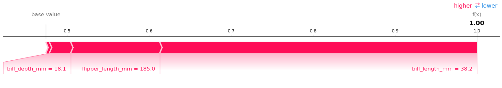
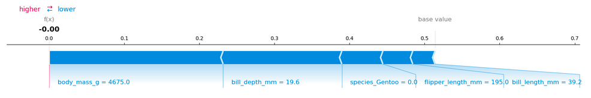

```{r, message = FALSE, warning = FALSE, echo = FALSE}
devtools::load_all()
set.seed(42)
```

<!--{pagebreak}-->

## SHAP (SHapley Additive exPlanations) {#shap}

`r if(is.html){only.in.html}`

The SHAP (SHapley Additive exPlanations) method by Lundberg and Lee (2016)[^lundberg2016] explains individual predictions.
SHAP is based on the game theoretically optimal [Shapley Values](#shapley).

There are two reasons why SHAP has its own chapter and is not a subchapter of [Shapley values](#shapley).
First, the SHAP authors propose KernelSHAP, a new kernel-based estimation approach for Shapley values inspired by [local surrogate models](#lime).
Additionally they propose TreeSHAP, an efficient estimation approach for tree-based models.

Second, SHAP is also an umbrella term for the many global explanation methods based on aggregations of Shapley values.
This chapter explains both the new estimation approaches and the global interpretation methods.

I recommend reading the [chapter on Shapley values](#shapley) first, as SHAP computes Shapley values.
I also recommend reading the [chapter on local models (LIME)](#lime), as SHAP estimation is inspired by LIME.

### Definition

The goal of SHAP is to explain the prediction of an instance x by computing the contribution of each feature to the prediction.
The SHAP explanation method computes Shapley values from coalitional game theory.
The feature values of a data instance act as players in a coalition.
Shapley values tell us how to fairly distribute the "payout" among the features.
A player can be an individual feature values, e.g. for tabular data.
A player can also be a group of feature values.
For example to explain an image, pixels can be grouped to super pixels and the prediction distributed among them.
One innovation that SHAP brings to the table is that the Shapley value explanation is represented as an additive feauture attribution method, a linear model.
That view connects LIME and Shapley Values.
SHAP specifies the explanation as an additive feature attribution with the following linear model:

$$g(z')=\phi_0+\sum_{j=1}^M\phi_jz_j'$$

where g is the explanation model, $z'\in\{0,1\}^M$ is the coalition vector, M is the maximum coalition size and $\phi_j\in\mathbb{R}$ is the feature attribution for a feature j, the Shapley values.
What I call "coalition vector" is called "simplified features" in the SHAP paper.
I think this name was chosen, because for e.g. image data, the images are not represented on the pixel level, but aggregated to super pixels.
And we look at coalitions of many super pixels.
So keep in mind that a "player" can also be a group of feature values.
I believe it is helpful to think about the z's as describing coalitions:
In the coalition vector, an entry of 1 means that the corresponding feature value is "present" and 0 that it is "absent".
This should sound familiar to you if you know about Shapley values.
To compute Shapley values, we simulate that only some features values are not playing ("present") and some are not ("absent").
The representation as a linear model of coalitions is a trick for the computation of the $\phi$'s.
For the instance of interest x, the coalition vector x' is a vector of all 1's, i.e. all feature values are "present".
The formula becomes simpler:

$$g(x')=\phi_0+\sum_{j=1}^M\phi_j$$

You can find this formula in similar notation in the [Shapley Value Chapter](#shapley).
More about this later the actual estimation comes later.
Let us first talk about the properties of the $\phi$'s before we go into the details of their estimation.

<!-- Desirable properties -->
From the [Shapley values chapter](#shapley) we know that Shapley values are the only solution that satisfies properties of efficiency, symmetry, dummy and additivity.
SHAP also satisfies these, since it computes Shapley values.
In the SHAP paper, you will find discrepancies between SHAP properties and Shapley properties.
SHAP describes the following three desirable properties:

**1) Local accuracy**

$$f(x)=g(x')=\phi_0+\sum_{j=1}^M\phi_jx_j'$$

If you define $\phi_0=E_X(\hat{f}(x))$ and set all $x_j'$ to 1, this is the Shapley efficiency property.
Only with a different name and using the coalition vector.

$$f(x)=\phi_0+\sum_{j=1}^M\phi_jx_j'=E_X(\hat{f}(X))+\sum_{j=1}^M\phi_j$$

**2) Missingness**

$$x_j'=0\Rightarrow\phi_j=0$$

Missingness says that a missing feature gets an attribution of zero.
Note that x_j' refers to the coalitions, where a value of 0 represents the absence of a feature value.
In coalition notation, all feature values $x_j'$ of the instance to be explained should be a vector with all 1's.
The presence of a 0 would mean that the feature value is missing for the instance of interest.
This property is not among the properties of the "normal" Shapley values.
So why do we need it for SHAP?
Lundberg calls it a ["minor book-keeping property"](https://github.com/slundberg/shap/issues/175#issuecomment-407134438).
A missing feature could -- in theory -- have an arbitrary Shapley value without hurting the local accuracy property, since it is multiplied with x_j'=0.
The Missingness property enforces that missing features get a Shapley value of 0. 
In practice this is only relevant for features that are constant.

**3)  Consistency**

Let $f_x(z')=f(h_x(z'))$ and $z_{\setminus{}j'}$ indicate that $z_j'=0$, than for any two models f and f':

$$f_x'(z')-f_x'(z_{\setminus{}j}')\geq{}f_x(z')-f_x(z_{\setminus{}j}')$$

for all inputs $z'\in\{0,1\}^M$, then

$$\phi_j(f',x)\geq\phi_j(f,x)$$

The consistency property says that if a model changes so that the marginal contribution of a feature value increases or stays the same (regardless of other features), the Shapley value also increases or stay the same.
From Consistency the Shapley properties Linearity, Dummy and Symmetry follow, as described in the Appendix of Lundberg and Lee [^shap].

### Estimation with KernelSHAP

<!-- The general Idea of linear model -->
KernelSHAP estimates for an instance x the contributions each feature value to the prediction.
KernelSHAP consists of 5 steps:

- Sample K coalitions $z_k'\in\{0,1\}^M,\quad{}k\in\{1,\ldots,K\}$ (1 = feature present in coalition, 0 = feature absent).
- Get prediction for each z_k' by first converting z_k' to the original feature space and then applying model f: $f(h_x(z_k'))$
- Compute the weight for each z_k' with the SHAP kernel.
- Fit weighted linear model.
- Return Shapley values $\phi_k$, the coefficients from the linear models.

We can create a random coalition by repeated coin flips until we have a chain of 0's and 1's.
For example, the vector of (1,0,1,0) means that we have a coalition of the first and third features.
The K sampled coalitions become the dataset for the regression model.
The target for the regression model is the prediction for a coalition.
("Hold on!," you say, "The model has not been trained on these binary coalition data and can't make predictions for them.")
To get from a coalition of feature values to a valid data instance, we need a function $z=h_x(z')$ where $h_x:\{0,1\}^M\rightarrow\mathbb{R}^p$.
The function h_x maps 1's to the corresponding value from the instance x, that we want to explain.
For tabular data, it maps 0's to the values of another instance that we sample from the data.
This means that we equate "feature value is absent" with "feature value is replaced by random feature value from data".
For tabular data, the following figure visualizes the mapping from coalitions to feature values:

```{r shap-simplified-feature, fig.cap = "Function hx maps a coalition to a valid instance. For present features (1) h_x maps to the feature value of x. For absent features (0) h_x maps to the values of a randomly sampled data instance ", out.width=800}
knitr::include_graphics("images/shap-simplified-features.jpg")
```

<!--
Given the h_x() function, we can evaluate f(h_x(z')) to calculate the predictions with observed or not observed features.

-->

In a perfect world, h_x samples the absent features conditional on the present features:

$$f(h_x(z'))=E_{X_C|X_S}[f(x)|x_S]$$

where X_C is the set of absent features and X_S is the set of present features.
However, as defined above, h_x for tabular data treats X_C and X_S as independent and integrates over the marginal distribution:

$$f(h_x(z'))=E_{X_C}[f(x)]$$

Sampling from the marginal distribution means ignoring the dependence structure between present and absent features.
KernelSHAP therefore suffers from the same problem as all permutation-based interpretation methods.
The estimation puts too much weight on unlikely instances.
Results can become unreliable.
As we will see later, TreeSHAP for tree-ensembles is not affected by this issue.

```{r fig.cap = "Function h maps coalitions of superpixels to images.  For present features (1) $h_x$ maps to the corresponding part of the original image. For absent features (0) $h_x$ greys out the corresponding area. Assigning the average color of surrounding pixels or similar would also be an option. Super-pixels (sp) are groups of pixels.", out.width=800}
knitr::include_graphics("images/shap-superpixels.jpg")
```


<!--By the way, we are free how we define "players" in a coalition.
For tabular data, each feature is usually a player.
We could as well group some of the features into one player.
We only have to adjust h_x accordingly, so that the whole group of features is sampled together from the data when the corresponding coalition entry is 0.
This is very useful for image.
Grouping pixels together to super pixels can make the explanations faster and more intuitive.
This approach is also used by LIME.
-->


<!-- Kernel -->
So far, the procedure is similar to the Shapley sampling approach as well as to LIME.
The big difference to LIME is the weighting of the instances in the regression model.
LIME weights the instances according to how close they are to the original instance.
The more 0's there are in the coalition vector, the smaller is the weight in LIME.
SHAP weights the sampled instances according to the weight the coalition would get in the Shapley value estimation.
Small coalitions (i.e. many 1's) and large coalitions (i.e. many 0's) get the largest weights.
The intuition behind it is:
We learn most about individual features if we can study their effects in isolation.
If a coalition consists of a single feature, we can learn about the features isolated main effect on the prediction.
If a coalition consists of all but one feature, we can learn about this features total effect (main effect plus feature interactions).
If a coalition consists of half the features, we learn little about an individual features contribution, as there are many possible coalitions with half of the features.
To achieve this Shapley compliant weighting, the authors propose the SHAP kernel:

$$\pi_{x}(z')=\frac{(M-1)}{(M{}choose|z'|)|z'|(M-|z'|)}$$

Here, M is the maximum coalition size, $|z'|$ the number of present features in instance z'.
Lundberg and Lee show that linear regression with this kernel weight yields Shapley values.
If you would use the SHAP kernel with LIME on the coalition data, LIME would also estimate Shapley values!

<!-- Sampling trick -->
We can be a bit smarter about the sampling of coalitions:
The smallest and largest coalitions take up most of the weight.
We get better Shapley value estimates by using some of the sampling budget K to include these high-weight coalitions instead of sampling blindly.
We start with all possible coalitions with 1 and M-1 features, 2 times M in total.
When we have enough budget left (current budget is K - 2M), we can include coalitions with two features and with M-2 features and so on.
From the remaining coalition sizes, we sample with readjusted weights.


<!-- Linear Model -->
We have the data, the target and the weights.
Everything to build our weighted linear regression model:

$$g(z')=\phi_0+\sum_{j=1}^M\phi_jz_j'$$

We train the linear model g by optimizing the following loss function L:

$$L(f,g,\pi_{x})=\sum_{z'\in{}Z}[f(h_x(z'))-g(z')]^2\pi_{x}(z')$$

This is the good old boring sum of squared errors that we usually optimized for linear models.
The coefficients of the model, the $\phi_j$'s are the Shapley values.


Since we are in a linear regression setting, we can also make use of the standard tools.
For example, we can add regularization terms to make the model sparse.
If we add an L1 penalty to the loss L, we can create sparse explanations.
(I am not so sure whether the resulting coefficients would still be valid Shapley values)

### TreeSHAP

Lundberg et. al (2018)[^tree-shap] proposed TreeSHAP, a variant of SHAP for tree-based machine learning models such as decision trees, random forests and gradient boosted trees.
TreeSHAP is fast, computes exact Shapley values, and correctly estimates the Shapley values when features are dependent.
In comparison, KernelSHAP is expensive to compute and only approximates the actual Shapley values.

How much faster is TreeSHAP?
For the exact Shapley values, it reduces the computational complexity from $O(TL2^M)$ to $O(TLD^2)$, where T is the number of trees, L is the maximum number of leaves in any tree and D the maximal depth of any tree.

<!-- To explain an individual prediction with exact Shapley values, we have to estimate  $E(f(x)|x_S)$ for all possible feature value subsets S.-->

TODO: CONTINUE HERE

I will explain the intuition how TreeSHAP works.
The following text describes the intuition for one tree.
For a given set of features $X_S$ and an instance x, we want to compute the expected prediction $E_{X_S|X_C}(f(x)|x_S)$.
In $X_C$ are the feautures that are not in S.
For features in set S, we know that they take on the values of the corresponding features in instance x that we want to explain.
For KernelSHAP we would sample the values for features not in S.
To get the expected prediction we have to start at the root of the tree and go down until we hit the terminal nodes.
Since not all feature values are given -- we only have subset S -- we have two distinguish two situations at each internal tree node.
First situation: the node used a feature from S for the split.
Then we go down the path of that node where the feature value matches the decision.
If a node uses a feature that is not in set S, we follow both paths.
We do this until we reach the terminal node in each path that we followed.
The mean of these terminal nodes, weighted by the number of instances per node, is the expected prediction for x given S.


Another way to think about it:
If we would condition on all features -- if S would be the set of all features -- then we would use the prediction from the node in which x would fall.
If we would condition on no feature at all -- if S would be the empty set -- we would use the weighted averaged prediction from all terminal nodes.
This is the same as taking the overall average prediction.
For the inbetween case where S contains some features, but not all, we ignore the predictions from the nodes that we can't reach, because their decisions path contradict values in x_S.
From the remaining terminal nodes, we average the predictions, weighted by the node sizes (i.e. number of training samples in that node).


The thing is, we need to do this procedure for every possible subset S of the feature values.
That is $\sum_{i=1}{p}\frac{(p-i)!i!}{i!}$.
Here, each summand is the set of all possible subsets S with the same cardinality (e.g. all possible subsets with 2 features).
To reduce the complexity, the authors proposed a faster algorithm in their paper that computes in polynomial time instead of exponential.
The basic idea is to push down all possible subsets S simultaneously.
Per node, we have to keep track of the number of subsets that go to the child nodes based on the split feature.
It is a bit trickier than that, since the subsets have different weights, so the algorithm also has to keep track of the overall weight of the subsets in each node.
For example, when the first split in a tree is on feature $x_3$, then all the subsets that contain feature $x_3$ will go to one node (to the one where x goes).
Subsets that do not contain feature $x_3$ go to both nodes with reduced weight.

TreeSHAP works with boosting frameworks XGBoost, LightGBM, CatBoost, and most tree-based scikit-learn models.

Next, we will look at SHAP explanations in action.

### Examples

I trained a random forest classifier with 100 trees to predict [risk for cervical cancer](#cervical).
We will use SHAP to explain individual predictions.
Since random forests are tree-based, we can use the fast TreeSHAP estimation method instead of the slower KernelSHAP method.

Since SHAP fits Shapley values, the interpretation is the same as presented in the [Shapley value chapter](#shapley).
But with the Python shap package comes a different visualization:
You can visualize feature attributions such as Shapley values as "forces".
Each feature value is a force that either increases or decreases the prediction.
The prediction starts from the baseline.
The baseline for Shapley values and therefore SHAP is the average of all predictions.
In the plot, each Shapley value is an arrow that pushes to increase the prediction (positive SHAP) or to decrease it (negative SHAP).
These forces balance out at the actual prediction of that particular data instance.

The following figure shows the SHAP values visualized as forces for two women from the cervical cancer dataset:

```{r, fig.cap = "SHAP values for explaining the predicted cancer probabilities of two individuals. The baseline -- average predicted probability -- is 0.066. The first woman has a low predicted risk of 0.06. Risk increasing effects such as STDs are canceled out by decreasing effects such as age. The second woman has a high predicted risk of 0.71. Age of 51 and 34 years of smoking increase predicted cancer risk. There are almost no effects that lower the cancer risk.", out.width = 800}


```

These were explanations for individual predictions.
Shapley values can be aggregated to global explanations.
When we run SHAP for every instance, we get a matrix of Shapley values.
The matrix has as many rows as data instances and as many columns as features.
We can aggregate and combine this matrix with the feature values to get further insights such as feature importance and feature effects.
The tools would work as well for Shapley Values not computed with SHAP.
We start with SHAP feature importance.

### SHAP Feature Importance

The idea behind SHAP feature importance is simple:
The features with the most impact on the model are the ones with the highest effects on the prediction.
For the importance we are not interested in the direction of the effect, so we take the absolute values.
Since we want to have a global importance, we measure the mean of absolute Shapley values over the data per feature:

$$I_j=\sum_{i=1}^n{}|\phi_j^{(i)}|$$

Once we have the importance for each feature, we sort them in descending order and plot them.
The following figure shows the feature importance for the random forest trained in the examples chapter to predict cervical cancer.

```{r fig.cap="SHAP feature importance measured as the mean absolute Shapley values. The number of years on hormonal contraceptives was the most important feature, changing the absolute cancer probability on average by 2.4 percentage points (0.024 on x-axis).", out.width=800}
knitr::include_graphics("images/shap-importance.png")
```

SHAP feature importance is an alternative to the [permutation feature importance](#feature-importance).
There is a big difference between both importance measures:
Permutation feature importance is based on drop in model performance.
SHAP is based on magnitude of feature attributions.


### Summary Plot

The feature importance plot is useful, but contains no information beyond the importances.
The summary plot combines feature importance with feature effects:
It shows the importance through ranking.
It shows range and distribution of Shapley values: e.g., does a feature only positively affect the prediction? What is the range of effects?
The summary shows also the effect direction, e.g. whether high feature values are associated with positive or negative effect on the predictions.

Each point on the summary plot is a Shapley value for one feature and one instance.
The position on the y-axis is set by the feature and on the x-axis by the Shapley value.
The color represents the value of the feature from low to high.
Overlapping points are jittered in y-axis direction, so we get a sense of the distribution of Shapley values per feature.

```{r fig.cap = "SHAP summary plot, which extends the SHAP feature importance plot. Low number of years on hormonal contraceptives decrease the predicted cancer risk, a large number of years increases the risk. Your regular reminder: All effects describe the behavior of the model, and are not necessarily causal in the real world.",  out.width=800}
knitr::include_graphics("images/shap-importance-extended.png")
```

In the summary plot we see first hints about the relationship between the value of a feature and the impact on the prediction.
But to see the exact shape of the relationship, we have to look at SHAP dependence plots.

### SHAP Feature Dependence

SHAP feature dependence is a simple plot:
Pick a feature.
For each instance from the data, plot a point with the feature value on the x-axis and corresponding Shapley value on the y-axis.
Done.
Mathematically, the plot contains this set of points: $\{(x_j^{(i)},\phi_j^{(i)})\}_{i=1}^n$

The following figure shows the SHAP feature dependence for years on hormonal contraceptives:

```{r fig.cap="SHAP dependence plot for years on hormonal contraceptives. Compared to 0 years, a few years lower the predicted probability and a high number of years increase the predicted cancer probability.", out.width=800}
knitr::include_graphics("images/shap-dependence.png")
```

SHAP Dependence Plots are an alternative to [Partial Dependence Plots](#pdp) and [Accumulated Local Effects](#ale).
Differences:
PDP and ALE are average effects, SHAP dependence also shows the variance on the y-axis.
Especially in case of interactions, the SHAP dependence plot will be much more dispersed.

The plot can be improved by also visualizing feature interactions.


### SHAP Feature Interactions

The interaction effect is the additional combined feature effect after accounting for the individual feature effects.

For Shapley values, there is a mathematical definition of so called Shapley interaction index, which also comes from game theory:

$$\phi_{i,j}=\sum_{S\subseteq\setminus\{i,j\}}\frac{|S|!(M-|S|-2)!}{2(M-1)!}\delta_{ij}(S)$$

when $i\neq{}j$ and:

$$\delta_{ij}(S)=f_x(S\cup\{i,j\})-f_x(S\cup\{i\})-f_x(S\cup\{j\})+f_x(S)$$

In words, the interaction is the marginal contribution of two feature i and j.
We average this again over all possible feature coalitions S, like in the standard Shapley value.
And we only count the interaction effect, i.e. we subtract the main effect of the features.
Basically the interaction gain by using both features, when account for the individual feature effects.
This is very similar to the definition of interaction in the [Feature Interaction chapter](#interaction).

When we compute SHAP interaction values for all features, we get one matrix per instance with dimensions p x p, where p is the number of features.

How can we use the interaction index?
For example to automatically color the SHAP feature dependence plot:

```{r fig.cap = "SHAP feature dependence plot with interaction visualization. Years on hormonal contraceptives interacts with STDs. In cases with close to 0 years, the occurence of a STD increases the predicted risk. For more years on contraceptives, the occurence of an STD decreases the predicted risk. Again, this is not a causal model. Effects might be due to confounding (e.g. STDs and lower cancer risk could be correlated with more doctor visits).", out.width=800}
knitr::include_graphics("images/shap-dependence-interaction.png")
```

### Clustering SHAP values

Shapley values can be used for clustering the data.
The goal of clustering is to find groups of similar instances.
Usually clustering is based on the features.
Features are often on different scales, height might be measured in meters, color intensity from 0 to 100 and some sensor output between -1 and 1.
The difficulty is to compute distances between instances with such different, non-comparable features.

SHAP clustering works by clustering on Shapley values of each instance, instead of the feature values.
This means you cluster instances by explanation similarity.
Another advantage is that SHAP values all have the same unit -- the unit of the prediction space.
The Shapley values for the p features describe an instance.
You can use any clustering method to cluster the instances.
For the following example, hierachical agglomerative cluster was used.
For the plot we create the force plot, which explains a prediction, for each instance.
We rotate them, so that they are vertical and put them side by side.
The clustering similarity sorts the instances.

```{r, fig.cap="Stacked SHAP feature attributions clustered by explanation similarity. Each position on the x-axis is an instance from the data. Red SHAP values increase the prediction, blue ones decrease it. One cluster stands out: To the right is a group with a high predicted cancer risk.", out.width=800}
knitr::include_graphics("images/shap-clustering.png")
```
### Advantages

Since SHAP computes Shapley values, all the advantages of Shapley values apply:
SHAP has a **solid theoretical foundation** in game theory.
The prediction is **fairly distributed** among the feature values.
We get **contrastive explanations** that compare the prediction with the average prediction.

SHAP **connects LIME and Shapley values**.
This is very useful for better understanding how explanations work.
This also helps to unify the field.
SHAP also unifies other methods such as DeepLift and LRP.

SHAP comes with a **fast model-specific implementation for tree-based models**.
I believe this was key to the popularity of SHAP.

Another strong argument in favor of SHAP is are the **global interpretation methods** built on top of the Shapley values.
The SHAP implementation comes with methods for importance, feature dependence, interactions, clustering and summary plots.
This has the advantage that local and global explanation have the same basis.
When you use e.g. LIME for local explanations and Partial Dependence Plot plus permutation feature importance for global explanations, you draw from very different techniques and can't directly relate both.

### Disadvantages

**KernelSHAP is slow**.
All the global interpretation methods require to compute Shapley values for a lot of instances and for all features.
This becomes quickly impractical when you cannot use the fast TreeSHAP, but when you have to rely on KernelSHAP

**KernelSHAP ignores feature dependence**.
This is the same issue as with many other model-agnostic methods which permute feature values.
By replacing feature values with values from random instances it is usually easier to randomly sample from the marginal distribution.
But when features are dependent, e.g. correlated, this can lead to unrealistic data instances.
The model might predict something unusual for this unseen data instances, but we still use them for computing Shapley values.
TreeSHAP fixes this problem by explicitly modeling the conditional distribution.

The disadvantages of Shapley values apply to SHAP as well:
Shapley values can be misinterpreted and access to data is needed to compute them for new data (except for TreeSHAP).

### Software

The authors implemented SHAP in the [shap Python package](https://github.com/slundberg/shap).
This package was used for all the examples in this chapter.

SHAP is integrated into the tree boosting frameworks [xgboost](https://github.com/dmlc/xgboost/tree/master/python-package) and [LightGBM](https://github.com/microsoft/LightGBM).

In R, there is the [shapper package](https://modeloriented.github.io/shapper/).
SHAP is also integrated into [the R xgboost package](https://rdrr.io/cran/xgboost/man/xgb.plot.shap.html)`

[^lundberg2016]: Lundberg, Scott M., and Su-In Lee. "A unified approach to interpreting model predictions." Advances in Neural Information Processing Systems. 2017.

[^tree-shap]: Lundberg, Scott M., Gabriel G. Erion, and Su-In Lee. "Consistent individualized feature attribution for tree ensembles." arXiv preprint arXiv:1802.03888 (2018).
