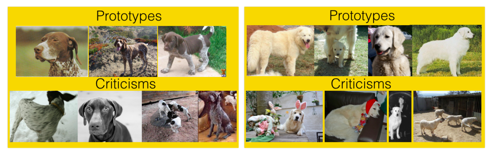

```{r, message = FALSE, warning = FALSE, echo = FALSE}
devtools::load_all()
set.seed(42)
```

# Example-based explanations {#example}

Example-based explanations are interpretability methods that return instances from the dataset to explain the behaviour of a black box machine learning model.

*Keywords: example-based explanations, case-based reasoning, CBR, solving by analogy, intra-domain analogy*

Example-based explanations are mostly model-agnostic, because they can be applied to make any machine learning model more interpretable.
The difference to model-agnostic methods is that the example-based methods return as an interpretation an instance from the dataset and not a summary of a feature (like the feature importance or the partial dependence).
It follows that example-based explanations are only meaningful if we can represent an example in a humanly understandable way.
It works well for images, because we can simply visualize images.
It's harder with tabular data, where an instance can consist of hundreds or thousands of features.
Listing the values of all those features to describe an instance is nonsense.
It works well if there are just a handful of features or if we have a way to summarize an instance.


The methods might be applied before fitting a model to explain the dataset, by which the behaviour of the model can be understood better.


Example-based explanations helps the humans to construct mental models of the machine learning model. 
Also it helps to understand the complex data distributions.
What are example-based explanations?
Let's start with a few real world exampels [^cbr]:

A physician treats a patient with unusual symptoms.
The patients symptoms remind her of another patient she had years ago with similar symptoms and sends him to a specialist for further examination.

A data scientist gets a new client with a new task: 
Analyzing the risk factors that lead to a breakdown of machines. 
The data scientist remembers a similar task he solved and re-uses parts of the code from the old project, because he thinks that the client might want to have the same analysis as the other client.

A firefighter sees a kitty in a burning house and decided whether he should go in and rescue it.
He remembers a few houses that were similar to this one: old wooden houses, with two levels. 
At a similar stage of the fire they were unstable and collapsed at some points. 
Based on the similarity of this case, he decides not to go in, because the risk of the house breaking down is too high. 
Fortunately the kitty jumps out of the window and nobody is harmed in the fire (happy end!).

These are examples how we humans think in examples.
The structure his: A is similar to B, B caused Y to happen, so I predict A to cause Y as well.
We humans love these explanations, because they make things seem plausible.
In an implicit way, some machine learning approaches work example-based.
Decision trees group data points together into a node, when they are similar in the features that are important for predicting the target.
Predicting the outcome for a new data point amounts to finding the data points that are similar (in the same terminal node) and predicting the average of those points (instead of returning all points).
The k-nearest neighbours algorithm works directly with example-based predictions. 
knn predicts new data points by asking what the k nearest data points predicted.
Explaining the prediction of a knn can be done by returning the k neighbours.
Only meaningful if single data points can be interpreted, i.e. they don't have too many features and the features are interpretable.
Hundreds of abstract measurements would not pass this test for example.

This chapter covers interpretable models using example-based methods, methods for analysing the data to make it interpretable and interpretability methods that work on models, but return examples as explanations. 
- **k-nearest neighbours**: An (interpretable) machine learning model that is based on examples.
- [Prototypes and criticisms](proto): Which instances from the data are stereotypical for the data?
Which instances from the data are a not well explained by the prototypes?
- **Counterfactuals**: How would the instance look like if we want to flip the prediction?
- **Adverserial examples**: Same as counterfactuals, but with the purpose to maliciously fooling the machine learning algorithm.
- **Archetypes**: What are the most extreme cases in my dataset?
- **Influence Functions**: Identifying the points most responsible for a particular prediction. [^koh]


## Prototypes and criticisms {#proto}

A prototype is a data point that is representative for the data.
Choosing a set of prototypes can be used to understand the data better.
A criticism is a data point that is atypical for the data and not covered well by the set of prototypes.
Prototypes are already nice, but they may not be sufficient to explain the data.
They are only sufficient when the data distribution within the classes is very homogenuous.
The purpose of criticisms is to deliver insights together with prototypes, and especially where prototypes don't tell the full story of a data subset.
This approach can be used independent from machine learning to just describe the data, but it can also be used to build interpretable models or to make black box models interpretable.

The following plot illustrates the idea of prototypes and criticisms.
Prototypes and criticisms are usually actual data points.


```{r, fig.cap = "Illustration for criticisms and prototypes of a data set."}
set.seed(1)
dat1 = data.frame(x1 = rnorm(20, mean = 4, sd = 0.3), x2 = rnorm(20, mean = 1, sd = 0.3))
dat2 = data.frame(x1 = rnorm(30, mean = 2, sd = 0.2), x2 = rnorm(30, mean = 2, sd = 0.2))
dat3 = data.frame(x1 = rnorm(40, mean = 3, sd = 0.2), x2 = rnorm(40, mean = 3))
dat4 = data.frame(x1 = rnorm(7, mean = 4, sd = 0.1), x2 = rnorm(7, mean = 2.5, sd = 0.1))

dat = rbind(dat1, dat2, dat3, dat4)
dat$type = "data"
dat$type[c(7, 23, 77)] = "prototype"
dat$type[c(81,95)] = "criticism"

ggplot(dat, aes(x = x1, y = x2)) + geom_point(alpha = 0.7) +
  geom_point(data = filter(dat, type!='data'), aes(shape = type), size = 9, alpha = 1, color = "blue") + 
  scale_shape_manual(breaks = c("prototype", "criticism"), values = c(19, 18)) 

```


While there are many ways to find prototypes in the data, this chapter will only present one approach which combines finding prototypes and criticisms within a single framework called MMD-critic by Kim et. al (2016)[^critique].

The main idea of MMD-critic:
We compare the density distributions of the prototypes and the actual data. 
We select prototypes that minimizes the discrepancy in the distributions.
Good prototypes are at points of the dataset with a high density, because then they are representative for the data.
Samples that are not explained well by the prototypes are selected as criticisms.
Let's delve deeper into the theory.

#### Theory: MMD-critic


The general algorithm can be summarized real simple:

1. Select the number of prototypes and criticisms you want
1. Select prototypes using greedy search. Prototypes are chosen so that the distribution of prototypes is close to the data distribution.
1. Selecte criticisms using greedy search. Criticisms are chosen as points at which the distribution of prototypes and data differ the most.

To do this, we need a couple of ingredients to find prototypes and criticisms for a dataset.
We need a sense of how the data is distributed. 
By the way, a couple of data points already make up a distribution.
For this purpose, the most elementary ingredient is a **kernel function** that tells us how close two data points are to each other. 
Based on this, we can measure how well a data point fits into a distribution of other data points.
Built upon the kernel function, we need a measure that can tell us how similar to distributions are, so that we can tell if the distribution of prototypes we have chosen is close to the actual distribution.
This is solved using the **maximum mean discrepancy (MMD)**.
Also built upon the kernel function, we need the **witness function** which can tell us how different two distribution are at a specific data point. 
With the witness function we can choose criticisms of the data points, which are points where the distribution of prototypes and data are very different.
The last ingredient is a search strategy for good prototypes and criticisms, which is solved with a simple **greedy search**.


Let's start with the maximum mean discrepancy (MMD), which measures the discrepancy between two distributions.
Selecting prototypes create a density distribution of prototypes.
The goal is to minimize the discrepancy between this distribution of the prototypes and the data distribution. 
We want to test whether the distributions are different, based on samples from them.
The maximuim mean discrepancy measures the difference between two distributions P and Q, as defined by the suprenum over a function space F of differences between the expectation with respect to two distributions (CHANGE sentence).
All clear?
It become clearer if we look at how we actually calculate the properties:
Pay attention more here, because this is relevant for understanding whats going on. 
I personally understand all those concepts much better, once I see what we effectively do with the data.
The square of the measure is optimized.

$$MMD^2=\frac{1}{m}\sum_{i,j=1}^m{}k(z_i,z_j)-\frac{2}{mn}\sum_{i,j=1}^{m,n}k(z_i,x_j)+\frac{1}{n^2}\sum_{i,j=1}^n{}k(x_i,x_j)$$

k is a kernel that measures the similarity of two points, but more on that later.
m samples from Q as $z_i$, here the prototypes (which come from the data).
n samples from P as $y_i$, here the data.
Each point is multidimensional, i.e. it can have many features.
The goal is to minimize MMD2, but for convenenience it is turned into a maximisation problem with some additivie bias (not so important here).

The following graphic illustrates the measure. 
The first plot shows the data points in two dimensions without prototypes. 
The other plots show different constellation of prototypes. 
The MMD2 measure matches the intuition: 
The prototypes that cover the data the best in these scenarios has the lowest discrepancy value.

```{r mmd, fig.cap = "The squared maximum mean discrepancy measure (MMD) for a dataset with two features and different prototypes. Density estimation for the black data points in blue and for the prototypes in red."}
set.seed(42)
n = 40
# create dataset from three gaussians in 2d
dt1 = data.frame(x1 = rnorm(n, mean = 1, sd = 0.1), x2 = rnorm(n, mean = 1, sd = 0.3))
dt2 = data.frame(x1 = rnorm(n, mean = 4, sd = 0.3), x2 = rnorm(n, mean = 2, sd = 0.3))
dt3 = data.frame(x1 = rnorm(n, mean = 3, sd = 0.5), x2 = rnorm(n, mean = 3, sd = 0.3))
dt4 = data.frame(x1 = rnorm(n, mean = 2.6, sd = 0.1), x2 = rnorm(n, mean = 1.7, sd = 0.1))
dt = rbind(dt1, dt2, dt3, dt4)


radial = function(x1, x2, sigma = 1) {
  dist = sum((x1 - x2)^2)
  exp(-dist/(2*sigma^2))
}


cross.kernel = function(d1, d2) {
  kk = c()
  for (i in 1:nrow(d1)) {
    for (j in 1:nrow(d2)) {
      res = radial(d1[i,], d2[j,])
      kk = c(kk, res)
    }
  }
  mean(kk)
}

mmd2 = function(d1, d2) {
  cross.kernel(d1, d1) - 2 * cross.kernel(d1, d2) + cross.kernel(d2,d2)
}

# create 3 variants of prototypes
pt1 = rbind(dt1[c(1,2),], dt4[1,])
pt2 = rbind(dt1[1,], dt2[3,], dt3[19,])
pt3 = rbind(dt2[3,], dt3[19,])

# create plot with all data and density estimation
p = ggplot(dt, aes(x = x1, y = x2)) + 
  stat_density_2d(geom = "tile", aes(fill = ..density..), contour = FALSE, alpha = 0.9) + 
  geom_point() + 
  scale_fill_gradient2(low = "white", high = "blue", guide = "none") + 
  scale_x_continuous(limits = c(0, NA)) + 
  scale_y_continuous(limits = c(0, NA))
# create plot for each prototype
p1 = p + geom_point(data = pt1, color = "red", size = 4) + geom_density_2d(data = pt1, color = "red") + 
  ggtitle(sprintf("%.3f MMD^2", mmd2(dt, pt1))) 
p2 = p + geom_point(data = pt2, color = "red", size = 4) + 
  geom_density_2d(data = pt2, color = "red") + 
  ggtitle(sprintf("%.3f MMD^2", mmd2(dt, pt2)))

p3 = p + geom_point(data = pt3, color = "red", size = 4) + 
  geom_density_2d(data = pt3, color = "red") + 
  ggtitle(sprintf("%.3f MMD^2", mmd2(dt, pt3)))
# TODO: Add custom legend for prototypes

# overlay mmd measure for each plot
gridExtra::grid.arrange(p, p1, p2, p3, ncol = 2)
```


A choice for the kernel is the radial basis function kernel:

$$k(x,x')=exp\left(\gamma||x-x'||^2\right)$$
where ||x-x'|| is the Euclidean distance betweeen two points.
$\gamma$ is a scaling parameter. 
The value of the kernel decreases with the distance of the two points and ranges between zero, when the points are infinitely far apart and one, when the points are the same.


We combine the MMD measure and the kernel with greedy search in an algorithm for finding prototypes:

- Start with empty list of prototypes
- While number of prototypes are below chosen number m:
    - Check for each point in the dataset how much it decreases the MMD. Choose the data point as prototype that minimizes the MMD and add it to the list of prototypes.
- Return the list of prototypes

Greedy search works, because the loss function is submodular, that means that the greedy method will at least get 63% of the optimal solution.


The remaining ingredient we need for finding criticisms is the witness function, which tells us how much two probability distributions differ at a particular point. 
It can be estimated using:

$$g(x)=\frac{1}{n}\sum_{i=1}^nk(x,x_i)-\frac{1}{m}\sum_{j=1}^mk(x,z_j)$$

For a point x, we can check the difference between two kernel estimates.
The witness function shows where the estimated densities of p and q differ the most.
The witness function is positive when x fits better into the distribution of the $x_i$, and it is negative when the x fits better with the distribution of the $z_i$'s.
For finding critcisms we look at both extreme values in negative and positive direction. 
A negative witness function means that we overestimate the probability at point x compared to the data distribution (for example when we put a prototype at a place where actually not many data points are) and it turns positive when we underestimate the probability at point x (for example when there are many data points, but we don't put any prototype near it).
When the witness function is close to zero for a point x, it means that the density function of the data and the prototypes are close to each other, which means that we found good prototypes for this area.

To give you more intuition, let's re-use the prototypes from before which had the least MMD from the three we tested and display the witness function for a few points.
The plot shows the density of the data in the background, plus the contour lines for the distribution generated by the three prototypes. 
The labels in the plot show the value of the witness function for different points  marked as triangles
These are candidates for criticisms, though only the point in the middle has a high value and the algorithm tests all points, not only a couple.

```{r witness, fig.cap = ""}
witness = function(x, dist1, dist2, sigma = 1) {
  k1 = apply(dist1, 1, function(z) radial(x, z, sigma = sigma))
  k2 = apply(dist2, 1, function(z) radial(x, z, sigma = sigma))
  mean(k1) - mean(k2)
}

w.points.indices = c(125, 2, 60, 19, 100)
wit.points = dt[w.points.indices,]
wit.points$witness = apply(wit.points, 1, function(x) round(witness(x[c("x1", "x2")], pt2, dt, sigma = 1), 3))

p + geom_point(data = pt2, color = "red") + 
  geom_density_2d(data = pt2, color = "red") + 
  ggtitle(sprintf("%.3f MMD^2", mmd2(dt, pt2))) + 
  geom_label(data = wit.points, aes(label = witness), alpha = 0.8, vjust = "top") + 
    geom_point(data = wit.points, color = "black", shape = 17, size = 4) 
```

Once the prototypes are found, we can choose the points from the data distribution, where the prototypes and the data are the most different. 
Let's say we have a image dataset for classifying animals and find a bunch of prototypes, including two prototypes for the dog class, one prototype shows dogs inside the house and the other is representative for dogs in the park. 
But there are a few outliers, that are not well covered by theses prototypes, and these are dogs that are dressed in costumes. 
They might be selected as criticisms.

Criticisms are searched for so that the points are where there are no prototypes, but many data points still. 
An additional term in the optimization function enforces diversity in the points, which is needed so that the points are not all from the same pile, but different types of criticisms.

Criticisms are points with the largest value of the witness function.
This large value means that at these points, the distribution of the data and of the prototypes diverge the most.
Divergence means, that the prototypes don't explain the dataset well for particular types of data points.

Algorithm for finding criticisms is the same as for finding the prototypes. 
But instead of finding the point that decreases the MMD, we search points that maximizes a cost function that involves the witness function and a regularizer term.
The absolute witness function is high for points that don't fit into the distribution and the regularizer term makes sure to select different points and not similar points.


**How it can be used with machine learning:**

1. Find prototypes and criticisms
1. Train machine learning model as usual
1. Predict the prototypes and criticisms
1. Analyse the predictions: In which cases was the algorithm wrong? Now you have an interpretable set of examples, where you know that it represents the data well and it can help you find the weaknesses of the machine learning model.


Another way in which it can be used: 

Build an intepretable classifier with it.
Nearest prototype based classifier.
Criticisms are not used for this.
Interpretability comes from retrieving the closest prototype and showing it to the user.

Choose the prototype that is closest to the x:

$$\hat{f}(x)=argmax_{i\in{}S}k(x,x_i)$$

Choosing the hyperparameter $\gamma$ is something the user has to do.
Can be cross-validated

### Examples:

The examples all show image classification examples, since here we can easily interpret a single example, because we can grasp a single image.
For calculating the kernel distances, each image is represented using image embeddings with 2048 dimensions. 
An image embedding is an abstract representation of an image by a vector, which is extracted from the weights of a neural network that has been trained to solve an image recognition task, in this case the Imagenet classification dataset.


The first dataset contains different breeds of dogs from the ImageNet dataset.
MMD-critic is applied on it for two dog breed classes.
The resulting prototypes mostly show the face of the dog, whereas criticisms are without the dogs face or in other coloring. Right hand side dog criticisms show the dog in a costume
```{r, prototypes-and-criticisms, fig.cap = "Prototypes and criticisms for two types of dog breeds from the ImageNet dataset.."}

```

Another example is a digit dataset. 

Interestingly the number of prototypes differ per class. Criticisms include digits drawn with unusually thick or thin lines amongst others. Or also unrecognizable digits.

```{r, prototypes-and-criticisms2, fig.cap = "Prototypes and criticisms for a digit recognition dataset. "}
knitr::include_graphics("images/proto-critique2.png")
```


### Advantages

- Can choose number of prototypes and criticisms
- Understanding the MMD and witness function is helpful.
- In a test, where subjects were given an image and they had to tell to which of two sets of images it belongs, they performed best when the sets where showing prototypes and criticisms instead of random images of that class.
- Works independent of data type.
- Algorithm straightforward and conceptually easy to understand.


### Disadvantages
- Unclear which kernel is best
- Kernel parameter has to be tuned, and there is no instructions how to.
Even for drafting the illustrations I wasn't sure how to choose the parameter. 
Changing it had quite an influence on the results.
- It takes all the features as input, disregarding the fact that some features might not be relevant in the context of a supervised problem.


### Code and Alternatives

- An implementation can be found at: https://github.com/BeenKim/MMD-critic
- K-medoid clustering. A classing technique for finding data ponts that represent others. Has similarities to k-means. [^medoids]
-


## Counterfactuals and adverserial examples

Difference here: Data points are not from training data, but artificially created or modified from existing points.

## k-Nearest Neighbors {#knn}
k-nearest neighbours retrieves the k most similar data points as measured with the distance to the data point to be predicted.

k-nearest neighbours is probably the most classic method for using examples to make predictions. 


## Influence functions

## Archetypes?

## Anchors?

[^medoids]: Kaufman, Leonard, and Peter Rousseeuw. Clustering by means of medoids. North-Holland, 1987.

[^bcm]: Kim, B., Rudin, C., & Shah, J. (n.d.). The Bayesian Case Model: A Generative Approach for Case-Based Reasoning and Prototype Classification.

[^critique]: Kim, Been, Rajiv Khanna, and Oluwasanmi O. Koyejo. "Examples are not enough, learn to criticize! criticism for interpretability." Advances in Neural Information Processing Systems. 2016.


[^cbr]: Aamodt, A., & Plaza, E. (1994). Case-based reasoning : Foundational issues, methodological variations, and system approaches. AI Communications, 7(1), 39–59.

[^koh]: Koh, P. W., & Liang, P. (2017). Understanding Black-box Predictions via Influence Functions. Retrieved from http://arxiv.org/abs/1703.04730
