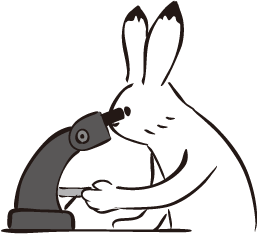

# A Look into the Crystal Ball

What is the future of interpretable machine learning?
This chapter is a speculative mental exercise and subjective guess how interpretable machine learning will develop.
I opened the book with rather pessimistic [short stories](#storytime) and would like to conclude with a more optimistic outlook. 

I have based my "predictions" on three premises:

1. **Digitization: Any (interesting) information will be digitized.**
Think of electronic cash and online transactions. 
Think of e-books, music and videos. 
Think of all the sensory data about our environment, human behavior, industrial production processes and so on.
The drivers of the digitization of erverything are: Cheap computers/sensors/memory, scaling effects (winner takes it all), new business models, modular value chains, cost pressure and much more.
1. **Automation: When a task can be automated and the cost of automation is lower than the cost of performing the task over time, the task will be automated.**
Even before the introduction of the computer, we had a certain degree of automation: For example, the weaving machine automated weaving or the steam machine automated horsepower.
But computers and digitization are taking automation to the next level. 
Simply the fact that you can program for-loops, write Excel macros, automate e-mail responses, and so on, show how much an individual can automate. 
Ticket machines automate the purchase of train tickets (no cashier needed any longer), washing machines automate laundry, standing orders automate money transactions and so on.
The automation of tasks frees up time and money, so there is a huge economic and personal incentive to automate things.
We are currently observing the automation of language translation, driving and even scientific discovery. 
1. **Misspecification: We are not (and never will be?) able to perfectly specify a goal with all its constraints.**
Think of the genie in a bottle, that always takes your wishes literally:
"I want to be the richest person in the world!" -> You become the richest person, but as a side effect, the currency you hold crashes due to inflation. 
"I want to be happy for the rest of my life!" -> The next 5 minutes you feel very, very happy, then the genie kills you. 
"I wish for world peace!" -> The genie kills all humans. 
We misspecify the goals either because we don't know all the constraints or because we can't measure them. 
Let's look at public limited companies as an example of imperfect goal specification: A public limited company has the simple goal of earning money for its shareholders. 
But this specification does not capture the true goal with all its constraints that we really strive for:
For example, we don't appreciate a company killing people to make money, poisoning rivers or to simply printing its own money. 
We have invented laws, regulations, penalties, compliance procedures and more to patch up the imperfect goal specification.
Another example you can live through yourself: [Paperclips](http://www.decisionproblem.com/paperclips/index2.html), a game in which you play a machine with the goal of producing as many paperclips as possible. 
WARNING: It's addictive.
I don't want to spoil it too much, but let's say things get out of hand really quickly.
In machine learning, the imperfections in goal specification come from imperfect data abstractions (biased population, measuremente errors, incomplete operationalization, ...), 
unconstrained loss functions, lack of knowledge of the constraints, shift in distribution between training and application data and much more. 

Digitization is driving automation forward. 
Imperfect goal specification conflicts with automation.
I claim that this conflict is mediated by interpretability methods.

The scene for our predictions is set, the crystal ball is ready, now let's take a look where the field could be going!

## The Future of Machine Learning

Without machine learning, there can be no interpretable machine learning.
Therefore we have to guess where machine learning is heading, before we talk about interpretability.

Machine learning (or "AI") is associatied a lot of promises and expectations.
But let's start with a less optimistic observation:
While science develops a lot of fancy machine learning tools, in my experience it is quite difficult to integrate them into existing processes and products.
Not because it's not possible, but because it simply takes time for companies and institutions to catch up. 
In the gold rush of the current AI hype, companies open up "AI labs", "Machine Learning Units" and hire "Data Scientists", "Machine Learning Experts", "AI engineers", and so on, but the reality is rather frustrating (in my experience):
Often companies do not even have data in the required form and the data scientist waits inactive for months.
Sometimes companies have such high expectation due to the AI hype in the media that the data scientists could never fulfill them.
And often nobody knows how to integrate this new kind of people into existing structures and many more problems.
That leads to my first prediction:

**Machine learning will grow up slowly but steadily**.

Digitization is advancing, and the temptation of automation is constantly pulling.
Even if the path of machine learning adoption is slow and stony, machine learning is constantly moving from science to business processes, products and real world applications.

I believe we need to better explain to non-experts what types of problems can be formulated as machine learning problems. 
I know many highly paid data scientists who perform Excel calculations or classical business intelligence with reporting and SQL queries instead of machine learning.
But a few companies are already successfully applying machine learning, with the large Internet companies at the forefront. 
We need to find better ways to integrate machine learning into processes and products, train people and create machine learning tools that are easy to use.
I believe that  machine learning will become a lot easier to use: 
We can already see that machine learning becomes more accessible, for example through cloud services ("Machine Learning as a service" - just to spray a few buzz words). 
Once machine learning has matured - and this has baby already made its first steps - my next prediction is: 

**Machine learning will fuel (almost) everything.**

Based on the principle "Whatever can be automated will be automated", I conclude that, whenever possible, 
tasks will be reformulated as prediction problems and solved with machine learning. 
Machine Learning is a form of automation or can at least be part of it.
Many tasks currently performed by humans are being replaced by machine learning. 
Here are just a few examples:

- Automation of the sorting / deciding on / filling out documents (e.g. in insurance companies, the legal sector or consulting firms)
- Data-driven decisions such as credit applications
- Drug discovery
- Quality controls in assembly lines
- Self-driving cars
- Diagnosis of diseases
- Translation. I am literally using this right now: A translation service ([DeepL](deepl.com)) powered by deep neural networks to improve my sentences by translating them from English into German and back into English. 
- ...

The breakthrough for machine learning is not only achieved through better computers / more data / better software, but also:

**Interpretability tools catalyze the adoption of machine learning.**

Based on the premise that the goal of a machine learning model can never be perfectly specified, it follows that interpretable machine learning is necessary to close the gap between the misspecified and the actual goal. 
In many areas and sectors, interpretability will be the catalyst for the adoption of machine learning. 
Some annecdotal evidence: Many people I have talked to do not use machine learning because they can't explain the model to others. 
I believe that interpretability will tackle this issue and make machine learning attractive to organisations and people that demand a degree of transparency.
In addition to the misspecification of the problem, many industries require interpretability, whether for legal reasons, risk aversion or to gain insight into the underlying problem.
Machine learning automates the modeling process and moves the human a bit further away from the data and the underlying problem: 
This increases the risk of problems with design of experiments, choice of training distribution, sampling procedure,  data coding, feature engineering, etc.
Interpretation tools make it easier to identify theses problems

## The Future Of Interpretability

Let's take a look at where machine learning interpretability might be going.

**The focus will be on model-agnostic interpretability tools.**

It is way easier to automate interpretability if it is decoupled from the underlying machine learning model. 
The advantage of model-agnostic interpretability is the modularity:
We can easily replace the underlying machine learning model. 
We can just as easilty replace the interpretability method.
For these reasons, model-agnostic methods will scale much better. 
That's why I believe that model-agnostic methods will become more dominant in the long term.
But intrinsically interpretable methods will also have their place.

**Machine learning will be automatic and so will be interpretability.**

An already visible trend is to completely automate the model fitting: 
That includes the automated engineering and selection of features, automated hyper parameter optimization, comparison of different model and ensembling or stacking of the models. 
The result is the best possible prediction. 
When we use model-agnostic interpretation methods, then we can automatically apply them on whatever model comes out of the automated machine learning process.
In a way, we can also automate this second step: Computer feature importance, partial dependence plots, fit a surrogate model and so on. 
Nobody stops you from computing all of this stuff automatically (besides computational resources).
The humans will be needed for the actual interpretation.
Imagine: You only upload a dataset, specify the prediction goal and, with the click of a button - the best prediction model is fitted and the program spits out all the interpretations of the model. 
Solutions for this already exist and I argue that this is the end game for machine learning. 
When these systems are mature enough, for many applications it will be enough to do this. 
The same as now everyone can build websites without knowing HTML, CSS and Javascript:
You don't have to know HTML to build a website, but there are still web developers.
While also letting a human look into the loop (through interpretability tools) and see if any goal missspecification happened.
But I think we can also take this a step further:

**Don't analyse data, analyse black box models.**

Unpopular opinion: The raw data itself is always useless. 
Theoretically, I don't care about the data. 
I care about the distilled knowledge contained in the data. 
Fitting a machine learning to predict the data is the ultimate distillation for my task (assuming the task is captured in the loss function).
I want to be able to throw away the data and work only on the model. 
Because I can ask the model as many things as I want, the model automatically detects if and how features are relevant for the prediction (many models have built-in feature selection), the model (when fitted flexibly) can detect automatically how the relationships are represented best.
I want a sound model that approximates reality. 

To answer questions like: 
- Was website variant A or B better?
- What are the most relevant factors for the prognosis of this cancer?
- How should this item be categorized?

Simply hypothesis tests like student t-test, analysis of variance or the correlation (the standardised linear regression coefficient is the same as Pearson's correlation coefficient) are already based on models of the data (because they assume distributions).
So what I am telling here is actually not new at all. 
What is new?
That we don't make any assumptions about the distributions. 
Assumptions suck!
They are usually wrong, difficult to check and hard to automate. 
The machine learning approach is more sexy: We don't do any assumptions, we just let it approximate reality as closely as possible (as done in a CV loop) and BOOM! we have our model of reality.
I argue that we should develop all the tools we have in statistics for answering questions (hypothesis tests, correlation measures, interaction measures, visualization tools, confidence intervals, p-values, prediction intervals, probability distributions) and re-coin the for black box models.
In a way, that is already happening: 

- Let's take a classic linear model: The standardized regression coefficient is already a feature importance measure. 
With the [permutation feature importance measure](#feature-importance), we have a tool that can do it for any model. 
- In a linear model the coefficients tell us the influence of a feature for the predicted outcome. 
The generalized version of this is the [partial dependence plot](#pdp).
- Testing whether A or B is better: 
We can also use partial dependence for this, by forcing data points to be A or B. 
What we don't have yet is a statistical significance  measure for arbirtrary model (to my best knowledge).

Taking this whole concept of automating modelling and explanation creation a step further:

**The automated data scientist.**

The goal of the data scientists is - of course - to automate themselves out of the job!
Why not, based on a model of the world, suggest new hypothesis to test?
When we automatically fit models, and - with a click - generate the interpretations for the field expert, then no data scientist was involved inbetween. 
Probably it won't be that radical, considering a comparison with web developers: 
Anyone can build a website today, without touching any HTML/CSS/Javascript. 
But there are still plenty of web developers around, doing the more sophisticated stuff.
I believe something similar will happen with machine learning.

If we go a bit further, imagine a program that not only models and interprets automatically, but also creates new hypothesis, plans and conducts experiments.
They can exlain why they suggested the next experiment, because they have an interpretable machine learning model that predicts possible experiments outcomes.
In very defined areas (like testing outcomes of chemical experiments) this will work well.

**Robots and programs that explain themselves**

More intuitive interfaces to machines and programs that make heavy use of machine learning. 
The explanations will be default.
A self-driving car that reports why it stopped abruptly. 
A credit default program that explains to a worker at the bank why a credit application was rejected ("Too many credit cards and working in unstable industry").
A robot arm that explains why it moved the cassis from the conveyor belt into the trash bin ("It detected a craze at the bottom.").

**Interpretability might boost machine intelligence research.**

I could imagine, that by doing more research on how programs and machines can explain themselves, we increase our understanding about intelligence and will be better at making intelligent machines.

