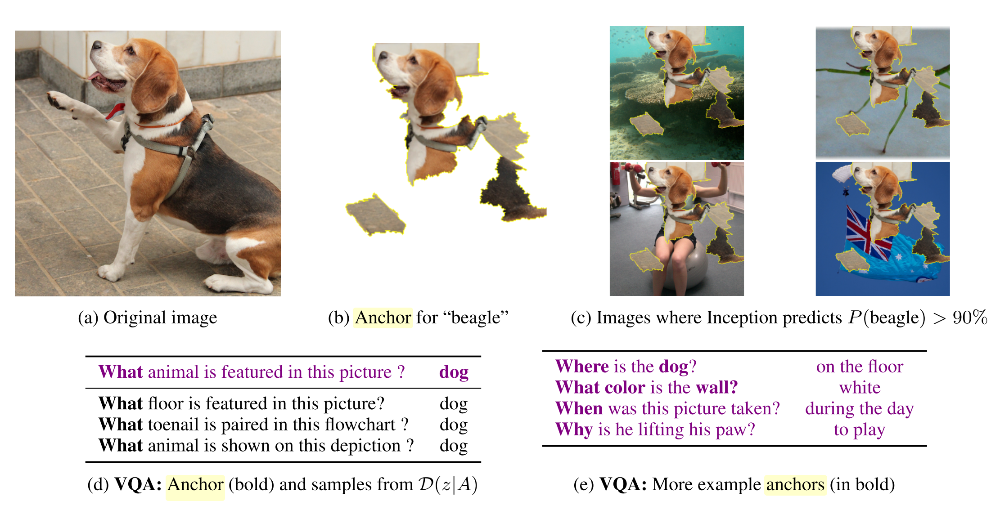

# Counterfactual explanations

A counterfactual of an event describes what the result of the event would have been, if the input were different contrary to what we observed.
For example: 
If I had waited for my meal to cool down, I wouldn't have burned my tongue.
The event here is that I burned my tongue.
The (presumed) cause for this event is that I did not wait long enough for the meal to cool down.
Contrare to the fact, that I didn't wait for the meal to cool down, I ask myself if I would have also burned my tongue if I waited a bit.
Arguably, counterfactuals are -among other powers- what sets humans apart from animals.
Being able to think about counterfactuals, simulating WHAT-IF scenarios in our heads.

In interpretable machine learning counterfactuals can be used to explain single predictions. 
A counterfactual explanation of a machine learning mdoels describes the smallest change to the features that would change the prediction of the model to a pre-defined output.
In a classification setting we could analyse which inputs we have to change to flip the prediction, or we define a probability score and try to find a counterfactual that produces this score (e.g. how to change a predicted 10% to predicted 50%?)
In a regressing setting we also try to find a counterfactual that produces some defined outcome.


Counterfactual explanations are model-agnostic method, since it works only with the model input and output.
Arguably, it could also be in the [model-agnostic chapter](#agnostic), since the output is both a summary for a feature ("change feature A and B to get prediction change") and a new instance ("starting from instance X, change A and B to get instance X'").
Counterfactuals don't have to be actual instances from the data.


Some illustrations:
Peter applies for a loan and gets rejected by the (machine learning powered) bank software.
What is the smallest change to the features (income, number of credit cards, age, ...) that would change the prediction from rejected to approved?
A possible answer could be:
If Peter would earn 10.000 Euros more per year, he would get the loan.


Another example with regression:
A website automatically estimates how much rent can be charged for an appartment.
Anna wants to rent out her flat, but she is not sure what to charge for it, so she decides to use the service.
After entering all the details into the form about the size, the location, if pets are allowed and so on,
the website's algorithm tells her that she can charge 900 Euro.
She are a bit setback because she expected 1000 Euro or maybe more, and doesn't understand the decision.
She kind of trusts the website though, so she thinks it must be right. 
Since nothing prohibits her from trying out different setting to see how the outcome changes. 
She finds out that the appartment would sell for over 1000 Euros, if it were 15 square meters larger.
Interesting, but useless knowledge, because she can't increase the size of the appartment.
Finally, by tweaking only the things under her control (age of built-in kitchen, pets allowed y/n, type of floor, etc.), 
she find out that if she allows pets and improves the isolation by replacing the windows with ones that have better isolation, she can charge 1000 Euros.
Anna had intuitively worked with counterfactuals to change the outcome.


Counterfactuals are [human-friendly explanations](#good-explanation), because they are contrastive to the current situation and they are selective, because they usually focus on a small set of feature changes.
But counterfactuals also suffer from the 'Rashomon effect': 
There is usually more than one counterfactual explanation.
Rashomon is a Japanese movie in which the murder of a Samurai is told by different people.
Each of the stories explains the outcome equally well, but the stories conflict with each other. 
The same can happen with counterfactuals. 
When we search for counterfactual explanations for flipping a classification, we will usually find multiple ways of changing the inputs to flip the classification.
In the Rashomon story, there is of course one true version, but we don't know which one, so we are in a similar situation with the counterfactuals. 
All of them are correct, even if they contradict themselves (one might say to change feature A, the other counterfactuals says to leave A the same, which is a contradiction).
This issue can be dealt with most effectively, by either reporting multiple counterfactual explanations or by having a criterion to rank counterfactuals and choosing the best one. 

Speaking of criteria, what do we require of a good counterfactual?
Most obvious the instance we choose as counterfactual should yield the pre-defined, desired predicted outcome or be very close.
This is not always possible, for example when we do classification and have one very common and one very rare class, and we want to find a counterfactual for an instance for which the classification is the common class, we now have the goal of changing input features to find a counterfactual of our instance, where the outcome is 50% probability for the rare class. 
It could be that the classifier always predicts low probabilities for the  rare case and we would never find a counterfactual.
So we need to relax the requirement a bit that the predicted output of the counterfactual matches exactly the defined outcome.
We want to contrast it to the prediction of a single instance, so the counterfactual example should be as close as possible to the instance of interest. 
This demands some kind of distance function between the instance to be explained and other distances.
To further improve the contrast and the selectiveness of the explanation, we want to change as few of the features as possible to get a counterfactual explanation.
So this needs to be regarded in the search for a counterfactual, that we favor the ones where the least amount of features are changed compared to the instance of interest.
The last requirement we have is that the counterfactual features should have values that are likely. 
It wouldn't be useful to generate a counterfactual explanation where an appartments size is negative or the number of rooms is set to 200.
Even better, it should be likely according to the data distribution, so a flat with 10 rooms and 20 square meters of size should not be created as a counterfactual.

We have talked about what we want from a counterfactual, but how do we actually generate them?

### Finding counterfactual explanations.

What would be the naive or ad-hoc method to find counterfactual explanations to a prediction of a particular instance?
Trial and error would be a natural first try, like in the example about Anna trying to find a version of her appartment for which she can charge more rent.
This approach involves randomly changing features of the instance of interest and stopping when the desired output is predicted.

But there are better approaches than that. 
First, we define a loss function, which tells us for a counterfactual, how good it is in the sense of how close the predicted outcome is to the desired outcome, how close the counterfactual is to the instance of interest and how many features are changed.
With this loss function, we can either use some function optimizer (like gradient descent) or by search / sampling (like Growing Spheres, see alternatives).

In this section I will present the approach suggested by Wachter et. al 2017[^wachter]

As Wachter et. al argue  this is especially useful for GDPR right to explanation.

We optimize the following function:


$$\arg\min_{x'}\left[\lambda\cdot(\hat{f}(x')-y')^2+d(x,x')\right]$$

The first term in the arg min represents the distance between the prediction for the counterfactual x' by the model and the desired outcome y', which the user has to define in advance.
The second term is the distance between the instance x to be explained and the counterfactual x', more about this later.
The $\lambda$ weights the distance in the prediction against the distance of points.
Ideally, the distance in prediction is zero, but this is not always possible.
The function is solved for a given $\lambda$. 
For minimizing this function, a $\lambda$ is fixed, the best counterfactual found and stored.
Then, $\lambda$ is increased and the best counterfactual found.
The prediction of the counterfactual should move closer and closer to the prediction of the instance of interest.
Iteratively solving for x' and increasing $\lambda$ until a sufficiently close solution is found.
The best solution is returned.

If $\lambda$ is set really high, but there is no counterfactual that can satisfy the first term, then the one will be chosen that is closest, regardless how far it is away from x.
So if we go to high, it will only be relevant that the prediction is close, but not the features.

Any optimization algorithm can be used, like Nelder-Mead, ADAM or gradient descent.
Use some optimizer, like ADAM to find a local minimum.


The distance function d is the L1-norm of the manhatten distance, weighted by the inverse median absolute deviation.

$$d(x,x')=\sum_{j=1}^p\frac{|x_j-x'_j|}{MAD_j}$$

Which is the sum over all features of the absolute distance between the counterfactual and the instance of interest.
It is scaled by the mean absolute deviation:


$$MAD_j = median_{i\in{}\{1,\ldots,n\}}(|x_{i,j}-median_{i\in{}\{1,\ldots,n\}}(x_{l,j})|)$$


The Manhatten norm has the advantage of introducing sparsity to the explanations that are generated.
And it is more robust to outliers.
The scaling with the MAD is necessary to bring all the features to the same scale - it shouldn't matter if you measure the size of an apparment in square meters or square feet.


These are the ingredients to find counterfactuals

1. Initialize a random instance as counterfactual
1. Optimize the counterfactual (while increasing $\lambda$)
1. Return the counterfactual that minimizes the loss function.

Let's see some examples.

### Example

The examples are taken from the paper [^wachter].
The first example works with the LSAT dataset about average law school admission tests. 
The analysis is based on a reduced version of the LSTAT dataset, which contains the first-year average grade based on race, grade-point average prior to law school 

The authors train a three-layer fully-connected neural network to predict the students first-year average grade in law school, based on the grade point average (GPA) prior to the law school, their race and the average and on their the law school entrance exam scores.

For this regression model, which predicts the scores of the students, counterfactuals are searched.
The question asked is:
How would the input feature have to be changed, to yield a predicted score of 0?
A predicted score of 0 means an average results, since the scores were normalised before.
A negative score means a result below average, a positive score above average.


The following table shows the learned counterfactuals:

| Score | Original GPA | Original LSAT | Original Race | Cf GPA | Cf LSAT | CF Race |
| ------|--------------| --------------| --------------| -------| --------| ------- |
| 0.17 | 3.1 | 39.0 | 0 | 3.1 | 34.0 | 0|
| 0.54 | 3.7 | 48.0 | 0 | 3.7 | 32.4 | 0|
| -0.77| 3.3 | 28.0 | 1 | 3.3 | 33.5 | 0|
| -0.83| 2.4 | 28.5 | 1 | 2.4 | 35.8 | 0|
| -0.57| 2.7 | 18.3 | 0 | 2.7 | 34.9 | 0|

The first column shows the predicted score, the next 3 columns the original feature values and the last 3 columns the counterfactual feature values that yield a score of 0.
The first two rows are students with a prediction above average, the other three rows below average.
So the counterfactuals for the first two cases are what would have to change to decrease the score and in the other three cases what have to change to increase the score to average.

The counterfactuals always change the race from black (encoded with 1) to white (encoded with 0), showing some racial bias.
The GPA is not changed for creating counterfactuals, but LSAT is.

TODO: ALSO USE THE SECOND EXAMPLE?


### Advantages

**The interpretation is very clear**:
If the instance changes in the shown way, the prediction changes. 
There is no assumptions involved or some magic happening in the background. 
This also means it is not as dangerous as [local models like LIME](#lime), where it is unclear how good the local model is how much I am allowed to extrapolate the model in the neighborhood.

It creates both an instance as returned value, but since it is comparable to the instance of interest, we can also summarize it shortly by stating which features changed.
This gives us **two modes of reporting results**.
Simply returning the counterfactual and / or highlighting which features changed between instance of interest and counterfactual.

The **counterfactual method doesn't need any access to the data or the model**.
It only needs access to the prediction function of the model. 
This can in theory be simply through an API. 
This is attractive for companies, who are audited by a third party or for creating explanations to customers, without revealing the model or the data. 
A company has an interest to protect the model and the data as trade secrets or because of data privacy.
Counterfactuals offer this balance between transparency and privacy.

The method **works also without machine learning**.
We can create counterfactuals for any system that received inputs and creates outputs.
For example let's say you apply for a job and you get rejections based on your CV.
You know that the companies did not use machine learning for that.

**It's relatively easy to implement**, since it's essentially one loss function that has to be implemented and which can be optimized with standard optimizer libraries. 
Of course some details have to be take care of, like allowing also categorial features.


### Disadvantages

The counterfactuals method **lacks a general software implementation**.
And a method is only useful if it is implemented. 
Fortunately, it should be easy to implement and hopefully I can remove that statement here soon.

**There are usually many counterfactuals to a case (Rashomon effect)**.
This is inconvenient - people love single, simple explanations for things and don't like being offered multiple different explanations.
It also poses a practical challenge: 
Let's say we generated 23 counterfactuals as explanations for an instance. 
Do we report all of them?
Just the best one?
What if they are all relatively "good", but very different?
These questions have to be answered individually per project.

It is **unclear how to optimize for $\lambda$** in practice.
But this is also a question of the application: 
Is it more important that the prediction of the counterfactual is the desired prediction or that the counterfactual is similar to the instance of interest?
Maybe it's okay to create a counterfactual that changes the the predicted appartment rent from 900 Euros to 990 (of the desired 1000) by only changing one feature. 
By increasing lambda, we find a counterfactual appartment with a predicted rent of 1001, which is closer to the desired outcome, but 4 features had to change dramatically for it. 
Which one is the better counterfactual?
Again, this has to be answered case by case

The proposed solution and distance function has **no real solution for categorical features**, which may have many different levels. 
The solution in the paper is not meaningful for more factors and or factors with more levels, because then there are many combinations and the number of evaluations we have to do would explode.

### Software and Alternatives

- Unfortunately there is no software available so far. 
- An alternative way of searching for counterfactuals is by drawing a sphere around the point of interest, sampling points, checking if one of the sampled points has the desired outcome and either contract or expand the sphere. 
This approach is presented by Laugel et. al (2017)[^spheres]. 
They don't use the word counterfactual in their paper, but the method is rather similar.
They also have a loss function that favors counterfactuals with changes in as few features as possible.
This is a greedy search approach.
```{r importance-bike, fig.cap = "An illustration of growing spheres and selecting sparse counterfactuals by Laugel et. al (2017)"}
knitr::include_graphics("images/spheres.png")
```

- Anchors by Ribeiro et. al 2018 [^anchors] are the opposite of counterfactuals.
Anchors are the answer to the question: 
Which features are sufficient to anchor a prediction, i.e. changing the other features can't change the prediction.
That is, when we have found anchors and leaving those features untouched, we will find no counterfactual instances by changing the other features.
```{r importance-bike, fig.cap = "Examples for anchors taken by Ribeiro et. al (2018)}

```


[^anchors]: Ribeiro, M. T., & Guestrin, C. (n.d.). Anchors : High-Precision Model-Agnostic Explanations.

[^spheres]: Laugel, T., Lesot, M.-J., Marsala, C., Renard, X., & Detyniecki, M. (2017). Inverse Classification for Comparison-based Interpretability in Machine Learning. Retrieved from http://arxiv.org/abs/1712.08443

[^wachter]: Wachter, S., Mittelstadt, B., & Russell, C. (2017). Counterfactual Explanations without Opening the Black Box: Automated Decisions and the GDPR, (1), 1–47. https://doi.org/10.2139/ssrn.3063289