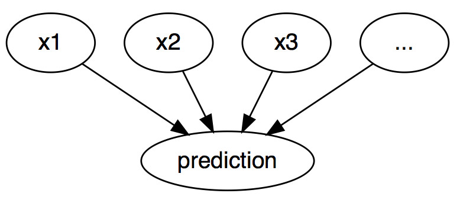
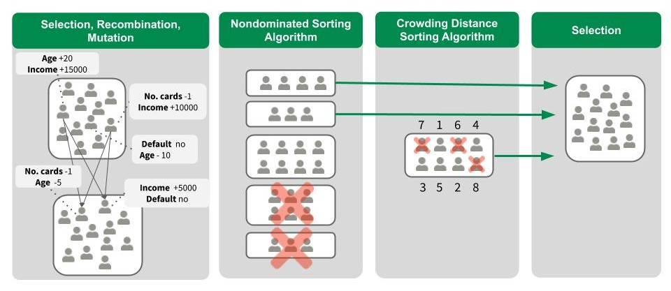

<!--{pagebreak}-->

## Counterfactual Explanations {#counterfactual}

*Authors: Susanne Dandl & Christoph Molnar*

```{r, message = FALSE, warning = FALSE, echo = FALSE}
devtools::load_all()
set.seed(42)
```

Counterfactual explanations menggambarkan situasi kausal dalam bentuk: "Jika X tidak terjadi, Y tidak akan terjadi".
Misalnya: "Jika saya tidak menyesap kopi panas ini, lidah saya tidak akan terbakar".
Acara Y adalah saya membakar lidah saya;
karena X adalah saya minum kopi panas.
Berpikir dalam kontrafaktual membutuhkan membayangkan realitas hipotetis yang bertentangan dengan fakta yang diamati (misalnya, dunia di mana saya belum minum kopi panas), maka nama "kontrafaktual".
Kemampuan berpikir kontrafaktual menjadikan kita manusia begitu cerdas dibandingkan dengan hewan lain.

Dalam machine learning yang dapat diinterpretasikan, counterfactual explanations dapat digunakan untuk menjelaskan prediksi instance individu.
"Peristiwa" adalah hasil yang diprediksi dari sebuah instance, "penyebab" adalah nilai fitur tertentu dari instance ini yang dimasukkan ke model dan "menyebabkan" prediksi tertentu.
Ditampilkan sebagai grafik, hubungan antara input dan prediksi sangat sederhana:
Nilai fitur menyebabkan prediksi.

```{r ml-graph-cf, fig.cap = "The causal relationships between inputs of a machine learning model and the predictions, when the model is merely seen as a black box. The inputs cause the prediction (not necessarily reflecting the real causal relation of the data).", out.width=500, align = 'center'}

```

Bahkan jika pada kenyataannya hubungan antara input dan hasil yang diprediksi mungkin tidak kausal, kita dapat melihat input dari model sebagai penyebab prediksi.

Dengan grafik sederhana ini, mudah untuk melihat bagaimana kita dapat mensimulasikan kontrafaktual untuk prediksi model machine learning:
Kami hanya mengubah nilai fitur dari sebuah instance sebelum membuat prediksi dan kami menganalisis bagaimana prediksi berubah.
Kami tertarik pada skenario di mana prediksi berubah dengan cara yang relevan, seperti pembalikan kelas prediksi (misalnya, aplikasi kredit diterima atau ditolak) atau di mana prediksi mencapai ambang tertentu (misalnya, kemungkinan kanker mencapai 10 %).
**counterfactual explanations tentang prediksi menjelaskan perubahan terkecil pada nilai fitur yang mengubah prediksi menjadi keluaran yang telah ditentukan sebelumnya.**

Ada metode counterfactual explanations model-agnostic dan model-spesifik, tetapi dalam bab ini kami fokus pada metode model-agnostic yang hanya bekerja dengan input dan output model (dan bukan struktur internal model tertentu).
Metode ini juga akan terasa nyaman di [bab model-agnostic](#agnostic), karena interpretasi dapat dinyatakan sebagai ringkasan perbedaan nilai fitur ("ubah fitur A dan B untuk mengubah prediksi").
Tetapi counterfactual explanations itu sendiri merupakan contoh baru, jadi ia tinggal di bab ini ("mulai dari contoh X, ubah A dan B untuk mendapatkan contoh kontrafaktual").
Tidak seperti [prototypes](#proto), kontrafaktual tidak harus berupa instance aktual dari data pelatihan, tetapi dapat berupa kombinasi baru dari nilai fitur.

Sebelum membahas cara membuat kontrafaktual, saya ingin membahas beberapa kasus penggunaan kontrafaktual dan bagaimana counterfactual explanations yang baik.

Dalam contoh pertama ini, Peter mengajukan pinjaman dan ditolak oleh perangkat lunak perbankan (bertenaga machine learning).
Dia bertanya-tanya mengapa aplikasinya ditolak dan bagaimana dia bisa meningkatkan peluangnya untuk mendapatkan pinjaman.
Pertanyaan “mengapa” dapat dirumuskan sebagai kontrafaktual:
Apa perubahan terkecil pada fitur (pendapatan, jumlah kartu kredit, usia, ...) yang akan mengubah prediksi dari ditolak menjadi disetujui?
Salah satu jawaban yang mungkin adalah:
Jika Peter akan mendapatkan 10.000 Euro lebih banyak per tahun, dia akan mendapatkan pinjaman.
Atau jika Peter memiliki lebih sedikit kartu kredit dan tidak gagal membayar pinjaman 5 tahun yang lalu, dia akan mendapatkan pinjaman.
Peter tidak akan pernah tahu alasan penolakannya, karena bank tidak tertarik pada transparansi, tapi itu cerita lain.

Dalam contoh kedua kami, kami ingin menjelaskan model yang memprediksi hasil berkelanjutan dengan counterfactual explanations.
Anna ingin menyewakan apartemennya, tetapi dia tidak yakin berapa biayanya, jadi dia memutuskan untuk melatih model machine learning untuk memprediksi harga sewanya.
Tentu saja, karena Anna adalah seorang ilmuwan data, begitulah cara dia menyelesaikan masalahnya.
Setelah memasukkan semua detail tentang ukuran, lokasi, apakah hewan peliharaan diperbolehkan dan sebagainya, model tersebut mengatakan kepadanya bahwa dia dapat mengenakan biaya 900 Euro.
Dia mengharapkan 1000 Euro atau lebih, tetapi dia mempercayai modelnya dan memutuskan untuk bermain dengan nilai fitur apartemen untuk melihat bagaimana dia dapat meningkatkan nilai apartemen.
Dia mengetahui bahwa apartemen itu bisa disewa dengan harga lebih dari 1000 Euro, jika lebih besar 15 m^2^.
Pengetahuan yang menarik, tetapi tidak dapat ditindaklanjuti, karena dia tidak dapat memperbesar apartemennya.
Akhirnya, dengan mengubah hanya nilai fitur di bawah kendalinya (dapur built-in ya/tidak, hewan peliharaan diperbolehkan ya/tidak, jenis lantai, dll.), dia menemukan bahwa jika dia mengizinkan hewan peliharaan dan memasang jendela dengan insulasi yang lebih baik, dia dapat mengisi 1000 Euro.
Anna secara intuitif bekerja dengan kontrafaktual untuk mengubah hasilnya.

Counterfactuals adalah [penjelasan ramah manusia](#good-explanation), karena kontras dengan contoh saat ini dan karena selektif, artinya mereka biasanya fokus pada sejumlah kecil perubahan fitur.
Tapi kontrafaktual menderita dari 'efek Rashomon'.
Rashomon adalah film Jepang di mana pembunuhan seorang Samurai diceritakan oleh orang yang berbeda.
Masing-masing cerita menjelaskan hasilnya dengan sama baiknya, tetapi cerita-cerita itu saling bertentangan.
Hal yang sama juga dapat terjadi dengan kontrafaktual, karena biasanya ada beberapa counterfactual explanations yang berbeda.
Setiap kontrafaktual menceritakan "kisah" yang berbeda tentang bagaimana hasil tertentu dicapai.
Satu kontrafaktual mungkin mengatakan untuk mengubah fitur A, kontrafaktual lainnya mungkin mengatakan untuk membiarkan A tetap sama tetapi mengubah fitur B, yang merupakan kontradiksi.
Masalah kebenaran ganda ini dapat diatasi baik dengan melaporkan semua counterfactual explanations atau dengan memiliki kriteria untuk mengevaluasi kontrafaktual dan memilih yang terbaik.

Berbicara tentang kriteria, bagaimana kita mendefinisikan counterfactual explanations yang baik?
Pertama, pengguna counterfactual explanations mendefinisikan perubahan yang relevan dalam prediksi suatu kejadian (= realitas alternatif).
Persyaratan pertama yang jelas adalah bahwa **contoh kontrafaktual menghasilkan prediksi yang telah ditentukan sedekat mungkin**.
Tidak selalu mungkin untuk menemukan kontrafaktual dengan prediksi yang telah ditentukan sebelumnya.
Misalnya, dalam pengaturan klasifikasi dengan dua kelas, kelas yang jarang dan kelas yang sering, model mungkin selalu mengklasifikasikan sebuah instance sebagai kelas yang sering.
Mengubah nilai fitur sehingga label yang diprediksi akan berubah dari kelas yang sering ke kelas yang jarang mungkin tidak mungkin.
Oleh karena itu, kami ingin melonggarkan persyaratan bahwa prediksi kontrafaktual harus sama persis dengan hasil yang telah ditentukan sebelumnya.
Dalam contoh klasifikasi, kita dapat mencari kontrafaktual di mana probabilitas prediksi kelas langka meningkat menjadi 10%, bukan 2% saat ini.
Pertanyaannya kemudian adalah, apa perubahan minimal pada fitur sehingga probabilitas yang diprediksi berubah dari 2% menjadi 10% (atau mendekati 10%)?
Kriteria kualitas lainnya adalah **sebuah kontrafaktual harus semirip mungkin dengan contoh terkait nilai fitur**.
Jarak antara dua contoh dapat diukur, misalnya, dengan jarak Manhattan atau jarak Gower jika kita memiliki fitur diskrit dan kontinu.
Counterfactual tidak hanya harus dekat dengan instance asli, tetapi juga harus **mengubah fitur sesedikit mungkin**.
Untuk mengukur seberapa baik counterfactual explanations dalam metrik ini, kita cukup menghitung jumlah fitur yang diubah atau, dalam istilah matematika yang bagus, mengukur norma $L_0$ antara contoh kontrafaktual dan aktual.
Ketiga, seringkali diinginkan untuk menghasilkan **beberapa counterfactual explanations yang beragam** sehingga subjek keputusan mendapatkan akses ke berbagai cara yang layak untuk menghasilkan hasil yang berbeda. Misalnya, melanjutkan contoh pinjaman kami, satu counterfactual explanations mungkin menyarankan hanya untuk menggandakan pendapatan untuk mendapatkan pinjaman, sementara kontrafaktual lain mungkin menyarankan untuk pindah ke kota terdekat dan meningkatkan pendapatan dengan jumlah kecil untuk mendapatkan pinjaman. Dapat dicatat bahwa sementara kontrafaktual pertama mungkin untuk beberapa, yang terakhir mungkin lebih dapat ditindaklanjuti untuk beberapa. Jadi, selain memberikan subjek keputusan dengan cara yang berbeda untuk mendapatkan hasil yang diinginkan, keragaman juga memungkinkan individu yang "beraneka ragam" untuk mengubah fitur yang nyaman bagi mereka.
Persyaratan terakhir adalah bahwa **instance kontrafaktual harus memiliki nilai fitur yang mungkin**.
Tidak masuk akal untuk menghasilkan counterfactual explanations untuk contoh sewa di mana ukuran apartemen negatif atau jumlah kamar diatur ke 200.
Lebih baik lagi bila kontrafaktualnya menurut distribusi data bersama, misalnya apartemen dengan 10 kamar dan 20 m^2^ tidak boleh dianggap sebagai counterfactual explanations.
Idealnya, jika jumlah meter persegi ditingkatkan, peningkatan jumlah kamar juga harus diusulkan.

### Generating Counterfactual Explanations

Pendekatan sederhana dan naif untuk menghasilkan counterfactual explanations adalah mencari dengan coba-coba.
Pendekatan ini melibatkan perubahan nilai fitur secara acak dari instance yang diinginkan dan berhenti ketika output yang diinginkan diprediksi.
Seperti contoh di mana Anna mencoba menemukan versi apartemennya yang bisa dikenakan biaya sewa lebih banyak.
Tetapi ada pendekatan yang lebih baik daripada coba-coba.
Pertama, kami mendefinisikan loss function berdasarkan kriteria yang disebutkan di atas.
loss ini mengambil sebagai masukan contoh kepentingan, kontrafaktual dan hasil yang diinginkan (kontrafaktual).
Kemudian, kita dapat menemukan counterfactual explanations yang meminimalkan loss ini menggunakan algoritma optimasi.
Banyak metode melanjutkan dengan cara ini tetapi berbeda dalam definisi loss function dan metode optimasi.

Berikut ini, kami fokus pada dua di antaranya: pertama, yang oleh Wachter et. al (2017)[^wachter] yang memperkenalkan counterfactual explanations sebagai metode interpretasi dan, kedua, oleh Dandl et al. (2020)[^dandl] yang memperhitungkan keempat kriteria yang disebutkan di atas.


#### Method by Wachter et al. 
Wachter dkk. menyarankan meminimalkan loss berikut:

$$L(x,x^\prime,y^\prime,\lambda)=\lambda\cdot(\hat{f}(x^\prime)-y^\prime)^2+d(x,x^\prime)$$

Suku pertama adalah jarak kuadrat antara prediksi model untuk kontrafaktual x' dan hasil yang diinginkan y', yang harus ditentukan pengguna terlebih dahulu.
Suku kedua adalah jarak d antara contoh x yang akan dijelaskan dan kontrafaktual x'.
loss mengukur seberapa jauh hasil prediksi kontrafaktual dari hasil yang telah ditentukan dan seberapa jauh kontrafaktual dari contoh yang diinginkan.
Fungsi jarak d didefinisikan sebagai jarak Manhattan yang dibobot dengan deviasi absolut median terbalik (MAD) dari setiap fitur.

$$d(x,x^\prime)=\sum_{j=1}^p\frac{|x_j-x^\prime_j|}{MAD_j}$$

Jarak total adalah jumlah dari semua p jarak berdasarkan fitur, yaitu, perbedaan mutlak nilai fitur antara contoh x dan kontrafaktual x'.
Jarak feature-wise diskalakan dengan kebalikan dari deviasi absolut median fitur j di atas kumpulan data yang didefinisikan sebagai:

$$MAD_j=\text{median}_{i\in{}\{1,\ldots,n\}}(|x_{i,j}-\text{median}_{l\in{}\{1,\ldots,n\}}(x_{l,j})|)$$

Median vektor adalah nilai di mana setengah dari nilai vektor lebih besar dan setengah lainnya lebih kecil.
MAD adalah setara dengan varians fitur, tetapi alih-alih menggunakan mean sebagai pusat dan menjumlahkan jarak kuadrat, kami menggunakan median sebagai pusat dan menjumlahkan jarak absolut.
Fungsi jarak yang diusulkan memiliki keunggulan dibandingkan jarak Euclidean yaitu
itu lebih kuat untuk outlier.
Penskalaan dengan MAD diperlukan untuk membawa semua fitur ke skala yang sama - tidak masalah apakah Anda mengukur ukuran apartemen dalam meter persegi atau kaki persegi.

Parameter $\lambda$ menyeimbangkan jarak dalam prediksi (istilah pertama) dengan jarak dalam nilai fitur (istilah kedua).
Loss diselesaikan untuk $\lambda$ tertentu dan mengembalikan x' kontrafaktual.
Nilai $\lambda$ yang lebih tinggi berarti bahwa kami lebih menyukai kontrafaktual dengan prediksi yang mendekati hasil yang diinginkan y', nilai yang lebih rendah berarti bahwa kami lebih menyukai kontrafaktual x' yang sangat mirip dengan x dalam nilai fitur.
Jika $\lambda$ sangat besar, instance dengan prediksi yang paling dekat dengan y' akan dipilih, terlepas dari seberapa jauh jaraknya dari x.
Pada akhirnya, pengguna harus memutuskan bagaimana menyeimbangkan persyaratan bahwa prediksi untuk kontrafaktual sesuai dengan hasil yang diinginkan dengan persyaratan bahwa kontrafaktual mirip dengan x.
Penulis metode menyarankan daripada memilih nilai untuk $\lambda$ untuk memilih toleransi $\epsilon$ untuk seberapa jauh prediksi dari contoh kontrafaktual diperbolehkan dari y'.
Batasan ini dapat ditulis sebagai:

$$|\hat{f}(x^\prime)-y^\prime|\leq\epsilon$$

Untuk meminimalkan loss function ini, algoritma optimasi yang sesuai dapat digunakan, seperti Nelder-Mead.
Jika Anda memiliki akses ke gradien model machine learning, Anda dapat menggunakan metode berbasis gradien seperti ADAM.
Contoh x yang akan dijelaskan, keluaran yang diinginkan y' dan parameter toleransi $\epsilon$ harus ditetapkan terlebih dahulu.
loss function diminimalkan untuk x' dan kontrafaktual x' optimal (lokal) dikembalikan sambil meningkatkan $\lambda$ hingga solusi yang cukup dekat ditemukan (= dalam parameter toleransi):

$$\arg\min_{x^\prime}\max_{\lambda}L(x,x^\prime,y^\prime,\lambda).$$

Secara keseluruhan, resep untuk menghasilkan kontrafaktual sederhana:

1. Pilih contoh x untuk dijelaskan, hasil yang diinginkan y', toleransi $\epsilon$ dan nilai awal (rendah) untuk $\lambda$.
1. Contoh contoh acak sebagai kontrafaktual awal.
1. Optimalkan loss dengan kontrafaktual sampel awalnya sebagai titik awal.
1. Sementara $|\hat{f}(x^\prime)-y^\prime|>\epsilon$:
    - Tingkatkan $\lambda$.
    - Optimalkan loss dengan kontrafaktual saat ini sebagai titik awal.
    - Kembalikan kontrafaktual yang meminimalkan loss.
1. Ulangi langkah 2-4 dan kembalikan daftar kontrafaktual atau daftar yang meminimalkan loss.

Metode yang diusulkan memiliki beberapa kelemahan.
Ini **hanya mempertimbangkan kriteria pertama dan kedua** bukan dua yang terakhir ("menghasilkan kontrafaktual dengan hanya sedikit perubahan fitur dan kemungkinan nilai fitur").
d tidak menyukai solusi sparse karena menambah 10 fitur sebanyak 1 akan memberikan jarak yang sama ke x dengan meningkatkan satu fitur sebesar 10.
Kombinasi fitur yang tidak realistis tidak dikenakan sanksi.

Metode ini **tidak menangani fitur kategoris** dengan banyak level berbeda dengan baik.
Penulis metode menyarankan untuk menjalankan metode secara terpisah untuk setiap kombinasi nilai fitur dari fitur kategoris, tetapi ini akan menyebabkan ledakan kombinatorial jika Anda memiliki beberapa fitur kategoris dengan banyak nilai.
Misalnya, 6 fitur kategoris dengan 10 level unik berarti 1 juta run.

Sekarang mari kita lihat pendekatan lain untuk mengatasi masalah ini.


#### Method by Dandl et al. 

Dandl dkk. menyarankan untuk secara bersamaan meminimalkan four-objective loss:

$$L(x,x',y',X^{obs})=\big(o_1(\hat{f}(x'),y'),o_2(x, x'),o_3(x,x'),o_4(x',X^{obs})\big) $$ 

Masing-masing dari empat tujuan $o_1$ hingga $o_4$ sesuai dengan salah satu dari empat kriteria yang disebutkan di atas.
Tujuan pertama $o_1$ mencerminkan bahwa prediksi kontrafaktual x' harus sedekat mungkin dengan prediksi y' yang diinginkan.
Oleh karena itu, kami ingin meminimalkan jarak antara $\hat{f}(x')$ dan y', di sini dihitung dengan metrik Manhattan (norma ($L_1$):

$$o_1(\hat{f}(x'),y')=\begin{cases}0&\text{if $\hat{f}(x')\in{}y'$}\\\inf\limits_{y'\in y'}|\hat{f}(x')-y'|&\text{else}\end{cases}$$

Tujuan kedua $o_2$ mencerminkan bahwa kontrafaktual kita harus semirip mungkin dengan instance $x$ kita.
Ini mengukur jarak antara x' dan x
sebagai jarak Gower:

$$o_2(x,x')=\frac{1}{p}\sum_{j=1}^{p}\delta_G(x_j, x'_j)$$

dengan p adalah jumlah fitur.
Nilai $\delta_G$ bergantung pada tipe fitur $x_j$:

$$\delta_G(x_j,x'_j)=\begin{cases}\frac{1}{\widehat{R}_j}|x_j-x'_j|&\text{if $x_j$ numerical}\\\mathbb{I}_{x_j\neq{}x'_j}&\text{if $x_j$ categorical}\end{cases}$$

Membagi jarak fitur numerik $j$ dengan $\widehat{R}_j$, rentang nilai yang diamati, menskalakan $\delta_G$ untuk semua fitur antara 0 dan 1.

Jarak Gower dapat menangani fitur numerik dan kategorikal tetapi tidak menghitung berapa banyak fitur yang diubah.
Oleh karena itu, kami menghitung jumlah fitur dalam tujuan ketiga $o_3$ menggunakan norma $L_0$:

$$o_3(x,x')=||x-x'||_0=\sum_{j=1}^{p}\mathbb{I}_{x'_j\neq x_j}.$$

Dengan meminimalkan $o_3$ kami bertujuan untuk kriteria ketiga kami - perubahan fitur yang jarang.

Tujuan keempat $o_4$ mencerminkan bahwa kontrafaktual kita seharusnya memiliki kemungkinan nilai/kombinasi fitur.
Kita dapat menyimpulkan seberapa "kemungkinan" suatu titik data menggunakan data pelatihan atau kumpulan data lainnya.
Kami menyatakan dataset ini sebagai $X^{obs}$.
Sebagai perkiraan kemungkinan, $o_4$ mengukur jarak Gower rata-rata antara x' dan titik data pengamatan terdekat $x^{[1]}\in{}X^{obs}$:

$$o_4(x',\textbf{X}^{obs})=\frac{1}{p}\sum_{j=1}^{p}\delta_G(x'_j,x^{[1]}_j)$$

Dibandingkan dengan Wachter dkk., $L(x,x',y',X^{obs})$ tidak memiliki istilah penyeimbang/pembobotan seperti $\lambda$.
Kami tidak ingin menciutkan empat tujuan $o_1$, $o_2$, $o_3$ dan $o_4$ menjadi satu tujuan dengan menjumlahkannya dan memberi bobot, tetapi kami ingin mengoptimalkan keempat istilah secara bersamaan.

Bagaimana kita bisa melakukan itu?
Kami menggunakan **Nondominated Sorting Genetic Algorithm**[^deb] atau NSGA-II singkat.
NSGA-II adalah algoritma yang terinspirasi dari alam yang menerapkan hukum Darwin tentang "survival of the fittest".
Kami menyatakan kesesuaian kontrafaktual dengan nilai vektor tujuan $(o_1,o_2,o_3,o_4)$.
Semakin rendah sebuah kontrafaktual empat tujuan, semakin "bugar" itu.

Algoritma terdiri dari empat langkah yang diulang sampai kriteria berhenti terpenuhi, misalnya, jumlah maksimum iterasi/generasi.
Gambar berikut memvisualisasikan empat langkah dari satu generasi.

```{r nsgaII-cf, fig.cap = "Visualization of one generation of the NSGA-II algorithm.", out.width=700}

```

Pada generasi pertama sekelompok kandidat kontrafaktual diinisialisasi dengan mengubah beberapa fitur secara acak dibandingkan dengan contoh x yang akan dijelaskan.
Berpegang pada contoh kredit di atas, satu kontrafaktual dapat menyarankan untuk meningkatkan pendapatan sebesar € 30.000 sementara yang lain mengusulkan untuk tidak mengalami default dalam 5 tahun terakhir dan pengurangan usia sebesar 10.
Semua nilai fitur lainnya sama dengan nilai x.
Setiap kandidat kemudian dievaluasi menggunakan empat fungsi tujuan di atas.
Di antara mereka, kami secara acak memilih beberapa kandidat, di mana kandidat yang lebih bugar kemungkinan besar akan dipilih.
Kandidat digabungkan kembali secara berpasangan untuk menghasilkan anak-anak yang mirip dengan mereka dengan merata-ratakan nilai fitur numerik mereka atau dengan menyilangkan fitur kategoris mereka.
Selain itu, kami sedikit mengubah nilai fitur anak-anak untuk menjelajahi seluruh ruang fitur.

Dari dua kelompok yang dihasilkan, satu dengan orang tua dan satu dengan anak-anak, kami hanya ingin setengah terbaik menggunakan dua algoritma pengurutan.
Algoritma penyortiran nondominated mengurutkan kandidat menurut nilai objektifnya.
Jika kandidat sama baiknya, algoritma crowding distance sorting mengurutkan kandidat berdasarkan keragamannya.

Mengingat peringkat dari dua algoritme pengurutan, kami memilih separuh kandidat yang paling menjanjikan dan/atau paling beragam.
Kami menggunakan set ini untuk generasi berikutnya dan memulai lagi dengan proses seleksi, rekombinasi dan mutasi.
Dengan mengulangi langkah-langkah tersebut berulang-ulang, kami berharap dapat mendekati beragam kandidat yang menjanjikan dengan nilai objektif yang rendah.
Dari set ini kita dapat memilih yang paling memuaskan kita, atau kita dapat memberikan ringkasan semua kontrafaktual dengan menyoroti fitur mana dan seberapa sering telah diubah.

### Example

Contoh berikut didasarkan pada contoh kumpulan data kredit di Dandl et al. (2020).
Kumpulan data Risiko Kredit Jerman dapat ditemukan di platform tantangan machine learning [kaggle.com](https://www.kaggle.com/uciml/german-credit).

Penulis melatih support vector machine (dengan radial basis kernel) untuk memprediksi probabilitas bahwa pelanggan memiliki risiko kredit yang baik.
Kumpulan data yang sesuai memiliki 522 pengamatan lengkap dan sembilan fitur yang berisi informasi kredit dan pelanggan.

Tujuannya adalah untuk menemukan counterfactual explanations untuk pelanggan dengan nilai fitur berikut

|age|sex|job |housing|savings|checking|amount|duration|purpose|  |
|---|---|----|-------------|--------|---------------|----------|----------|----|
|58  |f|unskilled|free|little|little |6143            |48     |car|


SVM memprediksi bahwa wanita tersebut memiliki risiko kredit yang baik dengan probabilitas 24,2 \%.
Kontrafaktual harus menjawab bagaimana fitur input perlu diubah untuk mendapatkan probabilitas yang diprediksi lebih besar dari 50 \%?

Tabel berikut menunjukkan 10 kontrafaktual terbaik:

|age|sex|job |amount|duration|$o_2$|$o_3$|$o_3$|$\hat{f}(x')$|
|---|---|----|-------------|--------|---------------|----------|----------|----|
|   |   |skilled   |             |-20     |0.108          |2         |0.036     |0.501|
|   |   |skilled   |             |-24     |0.114          |2         |0.029     |0.525|
|   |   |skilled   |             |-22     |0.111          |2         |0.033     |0.513|
|-6 |   |skilled   |             |-24     |0.126          |3         |0.018     |0.505|
|-3 |   |skilled   |             |-24     |0.120          |3         |0.024     |0.515|
|-1 |   |skilled   |             |-24     |0.116          |3         |0.027     |0.522|
|-3 |m|  |             |-24     |0.195          |3         |0.012     |0.501|
|-6 |m|  |             |-25     |0.202          |3         |0.011     |0.501|
|-30|m|skilled  |             |-24     |0.285          |4         |0.005     |0.590|
|-4 |m|  |-1254        |-24     |0.204          |4         |0.002     |0.506|


Lima kolom pertama berisi perubahan fitur yang diusulkan (hanya fitur yang diubah yang ditampilkan), tiga kolom berikutnya menunjukkan nilai objektif ($o_1$ sama dengan 0 dalam semua kasus) dan kolom terakhir menampilkan probabilitas yang diprediksi.

Semua kontrafaktual telah memprediksi probabilitas lebih besar dari 50 \% dan tidak saling mendominasi.
Nondominated berarti bahwa tidak ada kontrafaktual yang memiliki nilai lebih kecil di semua tujuan daripada kontrafaktual lainnya.
Kita dapat menganggap kontrafaktual kita sebagai satu set solusi trade-off.

Mereka semua menyarankan pengurangan durasi dari 48 bulan menjadi minimal 23 bulan, beberapa dari mereka mengusulkan agar wanita menjadi terampil bukan tidak terampil.
Beberapa kontrafaktual bahkan menyarankan untuk mengubah jenis kelamin dari perempuan menjadi laki-laki yang menunjukkan bias gender model.
Perubahan ini selalu disertai dengan pengurangan usia antara 1 hingga 30 tahun.
Kita juga dapat melihat bahwa meskipun beberapa kontrafaktual menyarankan perubahan pada 4 fitur, kontrafaktual ini adalah yang paling dekat dengan data pelatihan.

### Advantages

**Penafsiran counterfactual explanations sangat jelas**.
Jika nilai fitur dari sebuah instance diubah sesuai dengan kontrafaktual, prediksi berubah menjadi prediksi yang telah ditentukan sebelumnya.
Tidak ada asumsi tambahan dan tidak ada keajaiban di latar belakang.
Ini juga berarti tidak berbahaya seperti metode seperti [LIME](#lime), di mana tidak jelas seberapa jauh kita dapat memperkirakan model lokal untuk interpretasi.

Metode kontrafaktual membuat contoh baru, tetapi kita juga dapat meringkas kontrafaktual dengan melaporkan nilai fitur mana yang telah berubah.
Ini memberi kami **dua opsi untuk melaporkan hasil kami**.
Anda dapat melaporkan instans kontrafaktual atau menyoroti fitur mana yang telah diubah antara instans yang diminati dan instans kontrafaktual.

**Metode kontrafaktual tidak memerlukan akses ke data atau model**.
Ini hanya membutuhkan akses ke fungsi prediksi model, yang juga akan berfungsi melalui API web, misalnya.
Ini menarik bagi perusahaan yang diaudit oleh pihak ketiga atau yang menawarkan penjelasan kepada pengguna tanpa mengungkapkan model atau datanya.
Suatu perusahaan berkepentingan untuk melindungi model dan data karena alasan rahasia dagang atau perlindungan data.
Counterfactual explanations menawarkan keseimbangan antara menjelaskan prediksi model dan melindungi kepentingan pemilik model.

Metode ini **berfungsi juga dengan sistem yang tidak menggunakan machine learning**.
Kita dapat membuat kontrafaktual untuk sistem apa pun yang menerima input dan mengembalikan output.
Sistem yang memprediksi sewa apartemen juga dapat terdiri dari aturan tulisan tangan, dan counterfactual explanations akan tetap berfungsi.

**Metode counterfactual explanations relatif mudah diterapkan**, karena pada dasarnya merupakan loss function (dengan satu atau banyak tujuan) yang dapat dioptimalkan dengan pustaka pengoptimal standar.
Beberapa detail tambahan harus diperhitungkan, seperti membatasi nilai fitur ke rentang yang berarti (misalnya, hanya ukuran apartemen positif).

### Disadvantages

**Untuk setiap contoh, Anda biasanya akan menemukan beberapa counterfactual explanations (efek Rashomon)**.
Ini tidak nyaman - kebanyakan orang lebih suka penjelasan sederhana daripada kompleksitas dunia nyata.
Ini juga merupakan tantangan praktis.
Katakanlah kita menghasilkan 23 counterfactual explanations untuk satu contoh.
Apakah kita melaporkan semuanya?
Hanya yang terbaik?
Bagaimana jika semuanya relatif "baik", tetapi sangat berbeda?
Pertanyaan-pertanyaan ini harus dijawab lagi untuk setiap proyek.
Ini juga dapat menguntungkan untuk memiliki beberapa counterfactual explanations, karena dengan demikian manusia dapat memilih yang sesuai dengan pengetahuan mereka sebelumnya.

### Software and Alternatives {#example-software}

Metode counterfactual explanations multi-tujuan oleh Dandl et al. diimplementasikan di [repositori Github](https://github.com/susanne-207/moc/tree/master/counterfactuals).

Dalam paket Python [Alibi](https://github.com/SeldonIO/alibi) penulis menerapkan [metode kontrafaktual sederhana](https://docs.seldon.io/projects/alibi/en/stable/methods/CF.html) serta [metode yang diperluas](https://docs.seldon.io/projects/alibi/en/stable/methods/CFProto.html) yang menggunakan prototypes kelas untuk meningkatkan interpretasi dan konvergensi keluaran algoritme [^vanlooveren].

Karimi dkk. (2019)[^karimi] juga menyediakan implementasi Python dari algoritme MACE mereka di [repositori Github](https://github.com/amirhk/mace).
Mereka menerjemahkan kriteria yang diperlukan untuk kontrafaktual yang tepat ke dalam rumus logis dan menggunakan pemecah kepuasan untuk menemukan kontrafaktual yang memuaskan mereka.

Mothilal dkk. (2020)[^Mothilal] mengembangkan [DICE (Diverse Counterfactual Explanation)](https://github.com/interpretml/DiCE) untuk menghasilkan serangkaian counterfactual explanations yang beragam berdasarkan proses titik penentu. Saat ini, DiCE hanya berfungsi untuk model yang dapat dibedakan karena menggunakan penurunan gradien untuk pengoptimalan.

Cara lain untuk mencari kontrafaktual adalah algoritma Growing Spheres oleh Laugel et. al (2017)[^spheres].
Mereka tidak menggunakan kata kontrafaktual dalam makalah mereka, tetapi metodenya sangat mirip.
Mereka juga mendefinisikan loss function yang mendukung kontrafaktual dengan sesedikit mungkin perubahan dalam nilai fitur.
Alih-alih mengoptimalkan fungsi secara langsung, mereka menyarankan untuk terlebih dahulu menggambar bola di sekitar tempat tujuan, mengambil sampel titik di dalam bola itu dan memeriksa apakah salah satu titik sampel menghasilkan prediksi yang diinginkan.
Kemudian mereka berkontraksi atau memperluas lingkup sesuai sampai kontrafaktual (jarang) ditemukan dan akhirnya dikembalikan.

Anchors oleh Ribeiro et. al (2018)[^anchors] adalah kebalikan dari kontrafaktual, lihat bab tentang [Scoped Rules (Anchors)](#anchors).


[^anchors]: Ribeiro, Marco Tulio, Sameer Singh, and Carlos Guestrin. "Anchors: High-precision model-agnostic explanations." AAAI Conference on Artificial Intelligence (2018).

[^spheres]: Laugel, Thibault, et al. "Inverse classification for comparison-based interpretability in machine learning." arXiv preprint arXiv:1712.08443 (2017).

[^wachter]: Wachter, Sandra, Brent Mittelstadt, and Chris Russell. "Counterfactual explanations without opening the black box: Automated decisions and the GDPR." (2017).

[^vanlooveren]: Van Looveren, Arnaud, and Janis Klaise. "Interpretable Counterfactual Explanations Guided by Prototypes."  arXiv preprint arXiv:1907.02584 (2019).

[^dandl]: Dandl, Susanne, Christoph Molnar, Martin Binder, Bernd Bischl. "Multi-Objective Counterfactual Explanations". In: Bäck T. et al. (eds) Parallel Problem Solving from Nature – PPSN XVI. PPSN 2020. Lecture Notes in Computer Science, vol 12269. Springer, Cham (2020).

[^karimi]: Karimi, Amir-Hossein, Gilles Barthe, Borja Balle and Isabel Valera. “Model-Agnostic Counterfactual Explanations for Consequential Decisions.” AISTATS (2020).

[^deb]: Deb, Kalyanmoy, Amrit Pratap, Sameer Agarwal and T. Meyarivan, "A fast and elitist multiobjective genetic algorithm: NSGA-II," in IEEE Transactions on Evolutionary Computation, vol. 6, no. 2, pp. 182-197, April 2002, doi: 10.1109/4235.996017.

[^Mothilal]: Mothilal, Ramaravind K., Amit Sharma, and Chenhao Tan. "Explaining machine learning classifiers through diverse counterfactual explanations." Proceedings of the 2020 Conference on Fairness, Accountability, and Transparency. 2020.
