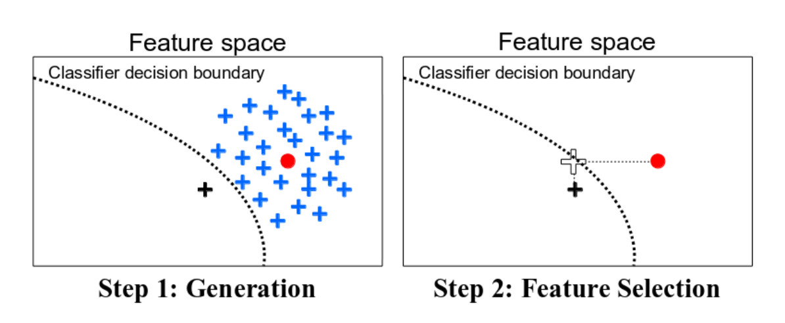

<!--{pagebreak}-->

## Counterfactual Explanations {#counterfactual}

```{r, message = FALSE, warning = FALSE, echo = FALSE}
devtools::load_all()
set.seed(42)
```

A counterfactual explanation describes a causal situation in the form: "If X had not occurred, Y would not have occurred".
For example: "If I hadn't taken a sip of this hot coffee, I wouldn't have burned my tongue".
Event Y is that I burned my tongue;
cause X is that I had a hot coffee.
Thinking in counterfactuals requires imagining a hypothetical reality that contradicts the observed facts (e.g. a world in which I have not drunk the hot coffee), hence the name "counterfactual".
The ability to think in counterfactuals makes us humans so smart compared to other animals.

In interpretable machine learning, counterfactual explanations can be used to explain predictions of individual instances.
The "event" is the predicted outcome of an instance, the "causes" are the particular feature values of this instance that were input to the model and "caused" a certain prediction.
Displayed as a graph, the relationship between the inputs and the prediction is very simple:
The feature values cause the prediction.

```{r ml-graph-cf, fig.cap = "The causal relationships between inputs of a machine learning model and the predictions, when the model is merely seen as a black box. The inputs cause the prediction (not necessarily reflecting the real causal relation of the data).", out.width=500}
knitr::include_graphics("images/graph.jpg")
```

Even if in reality the relationship between the inputs and the outcome to be predicted might not be causal, we can see the inputs of a model as the cause of the prediction.

Given this simple graph, it is easy to see how we can simulate counterfactuals for predictions of machine learning models:
We simply change the feature values of an instance before making the predictions and we analyze how the prediction changes.
We are interested in scenarios in which the prediction changes in a relevant way, like a flip in predicted class (e.g. credit application accepted or rejected) or in which the prediction reaches a certain threshold (e.g. the probability for cancer reaches 10%).
**A counterfactual explanation of a prediction describes the smallest change to the feature values that changes the prediction to a predefined output.**

The counterfactual explanation method is model-agnostic, since it only works with the model inputs and output.
This method would also feel at home in the [model-agnostic chapter](#agnostic), since the interpretation can be expressed as a summary of the differences in feature values ("change features A and B to change the prediction").
But a counterfactual explanation is itself a new instance, so it lives in this chapter ("starting from instance X, change A and B to get a counterfactual instance").
Unlike [prototypes](#proto), counterfactuals do not have to be actual instances from the training data, but can be a new combination of feature values.

Before discussing how to create counterfactuals, I would like to discuss some use cases for counterfactuals and how a good counterfactual explanation looks like.

In this first example, Peter applies for a loan and gets rejected by the (machine learning powered) banking software.
He wonders why his application was rejected and how he might improve his chances to get a loan.
The question of "why" can be formulated as a counterfactual:
What is the smallest change to the features (income, number of credit cards, age, ...) that would change the prediction from rejected to approved?
One possible answer could be:
If Peter would earn 10,000 Euro more per year, he would get the loan.
Or if Peter had fewer credit cards and had not defaulted on a loan 5 years ago, he would get the loan.
Peter will never know the reasons for the rejection, as the bank has no interest in transparency, but that is another story.

In our second example we want to explain a model that predicts a continuous outcome with counterfactual explanations.
Anna wants to rent out her apartment, but she is not sure how much to charge for it, so she decides to train a machine learning model to predict the rent.
Of course, since Anna is a data scientist, that is how she solves her problems.
After entering all the details about size, location, whether pets are allowed and so on, the model tells her that she can charge 900 Euro.
She expected 1000 Euro or more, but she trusts her model and decides to play with the feature values of the apartment to see how she can improve the value of the apartment.
She finds out that the apartment could be rented out for over 1000 Euro, if it were 15 m^2^ larger.
Interesting, but non-actionable knowledge, because she cannot enlarge her apartment.
Finally, by tweaking only the feature values under her control (built-in kitchen yes/no, pets allowed yes/no, type of floor, etc.), she finds out that if she allows pets and installs windows with better insulation, she can charge 1000 Euro.
Anna had intuitively worked with counterfactuals to change the outcome.

Counterfactuals are [human-friendly explanations](#good-explanation), because they are contrastive to the current instance and because they are selective, meaning they usually focus on a small number of feature changes.
But counterfactuals suffer from the 'Rashomon effect'. 
Rashomon is a Japanese movie in which the murder of a Samurai is told by different people.
Each of the stories explains the outcome equally well, but the stories contradict each other. 
The same can also happen with counterfactuals, since there are usually multiple different counterfactual explanations.
Each counterfactual tells a different "story" of how a certain outcome was reached.
One counterfactual might say to change feature A, the other counterfactual might say to leave A the same but change feature B, which is a contradiction.
This issue of multiple truths can be addressed either by reporting all counterfactual explanations or by having a criterion to evaluate counterfactuals and select the best one. 

Speaking of criteria, how do we define a good counterfactual explanation?
First, the user of a counterfactual explanation defines a relevant change in the prediction of an instance (= the alternative reality), so an obvious first requirement is that **a counterfactual instance produces the predefined prediction as closely as possible**.
It is not always possible to match the predefined output exactly.
In a classification setting with two classes, a rare class and a frequent class, the model could always classify an instance as the frequent class.
Changing the feature values so that the predicted label would flip from the common class to the rare class might be impossible.
We therefore want to relax the requirement that the predicted output of the counterfactual must correspond exactly to the defined outcome.
In the classification example, we could look for a counterfactual where the predicted probability of the rare class is increased to 10% instead of the current 2%.
The question then is, what are the minimum changes to the features so that the predicted probability changes from 2% to 10% (or close to 10%)?
Another quality criterion is that **a counterfactual should be as similar as possible to the instance regarding feature values**.
This requires a distance measure between two instances.
The counterfactual should not only be close to the original instance, but should also **change as few features as possible**.
This can be achieved by selecting an appropriate  distance measure like the Manhattan distance.
The last requirement is that **a counterfactual instance should have feature values that are likely**. 
It would not make sense to generate a counterfactual explanation for the rent example where the size of an apartment is negative or the number of rooms is set to 200.
It is even better when the counterfactual is likely according to the joint distribution of the data, e.g. an apartment with 10 rooms and 20 m^2^ should not be regarded as counterfactual explanation.

### Generating Counterfactual Explanations

A simple and naive approach to generating counterfactual explanations is searching by trial and error.
This approach involves randomly changing feature values of the instance of interest and stopping when the desired output is predicted.
Like the example where Anna tried to find a version of her apartment for which she could charge more rent.
But there are better approaches than trial and error.
First, we define a loss function that takes as input the instance of interest, a counterfactual and the desired (counterfactual) outcome. 
The loss measures how far the predicted outcome of the counterfactual is from the predefined outcome and how far the counterfactual is from the instance of interest.
We can either optimize the loss directly with an optimization algorithm or by searching around the instance, as suggested in the "Growing Spheres" method (see [Software and Alternatives](#example-software)).

In this section, I will present the approach suggested by Wachter et. al (2017)[^wachter].
They suggest minimizing the following loss.


$$L(x,x^\prime,y^\prime,\lambda)=\lambda\cdot(\hat{f}(x^\prime)-y^\prime)^2+d(x,x^\prime)$$

The first term is the quadratic distance between the model prediction for the counterfactual x' and the desired outcome y', which the user must define in advance.
The second term is the distance d between the instance x to be explained and the counterfactual x', but more about this later.
The parameter $\lambda$ balances the distance in prediction (first term) against the distance in feature values (second term).
The loss is solved for a given $\lambda$ and returns a counterfactual x'.
A higher value of $\lambda$ means that we prefer counterfactuals that come close to the desired outcome y', a lower value means that we prefer counterfactuals x' that are very similar to x in the feature values.
If $\lambda$ is very large, the instance with the prediction that comes closest to y' will be selected, regardless how far it is away from x.
Ultimately, the user must decide how to balance the requirement that the prediction for the counterfactual matches the desired outcome with the requirement that the counterfactual is similar to x.
The authors of the method suggest instead of selecting a value for $\lambda$ to select a tolerance $\epsilon$ for how far away the prediction of the counterfactual instance is allowed to be from y'.
This constraint can be written as:

$$|\hat{f}(x^\prime)-y^\prime|\leq\epsilon$$

To minimize this loss function, any suitable optimization algorithm can be used, e.g. Nelder-Mead.
If you have access to the gradients of the machine learning model, you can use gradient-based methods like ADAM.
The instance x to be explained, the desired output y' and the tolerance parameter $\epsilon$ must be set in advance.
The loss function is minimized for x' and the (locally) optimal counterfactual x' returned while increasing $\lambda$ until a sufficiently close solution is found (= within the tolerance parameter).

$$\arg\min_{x^\prime}\max_{\lambda}L(x,x^\prime,y^\prime,\lambda)$$

The function d for measuring the distance between instance x and counterfactual x' is the Manhattan distance weighted feature-wise with the inverse median absolute deviation (MAD).

$$d(x,x^\prime)=\sum_{j=1}^p\frac{|x_j-x^\prime_j|}{MAD_j}$$

The total distance is the sum of all p feature-wise distances, that is, the absolute differences of feature values between instance x and counterfactual x'.
The feature-wise distances are scaled by the inverse of the median absolute deviation of feature j over the dataset defined as:


$$MAD_j=\text{median}_{i\in{}\{1,\ldots,n\}}(|x_{i,j}-\text{median}_{l\in{}\{1,\ldots,n\}}(x_{l,j})|)$$

The median of a vector is the value at which half of the vector values are greater and the other half smaller.
The MAD is the equivalent of the variance of a feature, but instead of using the mean as the center and summing over the square distances, we use the median as the center and sum over the absolute distances.
The proposed distance function has the advantage over the Euclidean distance that it introduces sparsity.
This means that two points are closer to each other when less features are different.
And it is more robust to outliers.
Scaling with the MAD is necessary to bring all the features to the same scale -- it should not matter whether you measure the size of an apartment in square meters or square feet.

The recipe for producing the counterfactuals is simple:

1. Select an instance x to be explained, the desired outcome y', a tolerance $\epsilon$ and a (low) initial value for $\lambda$.
1. Sample a random instance as initial counterfactual.
1. Optimize the loss with the initially sampled counterfactual as starting point.
1. While $|\hat{f}(x^\prime)-y^\prime|>\epsilon$:
    - Increase $\lambda$.
    - Optimize the loss with the current counterfactual as starting point.
    - Return the counterfactual that minimizes the loss.
1. Repeat steps 2-4 and return the list of counterfactuals or the one that minimizes the loss.

### Examples

Both examples are from the work of Wachter et. al (2017).

In the first example, the authors train a three-layer fully-connected neural network to predict a student's average grade of the first year at law school, based on grade point average (GPA) prior to law school, race and law school entrance exam scores.
The goal is to find counterfactual explanations for each student that answer the following question:
How would the input features need to be changed, to get a predicted score of 0?
Since the scores have been normalized before, a student with a score of 0 is as good as the average of the students.
A negative score means a below-average result, a positive score an above-average result.

The following table shows the learned counterfactuals:

| Score | GPA | LSAT | Race | GPA x' | LSAT x' |  Race x'|
| ------|--------------| --------------| --------------| -------| --------| ------- |
| 0.17 | 3.1 | 39.0 | 0 | 3.1 | 34.0 | 0|
| 0.54 | 3.7 | 48.0 | 0 | 3.7 | 32.4 | 0|
| -0.77| 3.3 | 28.0 | 1 | 3.3 | 33.5 | 0|
| -0.83| 2.4 | 28.5 | 1 | 2.4 | 35.8 | 0|
| -0.57| 2.7 | 18.3 | 0 | 2.7 | 34.9 | 0|

The first column contains the predicted score, the next 3 columns the original feature values and the last 3 columns the counterfactual feature values that result in a score close to 0.
The first two rows are students with above-average predictions, the other three rows below-average.
The counterfactuals for the first two rows describe how the student features would have to change to decrease the predicted score and for the other three cases how they would have to change to increase the score to the average.
The counterfactuals for increasing the score always change the race from black (coded with 1) to white (coded with 0) which shows a racial bias of the model.
The GPA is not changed in the counterfactuals, but LSAT is.

The second example shows counterfactual explanations for predicted risk of diabetes.
A three-layer fully-connected neural network is trained to predict the risk for diabetes depending on age, BMI, number of pregnancies and so on for women of Pima heritage.
The counterfactuals answer the question: Which feature values must be changed to increase or decrease the risk score of diabetes to 0.5?
The following counterfactuals were found:

- Person 1: If your 2-hour serum insulin level was 154.3, you would have a score of 0.51
- Person 2: If your 2-hour serum insulin level was 169.5, you would have a score of 0.51
- Person 3: If your Plasma glucose concentration was 158.3 and your 2-hour serum insulin level was 160.5, you would have a score of 0.51


### Advantages

**The interpretation of counterfactual explanations is very clear**.
If the feature values of an instance are changed according to the counterfactual, the prediction changes to the predefined prediction.
There are no additional assumptions and no magic in the background. 
This also means it is not as dangerous as methods like [LIME](#lime), where it is unclear how far we can extrapolate the local model for the interpretation.

The counterfactual method creates a new instance, but we can also summarize a counterfactual by reporting which feature values have changed.
This gives us **two options for reporting our results**.
You can either report the counterfactual instance or highlight which features have been changed between the instance of interest and the counterfactual instance.

The **counterfactual method does not require access to the data or the model**.
It only requires access to the model's prediction function, which would also work via a web API, for example.
This is attractive for companies which are audited by third parties or which are offering explanations for users without disclosing the model or data. 
A company has an interest in protecting model and data because of trade secrets or data protection reasons.
Counterfactual explanations offer a balance between explaining model predictions and protecting the interests of the model owner.

The method **works also with systems that do not use machine learning**.
We can create counterfactuals for any system that receives inputs and returns outputs.
The system that predicts apartment rents could also consist of handwritten rules, and counterfactual explanations would still work.

**The counterfactual explanation method is relatively easy to implement**, since it is essentially a loss function that can be optimized with standard optimizer libraries. 
Some additional details must be taken into account, such as limiting feature values to meaningful ranges (e.g. only positive apartment sizes).

### Disadvantages

**For each instance you will usually find multiple counterfactual explanations (Rashomon effect)**.
This is inconvenient -- most people prefer simple explanations over the complexity of the real world.
It is also a practical challenge.
Let us say we generated 23 counterfactual explanations for one instance. 
Are we reporting them all?
Only the best?
What if they are all relatively "good", but very different?
These questions must be answered anew for each project.
It can also be advantageous to have multiple counterfactual explanations, because then humans can select the ones that correspond to their previous knowledge.

There is **no guarantee that for a given tolerance $\epsilon$ a counterfactual instance is found**.
That is not necessarily the fault of the method, but rather depends on the data.

The proposed method **does not handle categorical features** with many different levels well. 
The authors of the method suggested running the method separately for each combination of feature values of the categorical features, but this will lead to a combinatorial explosion if you have multiple categorical features with many values.
For example, 6 categorical features with 10 unique levels would mean 1 million runs.
A solution for only categorical features was proposed by Martens et. al (2014)[^martens].
A good solution would be to use an optimizer that solves problems with a mix of continuous and discrete inputs.

The counterfactuals method **lacks a general software implementation**.
And a method is only useful if it is implemented. 
Fortunately, it should be easy to implement and hopefully I can remove this statement here soon.

### Software and Alternatives {#example-software}

Unfortunately there is currently no software available  for counterfactual explanations.

A very similar approach was proposed by Martens et. al (2014) for explaining document classifications.
In their work, they focus on explaining why a document was or was not classified as a particular class.
The difference to the method presented in this chapter is that Martens et. al (2014) focus on text classifiers, which have word occurrences as inputs.

An alternative way to search counterfactuals is the Growing Spheres algorithm by Laugel et. al (2017)[^spheres].
The method first draws a sphere around the point of interest, samples points within that sphere, checks whether one of the sampled points yields the desired prediction, contracts or expands the sphere accordingly until a (sparse) counterfactual is found and finally returned.
They do not use the word counterfactual in their paper, but the method is quite similar.
They also define a loss function that favors counterfactuals with as few changes in the feature values as possible.
Instead of directly optimizing the function, they suggest the above-mentioned search with spheres.

```{r counterfactuals-spheres, fig.cap = "An illustration of Growing Spheres and selecting sparse counterfactuals by Laugel et. al (2017).", out.width=500}

```

Anchors by Ribeiro et. al (2018)[^anchors] are the opposite of counterfactuals.
Anchors answer the question: 
Which features are sufficient to anchor a prediction, i.e. changing the other features cannot change the prediction?
Once we have found features that serve as anchors for a prediction, we will no longer find counterfactual instances by changing the features not used in the anchor.

```{r counterfactual-anchors, fig.cap = "Examples for anchors by Ribeiro et. al (2018).", out.width=500}
knitr::include_graphics("images/anchors.jpg")
```

[^martens]: Martens, David, and Foster Provost. "Explaining data-driven document classifications." (2014).

[^anchors]: Ribeiro, Marco Tulio, Sameer Singh, and Carlos Guestrin. "Anchors: High-precision model-agnostic explanations." AAAI Conference on Artificial Intelligence (2018).

[^spheres]: Laugel, Thibault, et al. "Inverse classification for comparison-based interpretability in machine learning." arXiv preprint arXiv:1712.08443 (2017).

[^wachter]: Wachter, Sandra, Brent Mittelstadt, and Chris Russell. "Counterfactual explanations without opening the black box: Automated decisions and the GDPR." (2017).
