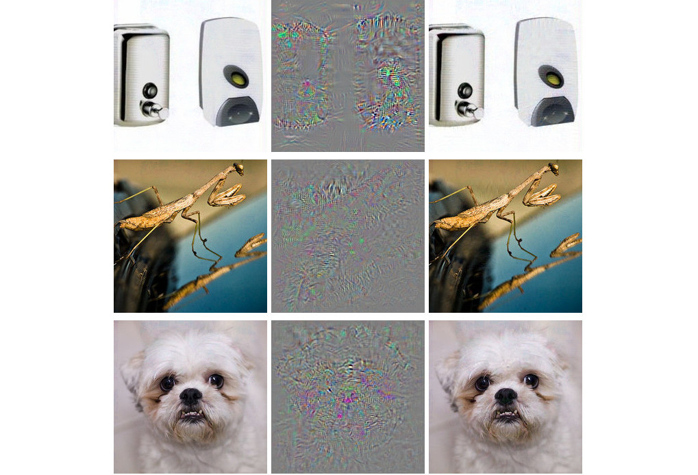
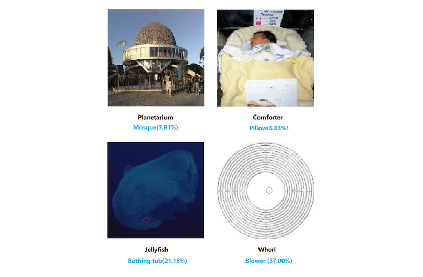
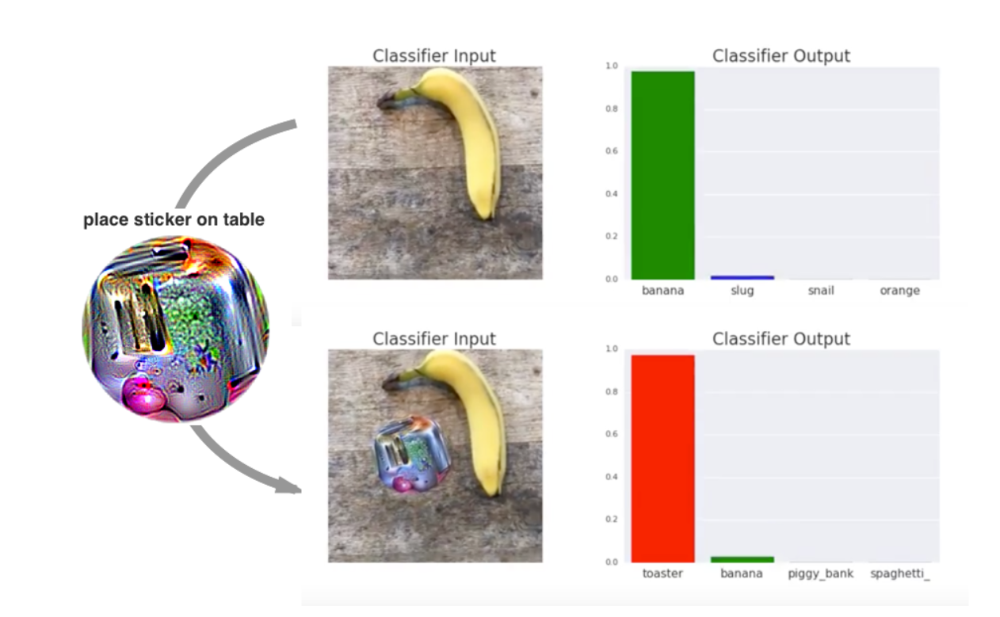
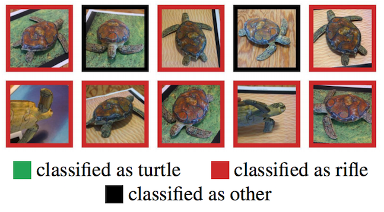

```{r, message = FALSE, warning = FALSE, echo = FALSE}
devtools::load_all()
set.seed(42)
```

<!--{pagebreak}-->

## Adversarial Examples {#adversarial}

Adversarial examples adalah instance dengan perturbations fitur kecil yang disengaja yang menyebabkan model machine learning membuat prediksi yang salah.
Saya sarankan membaca bab tentang [counterfactual explanations](#counterfactual) terlebih dahulu, karena konsepnya sangat mirip.
Contoh adversarial adalah contoh kontrafaktual dengan tujuan untuk menipu model, bukan menginterpretasikannya.

Mengapa kita tertarik pada adversarial examples?
Apakah mereka bukan hanya produk sampingan dari model machine learning tanpa relevansi praktis?
Jawabannya jelas "tidak".
Sdversarial examples membuat model machine learning rentan terhadap serangan, seperti dalam skenario berikut.

Sebuah mobil self-driving menabrak mobil lain karena mengabaikan tanda berhenti.
Seseorang telah menempatkan gambar di atas tanda, yang terlihat seperti tanda berhenti dengan sedikit kotoran untuk manusia, tetapi dirancang agar terlihat seperti tanda larangan parkir untuk perangkat lunak pengenalan tanda mobil.

Pendeteksi spam gagal mengklasifikasikan email sebagai spam.
Email spam telah dirancang menyerupai email biasa, tetapi dengan tujuan menipu penerima.

Pemindai bertenaga machine learning memindai koper untuk mencari senjata di bandara.
Pisau dikembangkan untuk menghindari deteksi dengan membuat sistem berpikir itu adalah payung.

Mari kita lihat beberapa cara untuk membuat adversarial examples.

### Methods and Examples

Ada banyak teknik untuk membuat adversarial examples.
Sebagian besar pendekatan menyarankan meminimalkan jarak antara adversarial examples dan contoh yang akan dimanipulasi, sambil menggeser prediksi ke hasil (permusuhan) yang diinginkan.
Beberapa metode memerlukan akses ke gradien model, yang tentu saja hanya bekerja dengan model berbasis gradien seperti jaringan saraf, metode lain hanya memerlukan akses ke fungsi prediksi, yang membuat metode ini model-agnostic.
Metode di bagian ini berfokus pada pengklasifikasi gambar dengan deep neural networks, karena banyak penelitian dilakukan di bidang ini dan visualisasi gambar permusuhan sangat mendidik.
Adversarial examples untuk gambar adalah gambar dengan piksel yang sengaja diganggu dengan tujuan untuk menipu model selama waktu aplikasi.
Contoh-contoh tersebut secara mengesankan menunjukkan betapa mudahnya deep neural networks untuk pengenalan objek dapat ditipu oleh gambar yang tampak tidak berbahaya bagi manusia.
Jika Anda belum melihat contoh-contoh ini, Anda mungkin akan terkejut, karena perubahan prediksi tidak dapat dipahami oleh pengamat manusia.
adversarial examples seperti ilusi optik tetapi untuk mesin.

**Ada yang Salah Dengan Anjing Saya**

Szegedy et. al (2013)[^szegedy] menggunakan pendekatan optimasi berbasis gradien dalam pekerjaan mereka "Intriguing Properties of Neural Networks" untuk menemukan adversarial examples untuk deep neural network.

```{r adversarial-ostrich, fig.cap = 'Adversarial examples for AlexNet by Szegedy et. al (2013). All images in the left column are correctly classified. The middle column shows the (magnified) error added to the images to produce the images in the right column all categorized (incorrectly) as "Ostrich". "Intriguing properties of neural networks", Figure 5 by Szegedy et. al. CC-BY 3.0.', out.width=600}

```

Adversarial examples ini dihasilkan dengan meminimalkan fungsi berikut terhadap r:

$$loss(\hat{f}(x+r),l)+c\cdot|r|$$

Dalam rumus ini, x adalah gambar (direpresentasikan sebagai vektor piksel), r adalah perubahan piksel untuk membuat gambar permusuhan (x+r menghasilkan gambar baru), l adalah kelas hasil yang diinginkan, dan parameter c digunakan untuk menyeimbangkan jarak antara gambar dan jarak antara prediksi.
Suku pertama adalah jarak antara hasil prediksi dari contoh adversarial dan kelas l yang diinginkan, suku kedua mengukur jarak antara contoh adversarial dan gambar asli.
Rumusan ini hampir identik dengan fungsi loss untuk menghasilkan [counterfactual explanations](#counterfactual).
Ada kendala tambahan untuk r sehingga nilai piksel tetap antara 0 dan 1.
Penulis menyarankan untuk menyelesaikan masalah optimasi ini dengan box-constrained L-BFGS, sebuah algoritma optimasi yang bekerja dengan gradien.

**Panda terganggu: Metode fast gradient sign**

Goodfellow et. al (2014)[^goodfellow] menemukan metode fast gradient sign untuk menghasilkan gambar permusuhan.
Metode gradient sign menggunakan gradien model yang mendasarinya untuk menemukan adversarial examples.
Gambar asli x dimanipulasi dengan menambahkan atau mengurangi kesalahan kecil $\epsilon$ untuk setiap piksel.
Apakah kita menambah atau mengurangi $\epsilon$ tergantung pada apakah gradient sign untuk suatu piksel positif atau negatif.
Menambahkan kesalahan pada arah gradien berarti gambar sengaja diubah sehingga klasifikasi model gagal.

Rumus berikut menjelaskan inti dari metode fast gradient sign:

$$x^\prime=x+\epsilon\cdot{}sign(\bigtriangledown_x{}J(\theta,x,y))$$

di mana $\bigtriangledown_x{}J$ adalah gradien fungsi kehilangan model sehubungan dengan vektor piksel masukan asli x, y adalah vektor label sebenarnya untuk x dan $\theta$ adalah vektor parameter model.
Dari vektor gradien (yang selama vektor piksel input) kita hanya perlu tanda:
gradient sign adalah positif (+1) jika peningkatan intensitas piksel meningkatkan loss (kesalahan yang dibuat model) dan negatif (-1) jika penurunan intensitas piksel meningkatkan loss.
Kerentanan ini terjadi ketika jaringan saraf memperlakukan hubungan antara intensitas piksel input dan skor kelas secara linier.
Secara khusus, arsitektur jaringan saraf yang mendukung linearitas, seperti LSTM, jaringan maxout, jaringan dengan unit aktivasi ReLU atau algoritma machine learning linier lainnya seperti logistic regression rentan terhadap metode gradient sign.
Serangan dilakukan dengan ekstrapolasi.
Linearitas antara intensitas piksel input dan skor kelas menyebabkan kerentanan terhadap outlier, yaitu model dapat ditipu dengan memindahkan nilai piksel ke area di luar distribusi data.
Saya berharap adversarial examples ini cukup spesifik untuk arsitektur jaringan saraf tertentu.
Tetapi ternyata Anda dapat menggunakan kembali adversarial examples untuk menipu jaringan dengan arsitektur berbeda yang dilatih untuk tugas yang sama.

Goodfellow et. al (2014) menyarankan untuk menambahkan adversarial examples ke data pelatihan untuk mempelajari model yang kuat.

**Ubur-ubur... Tidak, tunggu. Bak mandi: serangan 1-piksel**

Pendekatan yang disajikan oleh Goodfellow dkk (2014) membutuhkan banyak piksel untuk diubah, meskipun hanya sedikit.
Tetapi bagaimana jika Anda hanya dapat mengubah satu piksel?
Apakah Anda dapat menipu model machine learning?
Su et. al (2019) [^1pixel] menunjukkan bahwa sebenarnya mungkin untuk menipu pengklasifikasi gambar dengan mengubah satu piksel.

```{r adversarial-1pixel, fig.cap = "By intentionally changing a single pixel a neural network trained on ImageNet can be deceived to predict the wrong class instead of the original class.", out.width=600}

```

Mirip dengan kontrafaktual, serangan 1-piksel mencari contoh modifikasi x' yang mendekati gambar asli x, tetapi mengubah prediksi menjadi hasil yang berlawanan.
Namun, definisi kedekatan berbeda: Hanya satu piksel yang dapat berubah.
Serangan 1-piksel menggunakan evolusi diferensial untuk mengetahui piksel mana yang akan diubah dan bagaimana caranya.
Evolusi diferensial secara longgar diilhami oleh evolusi biologis spesies.
Sebuah populasi individu yang disebut solusi kandidat menggabungkan generasi demi generasi sampai solusi ditemukan.
Setiap solusi kandidat mengkodekan modifikasi piksel dan diwakili oleh vektor lima elemen: koordinat x dan y dan nilai merah, hijau dan biru (RGB).
Pencarian dimulai dengan, misalnya, 400 kandidat solusi (= saran modifikasi piksel) dan membuat generasi baru solusi kandidat (anak) dari generasi induk menggunakan rumus berikut:

$$x_{i}(g+1)=x_{r1}(g)+F\cdot(x_{r2}(g)-x_{r3}(g))$$

di mana setiap $x_i$ adalah elemen dari solusi kandidat (baik koordinat x, koordinat y, merah, hijau atau biru), g adalah generasi saat ini, F adalah parameter penskalaan (diatur ke 0,5) dan r1, r2 dan r3 adalah bilangan acak yang berbeda.
Setiap solusi kandidat anak baru pada gilirannya merupakan piksel dengan lima atribut untuk lokasi dan warna dan masing-masing atribut tersebut merupakan campuran dari tiga piksel induk acak.

Pembuatan anak dihentikan jika salah satu solusi kandidat adalah contoh adversarial, artinya diklasifikasikan sebagai kelas yang salah, atau jika jumlah iterasi maksimum yang ditentukan oleh pengguna tercapai.

**Semuanya adalah pemanggang roti: adversarial patch**

Salah satu metode favorit saya membawa adversarial examples ke dalam realitas fisik.
Brown et. al (2017)[^toaster] merancang label yang dapat dicetak yang dapat ditempelkan di samping objek agar terlihat seperti pemanggang roti untuk pengklasifikasi gambar.
Pekerjaan yang brilian!

```{r adversarial-toaster, fig.cap = "A sticker that makes a VGG16 classifier trained on ImageNet categorize an image of a banana as a toaster. Work by Brown et. al (2017).", out.width=600}

```

Metode ini berbeda dari metode yang disajikan sejauh ini untuk adversarial examples, karena batasan bahwa gambar permusuhan harus sangat dekat dengan gambar asli dihilangkan.
Sebagai gantinya, metode ini sepenuhnya menggantikan bagian dari gambar dengan tambalan yang dapat mengambil bentuk apa pun.
Gambar tambalan dioptimalkan di atas gambar latar belakang yang berbeda, dengan posisi tambalan yang berbeda pada gambar, terkadang dipindahkan, terkadang lebih besar atau lebih kecil dan diputar, sehingga tambalan berfungsi dalam banyak situasi.
Pada akhirnya, gambar yang dioptimalkan ini dapat dicetak dan digunakan untuk menipu pengklasifikasi gambar di alam liar.

**Jangan pernah membawa kura-kura cetak 3D ke tembak-menembak -- bahkan jika komputer Anda menganggap itu ide yang bagus: adversarial examples yang kuat**

Metode selanjutnya secara harfiah menambahkan dimensi lain ke pemanggang roti:
Athalye et. al (2017)[^turtle] 3D-mencetak kura-kura yang dirancang agar terlihat seperti senapan ke deep neural network dari hampir semua sudut yang memungkinkan.
Ya, Anda membacanya dengan benar.
Objek fisik yang terlihat seperti kura-kura bagi manusia terlihat seperti senapan bagi komputer!

```{r adversarial-turtle, fig.cap = "Athalye et. al (2017) created a 3D-printed that is recognized as a rifle by TensorFlow’s standard pre-trained InceptionV3 classifier.", out.width=600}

```

Penulis telah menemukan cara untuk membuat adversarial examples dalam 3D untuk pengklasifikasi 2D yang bertentangan dengan transformasi, seperti semua kemungkinan untuk memutar kura-kura, memperbesar dan sebagainya.
Pendekatan lain seperti metode gradien cepat tidak lagi berfungsi saat gambar diputar atau sudut pandang berubah.
Athalye et. al (2017) mengusulkan algoritma Expectation Over Transformation (EOT), yang merupakan metode untuk menghasilkan adversarial examples yang bahkan berfungsi ketika gambar ditransformasikan.
Ide utama di balik EOT adalah untuk mengoptimalkan adversarial examples di banyak kemungkinan transformasi.
Alih-alih meminimalkan jarak antara adversarial examples dan gambar asli, EOT menjaga jarak yang diharapkan antara keduanya di bawah ambang batas tertentu, mengingat distribusi yang dipilih dari kemungkinan transformasi.
Jarak yang diharapkan di bawah transformasi dapat ditulis sebagai:

$$\mathbb{E}_{t\sim{}T}[d(t(x^\prime),t(x))]$$

di mana x adalah gambar asli, t(x) gambar yang diubah (misalnya diputar), x' adversarial examples dan t(x') versi transformasinya.
Selain bekerja dengan distribusi transformasi, metode EOT mengikuti pola yang sudah dikenal dalam membingkai pencarian adversarial examples sebagai masalah optimasi.
Kami mencoba untuk menemukan adversarial examples x' yang memaksimalkan probabilitas untuk kelas yang dipilih $y_t$ (misalnya "senapan") di seluruh distribusi kemungkinan transformasi T:

$$\arg\max_{x^\prime}\mathbb{E}_{t\sim{}T}[log{}P(y_t|t(x^\prime))]$$

Dengan batasan bahwa jarak yang diharapkan dari semua kemungkinan transformasi antara adversarial examples x' dan gambar asli x tetap di bawah ambang batas tertentu:

$$\mathbb{E}_{t\sim{}T}[d(t(x^\prime),t(x))]<\epsilon\quad\text{and}\quad{}x\in[0,1]^d$$

Saya pikir kita harus memperhatikan kemungkinan yang dimungkinkan oleh metode ini.
Metode lain didasarkan pada manipulasi gambar digital.
Namun, contoh-adversarial examples yang kuat dan dicetak 3D ini dapat dimasukkan ke dalam adegan nyata apa pun dan menipu komputer untuk salah mengklasifikasikan suatu objek.
Mari kita putar balik: Bagaimana jika seseorang membuat senapan yang terlihat seperti kura-kura?

**Musuh yang ditutup matanya: Serangan black box**

Bayangkan skenario berikut:
Saya memberi Anda akses ke pengklasifikasi gambar hebat saya melalui Web API.
Anda bisa mendapatkan prediksi dari model, tetapi Anda tidak memiliki akses ke parameter model.
Dari kenyamanan sofa Anda, Anda dapat mengirim data dan jawaban layanan saya dengan klasifikasi yang sesuai.
Sebagian besar serangan permusuhan tidak dirancang untuk bekerja dalam skenario ini karena mereka memerlukan akses ke gradien deep neural networks yang mendasari untuk menemukan adversarial examples.
Papernot dan rekan (2017)[^papernot] menunjukkan bahwa adalah mungkin untuk membuat adversarial examples tanpa informasi model internal dan tanpa akses ke data pelatihan.
Jenis serangan (hampir) tanpa pengetahuan ini disebut serangan black box.

Bagaimana itu bekerja:

1. Mulailah dengan beberapa gambar yang berasal dari domain yang sama dengan data pelatihan, mis. jika classifier yang akan diserang adalah classifier digit, gunakan gambar digit. Pengetahuan tentang domain diperlukan, tetapi bukan akses ke data pelatihan.
1. Dapatkan prediksi untuk kumpulan gambar saat ini dari black box.
1. Latih surrogate models pada kumpulan gambar saat ini (misalnya jaringan saraf).
1. Buat kumpulan gambar sintetik baru menggunakan heuristik yang memeriksa kumpulan gambar saat ini ke arah mana untuk memanipulasi piksel untuk membuat keluaran model memiliki lebih banyak varians.
1. Ulangi langkah 2 hingga 4 untuk jumlah epoch yang telah ditentukan sebelumnya.
1. Buat adversarial examples untuk surrogate models menggunakan metode gradien cepat (atau serupa).
1. Serang model asli dengan adversarial examples.

Tujuan dari surrogate models adalah untuk mendekati batas keputusan dari model black box, tetapi tidak harus mencapai akurasi yang sama.

Penulis menguji pendekatan ini dengan menyerang pengklasifikasi gambar yang dilatih di berbagai layanan machine learning cloud.
Layanan ini melatih pengklasifikasi gambar pada gambar dan label yang diunggah pengguna.
Perangkat lunak melatih model secara otomatis -- terkadang dengan algoritme yang tidak diketahui pengguna -- dan menyebarkannya.
Pengklasifikasi kemudian memberikan prediksi untuk gambar yang diunggah, tetapi model itu sendiri tidak dapat diperiksa atau diunduh.
Penulis dapat menemukan adversarial examples untuk berbagai penyedia, dengan hingga 84% adversarial examples salah diklasifikasikan.

Metode itu bahkan berhasil jika model black box yang akan ditipu bukanlah jaringan saraf.
Ini termasuk model machine learning tanpa gradien seperti decision trees.

### The Cybersecurity Perspective

Machine learning berurusan dengan hal yang tidak diketahui: memprediksi titik data yang tidak diketahui dari distribusi yang diketahui.
Pertahanan terhadap serangan berkaitan dengan hal-hal yang tidak diketahui: memprediksi titik data yang tidak diketahui secara kuat dari distribusi input musuh yang tidak diketahui.
Karena machine learning diintegrasikan ke dalam lebih banyak sistem, seperti kendaraan otonom atau perangkat medis, mereka juga menjadi titik masuk untuk serangan.
Bahkan jika prediksi model machine learning pada set data pengujian 100% benar, adversarial examples dapat ditemukan untuk menipu model.
Pertahanan model machine learning terhadap serangan siber adalah bagian baru dari bidang keamanan siber.

Biggio et. al (2018)[^adversarial] memberikan ulasan yang bagus tentang sepuluh tahun penelitian tentang machine learning permusuhan, yang menjadi dasar bagian ini.
Keamanan siber adalah perlombaan senjata di mana penyerang dan pembela saling mengecoh berkali-kali.

**Ada tiga aturan emas dalam keamanan siber: 1) kenali musuh Anda 2) proaktif dan 3) lindungi diri Anda sendiri.**

Aplikasi yang berbeda memiliki musuh yang berbeda.
Orang yang mencoba menipu orang lain melalui email untuk mendapatkan uang mereka adalah agen musuh dari pengguna dan penyedia layanan email.
Penyedia ingin melindungi penggunanya, sehingga mereka dapat terus menggunakan program email mereka, penyerang ingin membuat orang memberi mereka uang.
Mengetahui musuh Anda berarti mengetahui tujuan mereka.
Dengan asumsi Anda tidak tahu bahwa spammer ini ada dan satu-satunya penyalahgunaan layanan email adalah mengirimkan salinan musik bajakan, maka pembelaannya akan berbeda (misalnya memindai lampiran untuk materi berhak cipta alih-alih menganalisis teks untuk indikator spam).

Menjadi proaktif berarti secara aktif menguji dan mengidentifikasi titik-titik lemah dari sistem.
Anda proaktif ketika Anda secara aktif mencoba menipu model dengan contoh-adversarial examples dan kemudian bertahan melawan mereka.
Menggunakan metode interpretasi untuk memahami fitur mana yang penting dan bagaimana fitur memengaruhi prediksi juga merupakan langkah proaktif dalam memahami kelemahan model machine learning.
Sebagai ilmuwan data, apakah Anda memercayai model Anda di dunia yang berbahaya ini tanpa pernah melihat melampaui forces prediksi pada kumpulan data uji?
Sudahkah Anda menganalisis bagaimana model berperilaku dalam skenario yang berbeda, mengidentifikasi input yang paling penting, memeriksa penjelasan prediksi untuk beberapa contoh?
Sudahkah Anda mencoba menemukan input permusuhan?
Penafsiran model machine learning memainkan peran utama dalam keamanan siber.
Menjadi reaktif, kebalikan dari proaktif, berarti menunggu sampai sistem diserang dan baru kemudian memahami masalahnya dan memasang beberapa tindakan defensif.

Bagaimana kita dapat melindungi sistem machine learning kita dari contoh-contoh yang bertentangan?
Pendekatan proaktif adalah pelatihan ulang berulang dari classifier dengan adversarial examples, juga disebut adversarial training.
Pendekatan lain didasarkan pada game theory, seperti mempelajari transformasi invarian fitur atau optimasi yang kuat (regularisasi).
Metode lain yang diusulkan adalah menggunakan beberapa pengklasifikasi alih-alih hanya satu dan meminta mereka memilih prediksi (ansambel), tetapi itu tidak memiliki jaminan untuk berfungsi, karena mereka semua dapat mengalami adversarial examples yang serupa.
Pendekatan lain yang juga tidak bekerja dengan baik adalah gradien masking, yang membangun model tanpa gradien yang berguna dengan menggunakan pengklasifikasi neighbors terdekat, bukan model aslinya.

Kita dapat membedakan jenis serangan dengan seberapa banyak penyerang tahu tentang sistem.
Penyerang mungkin memiliki pengetahuan yang sempurna (serangan white box), artinya mereka tahu segalanya tentang model seperti jenis model, parameter, dan data pelatihan;
penyerang mungkin memiliki pengetahuan sebagian (serangan kotak abu-abu), artinya mereka mungkin hanya mengetahui representasi fitur dan jenis model yang digunakan, tetapi tidak memiliki akses ke data pelatihan atau parameter;
penyerang mungkin tidak memiliki pengetahuan (serangan black box), artinya mereka hanya dapat menanyakan model dengan cara black box tetapi tidak memiliki akses ke data pelatihan atau informasi tentang parameter model.
Tergantung pada tingkat informasi, penyerang dapat menggunakan teknik yang berbeda untuk menyerang model.
Seperti yang telah kita lihat dalam contoh, bahkan dalam kasus black box adversarial examples dapat dibuat, sehingga menyembunyikan informasi tentang data dan model tidak cukup untuk melindungi dari serangan.

Mengingat sifat game kucing-dan-tikus antara penyerang dan pembela, kita akan melihat banyak perkembangan dan inovasi di bidang ini.
Pikirkan saja berbagai jenis email spam yang terus berkembang.
Metode serangan baru terhadap model machine learning ditemukan dan langkah-langkah defensif baru diusulkan terhadap serangan baru ini.
Serangan yang lebih kuat dikembangkan untuk menghindari pertahanan terbaru dan seterusnya, tanpa batas.
Dengan bab ini saya berharap untuk membuat Anda peka terhadap masalah adversarial examples dan bahwa hanya dengan mempelajari model machine learning secara proaktif kita dapat menemukan dan memperbaiki kelemahan.


[^szegedy]: Szegedy, Christian, et al. "Intriguing properties of neural networks." arXiv preprint arXiv:1312.6199 (2013).

[^adversarial]: Biggio, Battista, and Fabio Roli. "Wild Patterns: Ten years after the rise of adversarial machine learning." Pattern Recognition 84 (2018): 317-331.

[^turtle]: Athalye, Anish, and Ilya Sutskever. "Synthesizing robust adversarial examples." arXiv preprint arXiv:1707.07397 (2017).

[^goodfellow]: Goodfellow, Ian J., Jonathon Shlens, and Christian Szegedy. "Explaining and harnessing adversarial examples." arXiv preprint arXiv:1412.6572  (2014).

[^1pixel]: Su, Jiawei, Danilo Vasconcellos Vargas, and Kouichi Sakurai. "One pixel attack for fooling deep neural networks." IEEE Transactions on Evolutionary Computation (2019).

[^toaster]: Brown, Tom B., et al. "Adversarial patch." arXiv preprint arXiv:1712.09665 (2017).

[^papernot]: Papernot, Nicolas, et al. "Practical black-box attacks against machine learning." Proceedings of the 2017 ACM on Asia Conference on Computer and Communications Security. ACM (2017).
