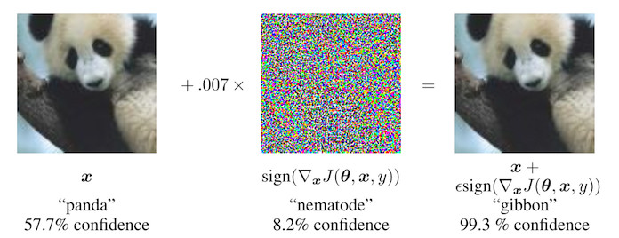
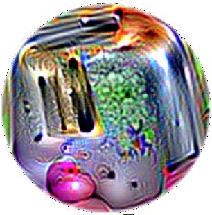

```{r, message = FALSE, warning = FALSE, echo = FALSE}
devtools::load_all()
set.seed(42)
```

<!--{pagebreak}-->

## Adversarial Examples {#adversarial}

An adversarial example is an instance with small, intentional feature perturbations that cause a machine learning model to make a false prediction.
I recommend reading the chapter about [Counterfactual Explanations](#counterfactual) first, as the concepts are very similar.
Adversarial examples are counterfactual examples with the aim to deceive the model, not interpret it.

<!-- *Keywords: adversarial examples, adversarial machine learning, counterfactuals, evasion attacks, machine learning security* -->

Why are we interested in adversarial examples?
Are they not just curious by-products of machine learning models without practical relevance?
The answer is a clear "no".
Adversarial examples make machine learning models vulnerable to attacks, as in the following scenarios.

A self-driving car crashes into another car because it ignores a stop sign.
Someone had placed a picture over the sign, which looks like a stop sign with a little dirt for humans, but was designed to look like a parking prohibition sign for the sign recognition software of the car.

A spam detector fails to classify an email as spam.
The spam mail has been designed to resemble a normal email, but with the intention of cheating the recipient.

A machine-learning powered scanner scans suitcases for weapons at the airport.
A knife was developed to avoid detection by making the system think it is an umbrella.

Let us take a look at some ways to create adversarial examples.

### Methods and Examples

There are many techniques to create adversarial examples.
Most approaches suggest minimizing the distance between the adversarial example and the instance to be manipulated, while shifting the prediction to the desired (adversarial) outcome.
Some methods require access to the gradients of the model, which of course only works with gradient based models such as neural networks, other methods only require access to the prediction function, which makes these methods model-agnostic.
The methods in this section focus on image classifiers with deep neural networks, as  a lot of research is done in this area and the visualization of adversarial images is very educational.
Adversarial examples for images are images with intentionally perturbed pixels with the aim to deceive the model during application time.
The examples impressively demonstrate how easily deep neural networks for object recognition can be deceived by images that appear harmless to humans.
If you have not yet seen these examples, you might be surprised, because the changes in predictions are incomprehensible for a human observer.
Adversarial examples are like optical illusions but for machines.

**Something is Wrong With My Dog**

Szegedy et. al (2013)[^szegedy] used a gradient based optimization approach in their work "Intriguing Properties of Neural Networks" to find adversarial examples for deep neural networks.

```{r adversarial-ostrich, fig.cap = "Adversarial examples for AlexNet by Szegedy et. al (2013). All images in the left column are correctly classified. The middle column shows the (magnified) error added to the images to produce the images in the right column all categorized (incorrectly) as 'Ostrich'.", out.width=600}
knitr::include_graphics("images/adversarial-ostrich.jpg")
```

These adversarial examples were generated by minimizing the following function with respect to r:

$$loss(\hat{f}(x+r),l)+c\cdot|r|$$

In this formula, x is an image (represented as a vector of pixels), r is the changes to the pixels to create an adversarial image (x+r produces a new image), l is the desired outcome class, and the parameter c is used to balance the distance between images and the distance between predictions.
The first term is the distance between the predicted outcome of the adversarial example and the desired class l, the second term measures the distance between the adversarial example and the original image.
This formulation is almost identical to the loss function to generate [counterfactual explanations](#counterfactual).
There are additional constraints for r so that the pixel values remain between 0 and 1.
The authors suggest to solve this optimization problem with a box-constrained L-BFGS, an optimization algorithm that works with gradients.

**Disturbed panda: Fast gradient sign method**

Goodfellow et. al (2014)[^goodfellow] invented the fast gradient sign method for generating adversarial images.
The gradient sign method uses the gradient of the underlying model to find adversarial examples.
The original image x is manipulated by adding or subtracting a small error $\epsilon$ to each pixel. 
Whether we add or subtract $\epsilon$ depends on whether the sign of the gradient for a pixel is positive or negative.
Adding errors in the direction of the gradient means that the image is intentionally altered so that the model classification fails.


```{r adversarial-panda, fig.cap = "Goodfellow et. al (2014) make a panda look like a gibbon for a neural network. By adding small perturbations (middle image) to the original panda pixels (left image), the authors create an adversarial example that is classified as a gibbon (right image) but looks like a panda to humans.", out.width=600}

```


The following formula describes the core of the fast gradient sign method:

$$x^\prime=x+\epsilon\cdot{}sign(\bigtriangledown_x{}J(\theta,x,y))$$


where $\bigtriangledown_x{}J$ is the gradient of the models loss function with respect to the original input pixel vector x, y is the true label vector for x and $\theta$ is the model parameter vector.
From the gradient vector (which is as long as the vector of the input pixels) we only need the sign:
The sign of the gradient is positive (+1) if an increase in pixel intensity increases the loss (the error the model makes) and negative (-1) if a decrease in pixel intensity increases the loss.
This vulnerability occurs when a neural network treats a relationship between an input pixel intensity and the class score linearly.
In particular, neural network architectures that favor linearity, such as LSTMs, maxout networks, networks with ReLU activation units or other linear machine learning algorithms such as logistic regression are vulnerable to the gradient sign method.
The attack is carried out by extrapolation.
The linearity between the input pixel intensity and the class scores leads to vulnerability to outliers, i.e. the model can be deceived by moving pixel values into areas outside the data distribution.
I expected these adversarial examples to be quite specific to a given neural network architecture.
But it turns out that you can reuse adversarial examples to deceive networks with a different architecture trained on the same task.

Goodfellow et. al (2014) suggested adding adversarial examples to the training data to learn robust models.


**A jellyfish ... No, wait. A bathtub: 1-pixel attacks**

The approach presented by Goodfellow and colleagues (2014) requires many pixels to be changed, if only by a little.
But what if you can only change a single pixel?
Would you be able to deceive a machine learning model?
Su et. al (2019) [^1pixel] showed that it is actually possible to deceive image classifiers by changing a single pixel.

```{r adversarial-1pixel, fig.cap = "By intentionally changing a single pixel (marked with circles) a neural network trained on ImageNet is deceived to predict the wrong class instead of the original class. Work by Su et. al (2019).", out.width=600}
knitr::include_graphics("images/adversarial-1pixel.jpg")
```

Similar to counterfactuals, the 1-pixel attack looks for a modified example x' which comes close to the original image x, but changes the prediction to an adversarial outcome.
However, the definition of closeness differs: Only a single pixel may change.
The 1-pixel attack uses differential evolution to find out which pixel is to be changed and how.
Differential evolution is loosely inspired by biological evolution of species.
A population of individuals called candidate solutions recombines generation by generation until a solution is found.
Each candidate solution encodes a pixel modification and is represented by a vector of five elements: the x- and y-coordinates and the red, green and blue (RGB) values.
The search starts with, for example, 400 candidate solutions (= pixel modification suggestions) and creates a new generation of candidate solutions (children) from the parent generation using the following formula:

$$x_{i}(g+1)=x_{r1}(g)+F\cdot(x_{r2}(g)+x_{r3}(g))$$

where each $x_i$ is an element of a candidate solution (either x-coordinate, y-coordinate, red, green or blue), g is the current generation, F is a scaling parameter (set to 0.5) and r1, r2 and r3 are different random numbers.
Each new child candidate solution is in turn a pixel with the five attributes for location and color and each of those attributes is a mixture of three random parent pixels.

The creation of children is stopped if one of the candidate solutions is an adversarial example, meaning it is classified as an incorrect class, or if the number of maximum iterations specified by the user is reached.


**Everything is a toaster: Adversarial patch**

One of my favorite methods brings adversarial examples into physical reality.
Brown et. al (2017)[^toaster] designed a printable label that can be stuck next to objects to make them look like toasters for an image classifier.
Brilliant work!

```{r adversarial-toaster, fig.cap = "A sticker that makes a VGG16 classifier trained on ImageNet categorize an image of a banana as a toaster. Work by Brown et. al (2017).", out.width=600}

```

This method differs from the methods presented so far for adversarial examples, since the restriction that the adversarial image must be very close to the original image is removed.
Instead, the method completely replaces a part of the image with a patch that can take on any shape. 
The image of the patch is optimized over different background images, with different positions of the patch on the images, sometimes moved, sometimes larger or smaller and rotated, so that the patch works in many situations.
In the end, this optimized image can be printed and used to deceive image classifiers in the wild.


**Never bring a 3D-printed turtle to a gunfight -- even if your computer thinks it is a good idea: Robust adversarial examples**

The next method is literally adding another dimension to the toaster:
Athalye et. al (2017)[^turtle] 3D-printed a turtle that was designed to look like a rifle to a deep neural network from almost all possible angles.
Yeah, you read that right. 
A physical object that looks like a turtle to humans looks like a rifle to the computer!

```{r adversarial-turtle, fig.cap = "A 3D-printed turtle that is recognized as a rifle by TensorFlow’s standard pre-trained InceptionV3 classifier. Work by Athalye et. al (2017)", out.width=600}
knitr::include_graphics("images/adversarial-turtle.jpg")
```

The authors have found a way to create an adversarial example in 3D for a 2D classifier that is adversarial over transformations, such as all possibilities to rotate the turtle, zoom in and so on.
Other approaches such as the fast gradient method no longer work when the image is rotated or viewing angle changes.
Athalye et. al (2017) propose the Expectation Over Transformation (EOT) algorithm, which is a method for generating adversarial examples that even work when the image is transformed.
The main idea behind EOT is to optimize adversarial examples across many possible transformations.
Instead of minimizing the distance between the adversarial example and the original image, EOT keeps the expected distance between the two below a certain threshold, given a selected distribution of possible transformations.
The expected distance under transformation can be written as:

$$\mathbb{E}_{t\sim{}T}[d(t(x^\prime),t(x))]$$

where x is the original image, t(x) the transformed image (e.g. rotated), x' the adversarial example and t(x') its transformed version.
Apart from working with a distribution of transformations, the EOT method follows the familiar pattern of framing the search for adversarial examples as an optimization problem.
We try to find an adversarial example x' that maximizes the probability for the selected class $y_t$ (e.g. "rifle") across the distribution of possible transformations T:

$$\arg\max_{x^\prime}\mathbb{E}_{t\sim{}T}[log{}P(y_t|t(x^\prime))]$$

With the constraint that the expected distance over all possible transformations between adversarial example x' and original image x remains below a certain threshold:

$$\mathbb{E}_{t\sim{}T}[d(t(x^\prime),t(x))]<\epsilon\quad\text{and}\quad{}x\in[0,1]^d$$

I think we should be concerned about the possibilities this method enables.
The other methods are based on the manipulation of digital images.
However, these 3D-printed, robust adversarial examples can be inserted into any real  scene and deceive a computer to wrongly classify an object.
Let us turn it around: What if someone creates a rifle which looks like a turtle?

**The blindfolded adversary: Black box attack**

Imagine the following scenario:
I give you access to my great image classifier via Web API.
You can get predictions from the model, but you do not have access to the model parameters.
From the convenience of your couch, you can send data and my service answers with the corresponding classifications.
Most adversarial attacks are not designed to work in this scenario because they require access to the gradient of the underlying deep neural network to find adversarial examples.
Papernot and colleagues (2017)[^papernot] showed that it is possible to create adversarial examples without internal model information and without access to the training data.
This type of (almost) zero-knowledge attack is called black box attack.

How it works:

1. Start with a few images that come from the same domain as the training data, e.g. if the classifier to be attacked is a digit classifier, use images of digits. The knowledge of the domain is required, but not the access to the training data.
1. Get predictions for the current set of images from the black box.
1. Train a surrogate model on the current set of images (for example a neural network).
1. Create a new set of synthetic images using a heuristic that examines for the current set of images in which direction to manipulate the pixels to make the model output have more variance.
1. Repeat steps 2 to 4 for a predefined number of epochs.
1. Create adversarial examples for the surrogate model using the fast gradient method (or similar).
1. Attack the original model with adversarial examples.

The aim of the surrogate model is to approximate the decision boundaries of the black box model, but not necessarily to achieve the same accuracy.

The authors tested this approach by attacking image classifiers trained on various cloud machine learning services.
These services train image classifiers on user uploaded images and labels.
The software trains the model automatically -- sometimes with an algorithm unknown to the user -- and deploys it.
The classifier then gives predictions for uploaded images, but the model itself cannot be inspected or downloaded.
The authors were able to find adversarial examples for various providers, with up to 84% of the adversarial examples being misclassified.

The method even works if the black box model to be deceived is not a neural network.
This includes machine learning models without gradients such as a decision trees.

### The Cybersecurity Perspective

Machine learning deals with known unknowns: predicting unknown data points from a known distribution.
The defense against attacks deals with unknown unknowns: robustly predicting unknown data points from an unknown distribution of adversarial inputs.
As machine learning is integrated into more and more systems, such as autonomous vehicles or medical devices, they are also becoming entry points for attacks.
Even if the predictions of a machine learning model on a test dataset are 100% correct,  adversarial examples can be found to deceive the model.
The defense of machine learning models against cyber attacks is a new part of the field of cybersecurity.

Biggio et. al (2018)[^adversarial] give a nice review of ten years of research on adversarial machine learning, on which this section is based.
Cybersecurity is an arms-race in which attackers and defenders outwit each other time and again.


**There are three golden rules in cybersecurity: 1) know your adversary 2) be proactive and 3) protect yourself.**

Different applications have different adversaries.
People who try to defraud other people via email for their money are adversary agents of users and providers of email services.
The providers want to protect their users, so that they can continue using their mail program, the attackers want to get people to give them money.
Knowing your adversaries means knowing their goals.
Assuming you do not know that these spammers exist and the only abuse of the email service is sending pirated copies of music, then the defense would be different (e.g. scanning the attachments for copyrighted material instead of analyzing the text for spam indicators).

Being proactive means actively testing and identifying weak points of the system.
You are proactive when you actively try to deceive the model with adversarial examples and then defend against them.
Using interpretation methods to understand which features are important and how features affect the prediction is also a proactive step in understanding the weaknesses of a machine learning model.
As the data scientist, do you trust your model in this dangerous world without ever having looked beyond the predictive power on a test dataset?
Have you analyzed how the model behaves in different scenarios, identified the most important inputs, checked the prediction explanations for some examples?
Have you tried to find adversarial inputs?
The interpretability of machine learning models plays a major role in cybersecurity.
Being reactive, the opposite of proactive, means waiting until the system has been attacked and only then understanding the problem and installing some defensive measures.

How can we protect our machine learning systems against adversarial examples?
A proactive approach is the iterative retraining of the classifier with adversarial examples, also called adversarial training.
Other approaches are based on game theory, such as learning invariant transformations of the features or robust optimization (regularization).
Another proposed method is to use multiple classifiers instead of just one and have them vote the prediction (ensemble), but that has no guarantee to work, since they could all suffer from similar adversarial examples.
Another approach that does not work well either is gradient masking, which constructs a model without useful gradients by using a nearest neighbor classifier instead of the original model.


We can distinguish types of attacks by how much an attacker knows about the system.
The attackers may have perfect knowledge (white box attack), meaning they know everything about the model like the type of model, the parameters and the training data;
the attackers may have partial knowledge (gray box attack), meaning they might only know the feature representation and the type of model that was used, but have no access to the training data or the parameters;
the attackers may have zero knowledge (black box attack), meaning they can only query the model in a black box manner but have no access to the training data or information about the model parameters.
Depending on the level of information, the attackers can use different techniques to attack the model.
As we have seen in the examples, even in the black box case adversarial examples can  be created, so that hiding information about data and model is not sufficient to protect against attacks.

Given the nature of the cat-and-mouse game between attackers and defenders, we will see a lot of development and innovation in this area. 
Just think of the many different types of spam emails that are constantly evolving.
New methods of attacks against machine learning models are invented and new defensive measures are proposed  against these new attacks.
More powerful attacks are developed to evade the latest defenses and so on, ad infinitum.
With this chapter I hope to sensitize you to the problem of adversarial examples and that only by proactively studying the machine learning models are we able to discover and remedy weaknesses.


[^szegedy]: Szegedy, Christian, et al. "Intriguing properties of neural networks." arXiv preprint arXiv:1312.6199 (2013).

[^adversarial]: Biggio, Battista, and Fabio Roli. "Wild Patterns: Ten years after the rise of adversarial machine learning." Pattern Recognition 84 (2018): 317-331.

[^turtle]: Athalye, Anish, and Ilya Sutskever. "Synthesizing robust adversarial examples." arXiv preprint arXiv:1707.07397 (2017).

[^goodfellow]: Goodfellow, Ian J., Jonathon Shlens, and Christian Szegedy. "Explaining and harnessing adversarial examples." arXiv preprint arXiv:1412.6572  (2014).

[^1pixel]: Su, Jiawei, Danilo Vasconcellos Vargas, and Kouichi Sakurai. "One pixel attack for fooling deep neural networks." IEEE Transactions on Evolutionary Computation (2019).

[^toaster]: Brown, Tom B., et al. "Adversarial patch." arXiv preprint arXiv:1712.09665 (2017).

[^papernot]: Papernot, Nicolas, et al. "Practical black-box attacks against machine learning." Proceedings of the 2017 ACM on Asia Conference on Computer and Communications Security. ACM (2017).
