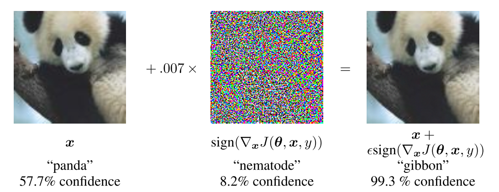

## Adversarial examples
Counterfactuals are not only good for understanding the models, but also to fool them.
Machine learning models can be easily fooled by adversarial examples.
Counterfactuals and adverserial examples in real life. 
Also called evasion attacks.

The broader research area is also known as adversarial machine learning.


This chapter focuses on evasion attacks, that happen during test or application time and not on poisoning attacks, which happen during the training of the model.

Evasion is meant in the sense that the attacker tries to evade the system  - a spammer who wants his spam mails remain undetected; a SECOND EXAMPLE.
In evasion, instances are modified at test time to evade the detection of a system.
But this chapter covers adversarial examples, which is a bit broader: 
It also covers attacks that aim to not only evade but cause other kind of harm, like make the system fail. 
An example are self-driving cars that misclassifies a street sign.

This chapter covers mainly insights from the paper that reviews ten years of research of adversarial machine learning by  Biggio et. al (2017)[^adversarial].

Adversarial examples for images are input samples that were intentionally perturbed (some pixels) aimed to fool the model during test time.

There are also attacks aimed at training time, but those are different.

Machine learning is a bit of an arms-race: spammer vs. a system. 
There are three golden rules : 1) know your adversary agent 2) be proactive and 4) protect yourself.

It has been shown that especially deep convolutional neural networs for object recognition are vulnerable to adversarial examples, that look harmles to humans.

What optical illusions are to us humans, are adversarial examples for machines.


Especially because we don't understand the machine learning models and what they learned, they are vulnerable to attacks and often the weakest link in a system. 

Interpretability of the models (for the builder of the system), knowing about adversarial examples helps to protect them against these examples.
To protect a system, try to proactively find holes in it. 
Make the models interpretable and find their weaknesses.


Box-constrained L-BFGS can reliably find adversarial examples.[^szegedy]
Some example: [^szegedy]


```{r adversarial-ostrich, fig.cap = ""}
knitr::include_graphics("images/adversarial-ostrich.png")
```
TEXT FROM THE PAPER FOR THE IMAGE:
Figure 5: Adversarial examples generated for AlexNet [9].(Left) is a correctly predicted sample, (center) dif- ference between correct image, and image predicted incorrectly magnified by 10x (values shifted by 128 and clamped), (right) adversarial example. All images in the right column are predicted to be an “ostrich, Struthio camelus”. Average distortion based on 64 examples is 0.006508. Plase refer to http://goo.gl/huaGPb for full resolution images. The examples are strictly randomly chosen. There is not any postselection involved.


There are even attacks that flip a classification by changing a single (!) pixel of the image[^1pixel]:
```{r adversarial-ostrich, fig.cap = ""}
knitr::include_graphics("images/adversarial-1pixel.png")
```

Text from paper: One-pixel attacks on ImageNet dataset where the mod- ified pixels are highlighted with red circles. The original class labels are in black color while the target class labels and their cor- responding confidence are in blue.

And my favorite example: Stickers you can print out and stick to objects to make them look like toasters to the machines.

```{r adversarial-ostrich, fig.cap = ""}
knitr::include_graphics("images/adversarial-toaster.png")
```
Text from image paper: Figure 1: A real-world attack on VGG16, using a physical patch generated by the white-box ensemble method described in Section 3. When a photo of a tabletop with a banana and a notebook (top photograph) is passed through VGG16, the network reports class ’banana’ with 97% confidence (top plot). If we physically place a sticker targeted to the class "toaster" on the table (bottom photograph), the photograph is classified as a toaster with 99% confidence (bottom plot). See the following video for a full demonstration: https://youtu.be/i1sp4X57TL4


Adversarial examples not only occur in image recognition, but also in text.
One of the frist adversarial examples hit spam filtering models in the early 2000s.


Error-generic Evasion Attack: 
Thea attacker is interested in fooling the machine learning model.
In mathematical terms:

$$\max_{x'}A(x',\theta)=\max_{l\neq{}k}f_l(x)-f_k(x)$$

so that

$$d(x,x')\leq{}d_{max},\quad{}x_{lb}\leq{}x'\leq{}x_{ub}$$

where $f_k(x)$ is the score associated with the true class and $f_l(x)$ the score for the closest competing class.
This is a similar defintion as the [counterfactuals](#counterfactual), where we want to change the prediction, while the original data point and the adversarial (or counterfactual) example should be similar.
The focus here is that the new x' is missclassified as the attacker aimed.
For counterfactuals, manipulation x to get x' has not the intention to produce a missclassification, but rather to understand the model better. 
Here the purpose of the manipulation is that x and x' have both the same class, but the predicted class for x' changes to a missclassification.
By adding sparsity to the manipulation, attacks with only few changes are created, for example images that have only a few images changed to the original image.
Keeping both instance and adversarial attack similar is important to evade detection of manipulation.


Another example using fast gradient sign method:
Goodfellow et. al (2014)[^goodfellow] that it's possible to add something like random  noise will make a missclassification.
```{r adversarial-panda, fig.cap = ""}

```
It works by first computing the gradient with respect to the input of the model.
Then take the sign of the gradient and multiply it by a small epsilon.

$$x+\epsilon\cdot{}sign(\bigtriangledown_x{}J(\theta, x, y))$$
This formula tells us to take the original point x and change the pixels a little bit by $\epsilon$ times the direction of the model gradient.
The gradient is computed using the current $\theta$  parameters of the model (mainly the weights of the neural network) and y the targets associated with x.


Problems with deep learning: 
Examples that are close in input space can be very different in the deep space (think of the embedding of an image or text).


The attacker can have different levels of knowledge.

- Perfect knowledge, or white-box attacks: Attacker knows everything about the ml model.
Like knowing all the weights of a linear model.
- Limited knowledge or gray-box attacks: attacker knows a bit about the ml model.
For example the feature representation that was used or which type of model was learend, but has no access to training data or the parameters of the model.
The attacker might be able to get a similar data set from a similar source and get feedback from the original classifier for labeling. 
By this the attacker can train a surrogate model.
- Zero-knowledge black box attacks: The attacker can query a system in a black-box manner and try to get feedback.
The attacker still has of course to know what the purpose of the model is to be able to do anything useful.

Defending against those attacks:
- Iteratively tretrain the classifier on simulated attacks, also called adversarial training.
- Other approaches are based on game theory. Like learning invariant transformations like feature inserstio, deletion and rescaling.
- Robust optimization: Adversarial data manipulation can be seen as a special type of nosie. 
This turn protecting against those attacks into the problem of learning models that are robust to noise.
For example: regularizing the gradients through simulation of the correpsonding attacks to imporve the security of deep neural networks to evasion attacks.
- Detecting and removing samples which are far away from the other training data in feature space.
Data points from this sparsely populated regions can get any prediction, even if wrong, without starkly decreasing the performance of the model.
- Use ensemble of many different models. 

TODO: WRITE ABOUT THE INTERPRETABLE vs. NON-INTERPREABLE ISSUE FOR SECURITY (i.e. parallel to the open vs. closed source software).


Other ways ml algorithms can be attacked (keep it short)
- poisoning attacks:  the training data set. An example is Microsoft's Twitter chatbot Tay, which was designed to talk to people on Twitter. 
It was shut off after 16 hours, because it had started crafting racist and other offensive tweets. 
It had started repeating what some malicious users were feeding it.
- evasion attacks: during test time, covered in this chapter.
- 


Machine learning deals with known unkowns (classifying data uknown data points from know distribution).
Machine leanring model attacks deal with unknown unknowns: classifying never seen data points that are weird.


Interpretability of machine learning models in general can help to improve the security of such systems. 

Knowing the boundaries and problems of a system let's the deployer more easily imagine possible vulnerabilities. 

Looking at feature importance values gives a quick overview which features influence the model prediction the most. 
ICE curves simulate some uni-variate attacks, by trying out variations of single features and measuring the output.
Analysing miss-classifications with counterfactuals, LIME and Shapley value might reveal further weaknesses of the machine learning model. 
Looking at prototypes and criticisms gives the developer a better understanding of the underlying data distribution, and especially the odd cases as well. 
And this might give an idea where problems in the model might occur for those edge cases.
Machine learning model defences deal with unknown unkowns as attacks.
Do you, as a developer of a model, trust your model out into this dangerous world, without having ever looked into it and even tried to understand it?
See how it behave in different scenarios, get a feel for the most important input, get the explanations for a few selected predictions.
Interpretability of machine learning models has a great role to play in adversarial machine learning.

As always, this sword has to edges. 
Interpretable machine learning can also be used to attack machine learning models. 
Using surrogate models, I can still an machine learning model. 
When I learn an interpretable surrogate model, I might also learn something about the internals.
This can be done conveniently from your home, by accessing the model via an API. 
Like this you could steal the image recognition models from all the cloud services.


You can - also conveniently via API - create counterfactual explanations, which can be used as adversarial examples.
When you understand a model, you have a chance to find entry points to cheat it. 
When you know that a credit score application uses having some special insurance (e.g. for jewelry) as feature (as a proxy that you are reliable or rich maybe), then you can simply get such an insurance to fool the system that your credit risk score is better than it really is.


There are many ways of creating these adversarial examples (with [counterfactuals](#counterfactual) being one of them).

Adversarial example can even be real object, like a 3D-printed turtle created by Athalye et. al (2018)[^turtle].

```{r adversarial-turtle, fig.cap = "A 3D-printed turtle that is recognized as a riffle by TensorFlow’s standard pretrained InceptionV3 classifier. Work by Athalye et. al (2018)"}
knitr::include_graphics("images/adversarial-turtle.png")
```
The difficult thing they achieved that they find a way to create an adversarial example in the 3D for a 2D classifier, that is adversarial over all possible transformations (all the ways of turning the turtle.)


TODO: Checkout  http://www.cleverhans.io/security/privacy/ml/2016/12/16/breaking-things-is-easy.html


[^szegedy]: Szegedy, C., Zaremba, W., Sutskever, I., Bruna, J., Erhan, D., Goodfellow, I., & Fergus, R. (2013). Intriguing properties of neural networks, 1–10. http://doi.org/10.1021/ct2009208

[^adversarial]: Biggio, B., & Roli, F. (2017). Wild Patterns: Ten Years After the Rise of Adversarial Machine Learning, 32–37. Retrieved from http://arxiv.org/abs/1712.03141


[^turtle]: Athalye, A., Engstrom, L., Ilyas, A., & Kwok, K. (2017). Synthesizing Robust Adversarial Examples. Retrieved from http://arxiv.org/abs/1707.07397


[^goodfellow]: Goodfellow, I. J., Shlens, J., & Szegedy, C. (2014). Explaining and Harnessing Adversarial Examples, 1–11. http://doi.org/10.1109/CVPR.2015.7298594


[^1pixel]: Su, J., Vargas, D. V., & Kouichi, S. (2017). One pixel attack for fooling deep neural networks. Retrieved from http://arxiv.org/abs/1710.08864

[^toaster]: Brown, T. B., Mané, D., Roy, A., Abadi, M., & Gilmer, J. (2017). Adversarial Patch, (Nips). Retrieved from http://arxiv.org/abs/1712.09665