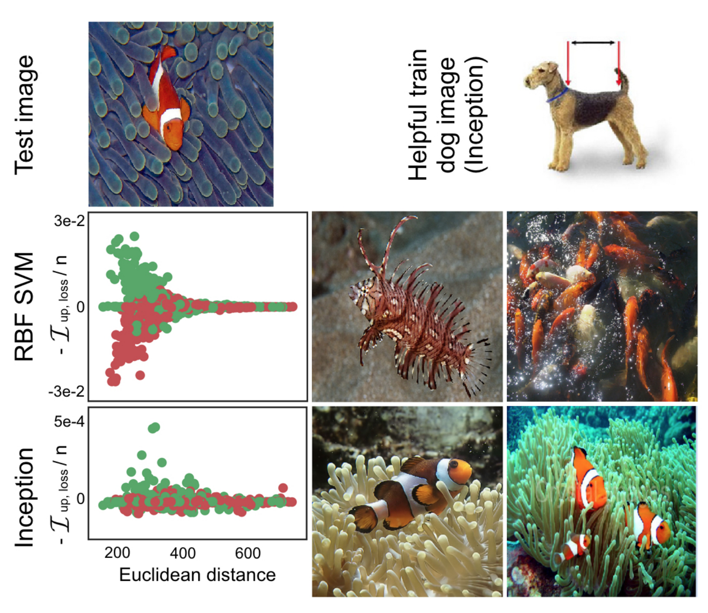

## Influential Instances

```{r, message = FALSE, warning = FALSE, echo = FALSE}
devtools::load_all()
set.seed(43)

influence.matrix.filename = "../data/influence-df.RData"
data("cervical")
```

<!-- Intro text -->
An influential instance is an instance whose deletion from the training data in the model fitting step considerably changes the prediction model.
Identifying influential training instances can be used to 'debug' the model and understand the global model behaviour and single predictions better.

*Keywords: Influential points, influence function, leave-one-out analysis, Cook's distance, deletion diagnostics, robust statistics*

In this chapter you will read about two approaches how to identify influential instances.
Both approaches originate from robust statistics and relate to influence functions.
Robust statistics is a field of statistis that deals with problematic and violated assumptions, outliers and influential instances.
For something that is derived from data, like the mean of a variable or a prediction model, the influence function measure how much a single data point influences the something derived from data.
For example, when we have 10 values and measure the mean, influence functions can tell us how strongly the mean is affected by single components.
The first approach tackles the question by simply removing an instance from the data and recalculating the statistic or the model, this is also called empirical influence functions.
For the mean example, we recalculate the mean 10 times while leaving out one of the values each time and measure how much it changes.
The second approach upweights one of the data points by a small weight, which is the same as the first derivative of some model given a distribution of data.
It's also called "infinitesimal approach"


Before we start digging into some methods how to find influential instance, we have to talk about the difference between outlier and an influential instances.

**Outlier**

An outlier is an instance which is far away from other instances in the dataset.
"Far away" means that the distance, for example the Euclidean distance, to all the other instances is very large.
In a dataset of newborn body measurements, a baby that weights 6kg would be considered an outlier.
In a dataset of bank accounts, where most are checking accounts, a dedicated loan account (large negative balance, only few transactions) would be considered an outlier.
The following images shows an outlier:

```{r outlier, fig.cap = "The feature follows a Gaussian distribution with the exception of the outlier x=8."}
set.seed(42)
n = 50
x = rnorm(mean = 1, n = n)
x = c(x, 8)
y = rnorm(mean = x, n = n)
y = c(y, 7.2)
df = data.frame(x, y)
ggplot(df) + geom_histogram(aes(x = x)) + my_theme() + 
  scale_x_continuous("feature x") + 
  scale_y_continuous("count")
```


Outliers might or might not be interesting data points (like criticisms or archetypes).
Outliers can be influential on the model training, but don't have to be. 
Influential instances is a different concept:

**Influential instance**
An influential instance is a data instance whose removal has a strong effect on the trained model.
The more the model parameters or the predictions of a model change, when the model is retrained with an instance removed from the training data, the more influential this particular instance is. 

```{r influential-point, fig.cap = "The influence on a linear model by adding an outlier or adding an influential data point. Adding a non-influential outlier doesn't change the fitted slope much. Adding an influential point changes the fitted slope drastically."}

df2 = df[-nrow(df),]
df3 = rbind(df2, data.frame(x = 8, y = 0))

df3$regression_model = "with influential instance"
df2$regression_model = "without influential instance"
df.all = rbind(df2, df3)


text.dat = data.frame(x = c(8), y = c(0), lab = c("Influential instance"), regression_model = "with influential instance")

ggplot(df.all, mapping = aes(x = x, y = y, group = regression_model, linetype = regression_model)) + 
  geom_point(size = 2) + 
  geom_smooth(method='lm',formula=y~x, se = FALSE, aes(color = regression_model), fullrange = TRUE) + 
  my_theme() + 
  geom_label(data = text.dat, aes(label = lab), hjust = 1, nudge_x = -0.2, vjust = 0.3) +
  scale_color_discrete("Training data") + 
  scale_linetype_discrete("Training data")

```

**How can we use influential instances to understand the model? Some motivation.**

The big idea behind influential instances for interpretability is to trace predictions back were it all began: the training data.
A learner, which is the algorithm that produces the machine learning model is a function that takes in training data consisting of features X and the target y and produces a machine learning model.
The learner of a decision tree is an algorithm that chooses the split features and the values at which to split. 
A learner for a neural network uses the backpropagation to find the best weights.


```{r learner, "A learner learns a model from labeled training data. The model is used to make predictions.", out.width="\textwidth"}
knitr::include_graphics("images/learner.png")
```

We ask how the model parameters or the predictions would change when we remove instances from the training data in the training process.
This is in contrast to other interpretability approaches that analyze how the prediction changes, when we change the features, like [partial dependence plots](#pdp) or [feature importane](#feature-importance).
With influential instances, we don't treat the model as fixed, but as a function of the training data and outcome.
Influential instances help us answer questions about the global model behaviour and about single predictions:
Which were the most influential instances for the model parameters or the predictions overall?
We can ask locally: Which were the most influential instances for the prediction of a particular instance?
Great! But how, exactly, can we find those influential instances?
We have two means of measuring the influence:
Our first option is to delete the instance from the training data, re-train the model on the reduced training dataset and observe the difference in either model parameters or the predictions (either locally or globally).
The second option is to upweight a data instance using an approximation based on the gradients of the model parameters.
The deletion approach is much easier to understand and motivates the upweighting approach, so we will start with looking into the former.

### Deletion Diagnostics or Empirical Influence Functions

When facing a problem, you should always take a look if other people have already solved a similar problem. 
In the area of influential instances, statistician have already done a lot of research, especially for (generalized) linear regression models.
When you search for "influential observations", the first hits will tell you about the measures DFBETA and Cook's distance.
**DFBETA** measures the effect of deleting an instance on the model parameters.
**Cook's distance** measures the effect of deleting an instance on the overall model predictions.
For both measures, we have to retrain the model repeatedly while leaving out certain instances.
The model with an instance is compared to the one without and the difference in parameters or predictions compared.

DFBETA is defined as:

$$DFBETA_{i}=\beta-\beta^{(-i)}$$

where $\beta$ is the vector with the model parameters with all data points, and $\beta_{(i)}$ the model parameters when the model is fit without instance i.
Quite intuitive I would say.
DFBETA, obviously, only works for models with weight parameters like logistic regression, neural networks etc..
For models that don't have weight parameters, like decision trees, tree ensembles, support vector machines, Cook's distance is more useful.

Cook's distance was invented for linear regression models and approximations for generalized linear regression models exist.
The Cooks distance for a data instance is defined as the sum of the changes in the predicted outcome when the i-th instance is removed from the model training.

$$D_i=\frac{\sum_{i=1}^n(\hat{y}_j-\hat{y}_{j}^{(-i)})^2}{p\cdot{}MSE}$$

where the numerator is the squared difference between prediction of model with and without the i-th instance, summed over the dataset.
The denominator is the number of features p times the mean squared error.
The denominator is the same for all instances to be removed and only scales the distance.
Cook's distance tells us how much the predicted output of a linear model changes when we remove the i-the instance in the training.


Can we use Cook's distance and DFBETA for any machine learning model?
DFBETA requires model parameters, so this measure works only for parameterized models.
Cook's distance does not require model parameters.
Interestingly, Cook's distance is usually not seen outside the context of linear models and generalized linear models, but the idea of taking the difference of some of the model before and after removal of a particular instance is very general.

The most simplistic influence measure for the effect on the model predictions can be written as: 

$$\text{Influence}^{(-i)}=\frac{1}{n}\sum_{j=1}^{n}\left|\hat{y}_j-\hat{y}_{j}^{(-i)}\right|$$

Also, we can easily break the influence down locally to explain for the prediction of instance j what the influence of the i-th training instance was:

$$\text{Influence}_{j}^{(-i)}=\left|\hat{y}_j-\hat{y}_{j}^{(-i)}\right|$$

Here I opted to formulate the influence on the prediction.
This would also work for the difference in model parameters or the difference in the loss.
We will use these simple influence measures in the following example.

**Example with deletion influence**

In the following example, we train a support vector machine to predict [cervical cancer](#cervical) given risk factors and we measure which training instances were the most influential overall and also for a particular prediction.
Since predicting cancer is a classification problem, we measure the influence on the predicted probability for cancer.
An instance is influential when the predicted probability changes a lot (increase / decrease) on average in the dataset when the instance is removed from the model training.
Measuring influence for all `r nrow(cervical)` training instances requires to train the model once on all training data and retrain it `r nrow(cervical)` times (= size of training data) with one of the instances removed each time.

```{r influence, eval = !file.exists(influence.matrix.filename)}
#'@param predicted The predicted outcome of a model
#'@param predicted.without The predicted outcome of a model with a data point removed
influence.v = function(predicted, predicted.without) {
  predicted - predicted.without
}

influence.matrix = matrix(NA, ncol = nrow(cervical), nrow = nrow(cervical))

lrn = makeLearner("classif.svm", predict.type = "prob")
tsk = makeClassifTask(data = cervical, target = "Biopsy")
mod = train(lrn, tsk)
predicted.orig = getPredictionProbabilities(predict(mod, newdata = cervical))
cs = lapply(1:nrow(cervical), function(to.remove.index) {
  mod.2 = train(lrn, tsk, subset = setdiff(1:nrow(cervical), to.remove.index))
  predict.removed = getPredictionProbabilities(predict(mod.2, newdata = cervical))
  influence.v(predicted.orig, predict.removed)
})

# Column: Removed instance, row: influenced instance
influence.df = data.frame(cs)
influence.df = as.matrix(influence.df)
diag(influence.df) = NA
save(influence.df, predicted.orig, file = influence.matrix.filename)
```


The following table shows the instance with the highest influence measure (influence = `r abs(df[1,"influence"])`) on all predictions. 

```{r}
load(influence.matrix.filename)
df = data.frame(influence = colMeans(abs(influence.df), na.rm = TRUE), id = 1:nrow(cervical))
df = df[order(df$influence, decreasing = TRUE),]
kable(t(cervical[df$id[1],]))
```

An influence of `r sprintf('%.3f', abs(df[1,"influence"]))` means that when we remove the `r df$id[1]`-th instance the predicted probability changes on average by an absolute `r sprintf('%.2f', 100 * df[1,"influence"])`%.
This is quite substantial considering the average predicted probability for cancer is `r sprintf('%.3f', 100 *mean(predicted.orig))`%.
The mean of influence measures over all possible deletions is `r sprintf('%.3f', 100 * mean(abs(df$influence)))`%.
Now know which of the data instances were most influential for the model.
This is already useful for debugging the data.
Is there some problematic instance?
Are there measurement errors?
The influential instances are the first instances to check for mistakes, because any mistake in them influences the model preditions a lot.

Apart from model debugging, can we learn anything to understand the model better?
Simply printing the top 10 most influential instances is not very useful, because that's just a table of instances with lots of features.
All the methods that yield instances as output are only meaningful when we have a good way of representing an instance.
But we can better understand what types of instances are influential by asking: 
What sets an influential instance apart from non-influential instances?
We can turn this question into a regression problem and model the influence of an instance as a function of its feature values. 
We are free to choose any model from the [interpretable machine learning models chapter](#simple).
For this example I chose a decision tree (following figure), which reveals that training data for women of age 35 and above were the most influential for training the support vector machine.
From all the women in the dataset  `r sprintf('%.3f', 100 * mean(cervical$Age >= 35))`% are older than 35.
In the [partial dependence chapter](#pdp) we have seen that after 40, there is a sharp increase in predicted cancer probability and the [feature importance](#feature-importance) has also detected age as one of the more important features.
The influence analysis tells us that the model becomes increasingly more unstable when predicting cancer for increasingly older women.
This is in itself valuable information. 
It means that mistakes in the data for one of those instances can have a strong effect on the model.

```{r cooks-analyzed, eval=TRUE, fig.cap = "A decision tree modeling the relationship between the influence of an instance and its features. The maximal depth of the tree is set to 2."}
df.cervical  = cbind(df, cervical)
ct = rpart(abs(influence) ~ . -id, data = df.cervical, control = rpart.control(maxdepth = 2))
ct = as.party(ct)
plot(ct, inner_panel = node_inner(ct, pval = FALSE), type='simple')
```

```{r influence-single-prepare}
i = which(predicted.orig == max(predicted.orig))
```


This first influence analysis was global and asked which was the overall most influential instance.
Now, we pick out one of the instances, for which we want to explain the prediction by finding the most influential training data instances.
This is like asking a counterfactual question:
How would the prediction for instance j change if we left out instance i from the training process.
We repeat this removal for all intance and get a vector of differences.
Then we can rank all the differences by amount and choose the training instance which yield the biggest change in prediction when left out of the training and use those to explain the prediction of the model for this instance.
This gives us a list of training instances, ranked by it's influence of the `r i`-the instance.
I picked the instance to be explained by choosing the instance which had the highest predicted probability of cancer (`r sprintf('%.2f', 100 * predicted.orig[i])`%), which I thought might be an interesting case to analyse more deeply.
Now, we could return the, let's say, top 10 most influential instances for the prediction of the `r i`-the instance, printed as a table.
Not very useful, because we wouldn't be able to see much.
Again it is more useful to find out what sets the influential instances apart from the non-influential by analysing their features.
We use a decision tree for that, which is trained to predict the influence given the features, but, really, we only misuse it to find some structure and not to actually predict anything.
The following decision tree reveals what kind of training instances where the most influential for the prediction of the `r i`-th instance. 


```{r influence-single, fig.cap = sprintf("Decision tree explaining which instances were the most influential for predicting the $i-th instance. Women in the data who smoked for 19 years or longer, have a very high influence on the prediction of the %i-th instance, with an average change in absolute prediction by 11.7 percentage points of cancer probability. Maximal depth of the tree is set to 2.", i, i)}
obs = influence.df[i,]
cervical.200 = cervical
cervical.200$influence = unlist(obs)
#cervical.200 = na.omit(cervical.200)
worst.case.index = which(abs(cervical.200$influence) == max(abs(cervical.200$influence), na.rm = TRUE))
ct = rpart(abs(influence) ~ ., data = cervical.200, control = rpart.control(maxdepth = 2))
ct = as.party(ct)
plot(ct, inner_panel = node_inner(ct, pval = FALSE), type='simple')
```

Instances, where women smoked for 19 years or more have a high influence on the prediction of the `r i`-th instance.
The case, for who we are checking the prediction has smoked for `r cervical$Smokes..years.[i]` years.
In the data, `r sprintf('%.2f', 100 * mean(cervical$Smokes..years >= 19))`% of women smoked that long, which amounts to only `r sum(cervical$Smokes..years >= 19)` subjects.
Any error that happened in surveying the number of years smoking of one of these women will have a tremendous effect on the predicted outcome for the `r i`-th instance.

The most extreme change in prediction happens when we remove the `r worst.case.index`-th instance.
She has smoked for `r cervical$Smokes..years.[worst.case.index]` years, confirming our findings from the decision tree.
The predicted probability for the `r i`-th instance changes from `r sprintf('%.2f', 100 * predicted.orig[i])` percentage points to `r sprintf('%.2f', 100 * (predicted.orig[i]  - cervical.200$influence[worst.case.index]))` percentage points, when we remove the `r worst.case.index`-th instance!!!


When we look closer at the other features of the influential case, we can see another possible problem.
```{r influence-most-influential}
kable(t(cervical.200[worst.case.index,]))
```

The data says that the woman is 28 years old, and has already been smoking 22 years. 
Either it's a really extreme case and she truly started smoking at 6 or this is a data error. 
I tend to believe the latter, but this is certainly a case where we should question the correctness of the data.

These examples demonstrated how useful identifying influential instances is for debugging models.
One problem with the proposed approach is that the model has to be retrained for each training point, which can be quite often.
The whole retraining can rather slow, because if you have thousands of training samples, you have to retrain your model thousands of times.
Assuming the model takes a day to train and you have 1000 training examples, then - without parallelization - the computation of influential instances will take almost 3 years.
Ain't nobody got time for that.
In the remaining part of the chapter I will show you a method that doesn't require refitting the model.


### Influence Functions

*You* : I want to know the influence of a training instance on a particular instance's prediction.  
*Research* : You can delete this training instance, refit the model, and measure the difference in prediction.  
You: Great! But do you have a method that works without me having to refit the model? It takes so much time.  
*Research* : Do you have a model with a differentiable loss and model parameters?  
*You* : I fitted a neural network with logistic loss. So yes.  
*Research* : Ok, you can use **influence functions** as an efficient approximation. 
An influence function is a measure of the dependence of the model on the value of one of the training instances. 
Instead of deleting the instance, the method upweights the instance in the loss by a very small step. 
Loss upweighting is similar to deleting the instance.  
*You* : Then what?  
*Research* : Since you have the loss function and you can differentiate it, you can calculate the influence on a prediction by upweighting the instance, without having to refit the model.  
*You* : Great, that's what I was looking for!  

Koh and Liang (2017)[^koh] suggested to use influence functions from the field of robust statistics to measure how an instance influences a prediction.
Like deletion diagnostics, influence functions trace a prediction back to the responsible training instance to explain this particular predictions.
Instead of deleting training instances, the method measures how much the model changes when the instance is upweighted.

The proposed method requires access to the gradient of the loss of the model.
This  only works for methods where you have some loss function that you can differentiate with respect to some model parameters.
Random forests for example don't work. 
Logistic regression, neural networks and support vector machines work.

It helps for understanding the model behaviour, debugging the model and detecting errors with the dataset.
It also helps to identify [adversarial examples](#adversarial) which exploit vulnerabilities of a machine learning model.

Influence functions originate from robust statistics.
The idea is that I have some estimator T (could be an estimate of the mean of a population or a complex model) which acts on some distribution F (data on which the estimation or training was done). 
Influence functions measure how much estimator T changes if we perturb F.
In our specific case for interpretable machine learning, influence functions measure how a training instance affects the predictions of another instance, by upweighting that training instance.

The following section explains the math behind influence functions.

### Going deeper into the math

The idea behind influence functions for epxplaining predictions is to upweight the loss of a training instance by a small step $\epsilon$, which results in the new model parameters:

$$\hat{\theta}_{\epsilon,z}=\arg\min_{\theta{}\in\Theta}(1-\epsilon)\frac{1}{n}\sum_{i=1}^n{}L(z_i,\theta)+\epsilon{}L(z,\theta)$$

where $\theta$ is the vector of the original model parameters and $\hat{\theta}_{\epsilon,z}$ the parameter vector after upweighting z by a very small number $\epsilon$.
L is the loss function used to train the model, $z_i$ are the training data and z is the training instance we upweight to simulate its removal.
The intuition behind this formula is:
How much does the loss change if we upweight a particular points $z_i$ from the training data by a little bit ($\epsilon$) and downweight the other data points respectively?
How would the parameter vector look like that optimizes this loss?
We actually never compute this parameters, but the influence functions from robust statistics, 
which is the first derivative of the loss in the direction of the parameters.
This answers the question:
How steep is the rate of change when upweighting a single instance.
The steeper, the more influential is an instance.
It's taking a single Newton step after forming a quadratic expansion around the estimated model parameters.


The change in the parameters can be calculated as

$$I_{\text{up,params}}(z)=\left.\frac{d{}\hat{\theta}_{\epsilon,z}}{d\epsilon}\right|_{\epsilon=0}=-H_{\hat{\theta}}^{-1}\nabla_{\theta}L(y,\hat{\theta})$$

The  last term $\nabla_{\hat{\theta}}L(z,\hat{\theta})$ is the gradient of the upweighted training instance. 
The middle part $H^{-1}_{\hat{\theta}}$ is the inverse Hessian matrix (second derivative of the loss with respect to the model parameters).
Intuition behind the gradient: The gradient is the rate of change of the loss of the training (or test example) in various directions.
It tells us how much the loss changes, when we change the model parameters $\theta$ by a little bit.
A positive entry in the gradient vector means that a small increase in the corresponding model parameter increases the loss, a negative gradient means that the increase of the parameter decreases the loss.
The Hessian is the second-order derivative.
What the gradient is to the loss, is the hessian to the gradient. 
The Hessian is the rate of change of the gradient, or expressed in terms of the loss, it is the rate of change of the rate of change of the loss.
A more informal explanation is that the Hessian informs us how curved the rate of change is. 
The Hessian is a matrix because to describe the curvature of the loss and that slope depends on the direction we are looking. 

$$H_{\theta}=\frac{1}{n}\sum_{i=1}^n\nabla^2_{\hat{\theta}}L(z_i,\hat{\theta})$$
This is basically forming a quadratic expansion around the parameters $\theta$.
We can also callculate what the new parameters would be through this linear approximation:

$$\hat{\theta}_{-z}\approx\hat{\theta}-\frac{1}{n}I_{\text{up,params}}(z)$$
That's basically the original parameter following the gradient of the loss of z (because we want to decrease the loss) scaled by the curvature (= divided by the hessian) and scaled by 1 over n, because that's the weight of a single training instance.
If we would not weight by 1 over n, but by 1, this would be like saying that we want to shift all of the weight away from the other training instances fully to the single training instance z and only optimize that.

The following illustration shows the loss for instance z on the y-axis and the parameter $\theta$ on the x-axis.
The model parameter is 1-dimensional for demonstration purposes, but in reality is usually high-dimensional.
Would we pick the optimal model parameter only according to this graphic would mean we pick a model parameter that is optimal for the training instance z, completely ignoring the other training instances.
That's why we only move a little into the direction of improvement for instance z.
We don't actually know how the loss will change when we upweight z, but with the first and second derivative of the loss, we can create a quadratic approximation around our actual model parameter and pretend that this is how the real loss would behave.

```{r quadratic-expansion}
x = seq(from = -1.2, to = 1.2, length.out = 100)
y.fun = function(x) {
  -x - 2*x^2 - x^3 + 2 * x^4
}
y = y.fun(x)
expansion = function(x, x0 = 0) {
  d1 = function(x) -1 - 2*x - 3 * x^2 +  8 * x^3
  d2 = function(x)    - 2   - 6 * x   + 24 * x^2
  y.fun(x0) + d1(x0) * (x - x0) + 0.5 * (x - x0)^2*d2(x0)
}

dat = data.frame(x=x, y=y)
dat$type = "Actual loss"
dat2 = dat
dat2$type = "Quadratic expansion"
dat2$y = expansion(x)
dat3 = rbind(dat, dat2)

#pts  = data.frame(x = c(0, 2/6))

ggplot(dat3) + geom_line(aes(x = x, y = y, group = type, color = type)) + 
  geom_vline(xintercept = 0, linetype = 2) + 
  geom_vline(xintercept = 1/2, linetype = 2) + 
  scale_y_continuous("Loss for instance z", labels = NULL, breaks = NULL) + 
  scale_x_continuous("Model parameter", labels = NULL, breaks = NULL) +
  geom_point(x = 0, y = expansion(x = 0)) + 
  geom_label(x = 0, label = expression(hat(theta)), y  = expansion(x=0), vjust = 2) + 
  geom_point(x = 1/2, y = expansion(x = 1/2)) + 
  geom_label(x = 1/2, y = expansion(x = 1/2), label = expression(hat(theta)[-z]), vjust = 2) + 
  geom_segment(x = 0, xend=1/2, y=1, yend=1, arrow = arrow(length = unit(0.2, "cm"))) + 
  geom_label(x = 0.25, y = 1.1, label = expression(-frac(1,n)~I[up~theta](z)), vjust = -0.2) + 
  my_theme()

```


With influence functions, we never actually calculate the new parameters, but derive from that an influence measure of upweighted training instance z on the prediction of another instance $z_{test}$.

But what is the rate of change in the predictions, for upweighting training instance z?
For that we could either calculate the new parameters and then make predictions with the newly parameterized model, or we could also calculate the influence directly, since we can get the influence on predictions by using the chain rule.
Instead of looking at the influence of training instance upweighting on model parameters, we look how the loss of a single prediction changes, when the loss of the training instance is upweighted and the parameters change accordingly.

$$\begin{align*}I_{up,loss}(z,z_{test})&=\left.\frac{d{}L(z_{test},\hat{\theta}_{\epsilon,z})}{d\epsilon}\right|_{\epsilon=0}\\&=\left.\nabla_{\theta}L(z_{test},\hat{\theta})^T\frac{d\hat{\theta}_{\epsilon,z}}{d\epsilon}\right|_{\epsilon=0}\\&=-\nabla_{\theta}L(z_{test},\hat{\theta})^T{}H^{-1}_{\theta}\nabla_{\theta}L(z,\hat{\theta})\end{align*}$$
The first line of this equation means that we are interested in the change of the loss of a particular instance $z_{test}$, would we upweight the instance z and get new parameters $\hat{\theta}_{\epsilon,z}$.
In the second line of the equation, we applied the chain rule of derivatives and get the derivative of the loss of the test instance regarding the parameters times the influence on the parameters, which we replace with the equation of it in the third line.
The first term in the third line $\nabla_{\theta}L(z_{test},\hat{\theta})^T{}$ is the gradient of the test instance with respect to the model parameters.
All these mathemtics, tricks and magic, and in the end, we do something straightforward:
This was all just the fancy and sciency way of saying that the influence of the training instance z on a particular instance $z_{test}$ is "how strongly the instance reacts to change in model parameter" times "how much the parameters will change if we upweight the instance z".
Not as difficult as the formulas suggest, right?
Took me a while to figure out, but once it becomes clear it is beautifully untangled and ready to be stored in my brain.
Another way to read the formula:
The influence is proportionate to how large the gradients for the training and test loss are.
The higher the gradient of the training loss, the higher its influence on the parameters and the higher the influence on the test prediction.
For the gradient of the test prediction loss: The higher the gradient, the more influentiable the test instance is.
The whole construct can also be seen as a measure of similarity between the the training and the test instance.
Similarity doesn't mean here the Euclidean distance, but the similarity the model learned and by how much they are connected through changes in the model parameters.


There is actually more to the method, but enough mathematics for this chapter.
These were the mathematical basics to understand the core of the system, the other stuff are fixes for problems.
First of all, the loss function of the machine learning model needs to be differentiable, twice actually.
If this is not the case, the authors propose to use a differentiable loss as replacement for the calculation of the influence.
This also works when no derivative exists, for example when the underlying model uses Hinge loss instead of some differentiable loss.
The loss is replaced with some smoothed loss, but the model can still be trained with the non-smooth loss.
The other issue is the Hessian matrix.
A few tricks are employed to get the thing with the Hessian working, because it is too nasty to calculate directly.
The problem is that computing and inverting the Hessian requires $O(np^2 + p^3)$ operations. 
This term tells us that the computation operations necessary (and therefore time) depends on the number of parameters to the cube.
Let's say that your model has 10 parameters and the time necessary to compute the Hessian is 1 second.
We exchange the model with a model with 100 parameters, 10 times as many parameters as before.
The computation time is not merely 10x 1 second = 10 seconds, but since it scales with the cube, it will actually be in the area of  1000 of seconds.
This is not healthy for a method that should be applicable to neural networks with millions of parameters.
So two tricks are applied. 
One is to never actually calculate the Hessian (TaDa!!). 
You never need the Hessian directly, but only the Hessian times another vector and with some tricks this is easier to compute.
The normal Hessian would involves all data instances. 
So another speed up is to sample instances from the data instead of using all.


### Application of Influence Instances

Influential instances have lots of applications, some already presented in this chapter.

**Understanding model behaviour**

Different machine learning models have different ways of making their predictions.
Even if they have the same performance, their combination of the features might be very different and because of that, they might fail in different scenarios.
Understanding the particular weak points of a model as in the instances that are most influential helps to form a "mental model" of the machine learning model behaviour in your head.

TODO: Include image once you got the permission

```{r example-influence-function-svm-inception, eval = FALSE, fig.cap = "Dog or fish? For the SVM prediction (middle row) images that are close in color with the test image were the most influential. For the neural network prediction (bottom row) fish in different setting were most influential, but also a dog image (top right). Work by Koh and Liang (2017)"}

```


**Fixing training data**

Given a budget for how many data points you can change the ground truth, how do you pick the ones to look at?
Best way is to only pick the influential points, because non-influential points - by definition - don't affect the model much anyways.
This works way better than choosing random misclassified or badly predicted points or choosing by the ones with the highest loss.

**Handling domain mismatch / Debugging model errors**

Assume data is trained on one domain - like deciding if a cat or a dog is on an image, but all images where from inside the house - and an example from another domain comes in, e.g. showing a dog outside the house.
The model can make heavy mistakes.
The influence function can tell how this domain mismatch will play out.
Checkout why the model makes error on certain data points by checking which inputs were most responsible.
This is closely related to understanding the model behaviour better.


### Advantages of Identifying Influential Instances

- Very different from other approaches, because looking at influential instances emphasizes the role the training data plays in the learning process
- Directly helps identifying problems with data points that are wrongly labeled or have high influence and are therefor to be critically evaluated.
- In theory model-agnostic at least the methods that requre refitting 
- Influence functions can also be used to create adversarial training data
- For the empiricial influence function, we looked at the difference in the prediction. 
But we could really look at any statistic we like. 
You could analyse how much a training instance influences the loss.
You could analyse how much a training instance influences the feature importance.
You could analyse how much a training instance influences

### Disadvantages of Identifying Influential Instances

- Deletion diagnostics and similar are very expensive to calculate because it requires refitting. 
When your model takes an hour to fit and you have 10,000 instances, then it will take longer than a year to sequentially compute the influence of instance by leaving them out one after each other from the training.
But history has proven so far that computing resources increase all the time.
A computation that was unthinkable 20 years ago, you can do on your smartphone today.
We can fit on a single laptop models with millions of training instances and thousands of parameters within minutes. 
So it's not a big step to say that deletion diagnostics will even work with big neural networks easily in 10 years.
- Influence functions are a good alternative, but only for models with differentiable parameters, like neural networks.
Forget it for tree-based methods like random forest, boosted trees or decision trees.
- Approximate influence functions with the upweighting are approximate, because it is only a quadratic expansion around the parameters.
This means that it can be wrong and the influence of an instance is actually higher or lower when removed.
- Cook's distance and the influence functions have no absolute scale on which to judge them. 
The cutoff at which we call an instance influential is therefore a bit arbitrary.
But it's still useful to rank the instances among each other.
- These diagnostics only look at the deletion of single points and not what happens when multiple points are deleted. 
Bigger groups of data instances could have some interactions with each other affecting the model fit and the prediction heavily.
There are n possibilities for deleting a single instance from the data. 
There are n times n-1 possibilities for deleting two instances from the training data. 
And you certainly don't want to start going any further, because there are just too many ways.

### Software and Alternatives

- Deletion diagnostics is very simple to implement. See example from this book.
- Cook's distance in R, though only for lm and glm. 
- Koh and Liang published the Python code for influence functions from paper [in a repository](https://github.com/kohpangwei/influence-release).
That's great!
Unfortunately it is 'only' the code to the paper dump and not a maintained and documented Python module.
But still better than nothing.
The code is focused on the tensorflow library, so you couldn't directly use it for black box models using other frameworks, like sci-kit learn.

Good blog post, which helped me understand this paper better: http://mlexplained.com/2018/06/01/paper-dissected-understanding-black-box-predictions-via-influence-functions/#more-641


[^koh]: Koh, P. W., & Liang, P. (2017). Understanding Black-box Predictions via Influence Functions. Retrieved from http://arxiv.org/abs/1703.04730


<!-- **Excursion: Intuition behind the gradient and the Hessian matrix** -->

<!-- Intuition behind the gradient: The gradient is the rate of change of the loss of the training (or test example) in various directions. -->
<!-- It tells us how much the loss changes, when we change the model parameters $\theta$ by a little bit. -->
<!-- Since the model usually has many parameters, the gradient also is a vector with many numbers, one for each parameter, telling for each parameter the rate and direction of change of the loss if we were to change the parameter. -->
<!-- A positive entry in the gradient vector means that a small increase in the corresponding model parameter increases the loss, a negative gradient means that the increase of the parameter decreases the loss. -->
<!-- The Hessian is the second-order derivative. -->
<!-- What the gradient is to the loss, is the hessian to the gradient.  -->
<!-- The Hessian is the rate of change of the gradient, or expressed in terms of the loss, it is the rate of change of the rate of change of the loss. -->
<!-- A more informal explanation is that the Hessian informs us how curved the rate of change is.  -->
<!-- The Hessian is a matrix because to describe the curvature of the loss and that slope depends on the direction we are looking.  -->
<!-- A real world example: A potato chip. -->
<!-- Not the irregular ones, but the ones where each chip has the same shape, which you can stack.  -->
<!-- If you lay such a chip on a surface, such that the ends on off the ends of the longer side touch the ground, we will see how it relates to gradients and the Hessian. -->
<!-- The long end points away from you, so that you could now put your fingers on the left and right elevated parts of the chip and wiggle it, but be careful not to break it. -->
<!-- Have a look at the next picture to see what I mean. -->

<!-- The chip is 3-dimensional and will be a good example. -->
<!-- Assume that each point on the chip describes the combiniation of two model parameters, represented as the coordinate in the direction of the long side and the coordinate in the direction of the short side. -->
<!-- The height of a point on the chip represents the value of the loss function. -->
<!-- Now, if we start on the left of the elevated short sides of the chip, the gradient of the loss (height of the chip) would be negative, since going from left to right by a small step would decrease the height/loss.  -->
<!-- In the middle of the chip, there is a gradient of zero and on the right a positive gradient for the direction. -->
<!-- But this was only one component of the gradient.  -->
<!-- The other component is in the longer direction of the chip.  -->
<!-- Coming from your body, the gradient is first positive, then zero, then negative. -->
<!-- Now for the Hessian: It describes how curvy the chip is or also the rate of change of the gradient.  -->
<!-- Since we have two parameters (two directions), we have to describe the curviness regarding the direction we are looking. -->
<!-- Let's again start at the left of the short sides of the chips, with the the high negative gradient.  -->
<!-- How curvy is the chip? -->
<!-- Well, that depends whether you look into the direction towards the other short end or into the direction of the long ends. -->
<!-- The Hessian or curviness is very high for going from short edge to short edge, because there is much curviness between the short edges.  -->
<!-- The curviness  -->
<!-- But being on a short edge and going into one  -->


<!-- Let's say the height of the chip is the loss, the coordinate along the back of the from back to neck is one parameter, and the coordinate of the saddle from left flank to right flank is the second parameter. -->
<!-- Going from left to right, the saddle first increases in height and than decreases. -->
<!-- A high rate of change of the gradient (rate of rate of increase of height), so there is a positive Hessian for short direction, when looking into the short direction.  -->
<!-- But how much does the gradient change for the short direction, when we look into the long direction? -->
<!-- That is, when we go to a certain coordinate on the chip, fix the position of the short side, but check how much the gradient changes, when we change the coordinate in the long direction.  -->
<!-- The answer is 0. -->

<!-- We assume the chip's height follows the following function of the position on the short side and the position on the long side. -->
<!-- Let's call the position on the short side s and the position on the long side l: -->

<!-- $$\text{Height}=s^2-l^2+2$$ -->
<!-- The 2 is just used so that the chip starts at zero and not a negative value. -->

<!-- The gradient of the chip looks like this: -->

<!-- $$\nabla\text{Height}=\begin{pmatrix}\frac{d\text{Height}}{ds}\\\frac{d\text{Height}}{dl}\end{pmatrix}=\begin{pmatrix}2s\\-2l\end{pmatrix}$$ -->

<!-- This means that going from left to write short end, we increase the gradient and going from body pointing long end to the one long end further away, we decrease the rate at which the height increases. -->
<!-- This gradient depends on the position on the chip, which shows that for the chip the gradient is dependent on where we are on the chip, which means that the Hessian matrix will not only contain zeros, but there is a changing rate of change of the height. -->


<!-- The Hessian for our chip looks like this:  -->

<!-- $$H=\begin{pmatrix}\frac{d^2\text{Height}}{dsds}&\frac{d^2\text{Height}}{dsdl}\\\frac{d^2\text{Height}}{dsdl}&\frac{d^2\text{Height}}{dldl}\end{pmatrix}=\begin{pmatrix}2&0\\0&-2\end{pmatrix}$$ -->


<!-- ```{r potato-chip, fig.cap = "Created by Topntp26 - Freepik.com"} -->
<!-- img <- jpeg::readJPEG("images/potato-chips.jpg") -->
<!-- p1 <- grid::rasterGrob(img, interpolate=TRUE) -->

<!-- df = expand.grid(long = seq(from = -1.5, to = 1.5, length.out = 10), -->
<!--   short = seq(from = -1, to = 1, length.out = 10)) -->

<!-- ## Adding to for elevation -->
<!-- df$height = 2 + df$short^2  - df$long^2   -->

<!-- p2 = ggplot(df) +  -->
<!--   geom_tile(aes(x = short, y = long, fill = height)) +  -->
<!--   scale_x_continuous("Short side of chip") +  -->
<!--   scale_y_continuous("Long side of chip") +  -->
<!--   scale_fill_continuous("Height of chip") +  -->
<!--   coord_fixed() -->
<!-- gridExtra::grid.arrange(p1, p2, ncol = 2) -->
<!-- ``` -->


<!-- **End of excursion** -->


