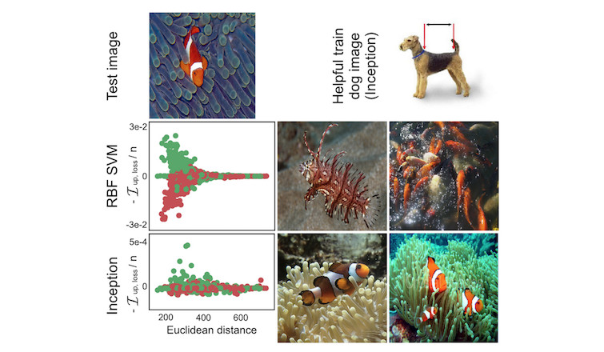

<!--{pagebreak}-->

## Influential Instances {#influential}

```{r, message = FALSE, warning = FALSE, echo = FALSE}
devtools::load_all()
set.seed(43)

influence.matrix.filename = "../data/influence-df.RData"
data("cervical")
```

<!-- Intro text -->
Machine learning models are ultimately a product of training data and deleting one of the training instances can affect the resulting model.
We call a training instance "influential" when its deletion from the training data considerably changes the parameters or predictions of the model.
By identifying influential training instances, we can "debug" machine learning models and better explain their behaviors and predictions.


<!-- *Keywords: Influential instances, influence function, leave-one-out analysis, Cook's distance, deletion diagnostics, robust statistics* -->


This chapter shows you two approaches for identifying influential instances, namely deletion diagnostics and influence functions.
Both approaches are based on robust statistics, which provides statistical methods that are less affected by outliers or violations of model assumptions.
Robust statistics also provides methods to measure how robust estimates from data are (such as a mean estimate or the weights of a prediction model).

Imagine you want to estimate the average income of the people in your city and ask ten random people on the street how much they earn.
Apart from the fact that your sample is probably really bad, how much can your average income estimate be influenced by a single person?
To answer this question, you can recalculate the mean value by omitting individual answers or derive mathematically via "influence functions" how the mean value can be influenced. 
With the deletion approach, we recalculate the mean value ten times, omitting one of the income statements each time, and measure how much the mean estimate changes. 
A big change means that an instance was very influential.
The second approach upweights one of the persons by an infinitesimally small weight, which corresponds to the calculation of the first derivative of a statistic or model.
This approach is also known as "infinitesimal approach" or "influence function".
The answer is, by the way, that your mean estimate can be very strongly influenced by a single answer, since the mean scales linearly with single values.
A more robust choice is the median (the value at which one half of people earn more and the other half less), because even if the person with the highest income in your sample would earn ten times more, the resulting median would not change.

Deletion diagnostics and influence functions can also be applied to the parameters or predictions of machine learning models to understand their behavior better or to explain individual predictions.
Before we look at these two approaches for finding influential instances, we will examine the difference between an outlier and an influential instance.

**Outlier**

An outlier is an instance that is far away from the other instances in the dataset.
"Far away" means that the distance, for example the Euclidean distance, to all the other instances is very large.
In a dataset of newborns, a newborn weighting 6 kg would be considered an outlier.
In a dataset of bank accounts with mostly checking accounts, a dedicated loan account (large negative balance, few transactions) would be considered an outlier.
The following figure shows an outlier for a 1-dimensional distribution.

```{r outlier, fig.cap = "Feature x follows a Gaussian distribution with an outlier at x=8."}
set.seed(42)
n = 50
x = rnorm(mean = 1, n = n)
x = c(x, 8)
y = rnorm(mean = x, n = n)
y = c(y, 7.2)
df = data.frame(x, y)
ggplot(df) + geom_histogram(aes(x = x)) + my_theme() + 
  scale_x_continuous("Feature x") + 
  scale_y_continuous("count")
```


Outliers can be interesting data points (e.g. [criticisms](#proto)).
When an outlier influences the model it is also an influential instance.

**Influential instance**

An influential instance is a data instance whose removal has a strong effect on the trained model.
The more the model parameters or predictions change when the model is retrained with a particular instance removed from the training data, the more influential that instance is. Whether an instance is influential for a trained model also depends on its value for the target y.
The following figure shows an influential instance for a linear regression model.


```{r influential-point, fig.cap = "A linear model with one feature. Trained once on the full data and once without the influential instance. Removing the influential instance changes the fitted slope (weight/coefficient) drastically."}

df2 = df[-nrow(df),]
df3 = rbind(df2, data.frame(x = 8, y = 0))

df3$regression_model = "with influential instance"
df2$regression_model = "without influential instance"
df.all = rbind(df2, df3)


text.dat = data.frame(x = c(8), y = c(0), lab = c("Influential instance"), regression_model = "with influential instance")

ggplot(df.all, mapping = aes(x = x, y = y, group = regression_model, linetype = regression_model)) + 
  geom_point(size = 2) + 
  geom_smooth(method='lm',formula=y~x, se = FALSE, aes(color = regression_model), fullrange = TRUE) + 
  my_theme() + 
  geom_label(data = text.dat, aes(label = lab), hjust = 1, nudge_x = -0.2, vjust = 0.3) +
  scale_x_continuous("Feature x") + 
  scale_y_continuous("Target y") + 
  scale_color_discrete("Model training") + 
  scale_linetype_discrete("Model training")

```

**Why do influential instances help to understand the model?**

The key idea behind influential instances for interpretability is to trace model parameters and predictions back to where it all began: the training data.
A learner, that is, the algorithm that generates the machine learning model, is a function that takes training data consisting of features X and target y and generates a machine learning model.
For example, the learner of a decision tree is an algorithm that selects the split features and the values at which to split. 
A learner for a neural network uses backpropagation to find the best weights.


```{r learner, fig.cap = "A learner learns a model from training data (features plus target). The model makes predictions for new data.", out.width=600}
knitr::include_graphics("images/learner.png")
```

We ask how the model parameters or the predictions would change if we removed instances from the training data in the training process.
This is in contrast to other interpretability approaches that analyze how the prediction changes when we manipulate the features of the instances to be predicted, such as [partial dependence plots](#pdp) or [feature importance](#feature-importance).
With influential instances, we do not treat the model as fixed, but as a function of the training data.
Influential instances help us answer questions about global model behavior and about individual predictions.
Which were the most influential instances for the model parameters or the predictions overall?
Which were the most influential instances for a particular prediction?
Influential instances tell us for which instances the model could have problems, which training instances should be checked for errors and give an impression of the robustness of the model.
We might not trust a model if a single instance has a strong influence on the model predictions and parameters.
At least that would make us investigate further.

How can we find influential instances?
We have two ways of measuring influence:
Our first option is to delete the instance from the training data, retrain the model on the reduced training dataset and observe the difference in the model parameters or predictions (either individually or over the complete dataset).
The second option is to upweight a data instance by approximating the parameter changes based on the gradients of the model parameters.
The deletion approach is easier to understand and motivates the upweighting approach, so we start with the former.

### Deletion Diagnostics

Statisticians have already done a lot of research in the area of influential instances, especially for (generalized) linear regression models.
When you search for "influential observations", the first search results are about measures like DFBETA and Cook's distance.
**DFBETA** measures the effect of deleting an instance on the model parameters.
**Cook's distance**  (Cook, 1977[^cook]) measures the effect of deleting an instance on model predictions.
For both measures we have to retrain the model repeatedly, omitting individual instances each time.
The parameters or predictions of the model with all instances is compared with the parameters or predictions of the model with one of the instances deleted from the training data.

DFBETA is defined as:

$$DFBETA_{i}=\beta-\beta^{(-i)}$$

where $\beta$ is the weight vector when the model is trained on all data instances, and $\beta^{(-i)}$ the weight vector when the model is trained without instance i.
Quite intuitive I would say.
DFBETA works only for models with weight parameters, such as logistic regression or neural networks, but not for models such as decision trees, tree ensembles, some support vector machines and so on.

Cook's distance was invented for linear regression models and approximations for generalized linear regression models exist.
Cook's distance for a training instance is defined as the (scaled) sum of the squared differences in the predicted outcome when the i-th instance is removed from the model training.

$$D_i=\frac{\sum_{j=1}^n(\hat{y}_j-\hat{y}_{j}^{(-i)})^2}{p\cdot{}MSE}$$

where the numerator is the squared difference between prediction of the model with and without the i-th instance, summed over the dataset.
The denominator is the number of features p times the mean squared error.
The denominator is the same for all instances no matter which instance i is removed.
Cook's distance tells us how much the predicted output of a linear model changes when we remove the i-th instance from the training.


Can we use Cook's distance and DFBETA for any machine learning model?
DFBETA requires model parameters, so this measure works only for parameterized models.
Cook's distance does not require any model parameters.
Interestingly, Cook's distance is usually not seen outside the context of linear models and generalized linear models, but the idea of taking the difference between model predictions before and after removal of a particular instance is very general.
A problem with the definition of Cook's distance is the MSE, which is not meaningful for all types of prediction models (e.g. classification).

The simplest influence measure for the effect on the model predictions can be written as follows: 

$$\text{Influence}^{(-i)}=\frac{1}{n}\sum_{j=1}^{n}\left|\hat{y}_j-\hat{y}_{j}^{(-i)}\right|$$

This expression is basically the numerator of Cook's distance, with the difference that the absolute difference is added up instead of the squared differences.
This was a choice I made, because it makes sense for the examples later.
The general form of deletion diagnostic measures consists of choosing a measure (such as the predicted outcome) and calculating the difference of the measure for the model trained on all instances and when the instance is deleted.


We can easily break the influence down to explain for the prediction of instance j what the influence of the i-th training instance was:

$$\text{Influence}_{j}^{(-i)}=\left|\hat{y}_j-\hat{y}_{j}^{(-i)}\right|$$

This would also work for the difference in model parameters or the difference in the loss.
In the following example we will use these simple influence measures.

**Deletion diagnostics example**

In the following example, we train a support vector machine to predict [cervical cancer](#cervical) given risk factors and measure which training instances were most influential overall and for a particular prediction.
Since the prediction of cancer is a classification problem, we measure the influence as the difference in predicted probability for cancer.
An instance is influential if the predicted probability strongly increases or decreases on average in the dataset when the instance is removed from model training.
The measurement of the influence for all `r nrow(cervical)` training instances requires to train the model once on all data and retrain it `r nrow(cervical)` times (= size of training data) with one of the instances removed each time.

```{r influence, eval = !file.exists(influence.matrix.filename)}
#'@param predicted The predicted outcome of a model
#'@param predicted.without The predicted outcome of a model with a data point removed
influence.v = function(predicted, predicted.without) {
  predicted - predicted.without
}

influence.matrix = matrix(NA, ncol = nrow(cervical), nrow = nrow(cervical))

lrn = makeLearner("classif.svm", predict.type = "prob")
tsk = makeClassifTask(data = cervical, target = "Biopsy")
mod = train(lrn, tsk)
predicted.orig = getPredictionProbabilities(predict(mod, newdata = cervical))
cs = lapply(1:nrow(cervical), function(to.remove.index) {
  mod.2 = train(lrn, tsk, subset = setdiff(1:nrow(cervical), to.remove.index))
  predict.removed = getPredictionProbabilities(predict(mod.2, newdata = cervical))
  influence.v(predicted.orig, predict.removed)
})

# Column: Removed instance, row: influenced instance
influence.df = data.frame(cs)
influence.df = as.matrix(influence.df)
diag(influence.df) = NA
save(influence.df, predicted.orig, file = influence.matrix.filename)
```

```{r}
load(influence.matrix.filename)
df = data.frame(influence = colMeans(abs(influence.df), na.rm = TRUE), id = 1:nrow(cervical))
df = df[order(df$influence, decreasing = TRUE),]
```

The most influential instance has an influence measure of about `r sprintf("%.2f", abs(df[1,"influence"]))`.
An influence of `r sprintf('%.2f', abs(df[1,"influence"]))` means that if we remove the `r df$id[1]`-th instance, the predicted probability changes by `r sprintf('%.0f', 100 * df[1,"influence"])` percentage point on average.
This is quite substantial considering the average predicted probability for cancer is `r sprintf('%.1f', 100 *mean(predicted.orig))`%.
The mean value of influence measures over all possible deletions is `r sprintf('%.1f', 100 * mean(abs(df$influence)))` percentage points.
Now we know which of the data instances were most influential for the model.
This is already useful to know for debugging the data.
Is there a problematic instance?
Are there measurement errors?
The influential instances are the first ones that should be checked for errors, because each error in them strongly influences the model predictions.

Apart from model debugging, can we learn something to better understand the model?
Just printing out the top 10 most influential instances is not very useful, because it is just a table of instances with many features.
All methods that return instances as output only make sense if we have a good way of representing them.
But we can better understand what kind of instances are influential when we ask:
What distinguishes an influential instance from a non-influential instance?
We can turn this question into a regression problem and model the influence of an instance as a function of its feature values. 
We are free to choose any model from the chapter on [Interpretable Machine Learning Models](#simple).
For this example I chose a decision tree (following figure) that shows that data from women of age 35 and older were the most influential for the support vector machine.
Of all the women in the dataset  `r sum(cervical$Age >= 35)` out of `r nrow(cervical)` were older than 35.
In the chapter on [Partial Dependence Plots](#pdp) we have seen that after 40 there is a sharp increase in the predicted probability of cancer and the [Feature Importance](#feature-importance) has also detected age as one of the most important features.
The influence analysis tells us that the model becomes increasingly unstable when predicting cancer for higher ages.
This in itself is valuable information. 
This means that errors in these instances can have a strong effect on the model.

```{r cooks-analyzed, eval=TRUE, fig.cap = "A decision tree that models the relationship between the influence of the instances and their features. The maximum depth of the tree is set to 2."}
df.cervical  = cbind(df, cervical)
ct = rpart(abs(influence) ~ . -id, data = df.cervical, control = rpart.control(maxdepth = 2))
ct = as.party(ct)
plot(ct, inner_panel = node_inner(ct, pval = FALSE, id=FALSE), terminal_panel=node_boxplot(ct,id=FALSE))
```

```{r influence-single-prepare}
i = which(predicted.orig == max(predicted.orig))
```


This first influence analysis revealed the *overall* most influential instance.
Now we select one of the instances, namely the `r i`-th instance, for which we want to explain the prediction by finding the most influential training data instances.
It is like a counterfactual question:
How would the prediction for instance `r i` change if we omit instance i from the training process?
We repeat this removal for all instances.
Then we select the training instances that result in the biggest change in the prediction of instance `r i` when they are omitted from the training and use them to explain the prediction of the model for that instance.
I chose to explain the prediction for instance `r i` because it is the instance with the highest predicted probability of cancer (`r sprintf('%.2f', 100 * predicted.orig[i])`%), which I thought was an interesting case to analyze more deeply.
We could return the, say, top 10 most influential instances for predicting the `r i`-th instance printed as a table.
Not very useful, because we could not see much.
Again, it makes more sense to find out what distinguishes the influential instances from the non-influential instances by analyzing their features.
We use a decision tree trained to predict the influence given the features, but in reality we misuse it only to find a structure and not to actually predict something.
The following decision tree shows which kind of training instances were most influential for predicting the `r i`-th instance. 


```{r influence-single, fig.cap = sprintf("Decision tree that explains which instances were most influential for predicting the %i-th instance. Data from women who smoked for 18.5 years or longer had a large influence on the prediction of the %i-th instance, with an average change in absolute prediction by 11.7 percentage points of cancer probability.", i, i)}
obs = influence.df[i,]
cervical.200 = cervical
cervical.200$influence = unlist(obs)
#cervical.200 = na.omit(cervical.200)
worst.case.index = which(abs(cervical.200$influence) == max(abs(cervical.200$influence), na.rm = TRUE))
ct = rpart(abs(influence) ~ ., data = cervical.200, control = rpart.control(maxdepth = 2))
ct = as.party(ct)
plot(ct, inner_panel = node_inner(ct, pval = FALSE, id=FALSE), terminal_panel=node_boxplot(ct,id=FALSE))
```

Data instances of women who smoked or have been smoking for 18.5 years or longer have a high influence on the prediction of the `r i`-th instance.
The woman behind the `r i`-th instance smoked for `r cervical$Smokes..years.[i]` years.
In the data, `r sum(cervical$Smokes..years >= 18.5)` women (`r sprintf('%.2f', 100 * mean(cervical$Smokes..years >= 18.5))`%) smoked 18.5 years or longer.
Any mistake made in collecting the number of years of smoking of one of these women will have a huge impact on the predicted outcome for the `r i`-th instance.

The most extreme change in the prediction happens when we remove instance number `r worst.case.index`.
The patient allegedly smoked for `r cervical$Smokes..years.[worst.case.index]` years, aligned with the results from the decision tree.
The predicted probability for the `r i`-th instance changes from `r sprintf('%.2f', 100 * predicted.orig[i])`% to `r sprintf('%.2f', 100 * (predicted.orig[i]  - cervical.200$influence[worst.case.index]))`% if we remove the instance `r worst.case.index`!


If we take a closer look at the features of the most influential instance, we can see another possible problem.
The data say that the woman is 28 years old and has been smoking for 22 years. 
Either it is a really extreme case and she really started smoking at 6, or this is a data error. 
I tend to believe the latter.
This is certainly a situation in which we must question the accuracy of the data.

These examples showed how useful it is to identify influential instances to debug models.
One problem with the proposed approach is that the model needs to be retrained for each training instance.
The whole retraining can be quite slow, because if you have thousands of training instances, you will have to retrain your model thousands of times.
Assuming the model takes one day to train and you have 1000 training instances, then the computation of influential instances -- without parallelization -- will take almost 3 years.
Nobody has time for this.
In the rest of this chapter, I will show you a method that does not require retraining the model.


### Influence Functions

*You*: I want to know the influence a training instance has on a particular prediction.  
*Research*: You can delete the training instance, retrain the model, and measure the difference in the prediction.  
*You*: Great! But do you have a method for me that works without retraining? It takes so much time.  
*Research*: Do you have a model with a loss function that is twice differentiable with respect to its parameters?  
*You*: I trained a neural network with the logistic loss. So yes.  
*Research*: Then you can approximate the influence of the instance on the model parameters and on the prediction with **influence functions**. 
The influence function is a measure of how strongly the model parameters or predictions depend on a training instance. 
Instead of deleting the instance, the method upweights the instance in the loss by a very small step. 
This method involves approximating the loss around the current model parameters using the gradient and Hessian matrix.
Loss upweighting is similar to deleting the instance.  
*You*: Great, that's what I'm looking for!  

Koh and Liang (2017)[^koh] suggested using influence functions, a method of robust statistics, to measure how an instance influences model parameters or predictions.
As with deletion diagnostics, the influence functions trace the model parameters and predictions back to the responsible training instance.
However, instead of deleting training instances, the method approximates how much the model changes when the instance is upweighted in the empirical risk (sum of the loss over the training data).

The method of influence functions requires access to the loss gradient with respect to the model parameters, which only works for a subset of machine learning models.
Logistic regression, neural networks and support vector machines qualify, tree-based methods like random forests do not.
Influence functions help to understand the model behavior, debug the model and detect errors in the dataset.

The following section explains the intuition and math behind influence functions.

**Math behind influence functions**

The key idea behind influence functions is to upweight the loss of a training instance by an infinitesimally small step $\epsilon$, which results in new model parameters:

$$\hat{\theta}_{\epsilon,z}=\arg\min_{\theta{}\in\Theta}(1-\epsilon)\frac{1}{n}\sum_{i=1}^n{}L(z_i,\theta)+\epsilon{}L(z,\theta)$$

where $\theta$ is the model parameter vector and $\hat{\theta}_{\epsilon,z}$ is the parameter vector after upweighting z by a very small number $\epsilon$.
L is the loss function with which the model was trained, $z_i$ is the training data and z is the training instance which we want to upweight to simulate its removal.
The intuition behind this formula is:
How much will the loss change if we upweight a particular instance $z_i$ from the training data by a little ($\epsilon$) and downweight the other data instances accordingly?
What would the parameter vector look like to optimize this new combined loss?
The influence function of the parameters, i.e. the influence of upweighting training instance z on the parameters, can be calculated as follows.

$$I_{\text{up,params}}(z)=\left.\frac{d{}\hat{\theta}_{\epsilon,z}}{d\epsilon}\right|_{\epsilon=0}=-H_{\hat{\theta}}^{-1}\nabla_{\theta}L(z,\hat{\theta})$$

The last expression $\nabla_{\theta}L(z,\hat{\theta})$ is the loss gradient with respect to the parameters for the upweighted training instance.
The gradient is the rate of change of the loss of the training instance.
It tells us how much the loss changes when we change the model parameters $\hat{\theta}$ by a bit.
A positive entry in the gradient vector means that a small increase in the corresponding model parameter increases the loss, a negative entry means that the increase of the parameter reduces the loss.
The first part $H^{-1}_{\hat{\theta}}$ is the inverse Hessian matrix (second derivative of the loss with respect to the model parameters).
The Hessian matrix is the rate of change of the gradient, or expressed as loss, it is the rate of change of the rate of change of the loss.
It can be estimated using: 

$$H_{\theta}=\frac{1}{n}\sum_{i=1}^n\nabla^2_{\hat{\theta}}L(z_i,\hat{\theta})$$

More informally: 
The Hessian matrix records how curved the loss is at a certain point. 
The Hessian is a matrix and not just a vector, because it describes the curvature of the loss and the curvature depends on the direction in which we look.
The actual calculation of the Hessian matrix is time-consuming if you have many parameters.
Koh and Liang suggested some tricks to calculate it efficiently, which goes beyond the scope of this chapter.
Updating the model parameters, as described by the above formula, is equivalent to taking a single Newton step after forming a quadratic expansion around the estimated model parameters.

What intuition is behind this influence function formula?
The formula comes from forming a quadratic expansion around the parameters $\hat{\theta}$.
That means we do not actually know, or it is too complex to calculate how exactly the loss of instance z will change when it is removed/upweighted.
We approximate the function locally by using information about the steepness (= gradient) and the curvature (= Hessian matrix) at the current model parameter setting.
With this loss approximation, we can calculate what the new parameters would approximately look like if we upweighted instance z:

$$\hat{\theta}_{-z}\approx\hat{\theta}-\frac{1}{n}I_{\text{up,params}}(z)$$

The approximate parameter vector is basically the original parameter minus the gradient of the loss of z (because we want to decrease the loss) scaled by the curvature (= multiplied by the inverse Hessian matrix) and scaled by 1 over n, because that is the weight of a single training instance.

The following figure shows how the upweighting works.
The x-axis shows the value of the $\theta$ parameter and the y-axis the corresponding value of the loss with upweighted instance z.
The model parameter here is 1-dimensional for demonstration purposes, but in reality it is usually high-dimensional.
We move only 1 over n into the direction of improvement of the loss for instance z.
We do not know how the loss would really change when we delete z, but with the first and second derivative of the loss, we create this quadratic approximation around our current model parameter and pretend that this is how the real loss would behave.

```{r quadratic-expansion, fig.cap="Updating the model parameter (x-axis) by forming a quadratic expansion of the loss around the current model parameter, and moving 1/n into the direction in which the loss with upweighted instance z (y-axis) improves most. This upweighting of instance z in the loss approximates the parameter changes if we delete z and train the model on the reduced data."}
x = seq(from = -1.2, to = 1.2, length.out = 100)
y.fun = function(x) {
  -x - 2*x^2 - x^3 + 2 * x^4
}
y = y.fun(x)
expansion = function(x, x0 = 0) {
  d1 = function(x) -1 - 2*x - 3 * x^2 +  8 * x^3
  d2 = function(x)    - 2   - 6 * x   + 24 * x^2
  y.fun(x0) + d1(x0) * (x - x0) + 0.5 * (x - x0)^2*d2(x0)
}

dat = data.frame(x=x, y=y)
dat$type = "Actual loss"
dat2 = dat
dat2$type = "Quadratic expansion"
dat2$y = expansion(x)
dat3 = rbind(dat, dat2)

#pts  = data.frame(x = c(0, 2/6))

ggplot(dat3) + 
  geom_line(aes(x = x, y = y, group = type, color = type, linetype = type)) + 
  geom_vline(xintercept = 0, linetype = 2) + 
  geom_vline(xintercept = 1/2, linetype = 2) + 
  scale_y_continuous("Loss with upweighted instance z", labels = NULL, breaks = NULL) + 
  scale_x_continuous("Model parameter", labels = NULL, breaks = NULL) +
  geom_point(x = 0, y = expansion(x = 0)) + 
  geom_label(x = 0, label = expression(hat(theta)), y  = expansion(x=0), vjust = 2) + 
  geom_point(x = 1/2, y = expansion(x = 1/2)) + 
  geom_label(x = 1/2, y = expansion(x = 1/2), label = expression(hat(theta)[-z]), vjust = 2) + 
  geom_segment(x = 0, xend=1/2, y=1, yend=1, arrow = arrow(length = unit(0.2, "cm"))) + 
  geom_label(x = 0.25, y = 1.1, label = expression(-frac(1,n)~I[up~theta](z)), vjust = -0.2) + 
  my_theme()

```


We do not actually need to calculate the new parameters, but we can use the influence function as a measure of the influence of z on the parameters.

How do the *predictions* change when we upweight training instance z?
We can either calculate the new parameters and then make predictions using the newly parameterized model, or we can also calculate the influence  of instance z on the predictions directly, since we can calculate the influence by using the chain rule:

$$\begin{align*}I_{up,loss}(z,z_{test})&=\left.\frac{d{}L(z_{test},\hat{\theta}_{\epsilon,z})}{d\epsilon}\right|_{\epsilon=0}\\&=\left.\nabla_{\theta}L(z_{test},\hat{\theta})^T\frac{d\hat{\theta}_{\epsilon,z}}{d\epsilon}\right|_{\epsilon=0}\\&=-\nabla_{\theta}L(z_{test},\hat{\theta})^T{}H^{-1}_{\theta}\nabla_{\theta}L(z,\hat{\theta})\end{align*}$$

The first line of this equation means that we measure the influence of a training instance on a certain prediction $z_{test}$ as a change in loss of the test instance when we upweight the instance z and get new parameters $\hat{\theta}_{\epsilon,z}$.
For the second line of the equation, we have applied the chain rule of derivatives and get the derivative of the loss of the test instance with respect to the parameters times the influence of z on the parameters.
In the third line, we replace the expression with the influence function for the parameters.
The first term in the third line $\nabla_{\theta}L(z_{test},\hat{\theta})^T{}$ is the gradient of the test instance with respect to the model parameters.

Having a formula is great and the scientific and accurate way of showing things.
But I think it is very important to get some intuition about what the formula means.
The formula for $I_{\text{up,loss}}$ states that the influence function of the training instance z on the prediction of an instance $z_{test}$ is "how strongly the instance reacts to a change of the model parameters" multiplied by "how much the parameters change when we upweight the instance z".
Another way to read the formula:
The influence is proportional to how large the gradients for the training and test loss are.
The higher the gradient of the training loss, the higher its influence on the parameters and the higher the influence on the test prediction.
The higher the gradient of the test prediction, the more influenceable the test instance.
The entire construct can also be seen as a measure of the similarity (as learned by the model) between the training and the test instance.

That is it with theory and intuition.
The next section explains how influence functions can be applied.

**Application of Influence Functions**

Influence functions have many applications, some of which have already been presented in this chapter.

**Understanding model behavior**

Different machine learning models have different ways of making predictions.
Even if two models have the same performance, the way they make predictions from the features can be very different and therefore fail in different scenarios.
Understanding the particular weaknesses of a model by identifying influential instances helps to form a "mental model" of the machine learning model behavior in your mind.
The following figure shows an example where a support vector machine (SVM) and a neural network were trained to distinguish images of dogs and fish.
The most influential instances of an exemplary image of a fish were very different for both models.
For the SVM, instances were influential if they were similar in color. 
For the neural network, instances were influential if they were conceptually similar.
For the neural network, even one image of a dog was among the most influential images, showing that it learned the concepts and not the Euclidean distance in color space.

```{r example-influence-function-svm-inception, eval = TRUE, fig.cap = "Dog or fish? For the SVM prediction (middle row) images that had similar colors as the test image were the most influential. For the neural network prediction (bottom row) fish in different setting were most influential, but also a dog image (top right). Work by Koh and Liang (2017).", out.width=600}

```


**Handling domain mismatches / Debugging model errors**

Handling domain mismatch is closely related to better understand the model behavior.
Domain mismatch means that the distribution of training and test data is different, which can cause the model to perform poorly on the test data.
Influence functions can identify training instances that caused the error.
Suppose you have trained a prediction model for the outcome of patients who have undergone surgery. 
All these patients come from the same hospital. 
Now you use the model in another hospital and see that it does not work well for many patients.
Of course, you assume that the two hospitals have different patients, and if you look at their data, you can see that they differ in many features. 
But what are the features or instances that have "broken" the model?
Here too, influential instances are a good way to answer this question.
You take one of the new patients, for whom the model has made a false prediction, find and analyze the most influential instances.
For example, this could show that the second hospital has older patients on average and the most influential instances from the training data are the few older patients from the first hospital and the model simply lacked the data to learn to predict this subgroup well.
The conclusion would be that the model needs to be trained on more patients who are older in order to work well in the second hospital.

**Fixing training data**

If you have a limit on how many training instances you can check for correctness, how do you make an efficient selection?
The best way is to select the most influential instances, because -- by definition -- they have the most influence on the model.
Even if you would have an instance with obviously incorrect values, if the instance is not influential and you only need the data for the prediction model, it is a better choice to check the influential instances.
For example, you train a model for predicting whether a patient should remain in hospital or be discharged early.
You really want to make sure that the model is robust and makes correct predictions, because a wrong release of a patient can have bad consequences.
Patient records can be very messy, so you do not have perfect confidence in the quality of the data.
But checking patient information and correcting it can be very time-consuming, because once you have reported which patients you need to check, the hospital actually needs to send someone to look at the records of the selected patients more closely, which might be handwritten and lying in some archive.
Checking data for a patient could take an hour or more.
In view of theses costs, it makes sense to check only a few important data instances.
The best way is to select patients who have had a high influence on the prediction model.
Koh and Liang (2017) showed that this type of selection works much better than random selection or the selection of those with the highest loss or wrong classification.


### Advantages of Identifying Influential Instances

The approaches of deletion diagnostics and influence functions are very different from the mostly feature-perturbation based approaches presented in the [Model-Agnostic chapter](#agnostic). 
A look at influential instances emphasizes the role of training data in the learning process.
This makes influence functions and deletion diagnostics **one of the best debugging tools for machine learning models**.
Of the techniques presented in this book, they are the only ones that directly help to identify the instances which should be checked for errors.

**Deletion diagnostics are model-agnostic**, meaning the approach can be applied to any model. 
Also influence functions based on the derivatives can be applied to a broad class of models. 

We can use these methods to **compare different machine learning models** and better understand their different behaviors, going beyond comparing only the predictive performance.

We have not talked about this topic in this chapter, but **influence functions via derivatives can also be used to create adversarial training data**. 
These are instances that are manipulated in such a way that the model cannot predict certain test instances correctly when the model is trained on those manipulated instances.
The difference to the methods in the [Adversarial Examples chapter](#adversarial) is that the attack takes place during training time, also known as poisoning attacks.
If you are interested, read the paper by Koh and Liang (2017).

For deletion diagnostics and influence functions, we considered the difference in the prediction and for the influence function the increase of the loss. 
But, really, **the approach is generalizable** to any question of the form:
"What happens to ... when we delete or upweight instance z?", where you can fill "..." with any function of your model of your desire. 
You can analyze how much a training instance influences the overall loss of the model.
You can analyze how much a training instance influences the feature importance.
You can analyze how much a training instance influences which feature is selected for the first split when training a [decision tree](#tree).

### Disadvantages of Identifying Influential Instances

Deletion diagnostics are very **expensive to calculate** because they require retraining.
But history has shown that computer resources are constantly increasing.
A calculation that 20 years ago was unthinkable in terms of resources can easily be performed with your smartphone.
You can train models with thousands of training instances and hundreds of parameters on a laptop in seconds/minutes. 
It is therefore not a big leap to assume that deletion diagnostics will work without problems even with large neural networks in 10 years.

**Influence functions are a good alternative to deletion diagnostics, but only for models with differentiable parameters**, such as neural networks.
They do not work for tree-based methods like random forests, boosted trees or decision trees.
Even if you have models with parameters and a loss function, the loss may not be differentiable.
But for the last problem, there is a trick:
Use a differentiable loss as substitute for calculating the influence when, for example, the underlying model uses the Hinge loss instead of some differentiable loss.
The loss is replaced by a smoothed version of the problematic loss for the influence functions, but the model can still be trained with the non-smooth loss.

**Influence functions are only approximate**, because the approach forms a quadratic expansion around the parameters.
The approximation can be wrong and the influence of an instance is actually higher or lower when removed.
Koh and Liang (2017) showed for some examples that the influence calculated by the influence function was close to the influence measure obtained when the model was actually retrained after the instance was deleted.
But there is no guarantee that the approximation will always be so close.

There is **no clear cutoff of the influence measure at which we call an instance influential or non-influential**.
It is useful to sort the instances by influence, but it would be great to have the means not only to sort the instances, but actually to distinguish between influential and non-influential.
For example, if you identify the top 10 most influential training instances for a test instance, some of them may not be influential because, for example, only the top 3 were really influential.

The influence measures **only take into account the deletion of individual instances** and not the deletion of several instances at once.
Larger groups of data instances may have some interactions  that strongly influence model training and prediction.
But the problem lies in combinatorics:
There are n possibilities to delete an individual instance from the data. 
There are n times (n-1) possibilities to delete two instances from the training data. 
There are n times (n-1) times (n-2) possibilities to delete three ...
I guess you can see where this is going, there are just too many combinations.

### Software and Alternatives

Deletion diagnostics are very simple to implement. 
Take a look at [the code](https://github.com/christophM/interpretable-ml-book/blob/master/manuscript/06.5-example-based-influence-fct.Rmd) I wrote for the examples in this chapter.

For linear models and generalized linear models many influence measures like Cook's distance are implemented in R in the `stats` package.

Koh and Liang published the Python code for influence functions from their paper [in a repository](https://github.com/kohpangwei/influence-release).
That is great!
Unfortunately it is "only" the code of the paper and not a maintained and documented Python module.
The code is focused on the Tensorflow library, so you cannot use it directly for black box models using other frameworks, like sci-kit learn.

Keita Kurita wrote a [great blog post for influence functions](http://mlexplained.com/2018/06/01/paper-dissected-understanding-black-box-predictions-via-influence-functions/#more-641) that helped me understand Koh and Liang's paper better. 
The blog post goes a little deeper into the mathematics behind influence functions for black box models and also talks about some of the mathematical 'tricks' with which the method is efficiently implemented.


[^cook]: Cook, R. Dennis. "Detection of influential observation in linear regression." Technometrics 19.1 (1977): 15-18.

[^koh]: Koh, Pang Wei, and Percy Liang. "Understanding black-box predictions via influence functions." arXiv preprint arXiv:1703.04730 (2017).
