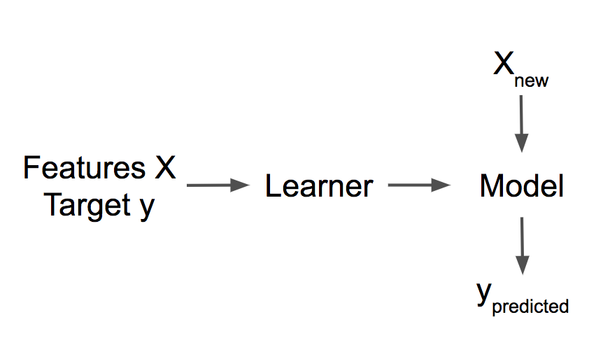
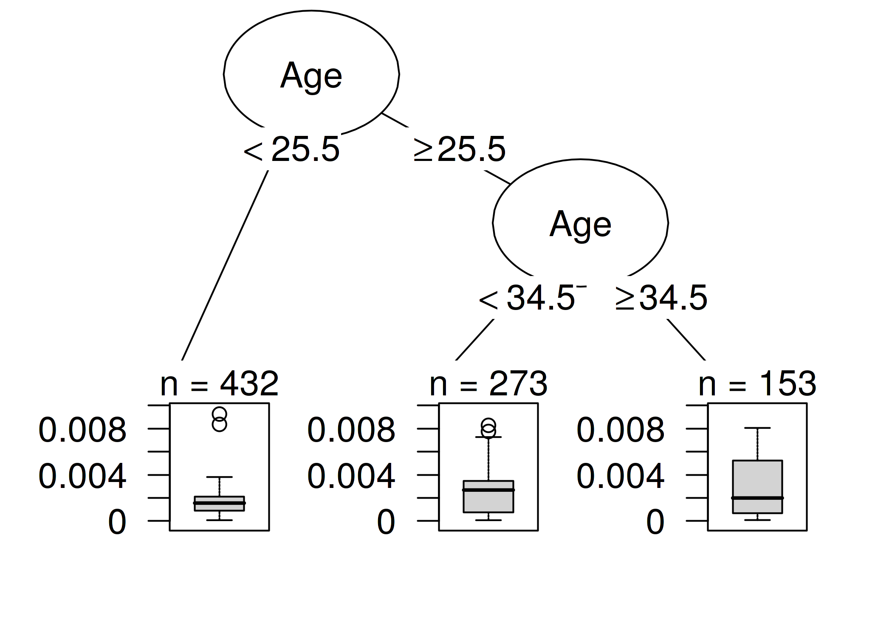
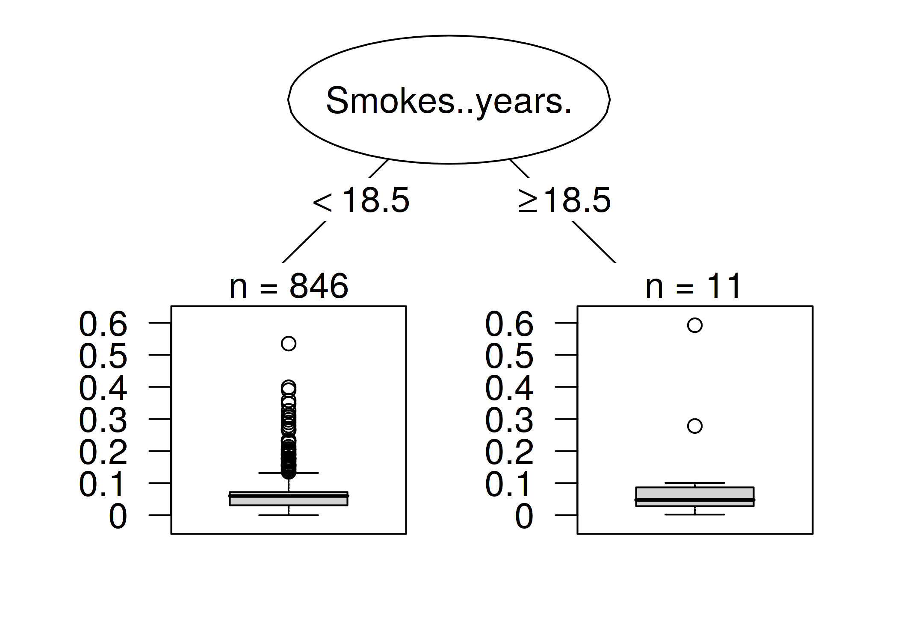

<!--{pagebreak}-->

## Influential Instances {#influential}

```{r, message = FALSE, warning = FALSE, echo = FALSE}
devtools::load_all()
set.seed(43)

influence.matrix.filename = "../data/influence-df.RData"
data("cervical")
```

Model machine learning pada akhirnya merupakan produk dari data pelatihan dan menghapus salah satu contoh pelatihan dapat memengaruhi model yang dihasilkan.
Kami menyebut instance pelatihan "berpengaruh" ketika penghapusannya dari data pelatihan sangat mengubah parameter atau prediksi model.
Dengan mengidentifikasi contoh pelatihan yang berpengaruh, kami dapat "men-debug" model machine learning dan menjelaskan perilaku dan prediksinya dengan lebih baik.

Bab ini menunjukkan kepada Anda dua pendekatan untuk mengidentifikasi instance yang berpengaruh, yaitu deletion diagnostics dan influence functions.
Kedua pendekatan didasarkan pada statistik yang kuat, yang menyediakan metode statistik yang kurang terpengaruh oleh outlier atau pelanggaran asumsi model.
Statistik yang kuat juga menyediakan metode untuk mengukur seberapa kuat perkiraan dari data (seperti perkiraan rata-rata atau bobot model prediksi).

Bayangkan Anda ingin memperkirakan pendapatan rata-rata orang-orang di kota Anda dan bertanya kepada sepuluh orang secara acak di jalan berapa penghasilan mereka.
Terlepas dari kenyataan bahwa sampel Anda mungkin sangat buruk, seberapa besar perkiraan pendapatan rata-rata Anda dapat dipengaruhi oleh satu orang?
Untuk menjawab pertanyaan ini, Anda dapat menghitung ulang nilai rata-rata dengan menghilangkan jawaban individual atau menurunkan secara matematis melalui "influence functions" bagaimana nilai rata-rata dapat dipengaruhi.
Dengan pendekatan penghapusan, kami menghitung ulang nilai rata-rata sepuluh kali, menghilangkan salah satu laporan laba rugi setiap kali, dan mengukur seberapa banyak estimasi rata-rata berubah.
Sebuah perubahan besar berarti bahwa sebuah instance sangat berpengaruh.
Pendekatan kedua menaikkan bobot salah satu orang dengan bobot yang sangat kecil, yang sesuai dengan perhitungan turunan pertama dari statistik atau model.
Pendekatan ini juga dikenal sebagai "pendekatan tak terhingga" atau "influence functions".
Jawabannya adalah, perkiraan rata-rata Anda dapat sangat dipengaruhi oleh satu jawaban, karena skala rata-rata secara linier dengan nilai tunggal.
Pilihan yang lebih kuat adalah median (nilai di mana satu setengah orang berpenghasilan lebih banyak dan setengah lainnya lebih sedikit), karena bahkan jika orang dengan pendapatan tertinggi dalam sampel Anda akan menghasilkan sepuluh kali lebih banyak, median yang dihasilkan tidak akan berubah.

deletion diagnostics dan influence functions juga dapat diterapkan pada parameter atau prediksi model machine learning untuk memahami perilakunya dengan lebih baik atau untuk menjelaskan prediksi individu.
Sebelum kita melihat dua pendekatan ini untuk menemukan instance yang berpengaruh, kita akan memeriksa perbedaan antara outlier dan instance yang berpengaruh.

**outlier**

Outlier adalah instance yang jauh dari instance lain dalam dataset.
"Jauh" berarti bahwa jarak, misalnya jarak Euclidean, ke semua contoh lainnya sangat besar.
Dalam kumpulan data bayi baru lahir, bayi baru lahir dengan berat 6 kg akan dianggap sebagai outlier.
Dalam kumpulan data rekening bank dengan sebagian besar rekening giro, rekening pinjaman khusus (saldo negatif besar, beberapa transaksi) akan dianggap sebagai outlier.
Gambar berikut menunjukkan outlier untuk distribusi 1 dimensi.

```{r outlier, fig.cap = "Feature x follows a Gaussian distribution with an outlier at x=8."}
set.seed(42)
n = 50
x = rnorm(mean = 1, n = n)
x = c(x, 8)
y = rnorm(mean = x, n = n)
y = c(y, 7.2)
df = data.frame(x, y)
ggplot(df) + geom_histogram(aes(x = x)) + my_theme() + 
  scale_x_continuous("Feature x") + 
  scale_y_continuous("count")
```


Outlier dapat menjadi titik data yang menarik (mis. [kritik](#proto)).
Ketika outlier mempengaruhi model, itu juga merupakan contoh yang berpengaruh.

**influential instances**

Influential instances adalah instance data yang penghapusannya memiliki efek kuat pada model yang dilatih.
Semakin banyak parameter model atau prediksi berubah ketika model dilatih ulang dengan instance tertentu dihapus dari data pelatihan, semakin berpengaruh instance tersebut. Apakah sebuah influential instances untuk model terlatih juga bergantung pada nilainya untuk target y.
Gambar berikut menunjukkan influential instances untuk model linear regression.


```{r influential-point, fig.cap = "A linear model with one feature. Trained once on the full data and once without the influential instance. Removing the influential instance changes the fitted slope (weight/coefficient) drastically."}

df2 = df[-nrow(df),]
df3 = rbind(df2, data.frame(x = 8, y = 0))

df3$regression_model = "with influential instance"
df2$regression_model = "without influential instance"
df.all = rbind(df2, df3)


text.dat = data.frame(x = c(8), y = c(0), lab = c("Influential instance"), regression_model = "with influential instance")

ggplot(df.all, mapping = aes(x = x, y = y, group = regression_model, linetype = regression_model)) + 
  geom_point(size = 2) + 
  geom_smooth(method='lm',formula=y~x, se = FALSE, aes(color = regression_model), fullrange = TRUE) + 
  my_theme() + 
  geom_label(data = text.dat, aes(label = lab), hjust = 1, nudge_x = -0.2, vjust = 0.3) +
  scale_x_continuous("Feature x") + 
  scale_y_continuous("Target y") + 
  scale_color_discrete("Model training") + 
  scale_linetype_discrete("Model training")

```

**Mengapa influential instances membantu memahami model?**

Ide kunci di balik influential instances untuk interpretabilitas adalah untuk melacak parameter model dan prediksi kembali ke tempat semuanya dimulai: data pelatihan.
Seorang pembelajar, yaitu algoritma yang menghasilkan model machine learning, adalah fungsi yang mengambil data pelatihan yang terdiri dari fitur X dan target y dan menghasilkan model machine learning.
Misalnya, pelajar dari decision trees adalah algoritme yang memilih fitur split dan nilai yang akan dibagi.
Seorang pelajar untuk jaringan saraf menggunakan backpropagation untuk menemukan bobot terbaik.


```{r learner, fig.cap = "A learner learns a model from training data (features plus target). The model makes predictions for new data.", out.width=600}

```

Kami menanyakan bagaimana parameter model atau prediksi akan berubah jika kami menghapus instance dari data pelatihan dalam proses pelatihan.
Ini berbeda dengan pendekatan interpretabilitas lain yang menganalisis bagaimana prediksi berubah ketika kita memanipulasi fitur dari instance yang akan diprediksi, seperti [partial dependency plots](#pdp) atau [feature important](#feature-importance).
Dengan instance yang berpengaruh, kami tidak memperlakukan model sebagai tetap, tetapi sebagai fungsi dari data pelatihan.
Influential instances membantu kami menjawab pertanyaan tentang perilaku model global dan tentang prediksi individu.
Manakah contoh yang paling berpengaruh untuk parameter model atau prediksi secara keseluruhan?
Manakah contoh yang paling berpengaruh untuk prediksi tertentu?
Influential instances memberi tahu kita untuk instance model mana yang mungkin bermasalah, instance pelatihan mana yang harus diperiksa kesalahannya dan memberikan kesan kekokohan model.
Kami mungkin tidak mempercayai model jika satu instance memiliki pengaruh kuat pada prediksi dan parameter model.
Setidaknya itu akan membuat kita menyelidiki lebih lanjut.

Bagaimana kita bisa menemukan contoh yang berpengaruh?
Kami memiliki dua cara untuk mengukur pengaruh:
Opsi pertama kami adalah menghapus instance dari data pelatihan, melatih kembali model pada set data pelatihan yang dikurangi dan mengamati perbedaan dalam parameter model atau prediksi (baik secara individual atau melalui set data lengkap).
Opsi kedua adalah menaikkan bobot instance data dengan memperkirakan perubahan parameter berdasarkan gradien parameter model.
Pendekatan penghapusan lebih mudah dipahami dan memotivasi pendekatan peningkatan bobot, jadi kita mulai dengan yang pertama.

### Deletion Diagnostics

Ahli statistik telah melakukan banyak penelitian di bidang influential instances, terutama untuk model linear regression (generalized).
Saat Anda mencari "influential observations", hasil pencarian pertama adalah tentang ukuran seperti DFBETA dan jarak Cook.
**DFBETA** mengukur efek penghapusan instance pada parameter model.
**Cook's distance** (Cook, 1977[^cook]) mengukur efek penghapusan instance pada prediksi model.
Untuk kedua ukuran, kita harus melatih ulang model berulang kali, menghilangkan setiap contoh setiap kali.
Parameter atau prediksi model dengan semua instance dibandingkan dengan parameter atau prediksi model dengan salah satu instance dihapus dari data pelatihan.

DFBETA didefinisikan sebagai:

$$DFBETA_{i}=\beta-\beta^{(-i)}$$

di mana $\beta$ adalah vektor bobot saat model dilatih pada semua instance data, dan $\beta^{(-i)}$ vektor bobot saat model dilatih tanpa instance i.
Cukup intuitif menurut saya.
DFBETA hanya berfungsi untuk model dengan parameter bobot, seperti logistic regression atau jaringan saraf, tetapi tidak untuk model seperti decision trees, tree ensemble, beberapa support vector machine, dan sebagainya.

Jarak Cook ditemukan untuk model linear regression dan ada pendekatan untuk model linear regression umum.
Jarak Cook untuk instance pelatihan didefinisikan sebagai jumlah (skala) dari perbedaan kuadrat dalam hasil yang diprediksi ketika instance ke-i dihapus dari pelatihan model.

$$D_i=\frac{\sum_{j=1}^n(\hat{y}_j-\hat{y}_{j}^{(-i)})^2}{p\cdot{}MSE}$$

di mana pembilangnya adalah selisih kuadrat antara prediksi model dengan dan tanpa instance ke-i, dijumlahkan pada kumpulan data.
Penyebutnya adalah jumlah fitur p kali kesalahan kuadrat rata-rata.
Penyebutnya sama untuk semua instance, tidak peduli instance i mana yang dihapus.
Jarak Cook memberi tahu kita seberapa banyak output yang diprediksi dari model linier berubah ketika kita menghapus instance ke-i dari pelatihan.

Bisakah kita menggunakan jarak Cook dan DFBETA untuk model machine learning apa pun?
DFBETA membutuhkan parameter model, jadi ukuran ini hanya berfungsi untuk model yang diparameterisasi.
Jarak Cook tidak memerlukan parameter model apa pun.
Menariknya, jarak Cook biasanya tidak terlihat di luar konteks model linier dan Generalized Linear Models, tetapi gagasan untuk mengambil perbedaan antara prediksi model sebelum dan setelah penghapusan contoh tertentu sangat umum.
Masalah dengan definisi jarak Cook adalah MSE, yang tidak berarti untuk semua jenis model prediksi (misalnya klasifikasi).

Ukuran pengaruh paling sederhana untuk efek pada prediksi model dapat ditulis sebagai berikut:

$$\text{Influence}^{(-i)}=\frac{1}{n}\sum_{j=1}^{n}\left|\hat{y}_j-\hat{y}_{j}^{(-i)}\right|$$

Ungkapan ini pada dasarnya adalah pembilang jarak Cook, dengan selisih bahwa selisih mutlak dijumlahkan, bukan selisih kuadrat.
Ini adalah pilihan yang saya buat, karena masuk akal untuk contoh nanti.
Bentuk umum tindakan deletion diagnostics terdiri dari memilih ukuran (seperti hasil yang diprediksi) dan menghitung perbedaan ukuran untuk model yang dilatih pada semua instance dan ketika instance dihapus.

Kita dapat dengan mudah memecah pengaruh untuk menjelaskan prediksi instance j apa pengaruh instance pelatihan ke-i itu:

$$\text{Influence}_{j}^{(-i)}=\left|\hat{y}_j-\hat{y}_{j}^{(-i)}\right|$$

Ini juga akan bekerja untuk perbedaan parameter model atau perbedaan loss.
Dalam contoh berikut kita akan menggunakan ukuran pengaruh sederhana ini.

**Contoh deletion diagnostics**

Dalam contoh berikut, kami melatih support vector machine untuk memprediksi [kanker serviks](#cervical) yang diberikan faktor risiko dan mengukur contoh pelatihan mana yang paling berpengaruh secara keseluruhan dan untuk prediksi tertentu.
Karena prediksi kanker adalah masalah klasifikasi, kami mengukur pengaruhnya sebagai perbedaan dalam prediksi probabilitas untuk kanker.
Sebuah influential instances jika probabilitas yang diprediksi sangat meningkat atau menurun secara rata-rata dalam kumpulan data ketika instance dihapus dari pelatihan model.
Pengukuran pengaruh untuk semua instance pelatihan `r nrow(cervical)` memerlukan untuk melatih model sekali pada semua data dan melatihnya kembali `r nrow(cervical)` kali (= ukuran data pelatihan) dengan salah satu instance dihapus setiap waktu.

```{r influence, eval = !file.exists(influence.matrix.filename)}
#'@param predicted The predicted outcome of a model
#'@param predicted.without The predicted outcome of a model with a data point removed
influence.v = function(predicted, predicted.without) {
  predicted - predicted.without
}

influence.matrix = matrix(NA, ncol = nrow(cervical), nrow = nrow(cervical))

lrn = makeLearner("classif.svm", predict.type = "prob")
tsk = makeClassifTask(data = cervical, target = "Biopsy")
mod = train(lrn, tsk)
predicted.orig = getPredictionProbabilities(predict(mod, newdata = cervical))
cs = lapply(1:nrow(cervical), function(to.remove.index) {
  mod.2 = train(lrn, tsk, subset = setdiff(1:nrow(cervical), to.remove.index))
  predict.removed = getPredictionProbabilities(predict(mod.2, newdata = cervical))
  influence.v(predicted.orig, predict.removed)
})

# Column: Removed instance, row: influenced instance
influence.df = data.frame(cs)
influence.df = as.matrix(influence.df)
diag(influence.df) = NA
save(influence.df, predicted.orig, file = influence.matrix.filename)
```

```{r}
load(influence.matrix.filename)
df = data.frame(influence = colMeans(abs(influence.df), na.rm = TRUE), id = 1:nrow(cervical))
df = df[order(df$influence, decreasing = TRUE),]
```

Instance yang paling berpengaruh memiliki ukuran pengaruh sekitar `r sprintf("%.2f", abs(df[1,"influence"]))`.
Pengaruh dari `r sprintf('%.2f', abs(df[1,"influence"]))` berarti bahwa jika kita menghapus instance ke-`r df$id[1]``, probabilitas yang diprediksi berubah sebesar `r sprintf('%.0f', 100 * df[1,"influence"])` poin persentase rata-rata.
Ini cukup substansial mengingat probabilitas prediksi rata-rata untuk kanker adalah `r sprintf('%.1f', 100 *mean(predicted.orig))`%.
Nilai rata-rata dari ukuran pengaruh atas semua kemungkinan penghapusan adalah `r sprintf('%.1f', 100 * mean(abs(df$influence)))` poin persentase.
Sekarang kita tahu contoh data mana yang paling berpengaruh untuk model tersebut.
Ini sudah berguna untuk diketahui untuk men-debug data.
Apakah ada contoh yang bermasalah?
Apakah ada kesalahan pengukuran?
Influential instances adalah yang pertama yang harus diperiksa kesalahannya, karena setiap kesalahan di dalamnya sangat mempengaruhi prediksi model.

Terlepas dari debugging model, dapatkah kita mempelajari sesuatu untuk lebih memahami model?
Mencetak 10 instans paling berpengaruh saja tidak terlalu berguna, karena itu hanya tabel instans dengan banyak fitur.
Semua metode yang mengembalikan instance sebagai output hanya masuk akal jika kita memiliki cara yang baik untuk merepresentasikannya.
Tetapi kita dapat lebih memahami contoh seperti apa yang berpengaruh ketika kita bertanya:
Apa yang membedakan influential instances dari contoh tidak berpengaruh?
Kita dapat mengubah pertanyaan ini menjadi masalah regresi dan memodelkan pengaruh sebuah instance sebagai fungsi dari nilai fiturnya.
Kami bebas memilih model apa pun dari bab [Model machine learning yang Dapat Diinterpretasikan](#simple).
Untuk contoh ini saya memilih decision trees (gambar berikut) yang menunjukkan bahwa data dari wanita berusia 35 tahun ke atas adalah yang paling berpengaruh untuk support vector machine.
Dari semua wanita dalam kumpulan data `r sum(cervical$Usia >= 35)` dari `r nrow(cervical)` berusia lebih dari 35 tahun.
Dalam bab tentang [partial dependence plot](#pdp) kita telah melihat bahwa setelah 40 ada peningkatan tajam dalam prediksi kemungkinan kanker dan [feature importance](#feature-importance) juga telah mendeteksi usia sebagai salah satu fitur yang paling penting.
Analisis pengaruh memberi tahu kita bahwa model menjadi semakin tidak stabil ketika memprediksi kanker untuk usia yang lebih tinggi.
Ini sendiri adalah informasi yang berharga.
Ini berarti bahwa kesalahan dalam contoh ini dapat memiliki efek yang kuat pada model.

```{r cooks-analyzed, eval=TRUE, fig.cap = "A decision tree that models the relationship between the influence of the instances and their features. The maximum depth of the tree is set to 2.", eval = FALSE}
# This code snippet causes problems on TravisCI.
# Hack: save resulting figure locally, set eval to FALSE and load img in different chunk
df.cervical  = cbind(df, cervical)
ct = rpart(abs(influence) ~ . -id, data = df.cervical, control = rpart.control(maxdepth = 2))
ct = partykit::as.party.rpart(ct)
partykit:::plot.constparty(ct,
     inner_panel = partykit::node_inner(ct, pval = FALSE, id=FALSE),
     terminal_panel = partykit::node_boxplot(ct, id = FALSE))
```

```{r cooks-analyzed-include, eval=TRUE, fig.cap = "A decision tree that models the relationship between the influence of the instances and their features. The maximum depth of the tree is set to 2."}

```


```{r influence-single-prepare}
i = which(predicted.orig == max(predicted.orig))
obs = influence.df[i,]
cervical.200 = cervical
cervical.200$influence = unlist(obs)
#cervical.200 = na.omit(cervical.200)
worst.case.index = which(abs(cervical.200$influence) == max(abs(cervical.200$influence), na.rm = TRUE))

```


Analisis pengaruh pertama ini mengungkapkan contoh paling berpengaruh *secara keseluruhan*.
Sekarang kita memilih salah satu instance, yaitu instance `r i`-th, yang ingin kita jelaskan prediksinya dengan mencari instance data pelatihan yang paling berpengaruh.
Ini seperti pertanyaan kontrafaktual:
Bagaimana prediksi untuk instance `r i` berubah jika kita menghilangkan instance i dari proses pelatihan?
Kami mengulangi penghapusan ini untuk semua contoh.
Kemudian kami memilih instance pelatihan yang menghasilkan perubahan terbesar dalam prediksi instance `r i` ketika mereka dihilangkan dari pelatihan dan menggunakannya untuk menjelaskan prediksi model untuk instance tersebut.
Saya memilih untuk menjelaskan prediksi misalnya `r i` karena itu adalah contoh dengan probabilitas prediksi tertinggi kanker (`r sprintf('%.2f', 100 * predicted.orig[i])`%), yang saya pikir merupakan kasus yang menarik untuk dianalisa lebih dalam.
Kita dapat mengembalikan, katakanlah, 10 instans paling berpengaruh teratas untuk memprediksi instans ke-`r i` yang dicetak sebagai tabel.
Tidak terlalu berguna, karena kami tidak bisa melihat banyak.
Sekali lagi, lebih masuk akal untuk mengetahui apa yang membedakan influential instances dari contoh tidak berpengaruh dengan menganalisis fitur-fiturnya.
Kami menggunakan decision trees yang dilatih untuk memprediksi pengaruh yang diberikan fitur, tetapi pada kenyataannya kami menyalahgunakannya hanya untuk menemukan struktur dan tidak benar-benar memprediksi sesuatu.
decision trees berikut menunjukkan jenis instance pelatihan mana yang paling berpengaruh untuk memprediksi instance ke-`r i`.


```{r influence-single, fig.cap = sprintf("Decision tree that explains which instances were most influential for predicting the %i-th instance. Data from women who smoked for 18.5 years or longer had a large influence on the prediction of the %i-th instance, with an average change in absolute prediction by 11.7 percentage points of cancer probability.", i, i), eval = FALSE}
# Also here TravisCI has a problem
# Using same hack as in chunk above
ct = rpart(abs(influence) ~ ., data = cervical.200, control = rpart.control(maxdepth = 2))
ct = as.party(ct)
plot(ct, inner_panel = node_inner(ct, pval = FALSE, id=FALSE), terminal_panel=node_boxplot(ct,id=FALSE))
```

```{r influence-single-include, eval=TRUE, fig.cap = sprintf("Decision tree that explains which instances were most influential for predicting the %i-th instance. Data from women who smoked for 18.5 years or longer had a large influence on the prediction of the %i-th instance, with an average change in absolute prediction by 11.7 percentage points of cancer probability.", i, i)}

```


Contoh data wanita yang merokok atau telah merokok selama 18,5 tahun atau lebih memiliki pengaruh yang tinggi terhadap prediksi kejadian ke-`r i`.
Wanita di balik kejadian ke-`r i` merokok selama `r cervical$Smokes..years.[i]` tahun.
Dalam data, `r sum(cervical$Smokes..years >= 18.5)` wanita (`r sprintf('%.2f', 100 * mean(cervical$Smokes..years >= 18.5))`%) merokok 18,5 tahun atau lebih.
Kesalahan apa pun yang dibuat dalam mengumpulkan jumlah tahun merokok salah satu wanita ini akan berdampak besar pada hasil yang diprediksi untuk contoh ke-`r i`.

Perubahan paling ekstrim dalam prediksi terjadi ketika kita menghapus nomor instance `r worst.case.index`.
Pasien diduga merokok selama `r cervical$Smokes..years.[worst.case.index]` tahun, selaras dengan hasil dari decision trees.
Probabilitas yang diprediksi untuk instance `r i`-th berubah dari `r sprintf('%.2f', 100 * predicted.orig[i])`% menjadi `r sprintf('%.2f', 100 * (predicted.orig[i]  - cervical.200$influence[worst.case.index]))`% jika kita menghapus instance `r worst.case.index`!

Jika kita melihat lebih dekat pada fitur dari instance yang paling berpengaruh, kita dapat melihat kemungkinan masalah lain.
Data menyebutkan bahwa wanita tersebut berusia 28 tahun dan telah merokok selama 22 tahun.
Entah itu kasus yang sangat ekstrim dan dia benar-benar mulai merokok pada usia 6 tahun, atau ini adalah kesalahan data.
Saya cenderung percaya yang terakhir.
Ini tentu situasi di mana kita harus mempertanyakan keakuratan data.

Contoh-contoh ini menunjukkan betapa bergunanya mengidentifikasi influential instances untuk men-debug model.
Satu masalah dengan pendekatan yang diusulkan adalah bahwa model perlu dilatih ulang untuk setiap contoh pelatihan.
Seluruh pelatihan ulang bisa sangat lambat, karena jika Anda memiliki ribuan instance pelatihan, Anda harus melatih ulang model Anda ribuan kali.
Dengan asumsi model membutuhkan satu hari untuk dilatih dan Anda memiliki 1000 instance pelatihan, maka penghitungan instance yang berpengaruh -- tanpa paralelisasi -- akan memakan waktu hampir 3 tahun.
Tidak ada yang punya waktu untuk ini.
Di sisa bab ini, saya akan menunjukkan metode yang tidak memerlukan pelatihan ulang model.


### Influence Functions

*Anda*: Saya ingin tahu pengaruh instance pelatihan terhadap prediksi tertentu.
*Penelitian*: Anda dapat menghapus instance pelatihan, melatih kembali model, dan mengukur perbedaan dalam prediksi.
*Kamu*: Hebat! Tetapi apakah Anda memiliki metode untuk saya yang berfungsi tanpa pelatihan ulang? Dibutuhkan begitu banyak waktu.
*Penelitian*: Apakah Anda memiliki model dengan loss function yang terdiferensiasi dua kali sehubungan dengan parameternya?
*Anda*: Saya melatih jaringan saraf dengan logistic loss. Jadi iya.
*Penelitian*: Kemudian Anda dapat memperkirakan pengaruh instance pada parameter model dan prediksi dengan **influence functions**.
influence functions adalah ukuran seberapa kuat parameter model atau prediksi bergantung pada instance pelatihan.
Alih-alih menghapus instance, metode ini meningkatkan instance dalam loss dengan langkah yang sangat kecil.
Metode ini melibatkan pendekatan loss di sekitar parameter model saat ini menggunakan gradien dan matriks Hessian.
Peningkatan bobot loss mirip dengan menghapus instans.
*Kamu*: Hebat, itu yang aku cari!

Koh dan Liang (2017)[^koh] menyarankan penggunaan influence functions, metode statistik yang kuat, untuk mengukur bagaimana sebuah instance memengaruhi parameter atau prediksi model.
Seperti deletion diagnostics, influence functions melacak parameter model dan prediksi kembali ke instance pelatihan yang bertanggung jawab.
Namun, alih-alih menghapus instance pelatihan, metode ini memperkirakan seberapa banyak model berubah ketika instance ditingkatkan bobotnya dalam risiko empiris (jumlah loss atas data pelatihan).

Metode influence functions memerlukan akses ke gradien loss sehubungan dengan parameter model, yang hanya berfungsi untuk sebagian model machine learning.
logistic regression, jaringan saraf, dan support vector machine memenuhi syarat, metode berbasis pohon seperti random forest tidak memenuhi syarat.
influence functions membantu memahami perilaku model, men-debug model, dan mendeteksi kesalahan dalam kumpulan data.

Bagian berikut menjelaskan intuisi dan matematika di balik influence functions.

**Matematika di balik influence functions**

Ide utama di balik influence functions adalah untuk meningkatkan hilangnya instance pelatihan dengan langkah yang sangat kecil $\epsilon$, yang menghasilkan parameter model baru:

$$\hat{\theta}_{\epsilon,z}=\arg\min_{\theta{}\in\Theta}(1-\epsilon)\frac{1}{n}\sum_{i=1}^n{}L(z_i,\theta)+\epsilon{}L(z,\theta)$$

di mana $\theta$ adalah vektor parameter model dan $\hat{\theta}_{\epsilon,z}$ adalah vektor parameter setelah menaikkan bobot z dengan jumlah yang sangat kecil $\epsilon$.
L adalah loss function dengan mana model dilatih, $z_i$ adalah data pelatihan dan z adalah contoh pelatihan yang ingin kita tingkatkan untuk mensimulasikan penghapusannya.
Intuisi di balik rumus ini adalah:
Berapa loss yang akan berubah jika kita menaikkan sedikit instance $z_i$ dari data pelatihan ($\epsilon$) dan menurunkan bobot instance data lainnya?
Seperti apa vektor parameter untuk mengoptimalkan loss gabungan baru ini?
Influence functions parameter, yaitu pengaruh upweighting training instance z terhadap parameter, dapat dihitung sebagai berikut.

$$I_{\text{up,params}}(z)=\left.\frac{d{}\hat{\theta}_{\epsilon,z}}{d\epsilon}\right|_{\epsilon=0}=-H_{\hat{\theta}}^{-1}\nabla_{\theta}L(z,\hat{\theta})$$

Ekspresi terakhir $\nabla_{\theta}L(z,\hat{\theta})$ adalah gradien loss sehubungan dengan parameter untuk instance pelatihan yang ditingkatkan.
Gradien adalah tingkat perubahan hilangnya instance pelatihan.
Ini memberitahu kita berapa banyak loss yang berubah ketika kita mengubah parameter model $\hat{\theta}$ sedikit.
Entri positif dalam vektor gradien berarti bahwa peningkatan kecil pada parameter model yang sesuai meningkatkan loss, entri negatif berarti peningkatan parameter mengurangi loss.
Bagian pertama $H^{-1}_{\hat{\theta}}$ adalah matriks Hessian terbalik (turunan kedua dari loss sehubungan dengan parameter model).
Matriks Hessian adalah laju perubahan gradien, atau dinyatakan sebagai loss, itu adalah laju perubahan laju perubahan loss.
Dapat diperkirakan dengan menggunakan:

$$H_{\theta}=\frac{1}{n}\sum_{i=1}^n\nabla^2_{\hat{\theta}}L(z_i,\hat{\theta})$$

Lebih informal:
Matriks Hessian mencatat seberapa melengkung loss pada titik tertentu.
Hessian adalah matriks dan bukan hanya vektor, karena itu menggambarkan kelengkungan yang hilang dan kelengkungan tergantung pada arah yang kita lihat.
Perhitungan sebenarnya dari matriks Hessian memakan waktu jika Anda memiliki banyak parameter.
Koh dan Liang menyarankan beberapa trik untuk menghitungnya secara efisien, yang melampaui coverage bab ini.
Memperbarui parameter model, seperti yang dijelaskan oleh rumus di atas, sama dengan mengambil satu langkah Newton setelah membentuk ekspansi kuadrat di sekitar parameter model yang diperkirakan.

Intuisi apa yang ada di balik rumus influence functions ini?
Rumusnya berasal dari pembentukan ekspansi kuadrat di sekitar parameter $\hat{\theta}$.
Itu berarti kita tidak benar-benar tahu, atau terlalu rumit untuk menghitung bagaimana tepatnya hilangnya instance z akan berubah ketika dihapus/ditingkatkan.
Kami memperkirakan fungsi secara lokal dengan menggunakan informasi tentang kecuraman (= gradien) dan kelengkungan (= matriks Hessian) pada pengaturan parameter model saat ini.
Dengan perkiraan loss ini, kita dapat menghitung seperti apa kira-kira parameter baru jika kita menaikkan bobot instance z:

$$\hat{\theta}_{-z}\approx\hat{\theta}-\frac{1}{n}I_{\text{up,params}}(z)$$

Vektor parameter perkiraan pada dasarnya adalah parameter asli dikurangi gradien hilangnya z (karena kami ingin mengurangi loss) yang diskalakan dengan kelengkungan (= dikalikan dengan matriks Hessian terbalik) dan diskalakan dengan 1 di atas n, karena itulah bobot instance pelatihan tunggal.

Gambar berikut menunjukkan cara kerja upweighting.
Sumbu x menunjukkan nilai parameter $\theta$ dan sumbu y menunjukkan nilai loss yang sesuai dengan instance z yang ditingkatkan.
Parameter model di sini adalah 1-dimensi untuk tujuan demonstrasi, tetapi pada kenyataannya biasanya berdimensi tinggi.
Kami hanya bergerak 1 di atas n ke arah peningkatan loss misalnya z.
Kami tidak tahu bagaimana loss akan benar-benar berubah ketika kami menghapus z, tetapi dengan turunan pertama dan kedua dari loss, kami membuat pendekatan kuadrat ini di sekitar parameter model kami saat ini dan berpura-pura bahwa ini adalah bagaimana loss sebenarnya akan berperilaku.

```{r quadratic-expansion, fig.cap="Updating the model parameter (x-axis) by forming a quadratic expansion of the loss around the current model parameter, and moving 1/n into the direction in which the loss with upweighted instance z (y-axis) improves most. This upweighting of instance z in the loss approximates the parameter changes if we delete z and train the model on the reduced data."}
x = seq(from = -1.2, to = 1.2, length.out = 100)
y.fun = function(x) {
  -x - 2*x^2 - x^3 + 2 * x^4
}
y = y.fun(x)
expansion = function(x, x0 = 0) {
  d1 = function(x) -1 - 2*x - 3 * x^2 +  8 * x^3
  d2 = function(x)    - 2   - 6 * x   + 24 * x^2
  y.fun(x0) + d1(x0) * (x - x0) + 0.5 * (x - x0)^2*d2(x0)
}

dat = data.frame(x=x, y=y)
dat$type = "Actual loss"
dat2 = dat
dat2$type = "Quadratic expansion"
dat2$y = expansion(x)
dat3 = rbind(dat, dat2)

#pts  = data.frame(x = c(0, 2/6))

ggplot(dat3) + 
  geom_line(aes(x = x, y = y, group = type, color = type, linetype = type)) + 
  geom_vline(xintercept = 0, linetype = 2) + 
  geom_vline(xintercept = 1/2, linetype = 2) + 
  scale_y_continuous("Loss with upweighted instance z", labels = NULL, breaks = NULL) + 
  scale_x_continuous("Model parameter", labels = NULL, breaks = NULL) +
  geom_point(x = 0, y = expansion(x = 0)) + 
  geom_label(x = 0, label = expression(hat(theta)), y  = expansion(x=0), vjust = 2) + 
  geom_point(x = 1/2, y = expansion(x = 1/2)) + 
  geom_label(x = 1/2, y = expansion(x = 1/2), label = expression(hat(theta)[-z]), vjust = 2) + 
  geom_segment(x = 0, xend=1/2, y=1, yend=1, arrow = arrow(length = unit(0.2, "cm"))) + 
  geom_label(x = 0.25, y = 1.1, label = expression(-frac(1,n)~I[up~theta](z)), vjust = -0.2) + 
  my_theme()

```


Kita sebenarnya tidak perlu menghitung parameter baru, tetapi kita dapat menggunakan influence functions sebagai ukuran pengaruh z pada parameter.

Bagaimana *prediksi* berubah saat kita meningkatkan instance pelatihan z?
Kita dapat menghitung parameter baru dan kemudian membuat prediksi menggunakan model parameter yang baru, atau kita juga dapat menghitung pengaruh instance z pada prediksi secara langsung, karena kita dapat menghitung pengaruh dengan menggunakan aturan rantai:

$$\begin{align*}I_{up,loss}(z,z_{test})&=\left.\frac{d{}L(z_{test},\hat{\theta}_{\epsilon,z})}{d\epsilon}\right|_{\epsilon=0}\\&=\left.\nabla_{\theta}L(z_{test},\hat{\theta})^T\frac{d\hat{\theta}_{\epsilon,z}}{d\epsilon}\right|_{\epsilon=0}\\&=-\nabla_{\theta}L(z_{test},\hat{\theta})^T{}H^{-1}_{\theta}\nabla_{\theta}L(z,\hat{\theta})\end{align*}$$

Baris pertama persamaan ini berarti bahwa kita mengukur pengaruh instance pelatihan pada prediksi tertentu $z_{test}$ sebagai perubahan hilangnya instance pengujian ketika kita menaikkan bobot instance z dan mendapatkan parameter baru $\hat{\ theta}_{\epsilon,z}$.
Untuk baris kedua persamaan, kami telah menerapkan aturan rantai turunan dan mendapatkan turunan dari hilangnya contoh uji sehubungan dengan parameter dikalikan pengaruh z pada parameter.
Di baris ketiga, kami mengganti ekspresi dengan influence functions untuk parameter.
Istilah pertama di baris ketiga $\nabla_{\theta}L(z_{test},\hat{\theta})^T{}$ adalah gradien dari instance pengujian sehubungan dengan parameter model.

Memiliki formula itu hebat dan cara yang ilmiah dan akurat untuk menunjukkan sesuatu.
Tetapi saya pikir sangat penting untuk mendapatkan beberapa intuisi tentang apa arti rumus itu.
Rumus untuk $I_{\text{up,loss}}$ menyatakan bahwa influence functions instance pelatihan z pada prediksi instance $z_{test}$ adalah "seberapa kuat instance bereaksi terhadap perubahan model parameter" dikalikan dengan "berapa banyak parameter berubah ketika kita menaikkan bobot instance z".
Cara lain untuk membaca rumus:
Pengaruhnya sebanding dengan seberapa besar gradien untuk pelatihan dan loss pengujian.
Semakin tinggi gradien loss pelatihan, semakin tinggi pengaruhnya terhadap parameter dan semakin tinggi pengaruhnya terhadap prediksi pengujian.
Semakin tinggi gradien prediksi pengujian, semakin dapat dipengaruhi instance pengujian.
Seluruh konstruk juga dapat dilihat sebagai ukuran kesamaan (seperti yang dipelajari oleh model) antara pelatihan dan contoh pengujian.

Itu saja dengan teori dan intuisi.
Bagian selanjutnya menjelaskan bagaimana influence functions dapat diterapkan.

**Penerapan influence functions**

Influence functions memiliki banyak aplikasi, beberapa di antaranya telah disajikan dalam bab ini.

**Memahami perilaku model**

Model machine learning yang berbeda memiliki cara yang berbeda untuk membuat prediksi.
Bahkan jika dua model memiliki kinerja yang sama, cara mereka membuat prediksi dari fitur bisa sangat berbeda dan karena itu gagal dalam skenario yang berbeda.
Memahami kelemahan model tertentu dengan mengidentifikasi influential instances membantu membentuk "model mental" dari perilaku model machine learning dalam pikiran Anda.

**Menangani ketidakcocokan domain / kesalahan model Debugging**

Penanganan domain mismatch berkaitan erat dengan pemahaman yang lebih baik terhadap perilaku model.
Ketidakcocokan domain berarti bahwa distribusi data pelatihan dan pengujian berbeda, yang dapat menyebabkan model berkinerja buruk pada data pengujian.
Influence functions dapat mengidentifikasi contoh pelatihan yang menyebabkan kesalahan.
Misalkan Anda telah melatih model prediksi untuk hasil pasien yang telah menjalani operasi.
Semua pasien ini berasal dari rumah sakit yang sama.
Sekarang Anda menggunakan model di rumah sakit lain dan melihat bahwa itu tidak bekerja dengan baik untuk banyak pasien.
Tentu saja, Anda berasumsi bahwa kedua rumah sakit memiliki pasien yang berbeda, dan jika Anda melihat data mereka, Anda dapat melihat bahwa mereka berbeda dalam banyak fitur.
Tapi apa saja fitur atau contoh yang telah "merusak" model?
Di sini juga, influential instances adalah cara yang baik untuk menjawab pertanyaan ini.
Anda mengambil salah satu pasien baru, yang modelnya telah membuat prediksi palsu, menemukan dan menganalisis contoh yang paling berpengaruh.
Misalnya, ini dapat menunjukkan bahwa rumah sakit kedua memiliki rata-rata pasien yang lebih tua dan contoh yang paling berpengaruh dari data pelatihan adalah beberapa pasien yang lebih tua dari rumah sakit pertama dan model hanya kekurangan data untuk belajar memprediksi subkelompok ini dengan baik.
Kesimpulannya adalah bahwa model perlu dilatih pada lebih banyak pasien yang lebih tua agar dapat bekerja dengan baik di rumah sakit kedua.

**Memperbaiki data pelatihan**

Jika Anda memiliki batasan berapa banyak contoh pelatihan yang dapat Anda periksa kebenarannya, bagaimana Anda membuat pilihan yang efisien?
Cara terbaik adalah memilih contoh yang paling berpengaruh, karena -- menurut definisi -- mereka memiliki pengaruh paling besar pada model.
Bahkan jika Anda memiliki instance dengan nilai yang jelas salah, jika instance tidak berpengaruh dan Anda hanya memerlukan data untuk model prediksi, itu adalah pilihan yang lebih baik untuk memeriksa instance yang berpengaruh.
Misalnya, Anda melatih model untuk memprediksi apakah pasien harus tetap di rumah sakit atau dipulangkan lebih awal.
Anda benar-benar ingin memastikan bahwa modelnya kuat dan membuat prediksi yang benar, karena pelepasan pasien yang salah dapat berakibat buruk.
Catatan pasien bisa sangat berantakan, sehingga Anda tidak yakin akan kualitas datanya.
Tetapi memeriksa informasi pasien dan mengoreksinya bisa sangat memakan waktu, karena setelah Anda melaporkan pasien mana yang perlu Anda periksa, rumah sakit sebenarnya perlu mengirim seseorang untuk melihat catatan pasien yang dipilih lebih dekat, yang mungkin berupa tulisan tangan dan berbaring di beberapa arsip.
Memeriksa data untuk pasien bisa memakan waktu satu jam atau lebih.
Mengingat biaya ini, masuk akal untuk memeriksa hanya beberapa contoh data penting.
Cara terbaik adalah memilih pasien yang memiliki pengaruh tinggi pada model prediksi.
Koh dan Liang (2017) menunjukkan bahwa jenis seleksi ini bekerja jauh lebih baik daripada seleksi acak atau seleksi dengan loss tertinggi atau klasifikasi yang salah.


### Advantages of Identifying Influential Instances

Pendekatan deletion diagnostics dan influence functions sangat berbeda dari kebanyakan pendekatan perturbation-based fitur yang disajikan dalam [bab model-agnostic](#agnostic).
Sebuah melihat influential instances menekankan peran data pelatihan dalam proses pembelajaran.
Hal ini menjadikan influence functions dan deletion diagnostics **salah satu alat debug terbaik untuk model machine learning**.
Dari teknik-teknik yang disajikan dalam buku ini, hanya teknik-teknik tersebut yang secara langsung membantu mengidentifikasi contoh-contoh yang harus diperiksa kesalahannya.

**deletion diagnostics bersifat model-agnostic**, artinya pendekatan ini dapat diterapkan ke model apa pun.
Juga influence functions berdasarkan turunan dapat diterapkan pada kelas model yang luas.

Kita dapat menggunakan metode ini untuk **membandingkan model machine learning yang berbeda** dan lebih memahami perilaku mereka yang berbeda, lebih dari sekadar membandingkan kinerja prediktif.

Kami belum membicarakan topik ini dalam bab ini, tetapi **influence functions melalui turunan juga dapat digunakan untuk membuat data adversarial training**.
Ini adalah contoh yang dimanipulasi sedemikian rupa sehingga model tidak dapat memprediksi contoh uji tertentu dengan benar ketika model dilatih pada contoh yang dimanipulasi tersebut.
Perbedaan metode dalam [bab Contoh Perlawanan](#adversarial) adalah bahwa serangan terjadi selama waktu pelatihan, juga dikenal sebagai serangan keracunan.
Jika Anda tertarik, bacalah makalah Koh dan Liang (2017).

Untuk diagnosa penghapusan dan influence functions, kami menganggap perbedaan dalam prediksi dan untuk influence functions peningkatan loss.
Tapi, sungguh, **pendekatannya dapat digeneralisasi** untuk pertanyaan apa pun dalam bentuk:
"Apa yang terjadi dengan ... ketika kami menghapus atau meningkatkan instance z?", di mana Anda dapat mengisi "..." dengan fungsi apa pun dari model yang Anda inginkan.
Anda dapat menganalisis seberapa besar instance pelatihan memengaruhi hilangnya model secara keseluruhan.
Anda dapat menganalisis seberapa besar instance pelatihan memengaruhi feature importance.
Anda dapat menganalisis seberapa besar pengaruh instans pelatihan terhadap fitur mana yang dipilih untuk pemisahan pertama saat melatih [decision trees](#tree).

### Disadvantages of Identifying Influential Instances

Deletion diagnostics sangat **mahal untuk dihitung** karena memerlukan pelatihan ulang.
Tetapi sejarah telah menunjukkan bahwa sumber daya komputer terus meningkat.
Sebuah perhitungan yang 20 tahun yang lalu tidak terpikirkan dalam hal sumber daya dapat dengan mudah dilakukan dengan smartphone Anda.
Anda dapat melatih model dengan ribuan instance pelatihan dan ratusan parameter di laptop dalam hitungan detik/menit.
Oleh karena itu, bukan lompatan besar untuk berasumsi bahwa deletion diagnostics akan bekerja tanpa masalah bahkan dengan jaringan saraf besar dalam 10 tahun.

**Influence functions adalah alternatif yang baik untuk deletion diagnostics, tetapi hanya untuk model dengan parameter yang dapat dibedakan**, seperti jaringan saraf.
Mereka tidak bekerja untuk metode berbasis pohon seperti random forest, pohon yang didorong atau decision trees.
Bahkan jika Anda memiliki model dengan parameter dan loss function, loss mungkin tidak dapat dibedakan.
Tapi untuk masalah terakhir, ada triknya:
Gunakan loss yang dapat dibedakan sebagai pengganti untuk menghitung pengaruh ketika, misalnya, model yang mendasarinya menggunakan loss Engsel alih-alih beberapa loss yang dapat dibedakan.
Loss tersebut digantikan oleh versi yang dihaluskan dari loss bermasalah untuk influence functions, tetapi modelnya masih dapat dilatih dengan loss yang tidak mulus.

**Influence functions hanya perkiraan**, karena pendekatan membentuk ekspansi kuadrat di sekitar parameter.
Perkiraannya bisa salah dan pengaruh sebuah instance sebenarnya lebih tinggi atau lebih rendah saat dihapus.
Koh dan Liang (2017) menunjukkan untuk beberapa contoh bahwa pengaruh yang dihitung oleh influence functions mendekati ukuran pengaruh yang diperoleh ketika model benar-benar dilatih ulang setelah instance dihapus.
Tetapi tidak ada jaminan bahwa perkiraan akan selalu begitu dekat.

**Tidak ada batas yang jelas dari ukuran pengaruh yang kami sebut sebagai instans berpengaruh atau tidak berpengaruh**.
Hal ini berguna untuk mengurutkan contoh berdasarkan pengaruh, tetapi akan sangat bagus untuk memiliki sarana tidak hanya untuk mengurutkan contoh, tetapi sebenarnya untuk membedakan antara berpengaruh dan tidak berpengaruh.
Misalnya, jika Anda mengidentifikasi 10 contoh pelatihan paling berpengaruh teratas untuk contoh pengujian, beberapa di antaranya mungkin tidak berpengaruh karena, misalnya, hanya 3 teratas yang benar-benar berpengaruh.

Tindakan pengaruh **hanya memperhitungkan penghapusan instance individual** dan bukan penghapusan beberapa instance sekaligus.
Grup instance data yang lebih besar mungkin memiliki beberapa interaksi yang sangat memengaruhi pelatihan dan prediksi model.
Tapi masalahnya terletak pada kombinatorik:
Ada n kemungkinan untuk menghapus instance individual dari data.
Ada n kali (n-1) kemungkinan untuk menghapus dua contoh dari data pelatihan.
Ada n kali (n-1) kali (n-2) kemungkinan untuk menghapus tiga ...
Saya kira Anda dapat melihat ke mana arahnya, ada terlalu banyak kombinasi.

### Software and Alternatives

Deletion diagnostics sangat mudah diterapkan.
Lihatlah [kodenya](https://github.com/christophM/interpretable-ml-book/blob/master/manuscript/06.5-example-based-influence-fct.Rmd) Saya menulis untuk contoh di sini bab.

Untuk model linier dan Generalized Linear Models, banyak ukuran pengaruh seperti jarak Cook diimplementasikan dalam R dalam paket `stats`.

Koh dan Liang menerbitkan kode Python untuk influence functions dari makalah mereka [dalam repositori](https://github.com/kohpangwei/influence-release).
Itu hebat!
Sayangnya itu "hanya" kode kertas dan bukan modul Python yang dipelihara dan didokumentasikan.
Kode difokuskan pada library Tensorflow, sehingga Anda tidak dapat menggunakannya secara langsung untuk model black box menggunakan kerangka kerja lain, seperti sci-kit learn.


[^cook]: Cook, R. Dennis. "Detection of influential observation in linear regression." Technometrics 19.1 (1977): 15-18.

[^koh]: Koh, Pang Wei, and Percy Liang. "Understanding black-box predictions via influence functions." arXiv preprint arXiv:1703.04730 (2017).
