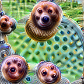

<!--
Some literature
- For feature attribution: http://blog.qure.ai/notes/deep-learning-visualization-gradient-based-methods
- http://blog.qure.ai/notes/visualizing_deep_learning
-->
# Neural Networks Interpretation {#neural-networks}

<!-- General Intro -->
This chapter focuses on interpretation methods for neural networks.
The presented methods visualize features and concepts learned by a neural network, explain individual predictions and simplify neural networks.

<!-- What are NNs -->
Deep neural networks are very powerful if you have a lot of data with a spatial structure, like images or texts.
The chapters assume that you are  familiar with deep learning, including convolutional neural networks.

#Image pixels have neighbouring pixels and each pixel individually is uninteresting, words in a sentence have an order which is consequential for the meaning of the sentence.
Deep learning has been very successful recently, especially in image classification and segmentation, language translation and many more tasks. 
The success story of deep neural networks took of in 2012, when the ImageNet image classification challenge [^imagenet] was won by a deep learning approach.
Since then, we have witnessed a Cambrian explosion of deep neural network architectures, with a trend towards deeper networks with more and more weight parameters.

<!-- Why not interpretable -->
For predictions, the input data is passed through many layers of multiplication with the learned weights and non-linear transformations.
A single prediction can involve millions of mathematical operations, depending on the architecture of the neural network.
There is no chance that we humans can follow the exact mapping from the data input to the prediction.
We would have to consider millions of weights to understand a prediction by a neural network.
And all these weights interact with each other in complex ways.
To interpret the behavior and predictions of neural networks, we need specific interpretation methods.

<!-- Why specific interpretation -->
We can certainly use [model-agnostic methods](#agnostic), like [local models](#lime) or [partial dependence plots](#pdp), but there are two reasons why it makes sense to look at interpretation methods that are specifically designed for neural networks:
First, neural networks learn feature and concepts in their hidden layers and second, the gradient can be utilized to implement interpretation methods that are more computationally efficient compared to  model-agnostic method that only look at the model "from the outside".
An additional reason is that most other methods in this book are for interpreting models for tabular data, but image and text data require and allow different explanations.

We next chapters cover the following topics:
- [Feature Visualization](#feature-visualisation): What features did the neural network learn?
- [Concepts](#neural-concepts) (IN PROGRESS): Which more abstract concepts did the neural network learn?
- [Feature Attribution](#feature-attribution) (IN PROGRESS): How did each input contribute to a certain prediction?
- [Modell Distillation](#neural-distillation) (IN PROGRESS): How can we explain a neural network with a simpler model?

## Feature Activation Maximization Visualization {#feature-visualization}

Deep learning feature visualization tries to uncover the data input patterns that different units of the neural networks recognize.

<!-- Background: Why feature visualization -->
One of the biggest strengths of deep neural networks is that they learn transformations of the input features, i.e. they do feature engineering internally.
This is especially remarkable for images and text.
In computer vision before deep learning, you would have extracted features like edges or shapes with specifically designed extractor functions.
With (convolutional) neural networks, the image is passed into the network in its raw form, transformed multiple times through the convolution layers and fully connected layers and the network spits out the predictions.
While the CNN is trained, it learns new features in its layers.
In the first layers, it learns edge detectors.
In the later layers it distinguishes between different textures.
In the higher layers it learns more complex concepts like detecting dog snouts or tennis balls.

Naturally, one way of interpreting deep neural networks is by making explicit what features the neural network learned at each step.
For images this means visualizing what activates each unit in a neural network the most.
For tabular data or text data you can also describe which input would excite the network the most.
TODO: Search for papers or blog post that do this for tabular or for text.
For text analysis with recurrent neural networks, you might want to 

<!-- Feature Visualization explained-->
The approach of making the learned features explicit is called "Feature Visualization".
Feature visualization for a unit of the neural network is done by finding the input that activates the unit the most.
A unit here refers to either individual neurons, whole feature maps in convolutional neural networks, whole layers, or it could be even the final class probability in classification.
Chapter based on https://distill.pub/2017/feature-visualization/
Appendix of post: https://distill.pub/2017/feature-visualization/appendix/


```{r trippy, fig.cap="Optimized images for GoogleNet (channels mixed3a, mixed4c, mixed4d and mixed5a). Images are maximized for a random direction of the activations. Figure from Olah, et al. 2017 (CC-BY 4.0) https://distill.pub/2017/feature-visualization/.", out.width=800}
knitr::include_graphics("images/trippy.png")
```

Mathematically it's simple.
You are looking for a new image $x^*$ that maximize the (mean) activation of some unit:


$$x^*=\arg\max_{x}h_{z1,z2,z3}(x)$$

There are usually constraints on x, e.g. that only small changes are allowed, or that it comes from the training data distribution.
The function $h$ is the activation of a neuron, x the input to the network, z1 and z2 describe the spatial position of the neuron, z3 describes the layer and activation map.
We assume that the weights of the neural networks are fixed, i.e. the network is fully trained.

For the mean activation of a whole channel, we would maximize:

$$x^*=\arg\max_{x}\sum{z,y}{z,y,z3}(x)$$

Alternatively, it would also work to maiximize random directions, which means that not all neurons are weighted equally.
These optimizations usually have additional constraints for the image x, so that x becomes an interpretable visualization.
For neural networks other than convolutional ones, this would work equally.


<!--Why not visualize the weights?-->
An alternative would be to simply visualize the weights, e.g. the weights that are learned in convolutional layer by CNNs.
This could also tell us whether it looks for edges or not.
But for more complex concepts it does not help us and it is more helpful to look at images that maximize some activation.
I just explained feature visualization via looking at the activation of units of the network for certain inputs.
The other option would be to visualize the weights directly.
Why don't we simply print out or visualize the learned weights?
Well, there are often millions of them, interacting in non-linear ways with each other.
It does not scale.
Also it is not on the same space as the feature input.
It is more difficult what the weights really mean and more intuitive to understand what input maximizes the activation of certain neurons in the neural network.


<!-- How to create feature visualizations? For activation map and with generated image--> 
Convolutional Neural Networks have an architecture where first convolutional and pooling layers are connected, then fully connected layers.
The inputs are pixels.
While an image can be understood by a human, each single pixel does not hold much meaning.
By passing the pixels through the layers, the trained neural networks neurons get activated, based on the content of the picture.
The idea is to find for each neuron an image that maximizes that neurons activation.


```{r activation-optim, fig.cap="Features can be visualized for different units. The most common is the vissualization for the individual channels. Here, n is the index of the layer, z the channel index, k the class index, x and y the spatial positions. Olah, et al. 2017 (CC-BY 4.0) https://distill.pub/2017/feature-visualization/.", out.width=800}
knitr::include_graphics("images/activation-optim.png")
```

<!-- Choice for Visualization -->
We have more choice than to visualize the layer or work with random images.
So understanding a neural network is turned into an optimization problem:
For an optimization problem, we have to choose the objective we want to optimize and the search space.
Both things define what we interpret.

Search space: 
- from training data
- artificially created images

Training data has the problem that elements on the image can be correlated and we don't get to see what the neural network is looking for.
If all the images that have a high activation of a neuron / channel show a dog and a tennis ball, we don't know whether the neural network looks at the dog, the tennis ball or maybe at both.


Also you have more options for what you maximize
- Neuron activiation. Makes no sense because you have millions of neurons in architecturs like GoogleNet.
- A whole channel. Still a lot of elements. = convolutional filter
- A whole (convolutional) layer 
- A neuron in the fully connected layer (pre-softmax)
- The final class probability (e.g. dog)


For multiple artificial neurons, we maximize the mean activation or a random direction.

TODO: Write about how many of each thing to optimize there are in some representative architectures (AlexNet, GoogleNet, ...)

```{r feature-viz-units, fig.cap="Features can be visualized for different units. The most common is the vissualization for the individual channels. Here, n is the index of the layer, z the channel index, k the class index, x and y the spatial positions. Olah, et al. 2017 (CC-BY 4.0) https://distill.pub/2017/feature-visualization/.", out.width=800}

```

<!-- How useful are they? -->
These images look intepretable, we may detect that one of them shows a certain concept, like a tennis ball. 
But then again, we interpret it to be a tennis ball, the same as we interpret art.
It could be something else, and actually you might see something different on the image as well.
A blend of concepts.
And let me remind you that we only look at the image that maximizes the activation.
If we go the other direction and minimize activation, a completely different blend of concepts might occur.
There can be multiple neurons or layers that respond (activate) for the same patterns or images.
See for example how many images you have to look at for Google Net here.
And these are only for optimizing the channels, not the individual neurons.
https://distill.pub/2017/feature-visualization/appendix/
Keep in mind that images can be unstable and it is recommend to look at multiple images per unit that is looked at.

To not get these images with repetitive patterns (which are more like adversarial examples than real life images), many researchers applied some regularization or some constraint.
Three options for regularization frequency penalization, transformation robustness, learned priors (e.g. GANs).
Or, of course, you only search through available, real images.

<!-- Google DeepDream --> 
Google DeepDream takes an image, extracts the activation from one and adds it to the image.
Start with an image, feed it to a pretrained nn, choose a layer.
During the forward pass until the chosen layer, extract the gradients.
We want to maximize for the given image the activation of the chosen layer, so we add the gradient to the image.
A few techniques like Gaussian blurring are applied to improve the resulting images.

<!-- Connection to Adversarial Examples -->
Deep connection with adversarial examples, because there you try also to find an image that maximizes something (e.g. class probability of an adversarial class).
TODO: Link chapter
Adversarial examples also maximally activate units, in this case the a class probability.
Also it starts with some given image, for which the adversarial example should be produced, instead of some random noise image.
Also the optimization has an additional constraint: Don't change too much from the initial image.

**Feature Visualization for Test and Tabular Data**

The literature focuses mainly on images.
The concept of activation maximization works for text and tabular data as well, but is less visually interesting.
For text, you would get a text that maximially activates an RNN.

For tabular data, you would get a data point that maximally activates a (usually) fully connected neural network.
This data point then has some features, is probably going to be out of range of the data distribution.

### Advantages
- Tool for communication: Someone who does not understand neural networks can look at those and at least get an intuition about the neural network learning more and more complex features.
- Gives unique insight into neural networks, especially for image recognition
- Make a T-Shirt from it or a dreamy background image.

### Disadvantages
- Restricted usefunless in day-to-day job
- Many units to look at
- For whole channels: Multiple directions in which to look (either all weighted the same, or different random directions)
- Also, you can negatively activate it.
- There is no local maxima, so running this multiple times, from different inputs can yield different results (TODO: Check)
- A bit like a horoscope, because there are multiple possible interpretation.
  Reminds me of school: Interpret the shit out of a snippet of text, trying to figure out what the author meant.
  And usually this explanation becomes its own thing, independent of the actual author intention.
  Same here, because the unit interacts with other unit, not only maximal activation is interesting.


Quite many disadvantages.
Which speaks for the difficulties with this technique.
But invaluable element for furthering our understanding how deep learning works.
Just don't interpret too much the individual images.

## Detecting Concepts 

Let's go deeper.
Visualizing features is nice and all, but can we maybe more concretely attach concepts to individual units of the neural network and individual predictions (?).

We will look at two approaches: Network Dissection and Concept Activation Vectors

Source for Network Dissection
http://netdissect.csail.mit.edu/

**TCAV: Testing with concept activation vectors.**

TCAV by Kim et al. (2019)[^tcav] explain a prediction by showing the importance of more high level concepts (e.g. texture, gender, color) for the prediction or classification.

You have to learn the concepts from data.
That means if you want to understand whether the network uses the concept of "female" for the classification of e.g. images, you have to provide some examples of "female" (could be images with women in it), and non-female (images without women in it).

You send all those images through the network 

Good thing is that TCAV does not require to change the network you are using, but you can use the network that you already have.


TCAV uses directional derivatives to quantify the importance of a concept for the classification or prediction.
The concept is defined by the user and must be defined via some positive and negative data examples.
For example for the image classification of a zebra, the concept might be stripes.
The concept is defined byselecting images of stripes and some randomly sampled images without stripes.

```{r tcav, fig.cap="Figure from TCAV paper, Been Kim et. al (2018) ", out.width=800}
knitr::include_graphics("images/tcav.png")
```


Code for TCAV: https://github.com/tensorflow/tcav

TODO: CONTINUE DESCRIBING TCAV

Good things about TCAV:
The concepts are not required to be known at training time.
Really any concept can be analyzed, as long as you find some positive and negative examples.

<!-- Feature Visualization for RNNs -->
For RNNs: https://medium.com/@plusepsilon/visualizations-of-recurrent-neural-networks-c18f07779d56
https://distill.pub/2019/memorization-in-rnns/
http://lstm.seas.harvard.edu/

TODO: Checkout RNNVis and LSTMVis

List of notebooks:
https://github.com/tensorflow/lucid
More a tool for getting a general, better understanding of cnns, but not for daily job.


**Word Embeddings**
As another way to visualize concepts that were learned are word embeddings.
An embedding maps a discrete feature (e.g. a word) to a m-dimensional vector.
A word embedding is the vector in some embedding space a word is mapped onto.
The embedding space is learned by the neural network.
The directions in that space often correlate to concepts.
This means that words with similar vectors have some similarity, e.g. cat and dog.
This also has the nice effect that we can do arithmetics in that space.
e.g.

$$embedding(king)-embedding(queen)=embedding(man)-embedding(woman)$$

The embeddings are high-dimensional vectors.
For visualization, they are often mapped to 2 Dimensions (e.g. with tSNE) TODO: CITE

What can you do with embeddings?
You can visualize the concepts that were learned.
Embedding let us analyze what the neural network learned.
For example, did it learn some kind of bias?
How do we get word embeddings?
Other use cases include to use these embeddings as feature transformations before the e.g. text is used in a machine learning model.

How are they created?
It's a mapping from categorical features (e.g. words) to some vectors.
They can be initialized with random weights and the embeddings are learned along with the thing you are trying to predict, e.g. with a recurrent neural network.
An alternativ is to use a pre-trained embedding like word2vec, GloVe or fasttext.
Those are trained over huge corpuses of text to predict words from their neighboring words.


**Detecting Concepts During Training Time**

Towards Robust Interpretability with Self-Explaining Neural Networks


**Software**

- Blog Post with some code: https://github.com/fg91/visualizing-cnn-feature-maps/blob/master/filter_visualizer.ipynb
- Tensorflow: https://github.com/InFoCusp/tf_cnnvis
- Keras: https://github.com/jacobgil/keras-filter-visualization
- DeepViz Toolbox - https://github.com/yosinski/deep-visualization-toolbox
TODO: How does DeepDream fit in here?
- CAffee and with GANS https://github.com/Evolving-AI-Lab/synthesizing


### Neurons in High-Dimensionsal Space

Understanding the semantics that the model learned.
Maybe also part of concepts chapter?

Word embeddings
t-SNE

## Feature Attribution

Feature attribution explains individual predictions by attributing each input feature by how much it changed the prediction (negative or positive).
Be it input pixels, tabular data or words.

Attribution is also sometimes called "relevance" or "contribution".
We only look at attribution methods that do not require to modify the network.
This means only methods that work for a trained network.

<!--Idea for chapter:
- Start with general goal
- Roughly explain different approaches
- More deeply explain one of the approaches (LRP?)
- Show paper comparisons of approaches
- Example with VGG15, innvestigate https://github.com/albermax/innvestigate and funny image.
- Advantages / Disadvantages
- Software
-->

Formal definition:
A feature attribution method of the prediction for p-dimensional input x, relative to some base input (or prediction?) can be expressed as a vector of relevances: $(r_1,\ldots,r_p)$.
The j-th element r~j~ is the contribution of the j-th feature input to the prediction.

There are kind of two ways to do it:
- Manipulate the input and see how the output changes:
  Occlusion, Shapley Value, LIME, wiggle around the inputs, visualize the directions in which the output changes
- Gradient Based Relvance Attribution: Distribute relevance among inputs, usually by backpropagation (also deconvolution here and some backpropagation based methods).

Problems with perturbation or occlustion: Network was never trained on those images, you are leaving the space of realistic images.
Might not be relevant how the neural network behaves here.

Big problem with backpropagation / attribution methods:
Neural network have non-linear transformation units, and that's also how most methods differ in how they deal with those.
So it's not clear how to backpropagate through those units.

Desiderata, as defined in [^integrated-gradients]:
- Sensitivity: If input and baseline differ in one feature and have different predictions, the relevance of that feature has to be non-zero. 
I think that is a fair requirement.
Gradient alone does not fulfill this axiom, because gradient can be zero, but feature different.
Also deconvnet and guided backpropagation break sensitivity.
- Implementation Invariance: For two networks that have exactly the same predictions, no matter how the input looks like, the attribution should be the same.
Even if the networks work differently inside.
I think this is also a fair assumption.
LRP and DeepLift don't satisfy implementation invariance.
If methods don't have implementation invariance, they are senstive to unimportant workings of the network.
- Completeness: The attributions / relevance score add up to the difference between input x and the chosen baseline.
Integrated Gradients, DeepList and LRRP do so.
- Dummy: if  a network does not depend on a feature at all, its relevance should be zero.
- Linearity: If we linearly combine two networks (e.g. weighted sum of the prediction of both), then the attribution for a feature should also be a weighted sum (with same weights as in linear combination).
- Symmetry: swapping two features should yield same attribution (see shapley value)

(most axioms are like their shapley equivalents)


What is the baseline that is chosen?
often the all black image, which has a prediction near zero.

TODO: Add axioms from shapley here?
Maybe also aximos from other papers as well.


Problemns with guided backpropagaion and similar methods:
Images closely resemble the output of edge detectors.
Edge detectors are independent of the model and the data, so this is really bad for guided backpropagation.
Gradients and GradCAM passed the sanity checks (model and data randomization).

Unfortunately, many of those methods have issues.
In an experiment, where the labels were mixed and the model was retrained, the explanations were stil very similar.
Only GradCAM was okay.

Feature attribution might also be called saliency maps.
There are lots and lots of approaches to to this, all very similar.
/We will only look at the general idea, and point out to some of the approaches.

Good overview: TOWARDS BETTER UNDERSTANDING OF GRADIENT - BASED ATTRIBUTION METHODS FOR DEEP NEURAL NETWORKS.
This paper also served to structure this article. 

Here we consider neural networks that output as prediction a vector of length $C$, which includes regression where $C=1$.
Output of DNN is called $S(x)=[S_1(x),\ldots,S_p(x)]$.
Formally all those methods take in input $x\in\mathbb{R}^p$ (can be image pixels, tabular data, words, ...) and outputs an explanation $R^c=[R_1^c,\ldots,R_p^c]$, one relevance value for each of the p input features.
The c indicicates the relevance for the c-th output.

In multi-class classification you have to decide for which classification to look at the relevance of the inputs.
This can be the correct class of that example, at least that's an interesting case to look at.
But also if DNN was wrong, it might be interesting to look at the input relevance for the wrong class and also for the relevance for the correct class for debugging.

The word attribution maps means that, for images, we visualize the pixels with red if they positively contributed, blue if negatively.
Of course, you are free to choose any color you like.
There are not rules.


All of the approaches return, as an explanation of an individual prediction a weighted sum:
TODO: Formula for attribution (linear sum). 


Main classification: 
- perturbation based methods: compute attribution of features by removing/masking/altering these features, and doing the prediction again. marginal effect of feature is estimated. depends on the  number of features that is perturbed together (for images you would perturb the nearby pixels together).
- gradient based methods
- 


Shapley Value only approximated usually, read more in LINK CHAPTER.

Some of those methods have the property of Completeness, meaning that the sum of the relevance values for all input features sum up to the difference between the prediction of the image/data point minus the prediction of a reference point (e.g. all grey image).
Integrated Gradient and SHAP have this property.

*List of approaches*

VISUALIZING DEEP NEURAL NETWORK DECISIONS: PREDICTION DIFFERENCE ANALYSIS:
- Based on Shapley Value for explaining individual predictions
- Relevance of feature is estimated by measuring how the prediction changes if feature is unknown, by simulating that the feature is unknown.
- what this paper does differently: instead of simulating 
- Implementation: https://github.com/lmzintgraf/DeepVis-PredDiff


- DeepSHAP (gradient-based)
  - version called DeepExplainer. There is a connection between SHAP and DeepLift
  - version called GradientExplainer. Connection between SHAP and Gradient Input algorithm.
- (epsilon) Layer-Wise Relevance Propagation (gradient-based)
- DeepLift (gradient-based)
- Deep Taylor Decomposition (gradient-based)
- Saliency Map (gradient-based) https://arxiv.org/abs/1312.6034. Saliency maps are a local method, because only gradient aroudn local is considered, but not the absolut global contributions. Most other methods are global. Probably Taylor decomp is also local.
- Gradient * Input (gradient-based, surprise!) https://arxiv.org/abs/1605.01713
- Occlusion (perturbation based) https://arxiv.org/abs/1311.2901
- Integrated Gradients (gradient based) https://arxiv.org/abs/1703.01365
- Shapley Value Sampling (perturbation based)
- LIME (perturbation based)
- Grad-CAM (gradient-based)
- Deconvolutional Network
- Guided Backpropagagion

Deep Lift and $\epsilon$-LRP can both be re-formulated as computing backpropagation for modified gradient function
Ancona et. al 2018.

These gradient based methods are all different for different activation functions, since when the chain rule for derivation is applied, they replace the non-linear activations with a function $g(x)$ is different in different methods.


TODO: Create example with different relevance methods.


Implementations:

https://github.com/oracle/Skater/blob/master/skater/core/local_interpretation/dnni/deep_interpreter.py

DeepLift Implementation https://github.com/kundajelab/deeplift
DeepVisualization ToolBox https://github.com/yosinski/deep-visualization-toolbox
Integrated Gradietns https://github.com/ankurtaly/Integrated-Gradients
SHAP https://github.com/slundberg/shap

Some tips and tricks (for LRP): Methods for Interpreting and Understanding Deep Neural Networks
LRP: Should work better on ReLU

TODO: Find some more advice from this paper and mention here.

Advantages of LRP over Deconvolution and Sensitivity Analysis.
https://www.google.com/url?sa=t&rct=j&q=&esrc=s&source=web&cd=1&ved=2ahUKEwj_5vL0m6DiAhUz8uAKHU6ED0oQFjAAegQIAhAC&url=https%3A%2F%2Fwww3.math.tu-berlin.de%2Fnumerik%2FCoSIPICDL2017%2FTalks%2Fmueller.pdf&usg=AOvVaw1yR_5ZwKPvKLxHvwsAfQgA


TODO: Insert image with edge detectors

### For RNNs

Paper: Visual Reasoning of Feature Attribution with Deep Recurrent Neural Networks


### Advantages 
- give a way to understand a predictions
- 
- better than model-agnostic variants (e.g. shapley) since they rely on the gradient and can be computed faster.
- 


### Disadvantages
- You have to see which methods works best for which network. It seems like LRP works better when there are not too many fully connected layers, because if there are too many, the relevance will be non-selective but distributed to many layers.
- Some methods have similarities to edge detectors, which are independent of training data and model. 
  Explanation becomes misleading.

A lot of the methods are implemented in the DeepExplaiin Toolbox: https://github.com/marcoancona/DeepExplain

### TCAV

Useful to analyze a neural network with regard to specfic concepts, e.g. to check for gender bias.


### Rule Extraction and Model Extraction

Some methods, which are all only tested on single hidden layer networks.
- KT method: Extract for each neuron a rule
- Extract decision tree (Hinton)
- CRED (2001, Sato and Tsukimoto)
- Trepan

DeepRed 


LIME

Types of rule extraction: Decompositional, Pedagogical, Eclectic
Pedagogical is simply model-agnostic.

You can also look at different levels:
Approximate the rules of a single neuron
Approximate the whole network classification.

TODO: Link overview paper.


### Built-In Interpretability

based on Explaining Explanations: An Overview of
Interpretability of Machine Learning

- Attention mechanisms
- Disentangled representations
- Genereated Explanations

### Stuffs that's good to know about neural networks

Stuff that came out of interpretability research. 
Not really tools but a few things for better understanding models.
Better understand when and why they might fail.

- CNNs
 - learn mostly textures, shapes not so much
 - concepts can transform when learning, e.g. dog into waterfall
 - The thing that maximally activates a neuron or channel can be completely unrelated from the patterns that minimize it
 - Nets learn similar things. 
 - 


## Example

I want to predict the following:
TODO: INCLUDE IMAGE OF DOGO

Neural Network VGG16 TODO: CITE

Most likely class Italian_greyhound (35.21%)

And my ouptut looks like this:

TODO: All the images here 

TODO: Check wheter to cover pattern.net and pattern

All examples are done with innVestigate


### Advantages
- Gradient allows many fast analysis
- For CNN nice pictures
- Really great to learn about feature visulization. makes clearer how nns work. For example it showed that CNNs look more on the texture, less on the shapes: I MAGE N ET - TRAINED CNN S ARE BIASED TOWARDS TEXTURE; INCREASING SHAPE BIAS IMPROVES  ACCURACY AND ROBUSTNESS
- Feature visualization are Great Desktop Wallpaper or for T-Shirts
- Can be combined with feature attribution to get a better tool, see here: https://distill.pub/2018/building-blocks/.
Feature attributions are explained here: TODO: LINK CHAPTER


### Disadvantages
- Many methods, difficult to get overview
- Feature Visualization: Not sure how useful it is
- feature visualization are not practical for daily work and difficult to get it to work.
- feature visualization: Maximum activation only small part of the space. 
  Negative activation exists as well, what about slightly postive activation? 
  We would have to describe the whole spectrum to describe that neuron.
- too many neurons to look at for feature visualization
- what does it tell you in the end? only sense of understanding, but final prediction is still a difficult interaction between all those neurons, and these images only show the maximal activation, but neurons might only be have activated for some specific prediction, and it is unclear if that image really helps you then
- feature visualizations are like understanding modern art, always trying to interpret what artist intended


[^imagenet]: Olga Russakovsky*, Jia Deng*, Hao Su, Jonathan Krause, Sanjeev Satheesh, Sean Ma, Zhiheng Huang, Andrej Karpathy, Aditya Khosla, Michael Bernstein, Alexander C. Berg and Li Fei-Fei. (* = equal contribution) ImageNet Large Scale Visual Recognition Challenge. IJCV, 2015

[^integrated-gradients]: Sundararajan, Mukund, Ankur Taly, and Qiqi Yan. "Axiomatic attribution for deep networks." Proceedings of the 34th International Conference on Machine Learning-Volume 70. JMLR. org, 2017.

[^visual-survey-frontier]: Hohman, Fred Matthew, et al. "Visual analytics in deep learning: An interrogative survey for the next frontiers." IEEE transactions on visualization and computer graphics (2018).
 
[^visual-survey]: Zhang, Quan-shi, and Song-Chun Zhu. "Visual interpretability for deep learning: a survey." Frontiers of Information Technology & Electronic Engineering 19.1 (2018): 27-39.

[^TCAV]: Kim, Been, et al. "Interpretability beyond feature attribution: Quantitative testing with concept activation vectors (tcav)." arXiv preprint arXiv:1711.11279 (2017).

