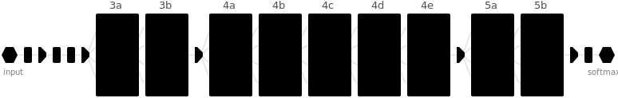
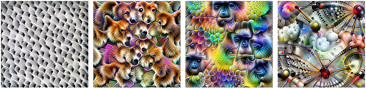
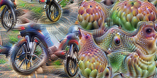
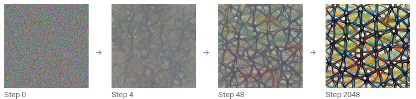
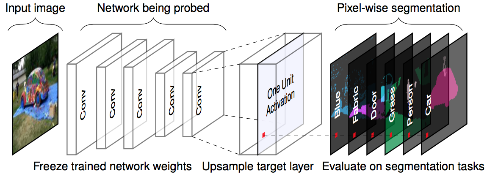
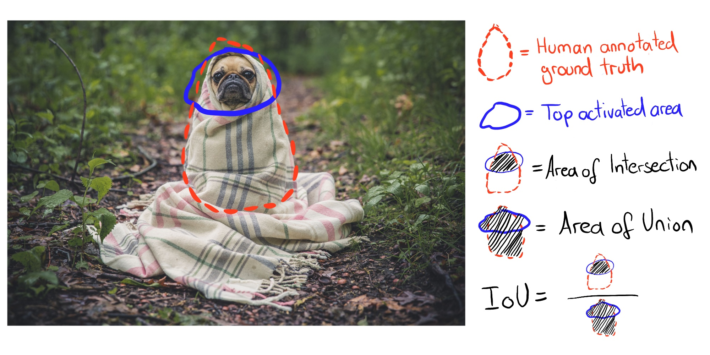
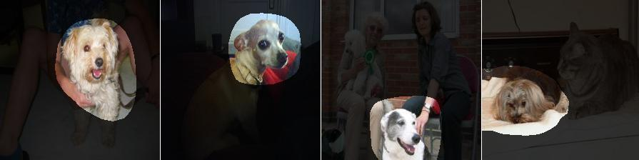
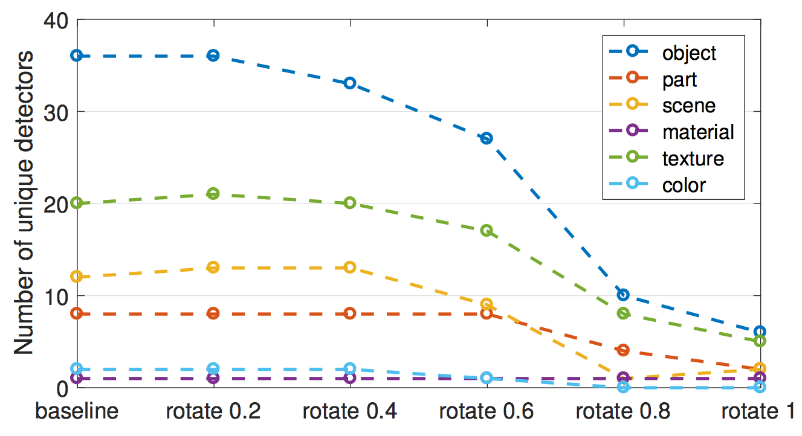

```{r, message = FALSE, warning = FALSE, echo = FALSE}
devtools::load_all()
```

## Learned Features {#cnn-features}

`r if(is.html){only.in.html}`

Convolutional neural networks mempelajari fitur dan konsep abstrak dari piksel gambar mentah.
[Visualisasi Fitur](#feature-visualization) memvisualisasikan fitur yang dipelajari dengan memaksimalkan aktivasi.
[Diseksi Jaringan](#network-dissection) memberi label unit jaringan saraf (mis. saluran) dengan konsep manusia.

Deep neural networks mempelajari fitur tingkat tinggi di lapisan tersembunyi.
Ini adalah salah satu forces terbesar mereka dan mengurangi kebutuhan akan rekayasa fitur.
Asumsikan Anda ingin membuat pengklasifikasi gambar dengan support vector machine.
Matriks piksel mentah bukanlah masukan terbaik untuk melatih SVM Anda, jadi Anda membuat fitur baru berdasarkan warna, domain frekuensi, detektor tepi, dan sebagainya.
Dengan convolutional neural networks, gambar dimasukkan ke dalam jaringan dalam bentuk mentahnya (piksel).
Jaringan mengubah gambar berkali-kali.
Pertama, gambar melewati banyak lapisan konvolusi.
Dalam lapisan konvolusi tersebut, jaringan mempelajari fitur baru dan semakin kompleks di lapisannya.
Kemudian informasi gambar yang diubah melewati lapisan yang terhubung penuh dan berubah menjadi klasifikasi atau prediksi.

```{r fig.cap = "Architecture of Inception V1 neural network. Each enumerated unit (3a to 5b) represents a layer with differently sized convolutions and pooling. Figure from Olah, et al. 2019 (CC-BY 4.0) https://distill.pub/2017/activation-atlas/.", out.width = 800, include = FALSE}

```
```{r fig.cap = "Features learned by a convolutional neural network (Inception V1) trained on the ImageNet data. The features range from simple features in the lower convolutional layers (left) to more abstract features in the higher convolutional layers (right). Figure from Olah, et al. 2017 (CC-BY 4.0) https://distill.pub/2017/feature-visualization/appendix/.", out.width = 800}
knitr::include_graphics("images/cnn-features.png")
```
- Lapisan konvolusi pertama mempelajari fitur-fitur seperti tepi dan tekstur sederhana.
- Lapisan konvolusi selanjutnya mempelajari fitur seperti tekstur dan pola yang lebih kompleks.
- Lapisan konvolusi terakhir mempelajari fitur seperti objek atau bagian objek.
- Lapisan yang sepenuhnya terhubung belajar menghubungkan aktivasi dari fitur tingkat tinggi ke kelas individu yang akan diprediksi.

Keren.
Tapi bagaimana kita benar-benar mendapatkan gambaran halusinasi itu?

### Feature Visualization {#feature-visualization}


Pendekatan untuk membuat fitur yang dipelajari menjadi eksplisit disebut **Visualisasi Fitur**.
Visualisasi fitur untuk suatu unit jaringan saraf dilakukan dengan mencari input yang memaksimalkan aktivasi unit tersebut.

"Unit" mengacu pada neuron individu, saluran (juga disebut peta fitur), seluruh lapisan atau probabilitas kelas akhir dalam klasifikasi (atau neuron pra-softmax yang sesuai, yang direkomendasikan).
Neuron individu adalah unit atom jaringan, jadi kami akan mendapatkan informasi paling banyak dengan membuat visualisasi fitur untuk setiap neuron.
Tapi ada masalah:
Jaringan saraf sering mengandung jutaan neuron.
Melihat visualisasi fitur setiap neuron akan memakan waktu terlalu lama.
Saluran (terkadang disebut peta aktivasi) sebagai unit adalah pilihan yang baik untuk visualisasi fitur.
Kita bisa melangkah lebih jauh dan memvisualisasikan seluruh lapisan konvolusi.
Lapisan sebagai unit digunakan untuk DeepDream Google, yang berulang kali menambahkan fitur visual lapisan ke gambar asli, menghasilkan versi input seperti mimpi.

```{r units, fig.cap="Feature visualization can be done for different units. A) Convolution neuron, B) Convolution channel, C) Convolution layer, D) Neuron, E) Hidden layer, F) Class probability neuron (or corresponding pre-softmax neuron)", out.width=800}
knitr::include_graphics("images/units.jpg")
```


```{r trippy, fig.cap="Optimized images for Inception V1 (channels mixed3a, mixed4c, mixed4d and mixed5a). Images are maximized for a random direction of the activations. Figure from Olah, et al. 2017 (CC-BY 4.0) https://distill.pub/2017/feature-visualization/.", out.width=800, include = FALSE}

```

#### Feature Visualization through Optimization

Dalam istilah matematika, visualisasi fitur adalah masalah optimasi.
Kami berasumsi bahwa bobot jaringan saraf tetap, yang berarti bahwa jaringan dilatih.
Kami mencari gambar baru yang memaksimalkan aktivasi (rata-rata) suatu unit, di sini satu neuron:

$$img^*=\arg\max_{img}h_{n,x,y,z}(img)$$

Fungsi $h$ adalah aktivasi neuron, *img* input jaringan (gambar), x dan y menggambarkan posisi spasial neuron, n menentukan lapisan dan z adalah indeks saluran.
Untuk aktivasi rata-rata seluruh saluran z di lapisan n kita maksimalkan:

$$img^*=\arg\max_{img}\sum_{x,y}h_{n,x,y,z}(img)$$

Dalam rumus ini, semua neuron di saluran z berbobot sama.
Atau, Anda juga dapat memaksimalkan arah acak, yang berarti bahwa neuron akan dikalikan dengan parameter yang berbeda, termasuk arah negatif.
Dengan cara ini, kami mempelajari bagaimana neuron berinteraksi di dalam saluran.
Alih-alih memaksimalkan aktivasi, Anda juga dapat meminimalkan aktivasi (yang sesuai dengan memaksimalkan arah negatif).
Menariknya, ketika Anda memaksimalkan arah negatif, Anda mendapatkan fitur yang sangat berbeda untuk unit yang sama:

```{r pos-neg, fig.cap="Positive (left) and negative (right) activation of Inception V1 neuron 484 from layer mixed4d pre relu. While the neuron is maximally activated by wheels, something which seems to have eyes yields a negative activation. Code: https://colab.research.google.com/github/tensorflow/lucid/blob/master/notebooks/feature-visualization/negative_neurons.ipynb", out.width=800}

```


Kami dapat mengatasi masalah pengoptimalan ini dengan berbagai cara.
Pertama, mengapa kita harus menghasilkan gambar baru?
Kami cukup mencari melalui gambar pelatihan kami dan memilih yang memaksimalkan aktivasi.
Ini adalah pendekatan yang valid, tetapi menggunakan data pelatihan memiliki masalah bahwa elemen pada gambar dapat dikorelasikan dan kita tidak dapat melihat apa yang sebenarnya dicari oleh jaringan saraf.
Jika gambar yang menghasilkan aktivasi tinggi dari saluran tertentu menunjukkan anjing dan bola tenis, kita tidak tahu apakah jaringan saraf melihat anjing, bola tenis, atau mungkin keduanya.

Pendekatan lainnya adalah menghasilkan gambar baru, mulai dari noise acak.
Untuk mendapatkan visualisasi yang bermakna, biasanya ada batasan pada gambar, mis. bahwa hanya perubahan kecil yang diperbolehkan.
Untuk mengurangi noise dalam visualisasi fitur, Anda dapat menerapkan jittering, rotasi, atau penskalaan pada gambar sebelum langkah pengoptimalan.
Pilihan regularisasi lainnya termasuk penalty frekuensi (misalnya mengurangi varians piksel neighbors) atau menghasilkan gambar dengan prior yang dipelajari, mis. dengan generative adversarial networks (GANs) [^synthesize] atau denoising autoencoder [^plugandplay].

```{r activation-optim, fig.cap="Iterative optimization from random image to maximizing activation. Olah, et al. 2017 (CC-BY 4.0) https://distill.pub/2017/feature-visualization/.", out.width=800}

```
Jika Anda ingin lebih mendalami visualisasi fitur, lihat jurnal online distill.pub, terutama postingan visualisasi fitur oleh Olah et al. [^distill-fv], dari mana saya menggunakan banyak gambar, dan juga tentang blok bangunan interpretasi [^distill-blocks].

#### Connection to Adversarial Examples

Ada hubungan antara visualisasi fitur dan [adversarial examples](#adversarial):
Kedua teknik memaksimalkan aktivasi unit jaringan saraf.
Untuk contoh adversarial, kami mencari aktivasi maksimum neuron untuk kelas adversarial (= salah).
Satu perbedaan adalah gambar yang kita mulai dengan:
Untuk adversarial examples, itu adalah gambar yang ingin kita hasilkan gambar permusuhannya.
Untuk visualisasi fitur, tergantung pada pendekatannya, noise acak.

#### Text and Tabular Data

Literatur berfokus pada visualisasi fitur untuk convolutional neural networks untuk pengenalan gambar.
Secara teknis, tidak ada yang menghentikan Anda untuk menemukan input yang secara maksimal mengaktifkan neuron dari jaringan saraf yang sepenuhnya terhubung untuk data tabular atau recurrent neural networks untuk data teks.
Anda mungkin tidak menyebutnya visualisasi fitur lagi, karena "fitur" akan menjadi input data tabular atau teks.
Untuk prediksi default kredit, inputnya mungkin jumlah kredit sebelumnya, jumlah kontrak seluler, alamat, dan lusinan fitur lainnya.
Fitur yang dipelajari dari neuron kemudian akan menjadi kombinasi tertentu dari lusinan fitur.
Untuk recurrent neural networks, sedikit lebih baik untuk memvisualisasikan apa yang dipelajari jaringan:
Karpati et. al (2015)[^viz-rnn] menunjukkan bahwa recurrent neural networks memang memiliki neuron yang mempelajari fitur yang dapat ditafsirkan.
Mereka melatih model level karakter, yang memprediksi karakter berikutnya dalam urutan dari karakter sebelumnya.
Setelah kurung kurawal pembuka "(" terjadi, salah satu neuron menjadi sangat aktif, dan dinonaktifkan saat kurung tutup yang cocok ")" terjadi.
Neuron lain ditembakkan di akhir baris.
Beberapa neuron diaktifkan di URL.
Perbedaan visualisasi fitur untuk CNN adalah bahwa contoh tidak ditemukan melalui optimasi, tetapi dengan mempelajari aktivasi neuron dalam data pelatihan.

Beberapa gambar tampaknya menunjukkan konsep terkenal seperti moncong anjing atau bangunan.
Tapi bagaimana kita bisa yakin?
Metode Network Dissection menghubungkan konsep manusia dengan unit jaringan saraf individu.
Peringatan spoiler: Pembedahan Jaringan memerlukan kumpulan data tambahan yang dilabeli seseorang dengan konsep manusia.

### Network Dissection {#network-dissection}

Pendekatan Diseksi Jaringan oleh Bau & Zhou et al. (2017) [^dissect] mengkuantifikasi interpretabilitas unit convolutional neural networks.
Ini menghubungkan area saluran CNN yang sangat aktif dengan konsep manusia (objek, bagian, tekstur, warna, ...).

Saluran convolutional neural networks mempelajari fitur baru, seperti yang kita lihat di bab [Visualisasi Fitur](#feature-visualization).
Tetapi visualisasi ini tidak membuktikan bahwa suatu unit telah mempelajari suatu konsep tertentu.
Kami juga tidak memiliki ukuran seberapa baik suatu unit mendeteksi mis. pencakar langit.
Sebelum kita masuk ke rincian Diseksi Jaringan, kita harus berbicara tentang hipotesis besar yang ada di balik garis penelitian itu.
Hipotesisnya adalah:
Unit jaringan saraf (seperti saluran konvolusi) mempelajari konsep yang tidak terjerat.

**Pertanyaan Fitur Terurai**

Apakah jaringan saraf (konvolusi) mempelajari fitur yang tidak terjerat?
Fitur terurai berarti bahwa unit jaringan individu mendeteksi konsep dunia nyata tertentu.
Saluran konvolusi 394 mungkin mendeteksi pencakar langit, saluran 121 moncong anjing, saluran 12 garis pada sudut 30 derajat ...
Kebalikan dari jaringan terjerat adalah jaringan yang sepenuhnya terjerat.
Dalam jaringan yang benar-benar terjerat, misalnya, tidak akan ada unit individu untuk moncong anjing.
Semua saluran akan berkontribusi pada pengakuan moncong anjing.

Fitur yang dipisahkan menyiratkan bahwa jaringan sangat mudah ditafsirkan.
Mari kita asumsikan kita memiliki jaringan dengan unit yang benar-benar tidak terjerat yang diberi label dengan konsep yang diketahui.
Ini akan membuka kemungkinan untuk melacak proses pengambilan keputusan jaringan.
Misalnya, kita bisa menganalisis bagaimana jaringan mengklasifikasikan serigala melawan husky.
Pertama, kami mengidentifikasi unit "huskey".
Kita dapat memeriksa apakah unit ini bergantung pada unit "moncong anjing", "bulu halus" dan "salju" dari lapisan sebelumnya.
Jika ya, kita tahu bahwa itu akan salah mengklasifikasikan gambar husky dengan latar belakang bersalju sebagai serigala.
Dalam jaringan yang tidak terjerat, kami dapat mengidentifikasi korelasi non-kausal yang bermasalah.
Kami dapat secara otomatis membuat daftar semua unit yang sangat aktif dan konsepnya untuk menjelaskan prediksi individu.
Kami dapat dengan mudah mendeteksi bias di jaringan saraf.
Misalnya, apakah jaringan mempelajari fitur "kulit putih" untuk memprediksi gaji?

Peringatan spoiler: convolutional neural networks tidak terurai sempurna.
Sekarang kita akan melihat lebih dekat pada Network Dissection untuk mengetahui bagaimana jaringan saraf yang dapat diinterpretasikan.


#### Network Dissection Algorithm

Network dissection memiliki tiga langkah:

1. Dapatkan gambar dengan konsep visual berlabel manusia, mulai dari garis hingga gedung pencakar langit.
1. Ukur aktivasi saluran CNN untuk gambar-gambar ini.
1. Mengukur keselarasan aktivasi dan konsep berlabel.

Gambar berikut memvisualisasikan bagaimana gambar diteruskan ke saluran dan dicocokkan dengan konsep berlabel.

```{r fig.cap = "For a given input image and a trained network (fixed weights), we forward propagate the image up to the target layer, upscale the activations to match the original image size and compare the maximum activations with the ground truth pixel-wise segmentation. Figure originally from Bau & Zhou et. al (2017).", out.width=800}

```

**Langkah 1: Broden dataset**

Langkah pertama yang sulit tetapi krusial adalah pengumpulan data.
Network Dissection membutuhkan gambar berlabel piksel dengan konsep tingkat abstraksi yang berbeda (dari warna hingga pemandangan jalanan).
Bau & Zhou dkk. al menggabungkan beberapa kumpulan data dengan konsep piksel.
Mereka menyebut kumpulan data baru ini 'Broden', yang merupakan singkatan dari data berlabel luas dan padat.
Dataset Broden sebagian besar tersegmentasi ke tingkat piksel, untuk beberapa dataset seluruh gambar diberi label.
Broden berisi 60.000 gambar dengan lebih dari 1.000 konsep visual dalam tingkat abstraksi yang berbeda: 468 adegan, 585 objek, 234 bagian, 32 bahan, 47 tekstur, dan 11 warna.
Gambar berikut menunjukkan contoh gambar dari dataset Broden.

```{r fig.cap = "Example images from the Broden dataset. Figure originally from Bau & Zhou et. al (2017).", out.width=800}
knitr::include_graphics("images/broden.png")
```

**Langkah 2: Ambil aktivasi jaringan**

Selanjutnya, kami membuat topeng dari area yang diaktifkan teratas per saluran dan per gambar.
Pada titik ini label konsep belum dilibatkan.

- Untuk setiap saluran konvolusi k:
    - Untuk setiap gambar x dalam dataset Broden
        - Teruskan propagasi gambar x ke lapisan target yang berisi saluran k.
        - Ekstrak aktivasi piksel saluran konvolusi k: $A_k(x)$
    - Hitung distribusi aktivasi piksel $\alpha_k$ di semua gambar
    - Tentukan tingkat 0,005-kuantil $T_k$ dari aktivasi $\alpha_k$. Ini berarti 0,5% dari semua aktivasi saluran k untuk gambar x lebih besar dari $T_k$.
    - Untuk setiap gambar x dalam dataset Broden:
        - Skalakan (mungkin) peta aktivasi dengan resolusi lebih rendah $A_k(x)$ ke resolusi gambar x. Kami menyebut hasilnya $S_k(x)$.
        - Binarisasi peta aktivasi: Sebuah piksel aktif atau tidak, tergantung apakah piksel tersebut melebihi ambang batas aktivasi $T_k$. Mask baru adalah $M_k(x)=S_k(x)\geq{}T_k(x)$.

**Langkah 3: Penyelarasan konsep aktivasi**

Setelah langkah 2, kami memiliki satu topeng aktivasi per saluran dan gambar.
Masker aktivasi ini menandai area yang sangat aktif.
Untuk setiap saluran kami ingin menemukan konsep manusia yang mengaktifkan saluran itu.
Kami menemukan konsep dengan membandingkan topeng aktivasi dengan semua konsep berlabel.
Kami mengukur keselarasan antara topeng aktivasi k dan topeng konsep c dengan skor Intersection over Union (IoU):

$$IoU_{k,c}=\frac{\sum|M_k(x)\bigcap{}L_c(x)|}{\sum|M_k(x)\bigcup{}L_c(x)|}$$

di mana $|\cdot|$ adalah kardinalitas suatu himpunan.
Intersection over union membandingkan keselarasan antara dua area.
$IoU_{k,c}$ dapat diinterpretasikan sebagai akurasi dimana unit k mendeteksi konsep c.
Kami menyebut unit k sebagai pendeteksi konsep c ketika $IoU_{k,c}>0,04$.
Ambang batas ini dipilih oleh Bau & Zhou et. Al.

Gambar berikut mengilustrasikan perpotongan dan penyatuan topeng aktivasi dan topeng konsep untuk satu gambar:

```{r, fig.cap = "The Intersection over Union (IoU) is computed by comparing the human ground truth annotation and the top activated pixels.", out.width=800}

```
Gambar berikut menunjukkan unit yang mendeteksi anjing:

```{r, fig.cap = "Activation mask for inception_4e channel 750 which detects dogs with $IoU=0.203$. Figure originally from Bau & Zhou et. al (2017).", out.width=800}

```


#### Experiments

Penulis Network Dissection melatih arsitektur jaringan yang berbeda (AlexNet, VGG, GoogleNet, ResNet) dari awal pada kumpulan data yang berbeda (ImageNet, Places205, Places365).
ImageNet berisi 1,6 juta gambar dari 1000 kelas yang fokus pada objek.
Places205 dan Places365 berisi 2,4 juta / 1,6 juta gambar dari 205 / 365 adegan berbeda.
Mereka juga melatih AlexNet pada tugas pelatihan yang supervised sendiri seperti memprediksi urutan bingkai video atau mewarnai gambar.
Untuk banyak dari pengaturan yang berbeda ini, mereka menghitung jumlah detektor konsep unik sebagai ukuran interpretasi.
Berikut beberapa temuannya:

- Jaringan mendeteksi konsep tingkat yang lebih rendah (warna, tekstur) pada lapisan yang lebih rendah dan konsep tingkat yang lebih tinggi (bagian, objek) pada lapisan yang lebih tinggi.
  Kita telah melihat ini di [Visualisasi Fitur](#feature-visualization).
- Normalisasi batch mengurangi jumlah detektor konsep unik.
- Banyak unit mendeteksi konsep yang sama.
Misalnya, ada 95 (!) saluran anjing di VGG yang dilatih di ImageNet saat menggunakan $IoU \geq 0,04$ sebagai batas deteksi (4 di conv4_3, 91 di conv5_3, lihat [situs web proyek](http://netdissect.csail.mit.edu/dissect/vgg16_imagenet/)).
- Meningkatkan jumlah saluran dalam lapisan meningkatkan jumlah unit yang dapat ditafsirkan.
- Inisialisasi acak (pelatihan dengan benih acak yang berbeda) menghasilkan jumlah unit yang dapat ditafsirkan sedikit berbeda.
- ResNet adalah arsitektur jaringan dengan jumlah detektor unik terbesar, diikuti oleh VGG, GoogleNet dan AlexNet terakhir.
- Jumlah terbesar dari pendeteksi konsep unik dipelajari untuk Places356, diikuti oleh Places205 dan ImageNet terakhir.
- Jumlah detektor konsep unik meningkat dengan jumlah iterasi pelatihan.
```{r fig.cap = "ResNet trained on Places365 has the highest number of unique detectors. AlexNet with random weights has the lowest number of unique detectors and serves as baseline. Figure originally from Bau & Zhou et. al (2017)."}
knitr::include_graphics("images/arch-compare.png")
```
- Jaringan yang dilatih untuk tugas yang supervised sendiri memiliki lebih sedikit detektor unik dibandingkan dengan jaringan yang dilatih untuk tugas yang supervised.
- Dalam pembelajaran transfer, konsep saluran dapat berubah. Misalnya, detektor anjing menjadi detektor air terjun. Ini terjadi dalam model yang awalnya dilatih untuk mengklasifikasikan objek dan kemudian disesuaikan untuk mengklasifikasikan adegan.
- Dalam salah satu eksperimen, penulis memproyeksikan saluran ke basis rotasi baru.
Ini dilakukan untuk jaringan VGG yang dilatih di ImageNet.
"Diputar" tidak berarti bahwa gambar itu diputar.
"Diputar" berarti kita mengambil 256 saluran dari lapisan conv5 dan menghitung 256 saluran baru sebagai kombinasi linier dari saluran asli.
Dalam prosesnya, saluran terjerat.
Rotasi mengurangi kemampuan interpretasi, yaitu, jumlah saluran yang disejajarkan dengan konsep berkurang.
Rotasi dirancang untuk menjaga performa model tetap sama.
Kesimpulan pertama:
Interpretabilitas CNN bergantung pada sumbu.
Ini berarti bahwa kombinasi saluran yang acak cenderung tidak mendeteksi konsep unik.
Kesimpulan kedua:
Interpretabilitas tidak tergantung pada forces diskriminatif.
Saluran dapat ditransformasikan dengan transformasi ortogonal sementara daya diskriminatif tetap sama, tetapi kemampuan interpretasi menurun.
```{r fig.cap = "The number of unique concept detectors decreases when the 256 channels of AlexNet conv5 (trained on ImageNet) are gradually changed to a basis using a random orthogonal transformation. Figure originally from Bau & Zhou et. al (2017)."}

```

Penulis juga menggunakan Network Dissection untuk Generative Adversarial Networks (GANs).
Anda dapat menemukan Diseksi Jaringan untuk GAN di [situs web proyek](https://gandissect.csail.mit.edu/).

### Advantages

Visualisasi fitur memberikan **wawasan unik tentang cara kerja jaringan saraf**, terutama untuk pengenalan gambar.
Mengingat kompleksitas dan opasitas jaringan saraf, visualisasi fitur merupakan langkah penting dalam menganalisis dan menggambarkan jaringan saraf.
Melalui visualisasi fitur, kami telah mempelajari bahwa jaringan saraf pertama-tama mempelajari detektor tepi dan tekstur sederhana dan detektor bagian dan objek yang lebih abstrak di lapisan yang lebih tinggi.
Diseksi jaringan memperluas wawasan tersebut dan membuat interpretasi unit jaringan dapat diukur.

Pembedahan jaringan memungkinkan kita untuk **secara otomatis menautkan unit ke konsep**, yang sangat nyaman.

Visualisasi fitur adalah alat yang hebat untuk **berkomunikasi secara non-teknis tentang cara kerja jaringan saraf**.

Dengan diseksi jaringan, kita juga bisa **mendeteksi konsep di luar kelas dalam tugas klasifikasi**.
Tetapi kita membutuhkan kumpulan data yang berisi gambar dengan konsep berlabel piksel.

Visualisasi fitur dapat **digabungkan dengan [metode feature attribution](#pixel-attribution)**, yang menjelaskan piksel mana yang penting untuk klasifikasi.
Kombinasi kedua metode memungkinkan untuk menjelaskan klasifikasi individu bersama dengan visualisasi lokal dari fitur yang dipelajari yang terlibat dalam klasifikasi.
Lihat [Blok-Blok Penafsiran dari distill.pub](https://distill.pub/2018/building-blocks/).

Terakhir, visualisasi fitur membuat **wallpaper desktop dan cetakan T-Shirts yang bagus**.


### Disadvantages

**Banyak gambar visualisasi fitur yang tidak dapat diinterpretasikan** sama sekali, tetapi mengandung beberapa fitur abstrak yang tidak memiliki kata atau konsep mental.
Tampilan visualisasi fitur beserta data pelatihan dapat membantu.
Gambar-gambar itu mungkin masih tidak mengungkapkan reaksi jaringan saraf dan hanya menunjukkan sesuatu seperti "mungkin harus ada sesuatu yang kuning dalam gambar".
Bahkan dengan Network Dissection beberapa saluran tidak terkait dengan konsep manusia.
Misalnya, lapisan conv5_3 dari VGG yang dilatih di ImageNet memiliki 193 saluran (dari 512) yang tidak dapat dicocokkan dengan konsep manusia.

Ada **terlalu banyak unit untuk dilihat**, bahkan ketika "hanya" memvisualisasikan aktivasi saluran.
Untuk Inception V1 sudah ada lebih dari 5000 saluran dari 9 lapisan konvolusi.
Jika Anda juga ingin menampilkan aktivasi negatif ditambah beberapa gambar dari data pelatihan yang mengaktifkan saluran secara maksimal atau minimal (misalkan 4 gambar positif, 4 gambar negatif), maka Anda harus sudah menampilkan lebih dari 50.000 gambar.
Setidaknya kami tahu -- berkat Network Dissection -- bahwa kami tidak perlu menyelidiki arah acak.

**Ilusi Penafsiran?**
Visualisasi fitur dapat menyampaikan ilusi bahwa kita memahami apa yang dilakukan jaringan saraf.
Tapi apakah kita benar-benar mengerti apa yang terjadi di jaringan saraf?
Bahkan jika kita melihat ratusan atau ribuan visualisasi fitur, kita tidak dapat memahami jaringan saraf.
Saluran berinteraksi dengan cara yang kompleks, aktivasi positif dan negatif tidak terkait, banyak neuron mungkin mempelajari fitur yang sangat mirip dan untuk banyak fitur kami tidak memiliki konsep manusia yang setara.
Kita tidak boleh jatuh ke dalam perangkap untuk percaya bahwa kita sepenuhnya memahami jaringan saraf hanya karena kita percaya bahwa kita melihat bahwa neuron 349 di lapisan 7 diaktifkan oleh bunga aster.
Diseksi Jaringan menunjukkan bahwa arsitektur seperti ResNet atau Inception memiliki unit yang bereaksi terhadap konsep tertentu.
Tetapi IoU tidak terlalu bagus dan seringkali banyak unit merespons konsep yang sama dan beberapa bahkan tidak memiliki konsep sama sekali.
Saluran-saluran itu tidak sepenuhnya terurai dan kami tidak dapat menafsirkannya secara terpisah.

Untuk Pembedahan Jaringan, **Anda memerlukan kumpulan data yang diberi label pada tingkat piksel** dengan konsep tersebut.
Kumpulan data ini membutuhkan banyak upaya untuk dikumpulkan, karena setiap piksel perlu diberi label, yang biasanya bekerja dengan menggambar segmen di sekitar objek pada gambar.

Network Dissection hanya menyelaraskan konsep manusia dengan aktivasi positif tetapi tidak dengan aktivasi negatif saluran.
Seperti yang ditunjukkan oleh visualisasi fitur, aktivasi negatif tampaknya terkait dengan konsep.
Ini dapat diperbaiki dengan juga melihat kuantil aktivasi yang lebih rendah.

### Software and Further Material

Ada implementasi sumber terbuka dari visualisasi fitur yang disebut [Lucid](https://github.com/tensorflow/lucid).
Anda dapat dengan mudah mencobanya di browser Anda dengan menggunakan tautan buku catatan yang disediakan di halaman Lucid Github.
Tidak ada perangkat lunak tambahan yang dibutuhkan.
Implementasi lainnya adalah [tf_cnnvis](https://github.com/InFoCusp/tf_cnnvis) untuk TensorFlow, [Keras Filters](https://github.com/jacobgil/keras-filter-visualization) untuk Keras dan [DeepVis]( https://github.com/yosinski/deep-visualization-toolbox) untuk Caffe.

Network Dissection memiliki [situs web proyek] (http://netdissect.csail.mit.edu/) yang bagus.
Di samping publikasi, situs web menampung materi tambahan seperti kode, data, dan visualisasi topeng aktivasi.

[^distill-fv]: Olah, et al., "Feature Visualization", Distill, 2017.

[^distill-blocks]: Olah, et al., "The Building Blocks of Interpretability", Distill, 2018.

[^plugandplay]: Nguyen, Anh, et al. "Plug & play generative networks: Conditional iterative generation of images in latent space." Proceedings of the IEEE Conference on Computer Vision and Pattern Recognition. 2017.

[^synthesize]: Nguyen, Anh, et al. "Synthesizing the preferred inputs for neurons in neural networks via deep generator networks." Advances in Neural Information Processing Systems. 2016.

[^viz-rnn]: Karpathy, Andrej, Justin Johnson, and Li Fei-Fei. "Visualizing and understanding recurrent networks." arXiv preprint arXiv:1506.02078 (2015).

[^dissect]: Bau, David, et al. "Network dissection: Quantifying interpretability of deep visual representations." Proceedings of the IEEE Conference on Computer Vision and Pattern Recognition. 2017.

[^imagenet]: Olga Russakovsky*, Jia Deng*, Hao Su, Jonathan Krause, Sanjeev Satheesh, Sean Ma, Zhiheng Huang, Andrej Karpathy, Aditya Khosla, Michael Bernstein, Alexander C. Berg and Li Fei-Fei. (* = equal contribution) ImageNet Large Scale Visual Recognition Challenge. IJCV, 2015

