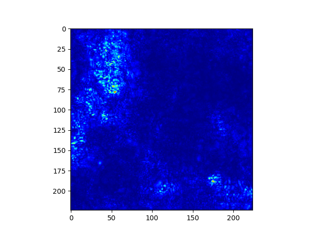
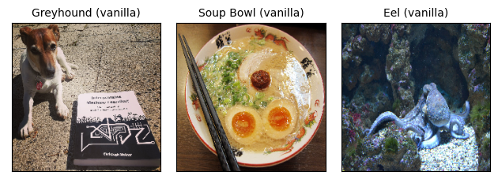
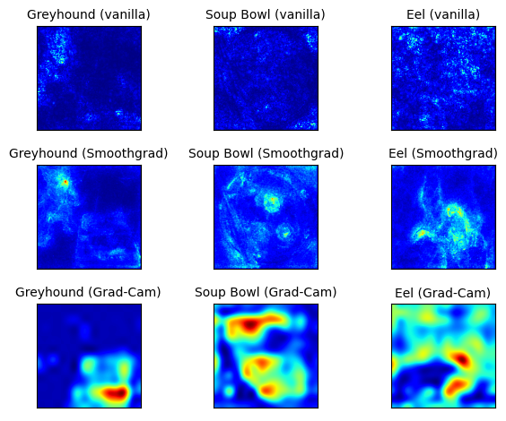

```{r, message = FALSE, warning = FALSE, echo = FALSE}
devtools::load_all()
set.seed(42)
```

<!--{pagebreak}-->

## Pixel Attribution (Saliency Maps) {#pixel-attribution}

`r if(is.html){only.in.html}`


Metode pixel attribution menyoroti piksel yang relevan untuk klasifikasi gambar tertentu oleh jaringan saraf.
Gambar berikut adalah contoh penjelasannya:

```{r, out.width = "80%"}

```


Anda akan melihat nanti di bab ini apa yang terjadi dalam gambar khusus ini.
Metode pixel attribution dapat ditemukan dengan berbagai nama: sensitivity map, saliency map, pixel attribution map, metode gradient-based attribution, feature relevance, feature attribution, dan feature contribution.

pixel attribution adalah kasus khusus dari feature attribution, tetapi untuk gambar.
Feature attribution menjelaskan prediksi individu dengan menghubungkan setiap fitur input sesuai dengan seberapa besar perubahan prediksi (negatif atau positif).
Fitur tersebut dapat berupa piksel masukan, data tabular atau kata-kata.
[SHAP](#shap), [Shapley Values](#shapley) dan [LIME](#lime) adalah contoh metode feature attribution umum.

Kami menganggap jaringan saraf yang menghasilkan prediksi sebagai vektor dengan panjang $C$, yang mencakup regresi di mana $C=1$.
Keluaran jaringan saraf untuk gambar I disebut $S(I)=[S_1(I),\ldots,S_C(I)]$.
Semua metode ini mengambil sebagai input $x\in\mathbb{R}^p$ (bisa berupa piksel gambar, data tabular, kata, ...) dengan fitur p dan output sebagai penjelasan nilai relevansi untuk setiap fitur input p : $R^c=[R_1^c,\ldots,R_p^c]$.
C menunjukkan relevansi untuk keluaran ke-c $S_C(I)$.

Ada sejumlah pendekatan pixel attribution yang membingungkan.
Ini membantu untuk memahami bahwa ada dua jenis metode atribusi yang berbeda:

**Berbasis oklusi atau perturbations**: Metode seperti [SHAP](#shap}) dan [LIME](#lime) memanipulasi bagian gambar untuk menghasilkan penjelasan (model-agnostic).

**Berbasis gradien**: Banyak metode menghitung gradien prediksi (atau skor klasifikasi) sehubungan dengan fitur input. Metode berbasis gradien (yang ada banyak) sebagian besar berbeda dalam cara menghitung gradien.

Kedua pendekatan memiliki kesamaan bahwa penjelasan memiliki ukuran yang sama dengan gambar input (atau setidaknya dapat diproyeksikan secara bermakna ke dalamnya) dan mereka menetapkan setiap piksel nilai yang dapat ditafsirkan sebagai relevansi piksel dengan prediksi atau klasifikasi gambar itu.

Kategorisasi lain yang berguna untuk metode pixel attribution adalah pertanyaan dasar:

**Metode khusus gradien** memberi tahu kami apakah perubahan piksel akan mengubah prediksi. Contohnya adalah Vanilla Gradient dan Grad-CAM.
Interpretasi dari atribusi hanya gradien adalah:
Jika saya mengubah piksel ini, probabilitas kelas yang diprediksi akan naik (untuk gradien positif) atau turun (untuk gradien negatif).
Semakin besar nilai absolut dari gradien, semakin kuat efek perubahan pada piksel ini.

**Metode atribusi jalur** membandingkan gambar saat ini dengan gambar referensi, yang dapat berupa gambar "nol" buatan seperti gambar yang benar-benar abu-abu.
Perbedaan dalam prediksi aktual dan baseline dibagi di antara piksel.
Gambar dasar juga dapat berupa banyak gambar: distribusi gambar.
Kategori ini mencakup metode berbasis gradien model khusus seperti Deep Taylor dan Integrated Gradients, serta metode model-agnostic seperti LIME dan SHAP.
Beberapa metode atribusi jalur bersifat "lengkap", artinya jumlah nilai relevansi untuk semua fitur masukan adalah selisih antara prediksi citra dikurangi prediksi citra referensi.
Contohnya adalah SHAP dan Integrated Gradients.
Untuk metode atribusi jalur, interpretasi selalu dilakukan sehubungan dengan garis dasar:
Perbedaan antara skor klasifikasi gambar sebenarnya dan gambar dasar dikaitkan dengan piksel.
Pilihan gambar referensi (distribusi) memiliki pengaruh besar pada penjelasan.
Asumsi yang biasa digunakan adalah menggunakan citra “netral” (distribusi).
Tentu saja, sangat mungkin untuk menggunakan selfie favorit Anda, tetapi Anda harus bertanya pada diri sendiri apakah itu masuk akal dalam sebuah aplikasi.
Itu pasti akan menegaskan dominasi di antara anggota proyek lainnya.

Tambahkan poin ini Saya biasanya akan memberikan intuisi tentang bagaimana metode ini bekerja, tetapi saya pikir yang terbaik adalah jika kita mulai dengan metode Vanilla Gradient, karena ini menunjukkan dengan sangat baik resep umum yang diikuti oleh banyak metode lain.


### Vanilla Gradient (Saliency Maps)

Ide Vanilla Gradient, yang diperkenalkan oleh [^saliency] sebagai salah satu pendekatan pixel attribution pertama cukup sederhana jika Anda sudah mengetahui backpropagation.
(Mereka menyebut pendekatan mereka "Image-Specific Class Saliency", tapi saya lebih suka Vanilla Gradient).
Kami menghitung gradien loss function untuk kelas yang kami minati sehubungan dengan piksel input.
Ini memberi kita peta ukuran fitur input dengan nilai negatif ke positif.

Resep untuk pendekatan ini adalah:

1. Lakukan forward pass dari gambar yang diinginkan.
1. Hitung gradien skor kelas yang diminati sehubungan dengan piksel input:
   $$E_{grad}(I_0)=\frac{\delta{}S_c}{\delta{}I}|_{I=I_0}$$
   Di sini kita mengatur semua kelas lain ke nol.
1. Visualisasikan gradien. Anda dapat menunjukkan nilai absolut atau menyoroti kontribusi negatif dan positif secara terpisah.

Lebih formal, kami memiliki gambar I dan convolutional neural networks memberinya skor $S_c(I)$ untuk kelas c.
Skor adalah fungsi yang sangat non-linear dari gambar kita.
Gagasan di balik penggunaan gradien adalah bahwa kita dapat memperkirakan skor itu dengan menerapkan ekspansi Taylor orde pertama

$$S_c(I)\approx{}w^T{}I+b$$

di mana w adalah turunan dari skor kami:

$$w = \frac{\delta S_C}{\delta I}|_{I_0}$$

Sekarang, ada beberapa ambiguitas bagaimana melakukan lintasan mundur dari gradien, karena unit non-linear seperti ReLU (Rectifying Linear Unit) "menghapus" tanda.
Jadi ketika kita melakukan backpass, kita tidak tahu apakah akan menetapkan aktivasi positif atau negatif.
Menggunakan keterampilan seni ASCII saya yang luar biasa, fungsi ReLU terlihat seperti ini: _/ dan didefinisikan sebagai $X_{n+1}(x)=max(0,X_n)$ dari lapisan $X_n$ ke lapisan $X_{n- 1}$.
Artinya ketika aktivasi sebuah neuron adalah 0, kita tidak tahu nilai mana yang akan di backpropagate.
Dalam kasus Vanilla Gradient, ambiguitas diselesaikan sebagai berikut:

$$\frac{\delta f}{\delta X_n} = \frac{\delta f}{\delta X_{n+1}} \cdot \mathbf{I}(X_n > 0)$$

Di sini, $\mathbf{I}$ adalah fungsi indikator elemen-bijaksana, yaitu 0 di mana aktivasi di lapisan bawah negatif, dan 1 di mana itu positif atau nol.
Vanilla Gradient mengambil gradien yang telah kita perbanyak kembali sejauh ini ke lapisan n+1, dan kemudian cukup setel gradien ke nol di mana aktivasi pada lapisan di bawahnya negatif.

Mari kita lihat contoh di mana kita memiliki lapisan $X_n$ dan $X_{n+1}=ReLU(X_{n+1})$.
Aktivasi fiktif kami di $X_n$ adalah:

$$
\begin{pmatrix}
1 & 0 \\
-1 & -10 \\
\end{pmatrix}
$$

Dan ini adalah gradien kami di $X_{(n+1)}$:

$$
\begin{pmatrix}
0.4 & 1.1 \\
-0.5 & -0.1  \\
\end{pmatrix}
$$

Maka gradien kami di $X_n$ adalah:

$$
\begin{pmatrix}
0.4 & 0 \\
 0 & 0  \\
\end{pmatrix}
$$


#### Problems with Vanilla Gradient

Vanilla Gradient memiliki masalah saturasi (dijelaskan dalam Avanti et. al, 2017 [^deeplift]):
Ketika ReLU digunakan, dan ketika aktivasi berjalan di bawah nol, maka aktivasi dibatasi pada nol dan tidak berubah lagi.
Aktivasi sudah jenuh.
Contoh: Input ke layer adalah dua neuron dengan bobot $-1$ dan $-1$ dan bias $1$.
Saat melewati lapisan ReLU, aktivasi akan menjadi neuron1 + neuron2 jika jumlah kedua neuron kurang dari 1.
Jika jumlah keduanya lebih besar dari 1, aktivasi akan tetap jenuh pada aktivasi 1.
Juga gradien pada titik ini akan menjadi nol, dan Gradien Vanilla akan mengatakan bahwa neuron ini tidak penting.

Dan sekarang, para pembaca yang budiman, pelajari metode lain, kurang lebih gratis: DeconvNet

### DeconvNet

DeconvNet oleh Zeiler an Fergus (2014) [^deconvnet] hampir identik dengan Vanilla Gradient.
Tujuan DeconvNet adalah untuk membalikkan jaringan saraf dan makalah ini mengusulkan operasi yang merupakan kebalikan dari lapisan penyaringan, penyatuan, dan aktivasi.
Jika Anda melihat ke dalam kertas, terlihat sangat berbeda dengan Vanilla Gradient, tetapi selain kebalikan dari lapisan ReLU, DeconvNet setara dengan pendekatan Vanilla Gradient.
Vanilla Gradient dapat dilihat sebagai generalisasi dari DeconvNet.
DeconvNet membuat pilihan yang berbeda untuk backpropagating gradien melalui ReLU:

$R_n=R_{n+1}\mathbb{I}(R_{n+1}>0)$$,

di mana $R_n$ dan $R_{n+1}$ adalah rekonstruksi lapisan.
Saat melakukan backpass dari layer n ke layer n-1, DeconvNet "mengingat" aktivasi mana di layer n yang disetel ke nol di forward pass dan disetel ke 0 di layer n-1.
Aktivasi dengan nilai negatif di lapisan x disetel ke nol di lapisan n-1.
Gradien $X_n$ untuk contoh sebelumnya menjadi:

$$
\begin{pmatrix}
0.4 & 1.1 \\
0 & 0  \\
\end{pmatrix}
$$


### Grad-CAM

Grad-CAM memberikan penjelasan visual untuk keputusan CNN.
Tidak seperti metode lain, gradien tidak dipropagasi mundur sepanjang jalan kembali ke gambar, tetapi (biasanya) ke lapisan konvolusi terakhir untuk menghasilkan localization map kasar yang menyoroti wilayah penting gambar.

Grad-CAM adalah singkatan dari Gradient-weighted Class Activation Map.
Dan, seperti namanya, ini didasarkan pada gradien jaringan saraf.
Grad-CAM, seperti teknik lainnya, memberikan setiap neuron skor relevansi untuk keputusan yang menarik.
Keputusan yang menarik ini dapat berupa prediksi kelas (yang kita temukan di lapisan keluaran), tetapi secara teoritis dapat berupa lapisan lain dalam jaringan saraf.
Grad-CAM menyebarkan kembali informasi ini ke lapisan konvolusi terakhir.
Grad-CAM dapat digunakan dengan CNN yang berbeda: dengan lapisan yang sepenuhnya terhubung, untuk keluaran terstruktur seperti teks dan dalam keluaran multi-tugas, dan untuk reinforcement learning.

Mari kita mulai dengan pertimbangan intuitif Grad-CAM.
Tujuan Grad-CAM adalah untuk memahami di bagian mana dari suatu gambar lapisan konvolusi "terlihat" untuk klasifikasi tertentu.
Sebagai pengingat, lapisan konvolusi pertama dari CNN mengambil sebagai input gambar dan menampilkan peta fitur yang mengkodekan fitur yang dipelajari (lihat bab tentang [Fitur yang Dipelajari](#cnn-features)).
Lapisan konvolusi tingkat yang lebih tinggi melakukan hal yang sama, tetapi mengambil peta fitur dari lapisan konvolusi sebelumnya sebagai masukan.
Untuk memahami bagaimana CNN membuat keputusan, Grad-CAM menganalisis wilayah mana yang diaktifkan di peta fitur lapisan konvolusi terakhir.
Ada k peta fitur di lapisan konvolusi terakhir, dan saya akan menyebutnya $A_1, A_2, \ldots, A_k$.
Bagaimana kita bisa "melihat" dari peta fitur bagaimana convolutional neural networks telah membuat klasifikasi tertentu?
Pada pendekatan pertama, kita cukup memvisualisasikan nilai mentah dari setiap peta fitur, rata-rata di atas peta fitur dan melapisinya di atas gambar kita.
Ini tidak akan membantu karena peta fitur menyandikan informasi untuk **semua kelas**, tetapi kami tertarik pada kelas tertentu.
Grad-CAM harus memutuskan seberapa penting setiap peta fitur k bagi kelas c yang kami minati.
Kami harus menimbang setiap piksel dari setiap peta fitur dengan gradien sebelum kami membuat rata-rata di atas peta fitur.
Ini memberi kami peta panas yang menyoroti wilayah yang secara positif atau negatif memengaruhi kelas minat.
Peta panas ini dikirim melalui fungsi ReLU, yang merupakan cara bagus untuk mengatakan bahwa kami menetapkan semua nilai negatif ke nol.
Grad-CAM menghapus semua nilai negatif dengan menggunakan fungsi ReLU, dengan argumen bahwa kita hanya tertarik pada bagian yang berkontribusi pada kelas c yang dipilih dan bukan pada kelas lain.
Kata piksel mungkin menyesatkan di sini karena peta fitur lebih kecil dari gambar (karena unit penyatuan) tetapi dipetakan kembali ke gambar aslinya.
Kami kemudian menskalakan peta Grad-CAM ke interval [0,1] untuk tujuan visualisasi dan melapisinya di atas gambar asli.

Mari kita lihat resep untuk Grad-CAM
Tujuan kami adalah menemukan localization map, yang didefinisikan sebagai:

$$L^c_{Grad-CAM} \in \mathbb{R}^{u\times v} = \underbrace{ReLU}_{\text{Pick positive values}}\left(\sum_{k} \alpha_k^c A^k\right)$$

Di sini, u adalah lebarnya, v tinggi penjelasannya dan c kelas yang diinginkan.

1. Teruskan menyebarkan gambar input melalui convolutional neural networks.
1. Mendapatkan nilai mentah untuk kelas minat, artinya aktivasi neuron sebelum lapisan softmax.
1. Setel semua aktivasi kelas lainnya ke nol.
1. Menyebarkan kembali gradien kelas yang diinginkan ke lapisan konvolusi terakhir sebelum lapisan yang terhubung sepenuhnya: $\frac{\delta{}y^c}{\delta{}A^k}$.
1. Bobot setiap fitur peta "piksel" dengan gradien untuk kelas. Indeks i dan j mengacu pada dimensi lebar dan tinggi:
   $$\alpha_k^c = \overbrace{\frac{1}{Z}\sum_{i}\sum_{j}}^{\text{global average pooling}} \underbrace{\frac{\delta y^c}{\delta A_{ij}^k}}_{\text{gradients via backprop}}$$
Ini berarti bahwa gradien dikumpulkan secara global.
1. Hitung rata-rata peta fitur, yang diberi bobot per piksel berdasarkan gradien.
1. Terapkan ReLU ke peta fitur rata-rata.
1. Untuk visualisasi: Skalakan nilai ke interval antara 0 dan 1. Tingkatkan gambar dan overlay di atas gambar asli.
1. Langkah tambahan untuk Grad-CAM Terpandu: Kalikan peta panas dengan guided backpropagation.


### Guided Grad-CAM

Dari deskripsi Grad-CAM Anda dapat menebak bahwa lokalisasi sangat kasar karena peta fitur konvolusi terakhir memiliki resolusi yang jauh lebih kasar dibandingkan dengan gambar input.
Sebaliknya, teknik atribusi lainnya melakukan backpropagate sampai ke piksel input.
Oleh karena itu, mereka jauh lebih detail dan dapat menunjukkan tepi atau titik individual yang berkontribusi paling besar pada prediksi.
Penggabungan kedua metode ini disebut Guided Grad-CAM.
Dan itu sangat sederhana.
Anda menghitung untuk gambar baik penjelasan Grad-CAM maupun penjelasan dari metode atribusi lain, seperti Vanilla Gradient.
Output Grad-CAM kemudian di-upsampling dengan interpolasi bilinear, kemudian kedua peta dikalikan dengan elemen.
Grad-CAM bekerja seperti lensa yang berfokus pada bagian tertentu dari pixel attribution map.

### SmoothGrad

Ide SmoothGrad oleh Smilkov et. al 2017 [^smoothgrad] adalah untuk membuat penjelasan berbasis gradien kurang noisy dengan menambahkan noise dan rata-rata atas artificially noisy gradients ini.
SmoothGrad bukanlah metode penjelasan yang berdiri sendiri, tetapi merupakan perluasan dari metode penjelasan berbasis gradien.

SmoothGrad bekerja dengan cara berikut:

1. Buat beberapa versi gambar yang diinginkan dengan menambahkan noise ke dalamnya.
1. Buat pixel attribution map untuk semua gambar.
1. Rata-rata pixel attribution map.

Ya, sesederhana itu.
Mengapa ini harus berhasil?
Teorinya adalah bahwa turunan sangat berfluktuasi pada skala kecil.
Jaringan saraf tidak memiliki insentif selama pelatihan untuk menjaga gradien tetap halus, tujuannya adalah untuk mengklasifikasikan gambar dengan benar.
Rata-rata pada beberapa peta "memperhalus" fluktuasi ini:

$$R_{sg}(x)=\frac{1}{N}\sum_{i=1}^n{}R(x+g_i),$$

Di sini, $g_i\sim{}N(0,\sigma^2)$ adalah vektor noise yang disampel dari distribusi Gaussian.
Tingkat noise "ideal" tergantung pada gambar input dan jaringan.
Penulis menyarankan tingkat noise 10%-20%, yang berarti $\frac{\sigma}{x_{max} - x_{min}}$ harus antara 0,1 dan 0,2.
Batas $x_{max}$ dan $x_{min}$ mengacu pada p-valueiksel minimum dan maksimum gambar.
Parameter lainnya adalah jumlah sampel n, yang disarankan untuk menggunakan n = 50, karena ada hasil yang semakin berkurang di atas itu.


### Examples

Mari kita lihat beberapa contoh seperti apa peta ini dan bagaimana metode ini dibandingkan secara kualitatif.
Jaringan yang diperiksa adalah VGG-16 (Simonyan et. al 2014 [^vgg16]) yang dilatih di ImageNet dan karenanya dapat membedakan lebih dari 20.000 kelas.
Untuk gambar berikut akan kami buatkan penjelasan untuk kelas dengan skor klasifikasi tertinggi.

Ini adalah gambar dan klasifikasinya oleh jaringan saraf:

```{r, out.width = "80%", fig.show}

```

Gambar di sebelah kiri dengan anjing terhormat yang menjaga buku Interpretable Machine Learning diklasifikasikan sebagai "Greyhound" dengan probabilitas 35\% (sepertinya "buku Interpretable Machine Learning" bukan salah satu dari kelas 20k).
Gambar di tengah menunjukkan semangkuk sup ramen lezat dan diklasifikasikan dengan benar sebagai "Mangkuk Sup" dengan probabilitas 50\%.
Gambar ketiga menunjukkan gurita di dasar laut, yang salah diklasifikasikan sebagai "Belut" dengan probabilitas tinggi 70%.

Dan ini adalah pixel attribution yang bertujuan untuk menjelaskan klasifikasi:

```{r, out.width = "80%"}

```

Sayangnya, agak berantakan.
Tapi mari kita lihat penjelasan individu, dimulai dengan anjing.
Vanilla Gradient dan Vanilla Gradient + SmoothGrad keduanya menyoroti anjing, yang masuk akal.
Tetapi mereka juga menyoroti beberapa area di sekitar buku, yang aneh.
Grad-CAM hanya menyoroti area buku, yang sama sekali tidak masuk akal.
Dan mulai sekarang, itu menjadi sedikit lebih berantakan.
Metode Vanilla Gradient tampaknya gagal untuk mangkuk sup dan gurita (atau, seperti yang dipikirkan jaringan, belut).
Kedua gambar terlihat seperti bayangan setelah melihat matahari terlalu lama.
(Tolong jangan melihat matahari secara langsung).
SmoothGrad banyak membantu, setidaknya areanya lebih jelas.
Dalam contoh sup, beberapa bahan disorot, seperti telur dan daging, tetapi juga area di sekitar chop stick.
Dalam gambar gurita, sebagian besar hewan itu sendiri disorot.

Untuk mangkuk sup, Grad-CAM menyoroti bagian telur dan, untuk beberapa alasan, bagian atas mangkuk.
Penjelasan gurita oleh Grad-CAM bahkan lebih berantakan.

Anda sudah bisa melihat di sini kesulitan dalam menilai apakah kami mempercayai penjelasannya.
Sebagai langkah pertama, kita perlu mempertimbangkan bagian mana dari citra yang mengandung informasi yang relevan dengan klasifikasi citra.
Tapi kemudian kita juga perlu memikirkan apa yang mungkin digunakan jaringan saraf untuk klasifikasi.
Mungkin mangkuk sup diklasifikasikan dengan benar berdasarkan kombinasi telur dan sumpit, seperti yang disiratkan SmoothGrad?
Atau mungkin jaringan saraf mengenali bentuk busur ditambah beberapa bahan, seperti yang disarankan Grad-CAM?
Kami hanya tidak tahu.

Dan itulah masalah besar dengan semua metode ini.
Kami tidak memiliki kebenaran dasar untuk penjelasannya.
Kita hanya dapat, pada langkah pertama, menolak penjelasan yang jelas-jelas tidak masuk akal (dan bahkan dalam langkah ini kita tidak memiliki keyakinan yang kuat. Proses prediksi dalam jaringan saraf sangat rumit).

### Advantages
Penjelasannya **visual** dan kami cepat mengenali gambar.
Khususnya, ketika metode hanya menyorot piksel penting, mudah untuk segera mengenali bagian penting dari gambar.

Metode berbasis gradien biasanya **lebih cepat dihitung daripada metode model-agnostic**.
Misalnya, [LIME](#lime) dan [SHAP](#shap) juga dapat digunakan untuk menjelaskan klasifikasi gambar, tetapi lebih mahal untuk dihitung.

Ada **banyak metode untuk dipilih**.

### Disadvantages
Seperti kebanyakan metode interpretasi, **sulit untuk mengetahui apakah suatu penjelasan itu benar**, dan sebagian besar evaluasi hanya bersifat kualitatif ("Penjelasan ini terlihat benar, ayo publikasikan makalahnya." ).

Metode pixel attribution bisa sangat **rapuh**.
Ghorbani et. al (2019)[^fragile-saliency] menunjukkan bahwa memperkenalkan perturbations kecil (adversarial) pada gambar, yang masih mengarah pada prediksi yang sama, dapat menyebabkan piksel yang sangat berbeda disorot sebagai penjelasan.

Kindermann et. al (2019) [^unreliable-saliency] juga menunjukkan bahwa metode pixel attribution ini **bisa sangat tidak dapat diandalkan**.
Mereka menambahkan pergeseran konstan ke data input, yang berarti mereka menambahkan perubahan piksel yang sama ke semua gambar.
Mereka membandingkan dua jaringan, jaringan asli dan jaringan "bergeser" di mana bias lapisan pertama diubah untuk beradaptasi dengan pergeseran piksel yang konstan.
Kedua jaringan menghasilkan prediksi yang sama.
Juga gradiennya sama untuk keduanya.
Tetapi penjelasannya berubah, yang merupakan properti yang tidak diinginkan.
Mereka melihat DeepLift, Vanilla Gradient dan Integrated Gradients.

Makalah "Sanity Checks for Saliency Maps" [^sanity-checks] menyelidiki apakah metode saliency **tidak sensitif terhadap model dan data**.
Ketidakpekaan sangat tidak diinginkan karena itu berarti "penjelasan" tidak terkait dengan model dan data.
Metode yang tidak sensitif terhadap model dan data pelatihan mirip dengan detektor tepi.
Detektor tepi hanya menyoroti perubahan warna piksel yang kuat dalam gambar dan tidak terkait dengan model prediksi atau fitur abstrak gambar, dan tidak memerlukan pelatihan.
Metode yang diuji adalah Vanilla Gradient, Gradient x Input, Integrated Gradients, Guided Backpropagation, Guided Grad-CAM dan SmoothGrad (dengan vanilla gradient).
Gradasi vanila dan Grad-CAM lolos pemeriksaan ketidakpekaan, sedangkan Backpropagation Terpandu dan GradCAM Terpandu gagal.
Namun, kertas pemeriksaan kewarasan itu sendiri telah menemukan beberapa kritik dari Tomsett et. al (2020) [^sanity-metrics] dengan makalah berjudul "Sanity Checks for Saliency Metrics" (tentu saja).
Mereka menemukan bahwa ada ketidakkonsistenan untuk metrik evaluasi (saya tahu, ini menjadi sangat meta sekarang).
Jadi kita kembali ke tempat kita mulai ... Masih sulit untuk mengevaluasi penjelasan visual.
Hal ini membuat sangat sulit bagi seorang praktisi.

Secara keseluruhan, ini adalah **keadaan yang sangat tidak memuaskan**.
Kita harus menunggu sedikit untuk penelitian lebih lanjut tentang topik ini.
Dan tolong, tidak ada lagi penemuan metode baru, tetapi lebih banyak pengawasan tentang bagaimana mengevaluasi metode ini.

### Software

Ada beberapa implementasi perangkat lunak dari metode pixel attribution.
Sebagai contoh, saya menggunakan [tf-keras-vis](https://pypi.org/project/tf-keras-vis/).
Salah satu library paling komprehensif adalah [iNNvestigate](https://github.com/albermax/innvestigate), yang mengimplementasikan gradien Vanilla, Smoothgrad, Deconvnet, Guided Backpropagation, PatternNet, LRP, dan lainnya.
Banyak metode diimplementasikan di [DeepExplain Toolbox](https://github.com/marcoancona/DeepExplain).


[^deeplift]: Shrikumar, Avanti, Peyton Greenside, and Anshul Kundaje. "Learning important features through propagating activation differences." Proceedings of the 34th International Conference on Machine Learning-Volume 70. JMLR. org, (2017).

[^integrated-gradients]: Sundararajan, Mukund, Ankur Taly, and Qiqi Yan. "Axiomatic attribution for deep networks." Proceedings of the 34th International Conference on Machine Learning-Volume 70. JMLR. org, 2017.

[^saliency]: Simonyan, Karen, Andrea Vedaldi, and Andrew Zisserman. "Deep inside convolutional networks: Visualising image classification models and saliency maps." arXiv preprint arXiv:1312.6034 (2013).

[^grad-cam]: Selvaraju, Ramprasaath R., et al. "Grad-cam: Visual explanations from deep networks via gradient-based localization." Proceedings of the IEEE international conference on computer vision. (2017).

[^sanity-checks]: Adebayo, Julius, Justin Gilmer, Michael Muelly, Ian Goodfellow, Moritz Hardt, and Been Kim. "Sanity checks for saliency maps." arXiv preprint arXiv:1810.03292 (2018).

[^sanity-metrics]: Tomsett, Richard, Dan Harborne, Supriyo Chakraborty, Prudhvi Gurram, and Alun Preece. "Sanity checks for saliency metrics." In Proceedings of the AAAI Conference on Artificial Intelligence, vol. 34, no. 04, pp. 6021-6029. 2020.

[^smoothgrad]: Smilkov, Daniel, et al. "Smoothgrad: removing noise by adding noise." arXiv preprint arXiv:1706.03825 (2017).

[^deconvnet]: Zeiler, Matthew D., and Rob Fergus. "Visualizing and understanding convolutional networks." European conference on computer vision. Springer, Cham, 2014.

[^guided-backpropagation]: Springenberg, Jost Tobias, et al. "Striving for simplicity: The all convolutional net." arXiv preprint arXiv:1412.6806 (2014).

[^lrp]: Bach, Sebastian, et al. "On pixel-wise explanations for non-linear classifier decisions by layer-wise relevance propagation." PloS one 10.7 (2015).


<!-- References about problems -->

[^better-understanding]: Ancona, Marco, et al. "Towards better understanding of gradient-based attribution methods for deep neural networks." arXiv preprint arXiv:1711.06104 (2017).

[^fragile-saliency]: Ghorbani, Amirata, Abubakar Abid, and James Zou. "Interpretation of neural networks is fragile." Proceedings of the AAAI Conference on Artificial Intelligence. Vol. 33. 2019.

[^unreliable-saliency]: Kindermans, Pieter-Jan, Sara Hooker, Julius Adebayo, Maximilian Alber, Kristof T. Schütt, Sven Dähne, Dumitru Erhan, and Been Kim. "The (un) reliability of saliency methods." In Explainable AI: Interpreting, Explaining and Visualizing Deep Learning, pp. 267-280. Springer, Cham, (2019).


[^perplexing-behavior]: Nie, Weili, Yang Zhang, and Ankit Patel. "A theoretical explanation for perplexing behaviors of backpropagation-based visualizations." arXiv preprint arXiv:1805.07039 (2018).

<!-- Toolboxes -->

[^innvestigate]: "iNNvestigate neural networks!"(http://arxiv.org/abs/1808.04260) by Maximilian Alber, Sebastian Lapuschkin, Philipp Seegerer, Miriam Hägele, Kristof T. Schütt, Grégoire Montavon, Wojciech Samek, Klaus-Robert Müller, Sven Dähne, Pieter-Jan Kindermans


[^vgg16]: Simonyan, Karen, and Andrew Zisserman. "Very deep convolutional networks for large-scale image recognition." arXiv preprint arXiv:1409.1556 (2014).

