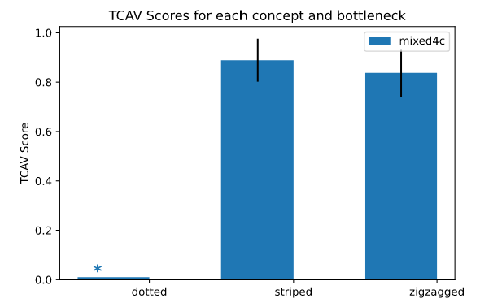

## Detecting Concepts

*Author: Fangzhou Li @ University of California, Davis*

`r if(is.html){only.in.html}`

Sejauh ini, kami menemukan banyak metode untuk menjelaskan model black box melalui feature attribution.
Namun, ada beberapa keterbatasan mengenai pendekatan berbasis fitur.
Pertama, fitur belum tentu ramah pengguna dalam hal interpretasi.
Misalnya, pentingnya satu piksel dalam sebuah gambar biasanya tidak memberikan banyak interpretasi yang berarti.
Kedua, ekspresi dari penjelasan berbasis fitur dibatasi oleh jumlah fitur.

Pendekatan berbasis konsep membahas kedua keterbatasan yang disebutkan di atas.
Konsep dapat berupa abstraksi apa pun, seperti warna, objek, atau bahkan ide.
Mengingat konsep yang ditentukan pengguna, meskipun jaringan saraf mungkin tidak dilatih secara eksplisit dengan konsep yang diberikan, pendekatan berbasis konsep mendeteksi konsep yang tertanam dalam ruang laten yang dipelajari oleh jaringan.
Dengan kata lain, pendekatan berbasis konsep dapat menghasilkan penjelasan yang tidak dibatasi oleh ruang fitur jaringan saraf.

Dalam bab ini, kami terutama akan fokus pada makalah Testing with Concept Activation Vectors (TCAV) oleh Kim et al.[^tcav]

### TCAV: Testing with Concept Activation Vectors

TCAV diusulkan untuk menghasilkan penjelasan global untuk jaringan saraf, tetapi, secara teori, TCAV juga harus bekerja untuk model apa pun yang memungkinkan pengambilan turunan terarah.
Untuk setiap konsep yang diberikan, TCAV mengukur sejauh mana pengaruh konsep tersebut pada prediksi model untuk kelas tertentu.
Misalnya, TCAV dapat menjawab pertanyaan seperti bagaimana konsep "bergaris" memengaruhi model yang mengklasifikasikan gambar sebagai "zebra".
Karena TCAV menjelaskan hubungan antara konsep dan kelas, alih-alih menjelaskan prediksi tunggal, TCAV memberikan interpretasi global yang berguna untuk perilaku model secara keseluruhan.


#### Concept Activation Vector (CAV)

CAV hanyalah representasi numerik yang menggeneralisasi konsep dalam ruang aktivasi lapisan jaringan saraf.
CAV, dilambangkan sebagai $v_l^C$, bergantung pada konsep $C$ dan lapisan jaringan saraf $l$, di mana $l$ juga disebut sebagai bottleneck model.
Untuk menghitung CAV dari sebuah konsep $C$, pertama-tama, kita perlu menyiapkan dua kumpulan data: kumpulan data konsep yang mewakili $C$ dan kumpulan data acak yang terdiri dari data arbitrer.
Misalnya, untuk mendefinisikan konsep "bergaris", kita dapat mengumpulkan gambar objek bergaris sebagai dataset konsep, sedangkan dataset acak adalah sekelompok gambar acak tanpa garis.
Selanjutnya, kami menargetkan lapisan tersembunyi $l$ dan melatih pengklasifikasi biner yang memisahkan aktivasi yang dihasilkan oleh kumpulan konsep dari yang dihasilkan oleh kumpulan acak.
Vektor koefisien dari pengklasifikasi biner terlatih ini adalah CAV $v_l^C$.
Dalam praktiknya, kita dapat menggunakan SVM atau logistic regression model sebagai pengklasifikasi biner.
Terakhir, dengan masukan gambar $x$, kita dapat mengukur "sensitivitas konseptual" dengan menghitung turunan arah dari prediksi dalam arah unit CAV:

$$S_{C,k,l}(x)=\nabla h_{l,k}(f_l(x))\cdot v_l^C$$

di mana $f_l$ memetakan input $x$ ke vektor aktivasi layer $l$ dan $h_{l,k}$ memetakan vektor aktivasi ke output logit kelas $k$.

Secara matematis, tanda $S_{C,k,l}(x)$ hanya bergantung pada sudut antara gradien $h_{l,k}(f_l(x))$ dan $v_l^C$.
Jika sudutnya lebih besar dari 90 derajat, $S_{C,k,l}(x)$ akan positif, dan jika sudutnya kurang dari 90 derajat, $S_{C,k,l}(x)$ akan menjadi negatif.
Karena gradien $\nabla h_{l,k}$ menunjuk ke arah yang paling cepat memaksimalkan keluaran, sensitivitas konseptual $S_{C,k,l}$, secara intuitif, menunjukkan apakah $v_l^C$ menunjuk ke arah serupa yang memaksimalkan $h_{l,k}$.
Dengan demikian, $S_{C,k,l}(x)>0$ dapat diinterpretasikan sebagai konsep $C$ yang mendorong model untuk mengklasifikasikan $x$ ke dalam kelas $k$.

#### Testing with CAVs (TCAV)

Dalam paragraf terakhir, kita telah mempelajari cara menghitung sensitivitas konseptual dari satu titik data.
Namun, tujuan kami adalah untuk menghasilkan penjelasan global yang menunjukkan sensitivitas konseptual keseluruhan dari seluruh kelas.
Pendekatan yang sangat mudah dilakukan oleh TCAV adalah menghitung rasio input dengan sensitivitas konseptual positif terhadap jumlah input untuk suatu kelas:

$$TCAV_{Q_{C,k,l}}=\frac{|{x\in X_k:S_{C,k,l}(x)>0}|}{|X_k|}$$

Kembali ke contoh kami, kami tertarik pada bagaimana konsep "bergaris" memengaruhi model saat mengklasifikasikan gambar sebagai "zebra".
Kami mengumpulkan data yang diberi label sebagai "zebra" dan menghitung sensitivitas konseptual untuk setiap gambar masukan.
Kemudian skor TCAV konsep “bergaris” dengan kelas prediksi “zebra” adalah jumlah citra “zebra” yang memiliki sensitivitas konseptual positif dibagi dengan jumlah citra “zebra”.
Dengan kata lain, $TCAV_{Q_{"striped","zebra",l}}$ sama dengan 0,8 menunjukkan bahwa 80% prediksi untuk kelas "zebra" dipengaruhi secara positif oleh konsep "striped".

Ini terlihat bagus, tetapi bagaimana kita tahu bahwa skor TCAV kita berarti?
Bagaimanapun, CAV dilatih oleh konsep yang dipilih pengguna dan kumpulan data acak.
Jika kumpulan data yang digunakan untuk melatih CAV buruk, penjelasannya bisa menyesatkan dan tidak berguna.
Dan dengan demikian, kami melakukan uji signifikansi statistik sederhana untuk membantu TCAV menjadi lebih andal.
Artinya, alih-alih melatih hanya satu CAV, kami melatih beberapa CAV menggunakan kumpulan data acak yang berbeda sambil menjaga kumpulan data konsep tetap sama.
Konsep yang bermakna harus menghasilkan CAV dengan skor TCAV yang konsisten.
Prosedur pengujian yang lebih rinci ditunjukkan sebagai berikut:

1. Kumpulkan set data acak $N$, di mana direkomendasikan bahwa $N$ setidaknya 10.
2. Perbaiki kumpulan data konsep dan hitung skor TCAV menggunakan masing-masing kumpulan data acak $N$.
3. Terapkan uji-t dua sisi untuk skor TCAV $N$ terhadap skor TCAV $N$ lainnya yang dihasilkan oleh CAV acak.
CAV acak dapat diperoleh dengan memilih dataset acak sebagai dataset konsep.

Disarankan juga untuk menerapkan metode koreksi pengujian berganda di sini jika Anda memiliki banyak hipotesis.
Makalah asli menggunakan koreksi Bonferroni, dan di sini jumlah hipotesis sama dengan jumlah konsep yang Anda uji.

### Example

Mari kita lihat contoh yang tersedia di TCAV [GitHub](https://github.com/tensorflow/tcav/blob/master/Run_TCAV.ipynb).
Melanjutkan contoh kelas “zebra” yang telah kita gunakan sebelumnya, contoh ini menunjukkan hasil skor TCAV konsep “striped”, “zigzagged”, dan “dotted”.
Pengklasifikasi gambar yang kami gunakan adalah InceptionV3[^inception], convolutional neural networks yang dilatih menggunakan data ImageNet.
Setiap konsep atau kumpulan data acak berisi 50 gambar, dan kami menggunakan 10 kumpulan data acak untuk uji signifikansi statistik dengan tingkat signifikansi 0,05.
Kami tidak menggunakan koreksi Bonferroni karena kami hanya memiliki beberapa kumpulan data acak, tetapi disarankan untuk menambahkan koreksi dalam praktik untuk menghindari penemuan yang salah.

```{r fig.cap = "The example of measuring TCAV scores of three concepts for the model predicting “zebra”. The targeted bottleneck is a layer called “mixed4c”. A star sign above “dotted” indicates that “dotted” has not passed the statistical significance test, i.e., having the p-value larger than 0.05. Both “striped” and “zigzagged” have passed the test, and both concepts are useful for the model to identify “zebra” images according to TCAV. Figure originally from the TCAV GitHub.", out.width=800}

```

Dalam praktiknya, Anda mungkin ingin menggunakan lebih dari 50 gambar di setiap kumpulan data untuk melatih CAV yang lebih baik.
Anda mungkin juga ingin menggunakan lebih dari 10 kumpulan data acak untuk melakukan uji signifikansi statistik yang lebih baik.
Anda juga dapat menerapkan TCAV ke beberapa kemacetan untuk mendapatkan pengamatan yang lebih menyeluruh.

### Advantages

Karena pengguna hanya diharuskan mengumpulkan data untuk melatih konsep yang mereka minati, **TCAV tidak mengharuskan pengguna memiliki keahlian machine learning**.
Hal ini memungkinkan TCAV menjadi sangat berguna bagi pakar domain untuk mengevaluasi model jaringan saraf mereka yang rumit.

Karakteristik unik lainnya dari TCAV adalah **kemampuan penyesuaiannya** yang diaktifkan oleh **penjelasan di luar feature attribution** TCAV.
Pengguna dapat menyelidiki konsep apa pun selama konsep tersebut dapat didefinisikan oleh kumpulan data konsepnya.
Dengan kata lain, pengguna dapat mengontrol keseimbangan antara kompleksitas dan interpretasi penjelasan berdasarkan kebutuhan mereka: Jika ahli domain memahami masalah dan konsep dengan sangat baik, mereka dapat membentuk kumpulan data konsep menggunakan data yang lebih rumit untuk menghasilkan yang lebih baik. -penjelasan berbutir

Terakhir, TCAV menghasilkan **penjelasan global** yang menghubungkan konsep dengan kelas mana pun.
Penjelasan global memberi Anda gambaran apakah model keseluruhan Anda berperilaku baik atau tidak, yang biasanya tidak dapat dilakukan oleh local explanation.
Dan dengan demikian, TCAV dapat digunakan untuk mengidentifikasi potensi "cacat" atau "titik buta" yang terjadi selama pelatihan model: Mungkin model Anda telah belajar menimbang konsep secara tidak tepat.
Jika pengguna dapat mengidentifikasi konsep-konsep yang kurang dipelajari tersebut, seseorang dapat menggunakan pengetahuan tersebut untuk **meningkatkan model mereka**.
Katakanlah ada pengklasifikasi yang memprediksi "zebra" dengan akurasi tinggi. TCAV, bagaimanapun, menunjukkan bahwa classifier lebih sensitif terhadap konsep "bertitik" daripada "bergaris".
Ini mungkin menunjukkan bahwa pengklasifikasi dilatih secara tidak sengaja oleh set data yang tidak seimbang, memungkinkan Anda untuk meningkatkan model dengan menambahkan lebih banyak gambar "zebra bergaris" atau lebih sedikit gambar "zebra bertitik" ke set data pelatihan.

### Disadvantages

TCAV mungkin **berperforma buruk pada jaringan saraf yang lebih dangkal**.
Seperti yang disarankan oleh banyak makalah [^probe], konsep di lapisan yang lebih dalam lebih dapat dipisahkan.
Jika jaringan terlalu dangkal, lapisannya mungkin tidak dapat memisahkan konsep dengan jelas sehingga TCAV tidak dapat diterapkan.

Karena TCAV memerlukan **anotasi tambahan** untuk kumpulan data konsep, maka biayanya bisa sangat mahal untuk tugas yang tidak memiliki data berlabel siap pakai.
Alternatif yang mungkin untuk TCAV ketika anotasi mahal adalah dengan menggunakan ACE[^ace] yang akan kita bicarakan secara singkat di bagian selanjutnya.

Meskipun TCAV dipuji karena kemampuan penyesuaiannya, **sulit untuk diterapkan pada konsep yang terlalu abstrak atau umum**.
Ini terutama karena TCAV menggambarkan sebuah konsep dengan kumpulan data konsep yang sesuai.
Semakin abstrak atau umum suatu konsep, seperti "kebahagiaan", semakin banyak data yang diperlukan untuk melatih CAV untuk konsep tersebut.

Meskipun TCAV mendapatkan popularitas dalam penerapannya pada data gambar, ia memiliki **aplikasi yang relatif terbatas pada data teks dan data tabular**.

### Bonus: Other Concept-based Approaches

Pendekatan berbasis konsep telah menarik popularitas yang meningkat akhir-akhir ini, dan ada banyak metode baru yang terinspirasi oleh pemanfaatan konsep. Di sini kami ingin menyebutkan metode ini secara singkat, dan kami sarankan Anda membaca karya aslinya jika Anda tertarik.

Automated Concept-based Explanation (ACE)[^ace] dapat dilihat sebagai versi otomatis dari TCAV.
ACE melewati serangkaian gambar kelas dan secara otomatis menghasilkan konsep berdasarkan pengelompokan segmen gambar.

Model Concept bottleneck (CBM)[^cbm] adalah jaringan saraf yang dapat ditafsirkan secara intrinsik.
CBM mirip dengan model encoder-decoder, di mana paruh pertama CBM memetakan input ke konsep, dan paruh kedua menggunakan konsep yang dipetakan untuk memprediksi output model.
Setiap aktivasi neuron dari lapisan bottleneck kemudian mewakili pentingnya sebuah konsep.
Selanjutnya, pengguna dapat melakukan intervensi terhadap aktivasi neuron dari bottleneck untuk menghasilkan counterfactual explanations dari model tersebut.

Concept whitening (CW)[^cw] adalah pendekatan lain untuk menghasilkan pengklasifikasi gambar yang dapat ditafsirkan secara intrinsik.
Untuk menggunakan CW, cukup dengan mengganti lapisan normalisasi, seperti lapisan normalisasi batch, dengan lapisan CW.
Dan dengan demikian, CW sangat berguna ketika pengguna ingin mengubah pengklasifikasi gambar yang telah dilatih sebelumnya agar dapat ditafsirkan secara intrinsik, sambil mempertahankan kinerja model.
CW sangat terinspirasi oleh transformasi pemutihan, dan kami sangat menyarankan Anda untuk mempelajari matematika di balik transformasi pemutihan jika Anda tertarik untuk mempelajari lebih lanjut tentang CW.

### Software

Pustaka Python resmi [TCAV](https://pypi.org/project/tcav/) memerlukan Tensorflow, tetapi ada versi lain yang diterapkan secara online.
Notebook Jupyter yang mudah digunakan juga dapat diakses di [tensorflow/tcav](https://github.com/tensorflow/tcav/tree/master).


[^tcav]: Kim, Been, et al. "Interpretability beyond feature attribution: Quantitative testing with concept activation vectors (tcav)." Proceedings of the 35th International Conference on Machine Learning (2018).

[^probe]: Alain, Guillaume, et al. "Understanding intermediate layers using linear classifier probes." arXiv preprint arXiv:1610.01644 (2018).

[^inception]: Szegedy, Christian, et al. "Rethinking the Inception architecture for computer vision." Proceedings of the IEEE conference on computer vision and pattern recognition, 2818-2826 (2016).

[^ace]: Ghorbani, Amirata, et al. "Towards automatic concept-based explanations." Advances in Neural Information Processing Systems 32 (2019).

[^cbm]: Koh, Pang Wei, et al. "Concept bottleneck models." Proceedings of the 37th International Conference on Machine Learning (2020).

[^cw]: Chen, Zhi, et al. "Concept Whitening for Interpretable Image Recognition." Nature Machine Intelligence 2, 772–782 (2020).

<!-- [^dissect]: Bau, David, et al. "Network dissection: Quantifying interpretability of deep visual representations." Proceedings of the IEEE Conference on Computer Vision and Pattern Recognition. 2017. -->
